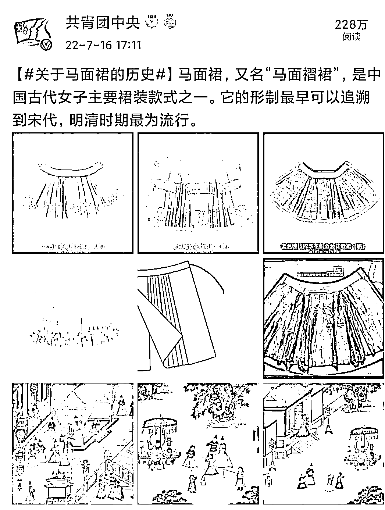
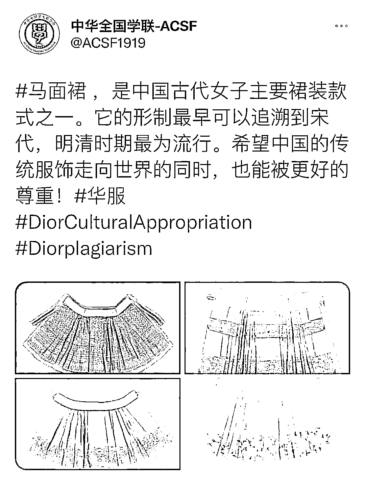

# “标志性”“全新”？迪奥半身裙引发网友关注，华服马面裙的历史了解一下！

> 原文：[`mp.weixin.qq.com/s?__biz=MzIyMDYwMTk0Mw==&mid=2247540320&idx=6&sn=bf90393001b1d8974cc8b53b5e067242&chksm=97cb9558a0bc1c4ed7a0582e2d872f696d41f537b236c996809884c70a2c1f0013611c3ad219&scene=27#wechat_redirect`](http://mp.weixin.qq.com/s?__biz=MzIyMDYwMTk0Mw==&mid=2247540320&idx=6&sn=bf90393001b1d8974cc8b53b5e067242&chksm=97cb9558a0bc1c4ed7a0582e2d872f696d41f537b236c996809884c70a2c1f0013611c3ad219&scene=27#wechat_redirect)

近日

有网友发文质疑

迪奥发布的一款半身裙

疑似抄袭华服马面裙

“迪奥抄袭”相关话题词也冲上热搜榜

查看迪奥公司网站

可以看到

在涉事服饰的产品说明中称：

**这款半裙采用标志性的 Dior 廓形**

**是一款全新的优雅时尚的单品**

所谓的 Dior 廓形

确实与华服马面裙非常相似

很多细节都雷同

为何毫无愧色地称“全新设计”

还冠以“标志性的 dior 廓形”

网友的不解之处

甚至愤怒之处

是完全可以理解的

**华服马面裙到底有多美**

马面裙

又名“马面褶裙”

**是中国古代女子主要裙装款式之一**

**它的形制最早可以追溯到宋代**

**明清时期最为流行**

前后里外共有四个裙门

两两重合

俗称“马面” 

**让我们一起来看看**

**博物馆里的华服马面裙**

而迪奥的这款裙

也是前后裙门的设计

再加上开衩的变动

外形上与马面裙相似

马面裙平铺示意图

来自微博@洛梅笙

**何为“标志性”全新？**

中华上下五千年的历史，留下了许多经典文化遗产。近些年来，中国风风靡全球，国际时装周也经常出现中国元素，很多使用中国元素的设计师都会坦言设计灵感来自中国传统文化中的经典之作。**中华文化是中国的，也是世界的，我们对于借鉴中华文化丰富人类美好生活是支持的，同时也希望我们的中华传统文化能够被更好的尊重！** 

迪奥应尽快回应网民们的关切，这既是一个国际知名公司对自身企业文化的负责，也是对世界历史和文化传承的致敬。

我们不仅要明确反对文化挪用

更要开足马力文化输出

**通过多种形式**

**传播中国文化的要素和形象**

**提升文化创意产品附加值和竞争力**

打造具有中国特色的

文化创意产品和品牌

来源：微信公众号“共青团中央”（ID：gqtzy2014）综合整理自“央视网”（ID：cctvcomweixin）、微博@共青团中央、@中国新闻网、@人民网评、@山东博物馆、@河南共青团、@洛梅笙、@撷芳主人、网友评论等 

← 向右滑动与灰产圈互动交流 →

