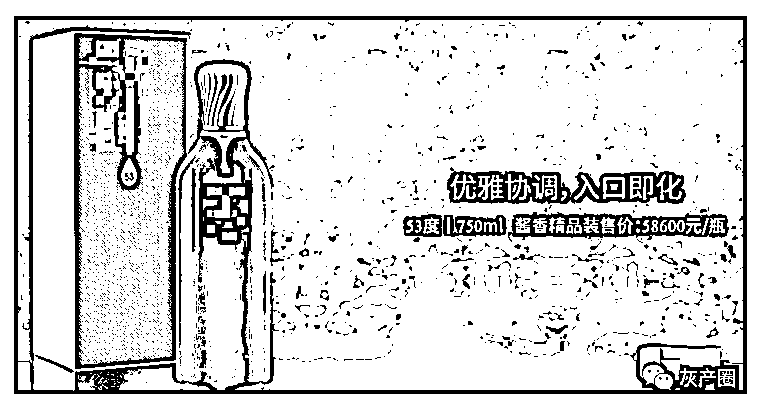
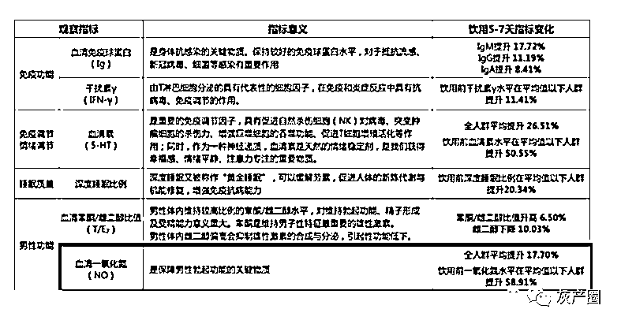
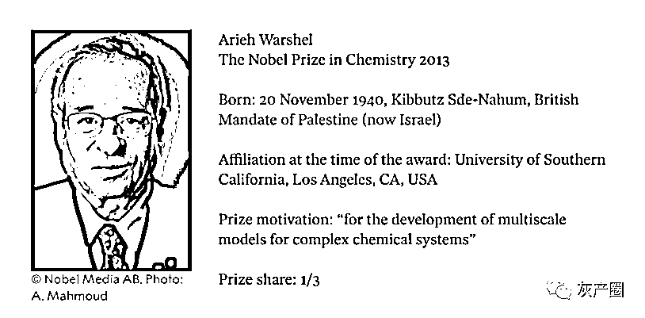

# 两位诺奖得主给“太上老君托梦”的天价白酒当首席科学家

> 原文：[`mp.weixin.qq.com/s?__biz=MzIyMDYwMTk0Mw==&mid=2247540412&idx=2&sn=932010b3bf377229b3ae87e8aa385984&chksm=97cb9584a0bc1c92557cdd707670fbb14d7132a1f8bfe57efa77d26210d4c0833e9c95297f29&scene=27#wechat_redirect`](http://mp.weixin.qq.com/s?__biz=MzIyMDYwMTk0Mw==&mid=2247540412&idx=2&sn=932010b3bf377229b3ae87e8aa385984&chksm=97cb9584a0bc1c92557cdd707670fbb14d7132a1f8bfe57efa77d26210d4c0833e9c95297f29&scene=27#wechat_redirect)

一家 A 股上市的白酒公司，居然请来两位**诺奖得主**担任联席首席科学家。

其中一位还是大名鼎鼎的**“伟哥之父”**，斐里德·穆拉德*（Ferid Murad）*。

另一位也不简单，是被称为**“计算酶学的奠基人”**的**亚利耶·瓦谢尔*（Arieh Warshel）***。

这家公司最贵的酒要**58600 元一瓶**，价格是飞天茅台的整整**39 倍**。

更奇葩的是，该公司创始人反复声称，研发这款天价白酒的灵感是来自“太上老君托梦”。

就这么一家公司，突然请来诺奖得主走科技路线，难道要争当“酱香型科技”的天花板？

从官网的产品介绍来看，他们不注重宣传历史传承和文化积淀，反而处处标榜科学理论与实验数据。

比如这“代谢动力学研究”。

甚至还列出了参考文献。

对于诺奖得主为何加盟国内白酒品牌，不少人调侃：“他们给的实在太多了”。

也有人认为他们并不是真的打算请诺奖得主来搞研究，只是买个代言人。

所以这一次，两位知名诺奖得主来到一家白酒企业到底是要搞什么名堂？

## 标榜科学的白酒

该公司在最近一份公告中披露，他们分别与穆拉德、瓦谢尔签署了为期 3 年的《合作协议》。

在此期间，两位诺奖得主除了搞科学研究，还特别提到“需要服务于公司的、人才培养、推荐和引进人才以及出席公司相关的公务活动”。

不过，这家公司的产品倒确实与两位的研究方向有相关之处。

**先说说**“伟哥之父”穆拉德**。**

1977 年，穆拉德揭开了硝酸甘油能缓解心绞痛的原理。硝酸甘油会增加血管中**一氧化氮**的含量，通过控制平滑肌来扩张血管。

这一成果同时也是首次发现气体也能作为信号，在细胞间传递信息，对后续研究有很大价值。

1998 年，穆拉德因此获得诺贝尔生理学或医学奖。

后来，美国辉瑞公司根据穆拉德的成果发明了万艾可，也就是俗称的伟哥。

伟哥通过抑制一种叫 PDE5 的酶来减少一氧化氮产物 cGMP 的分解，从而延长阴茎充血时间。

但是这和白酒又有啥关系？

仔细一查，发现他们之前与四川轻化工大学合作了一项试验，结果表明饮用该酒可以提升血清一氧化氮。

根据公告，穆拉德教授将指导研发团队对一氧化氮提升等现象及其对人体健康的作用与价值展开深入研究。

**再说说**“******计算酶学奠基人”瓦谢尔**。

他的研究与白酒的关系就更直接了，计算酶学也就是为酶及其分子反应机制的建模与仿真。

而白酒发酵过程中之所以会产生不同风味，就和各种酶的活动有关，影响最大的包括淀粉酶、蛋白酶、半纤维素酶。

瓦谢尔因给复杂化学体系设计了多尺度模型，在 2013 年获得诺贝尔化学奖。

在公告中，瓦谢尔教授将指导研发团队在工艺与酒体风味、风味与人体感知等领域展开系统解析研究。 

在两位诺奖得主加入之前，这家公司主打的原创技术是“双激活”酿酒理论，主要依据有两条。

一是酒精会过度激活交感神经、抑制副交感神经。

二是副交感神经激活会增加唾液分泌。

最终他们在酒里添加了“生津”（增加唾液分泌）的成分，希望能减轻喝酒对人的伤害。

关于副交感神经的两条科学论断倒是确有其事，不过最后结论的逻辑就有点……

另外要说的是，这两位诺奖得主倒也不是第一次给商业公司站台。

“伟哥之父”穆拉德近年来参与了不少和一氧化氮相关的药物、保健品公司的项目。

往更早追溯，他在 2014 年还受邀协助广州白云山制药厂研发出“国产伟哥”金戈，以及保健品：白云山铁马。

瓦谢尔这边则是据称 2018 年受聘担任天狮集团发展研究院顾问，后来这个天狮集团一度因为传销而深陷舆论漩涡。

近些年来，诺奖得主已成了不少企业眼里的香饽饽。

如 2006 年物理学奖得主乔治·斯穆特，原本是个天体物理学家，后来却参与不少国内医疗保健器械的公司。

2013 年生理学或医学奖得主兰迪·谢克曼还被微商品牌请来做背书。

……

## 很会搞事的创始人

再说回到这次的白酒公司，创始人张老板出生于 1969 年，四川大学工商管理硕士毕业。

在官网的“研发历程”板块，关于老君托梦这段是这么描述的：

> 凌晨 4 点，他在实验室靠着椅子小憩。恍惚梦境中，他好像在雪山上寻找着什么。
> 
> 一位腰系金绳、白髯飘飘的老者，来到他面前，挥起拂尘，在他手心写下一个“活”字，翩然而去。手中的活字晶莹璀璨，五彩流转。

张老板醒来后，从“活=水在舌边”，想到“舌边之水是唾液”，再联系上唾液、酒精与交感神经、副交感神经的关系，最终创造了“双激活”理论。

除了太上老君这个噱头外，这家公司在营销策略上也总出骚操作。

比如定价，2021 年初刚上市时标准版起步价 2199-2599，不久之后直接翻倍到现在的 5680。

到了 2022 年，价格**再翻 10 倍**推出 56800 的精品版。

用天价白酒把名气打开后，**再除个 100**推出 568 一瓶的低端版走量。

这般大开大合的神操作，让人直呼 666。

此外，前不久这款天价白酒还被贵州茅台、泸州老窖联手告上法庭。

原因是百度搜索“茅台”和“国窖”时会出现他们产品的广告，此事还一度登上了微博热搜。

说到这里，这么贵的白酒到底有没有人买单呢？

根据该公司今年第一季度的财报，这个比飞天茅台还贵、广受质疑的白酒系列给他们带来了**相当可观的利益**。

公司整体仍处于亏损状态，但在一季度 7500 多万元的总营收中，酒水业务就贡献了 5296.95 万，同比**增长 1101.59%**；拉动公司酒水业务板块在一个季度的营收，就相当于去年全年的营收的 2 倍。

除了天价白酒之外，上一个主营产品是天价冬虫夏草含片，81 片一盒的价格高达**29888 元**。

不过最终因砷含量超标、未取得相关资质等原因被国家食品药品监督管理总局叫停生产。

与张老板相关的企业中，还有一家主打生产带人造燕窝成分饮料的公司。这个倒是不贵，6.8 元/瓶。

根据环球网报道，这家饮品公司实际控制人是张老板的母亲。

从虫草含片、生津白酒到燕窝*（有效成分唾液酸）*，不知道为何与这位张老板相关的产品，都和口水多少有些关系？

来源：量子位

← 向右滑动与灰产圈互动交流 →

