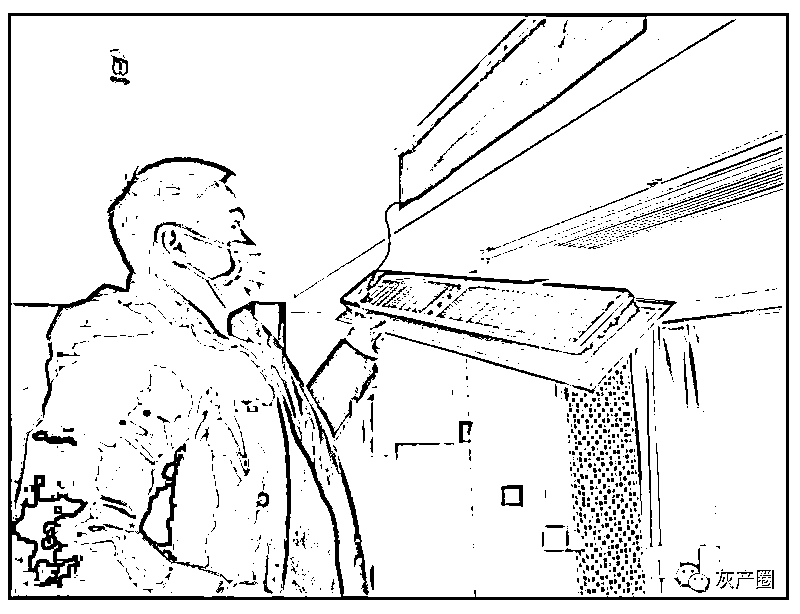
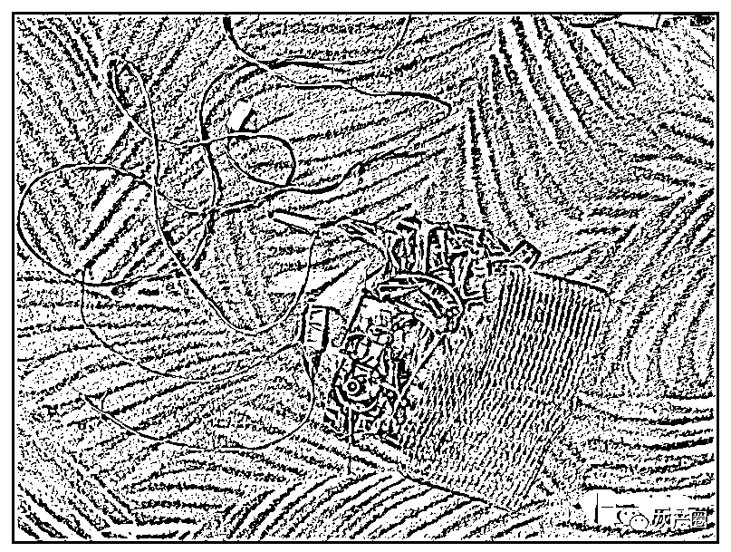
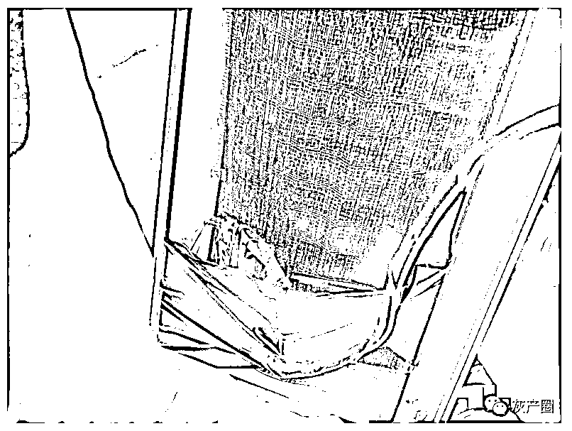
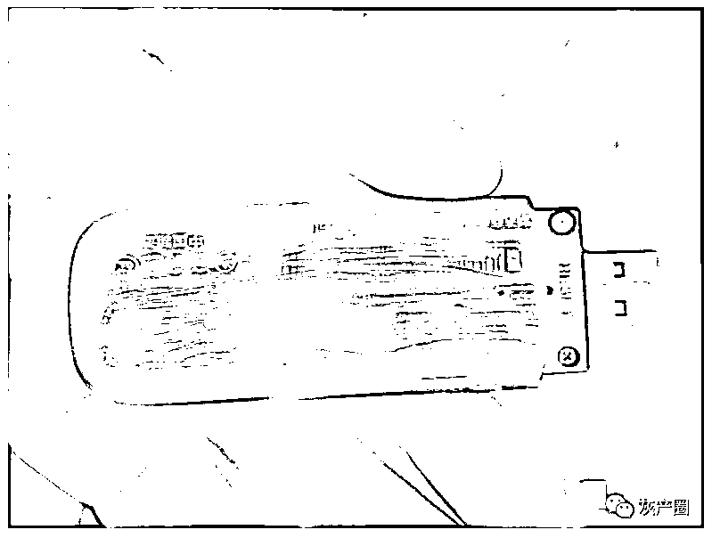
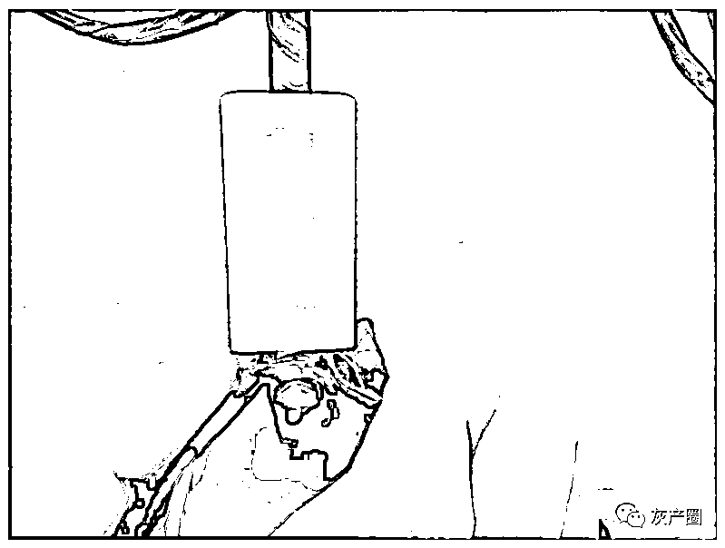
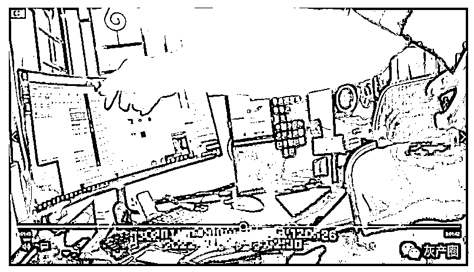
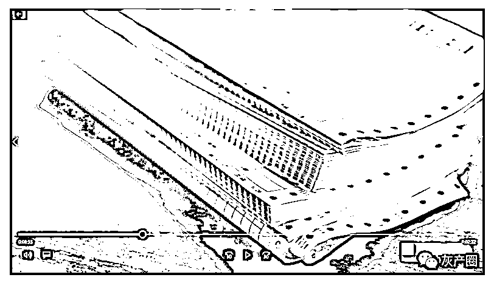

# 骗子为什么能精准 GET 到我们的兴趣点？有人用这种办法窃取个人信息 10 亿条，全国首例！

> 原文：[`mp.weixin.qq.com/s?__biz=MzIyMDYwMTk0Mw==&mid=2247540412&idx=3&sn=c022539daaa79271f8df35cbfce59f45&chksm=97cb9584a0bc1c9265a3cf222258fec85422e246434a932bbfff1003c01097e6b8b9715e6b4f&scene=27#wechat_redirect`](http://mp.weixin.qq.com/s?__biz=MzIyMDYwMTk0Mw==&mid=2247540412&idx=3&sn=c022539daaa79271f8df35cbfce59f45&chksm=97cb9584a0bc1c9265a3cf222258fec85422e246434a932bbfff1003c01097e6b8b9715e6b4f&scene=27#wechat_redirect)

7 月 12 日上午，浙江省公安厅召开“净网 2022”专项行动新闻发布会。

今年 1 月至 6 月，浙江警方共侦办各类网络违法犯罪案件 2.1 万多起，抓获犯罪嫌疑人 2.5 万多人。侦破侵犯公民个人信息案件 115 起，抓获犯罪嫌疑人 2300 多人。

在全省公安机关夏季治安打击整治“百日行动”第一次集中统一行动暨重点场所区域清查行动中，共出动警力 8.5 万人次，查处各类违法犯罪嫌疑人员 4703 人，抓获在逃人员 72 人。

会上公布了三起典型案例。

**情趣酒店的中央空调出风口被悄悄安装了密拍摄像头**

其中一起是湖州吴兴警方破获的“偷拍案”。嫌疑人在杭州、绍兴、嘉兴、湖州、贵州贵阳等地的酒店、宾馆秘密安装摄像头偷拍。今年 1 月 6 日，湖州吴兴警方接到上海、云南、江苏等地的人报警，他们反映，有人在吴兴某个酒店内偷拍视频，上传到了网站，视频上不仅写明了酒店名字，里面的当事人也没打马赛克，严重侵犯了公民个人隐私。湖州警方成立专案组，在省公安厅网安总队的指导下，全力侦办此案。专案组发现，被举报的网上的视频，有人已把标题中涉及到的酒店名称改了，但根据偷拍视频中的角度和房间布局，最终在一家情趣酒店内找到了三个被安装偷拍摄像头的房间，在三个房间内中央空调出风口的位置发现了偷拍摄像头，系一被拆卸了外壳并简易改装取电方式的某型号的摄像头。

是谁在宾馆三个房间安装了摄像头？吴兴警方开始寻找蛛丝马迹。专案组兵分多路展开侦查，发现了 27 岁的贵州镇远籍人员石某有重大作案嫌疑。今年 1 月初，石某到了湖州，且一个人入住了涉案酒店，另发现他近期还在浙江其他地方如杭州、嘉兴、绍兴等地出现过，都有过短暂住宿的情况，形迹十分可疑。而与石某一起同来的还有三人，他们也在涉案酒店内有住宿情况，专案组推断以上四人为同一团伙，并于同日来到该酒店作案，又同时离开。在其他三人住过的房间内，侦查员在央空调出风口也发现了同类型的偷拍摄像头。侦查员还发现他们在住宿酒店时叫了外卖，叫的外卖竟是电工胶布、螺丝刀等工具。有些。侦查员把设备送往有关公司进行检测后，这些设备关联着的就是石某。 专案组分析推断出这个团伙在杭州、嘉兴等地也曾作案。但这伙人早已离开了湖州，专案组发现石某他们去了贵州贵阳随后又回到了镇远县老家。今年 1 月至 3 月，专案组赴贵州、河南以及浙江省内等地将石某、罗某、吴某、刘某等人相继抓获归案。目前总共扣押到 17 台摄像头，其中某云品牌摄像头 13 台，某网络摄像头 4 台，警方从其中调回视频数据 66GB。

石某交代说，他在网上看到有密拍视频的事，就去网上找相关的 QQ 群、网站，无意中进入了“密拍圈”。“有人在群里发布需要视频的信息，他们就去找地方拍”，办案民警说。石某以前在嘉兴一个酒吧工作，看到这样的生意动心，他边学边问自学密拍，还叫来老乡、以前同事罗某、吴某等人一起做。石某通过“自学”知道一般密拍点在情趣类酒店成功率比较高，就在携程等平台搜索情趣、主题酒店，找到相应酒店，然后去这些酒店开房。一般每次都有三四人一组，开好房后，石某去房间装摄像头，他们把买来的摄像头外壳拆掉后安装在房间内中央空调出风口处，同时在出风口外部采用黑纱布遮挡等来伪装。有时在现场，因为所带工具不够，石某等人就叫外卖帮买工具，现场调试后再离开。石某在手机上远程操控摄像头，看到被拍到的不雅内容后，下载后进行后期剪辑，大约时长一小时的视频卖到 200 元一部到上千元不等。他甚至还将摄像头权限分享给他人，类似会员制形式，1500 元一个月。这些被密拍的视频，同时卖给很多中间人，中间人再拿去再剪辑成一小段一小段再出售。此次被抓的刘某，就是其中一个中间人。他是河南周口人，32 岁，前几年出了车祸导致高位截瘫。因为无法工作没生活来源，当看到网上有这样的需求，想做这个生意赚钱。他从石某这买来视频或者摄像头登录权限再转手倒卖。获利数万元。经查，此案涉及浙江、贵州两省 5 市共计 10 家酒店，被安装了 17 台摄像头，这些被偷装了摄像头的酒店大多是中档的情趣、主题酒店，有的在火车站边上。石某等人到了这些酒店后，为了节省成本开钟点房，装好后就离开，“打一枪换一个地方”。到案发，他们卖了上百部偷拍视频，还大量出售摄像头分享权限，从石某等人开始作案到被抓，半年多时间，获利 20 多万元。为方便作案，石某还买了辆凯迪拉克二手车，来回很方便。另外，警方还抓到了帮助石某他们收钱的田某、杜某，田某是石某老乡，杜某是石某女朋友，才 20 岁。今年 3 月初，公安部网安局在湖州发起打击偷拍偷窥专项会战，经过 100 天的连续会战，部分线索实现全链条打击偷拍、偷窥类犯罪，涉及全国 23 个省市的犯罪嫌疑人 103 人，宾馆偷拍摄像头设备 100 多台，捣毁团伙 10 多个。目前，犯罪嫌疑人石某、罗某、吴某、田某因制作、传播淫秽物品牟利罪，刘某因传播淫秽物品牟利罪，杜某因掩饰、隐瞒犯罪所得、犯罪所得收益罪均已被依法移送审查起诉，案件正在正一步办理中。民警提醒说，大家在外出住宿酒店或民宿，需要重点检查正对床、沙发位置的各种物品以外，房顶的各种烟感器、空调以及洗手间、换衣间也要多留心检查一下有没有偷拍设备，一般都有一个红色小指示灯会亮。**全国首例以注册皮包公司与企业开展合作方式窃取个人信息**骗子为什么能精准 GET 到我们的兴趣点？杭州滨江警方破获的这起侵犯公民个人信息案中，犯罪嫌疑人窃取个人信息的手段新颖——以注册皮包公司与企业开展合作方式窃取个人信息，在全国还是首例。今年 2 月，滨江警方接到市公安局网警分局线索，有人在互联网上通过搭建网站、境外社交软件等方式大量贩卖公民网络行为信息数据，涉嫌侵犯公民个人信息罪。滨江警方成立专案组，查明了一个以贾某为首的犯罪团伙。民警介绍，这个团伙注册“大数据”公司，其实是个空壳皮包公司，然后与大量企业谈合作开发项目，比如共同开发网站、平台等，他们为了窃取更多信息，还会搭建一个平台伪装，蒙混过关。从合作企业获取各类公民信息及其他关联信息后，通过组合加工的方式形成结构完整、内容丰富的公民个人信息进行出售。今年 6 月，滨江警方统一收网，分赴四省开展集中抓捕，抓获了包括贾某等 12 人。经扣押计算机、手机、硬盘等作案设备 50 多件。这个团伙成员清一色 90 后。贾某，是老黑客，以前因此入狱四五年，出来后重起炉灶，注册了一家公司，招聘人员，这些人被招来一方面做业务一方面做技术即窃取数据、信息加工等。窃取信息后，他们通过在境外服务器搭建专门用于出售公民信息的网站并用境外聊天软件寻找买家，根据买家的需求精准定制相关数据并进行出售，总量超 10 亿条。短短一年多时间，靠窃取信息出售卖了几千万元，贾某买了豪宅、好几辆百万元以上的豪车，而他招来的业务员按比例提成，最少的一年里也拿了一百万多元左右。据初步统计，这个团伙获取的数据信息包括金融、购物、母婴、博彩等多种类型的互联网企业，“来源广泛、种类繁多，数量巨大”，民警说，查获时，这伙人窃取的信息还有 4 亿多条。这个团伙为大量境外电信网络诈骗、裸聊敲诈、跨境网络赌博等下游犯罪团伙提供精准群体引流数据支撑。这也是我们个人信息泄露之所以饱受垃圾短信、骚扰电话、垃圾邮件严重侵扰，更是导致电信诈骗、敲诈勒索、跨境赌博等次生案件高发。

民警提醒说，大家不随意点击不明链接，不随意上传、填写个人信息，不随意在网上公开个人详细信息及隐私。

**有人在电商云仓中植入木马软件窃取快递信息**

现在，冒充快递、电商客服电话诈骗案件多发，大家有个问题，就是我们的快递信息，骗子是怎么知道的？来看宁波警方网安部门破获的这起案件。今年 4 月，余姚市居民多次反映接到冒充快递员和电商客服的诈骗电话，骗子能清楚掌握受害人姓名、联系方式、地址及所购商品种类等详细信息，以商品质量问题退款、丢单理赔为名进行诈骗。余姚警方成立专案组，从受害人购物、发货渠道着手，通过被害人回访、实地摸排、大数据分析，查明一个以鲍某、高某、马某为首的特大侵犯公民个人信息的犯罪团伙。4 月 15 日至 6 月 22 日，在省厅及宁波市局的统一调度指挥下，专案组组织警力开展集中收网，先后在浙江、广东、重庆等 10 省 21 市，抓获犯罪嫌疑人 37 人，扣押作案手机 52 部、电脑 38 台，查获木马软件 3 个。专案组调查发现，去年 11 月以来，谢某、鲍某、马某等人在浙江、广东、四川等地 100 多个电商云仓中植入木马软件，非法窃取面单数据 500 多万条，并通过“中间料商”或直接对接诈骗团伙进行售卖，涉案总额约 3000 多万元。民警介绍，这个犯罪团伙由技术保障、装马、销售三个团队组成，每个团队都有明确的负责人。三个团队日常通过网络紧密联系，但又互不见面。技术保障团队负责提供木马软件和后台维护，装马团伙负责前往实地踩点安装木马软件，销售团队负责被盗取信息的去重分类和对接诈骗团伙进行售卖。犯罪所得由伙成员按层级、作用进行分配。

此案中，有一种新的窃取信息的模式。民警说，这个犯罪团伙主要以假装应聘、半夜翻墙等手段进入电商云仓库中植入木马软件，并远程操控窃取面单数据，“这和以前手拍快递面单更方便，也更难以被发现。”诈骗团伙拿到快递面单数据后，利用快递运输的时间差，冒充客服以丢单理赔实施诈骗，受害人一时难以辨别防范，往往是在被骗后才发现自己个人信息被泄露。此案已被公安部、浙江省公安厅列为督办案件。 截至目前，专案组通过比对，发现经由上述被窃取信息导致的电信诈骗案件多达 140 起，这些案件多是冒充电商客服诈骗，涉案金额达 851.82 万元。民警提醒说，大家在网购时，寄送快递时尽量不要暴露真实姓名、住址门牌号，取到快递后及时涂抹快递面单上的关键信息或者销毁单据。对于网购后接到理赔类电话，应及时与商家核实，不要接听来历不明的境外电话。**浙江省将推广快递隐私面单**从发布会上了解到，浙江省将尽快推广隐私面单、虚拟安全号码、网络身份认证等技术应用。目前，浙江警方会同省邮政管理局、省委网信办，对快递领域进行多次专项检查，严格落实相关企业主体责任，健全完善快递领域个人信息保护相关制度措施。对于快递从业单位，必须加强相关法律法规学习，在快递的发货、中转、入库、派送等环节加强日常防范管理，特别是对打印快递面单的电脑要专人专用、设置锁屏密码，安装视频监控，定期查杀木马。来源：全面反诈 文：杨丽 陈谊 施一荟 赵越 刘倩倩 编：林纪彤

← 向右滑动与灰产圈互动交流 →

