# 刚刚，“消失”高管已被刑拘，系股东报案！拥有 4 亿用户的知名婚恋平台曾被曝侵犯会员隐私、卷入“杀猪盘”诈骗...

> 原文：[`mp.weixin.qq.com/s?__biz=MzIyMDYwMTk0Mw==&mid=2247540412&idx=5&sn=7e6d11594c7430e09c57d7ba86cf3f10&chksm=97cb9584a0bc1c92fca6d997f2425a642bde12adb6f0363249cb2aa9500027c7dc0c5ad6b3fb&scene=27#wechat_redirect`](http://mp.weixin.qq.com/s?__biz=MzIyMDYwMTk0Mw==&mid=2247540412&idx=5&sn=7e6d11594c7430e09c57d7ba86cf3f10&chksm=97cb9584a0bc1c92fca6d997f2425a642bde12adb6f0363249cb2aa9500027c7dc0c5ad6b3fb&scene=27#wechat_redirect)

高管突传“失联”，刚刚被证实：已被刑拘！

18 日晚，网传婚恋网站世纪佳缘公司多位高管被指突然“消失”。7 月 19 日，据澎湃新闻，记者从世纪佳缘的控股股东复星集团了解到，**世纪佳缘个别管理层，因个人涉嫌职务侵占，目前被公安机关采取刑事拘留措施。**相关信息以司法机关公布为准。

世纪佳缘风波不断。就在 2021 年底，这个婚恋平台曾被江苏消保会点名，线上相亲信息存在造假，**当时媒体的报道指出，该平台还涉暴露用户隐私，如浏览的异性照片记录、聊天记录等。**

**“失联”高管已被****刑****拘：**

**股东督查发现犯罪线索，警方介入**

据红星资本局，日前，互联网婚恋平台世纪佳缘传出高管被带走调查的消息。随后，世纪佳缘方面回应称，有个别管理层因个人原因，正在配合司法机关调查。

19 日，世纪佳缘控股股东复星集团回复记者称，其留意到有相关报道，百合佳缘个别管理层，因个人涉嫌职务侵占，**目前被公安机关采取刑事拘留措施**。相关信息以司法机关公布为准。

这次案件，是复星廉政督察部门在日常的监督检查中，发现当事人涉嫌利用职务便利进行犯罪的相关线索，之后向公安机关报案，并由公安机关依法采取了强制措施。目前，公司业务运营一切正常，公司董事会已授权相关人员行使相应职责，**新管理团队将很快上任。**

复星表示，一贯坚持合法合规运营，对任何腐败问题坚持零容忍态度，要求管理层和每位员工都必须具有遵纪守法的执业理念和诚实守信的职业道德操守。

据 21 世纪经济报道，在复星集团内部，自 2013 年设立廉政督察部，建立了一整套的内部廉政督察工作机制，要求每一位复星员工以及与复星发生商业行为的实体和个人，都必须无条件遵守和维护复星在廉政反腐方面的政策规定。在合规合法经营的原则下，对内部腐败问题发现一起查处一起。

世纪佳缘由号称“网络红娘第一人”的龚海燕创立。公开资料显示，2003 年 10 月 8 日，复旦大学新闻学院研二女生龚海燕看到身边很多高学历的同学朋友由于工作学习忙，而无从找到理想爱人，因此创办了世纪佳缘。

截至 2011 年 4 月，世纪佳缘拥有会员 4000 多万。2011 年 5 月 11 日，世纪佳缘在美国挂牌上市，抢占“中国婚恋第一股”。2015 年 3 月，龚海燕几乎已经清空持股，也不再担任世纪佳缘任何管理职务。

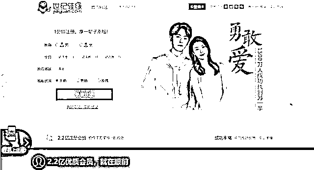

图片来源：世纪佳缘官网截图

2015 年 12 月，百合网全资子公司收购世纪佳缘，世纪佳缘随之私有化退市。此后，世纪佳缘与百合网正式合并，更名为“百合佳缘”，成为网络婚恋市场的“巨无霸”。据证券日报报道，从市场份额来看，合并后的百合佳缘占有 40%的市场份额。

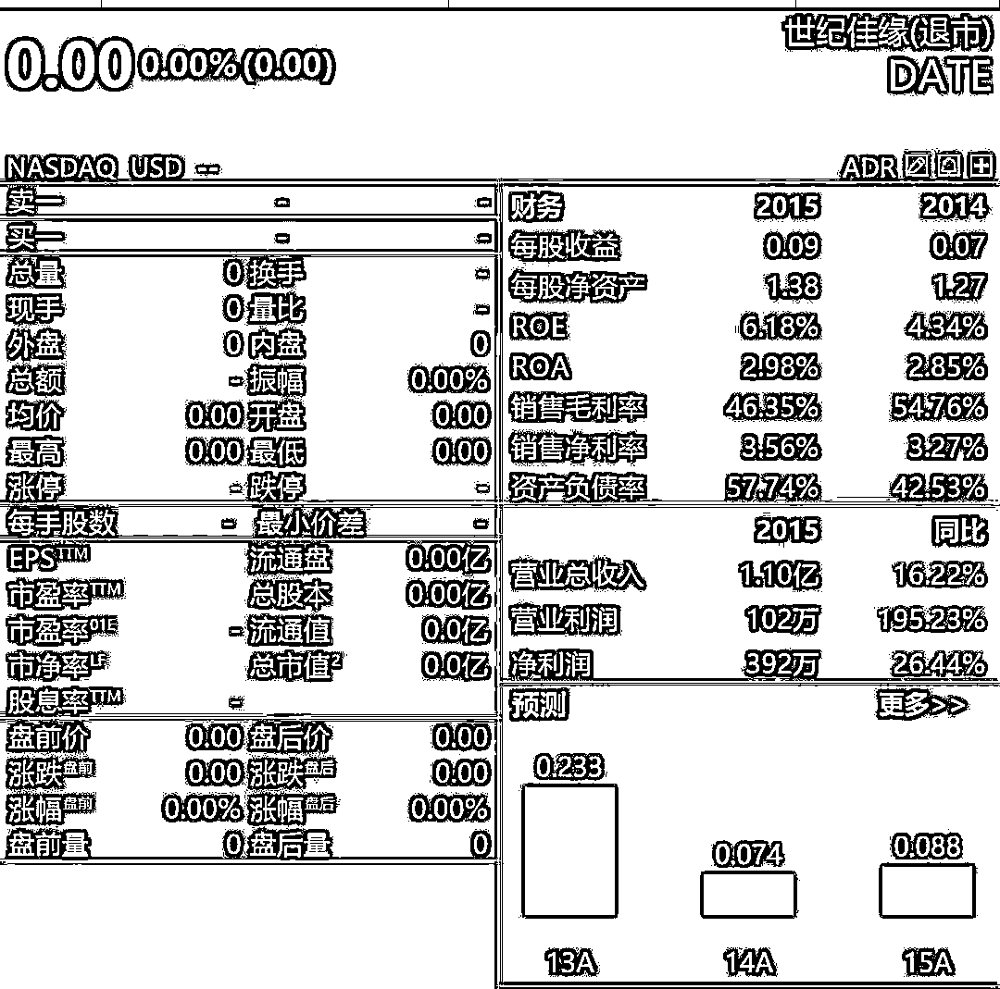

2018 年，复星国际发布公告，宣布成为百合佳缘控股股东。目前，复星总计持有百合佳缘 72.36%的股权。

2021 年，百合佳缘将原有的品牌赛道再一次进行整合。2022 年 5 月，百合佳缘再次更名，为“复爱合缘集团”，并对业务条线进行重新整合。复爱合缘梳理出三条赛道：连接爱情关系的传统婚恋交友赛道、见证爱情关系的婚嫁产业赛道、维系爱情关系的娱乐社区赛道。至此，涵盖恋爱、婚嫁、娱乐社区的线上、线下的全景式“三驾马车”正式形成。

6 月 15 日，复星全球合伙人、复爱合缘集团 CEO 吴琳光接受媒体采访时称，“除了名称的升级，集团的顶层设计、组织架构也进行了相应的调整，从确定战略以后，就对每个赛道进行资产充实和调整，现在三条赛道架构已经十分清晰。”

官网数据显示，截至 2022 年 4 月底，**复爱合缘集团累计拥有注册用户超过 4 亿，月均活跃用户 1110 万，全国线下门店数量超过 200 家。**

**世纪佳缘曾被曝侵犯会员隐私**

近年来，世纪佳缘因涉嫌侵犯会员隐私，屡受质疑。

2021 年 12 月，媒体报道世纪佳缘被指以“杀猪盘”套路诈骗及侵犯隐私权。

据澎湃新闻报道，世纪佳缘网后台可以随意查看用户个人信息，包括会员浏览的异性照片记录、聊天记录等。

> “我离异有一个女儿，你呢？”
> 
> “我的老家在**，现在在**做点小生意。”
> 
> “我是腿控，你能拍张照片给我看看吗？”

婚恋平台为达“精准营销”目的，默许销售人员随意游览用户私密信息这一现象，多位行业专家学者向澎湃新闻直言，该行为已触碰上述法律红线，且性质极为恶劣。

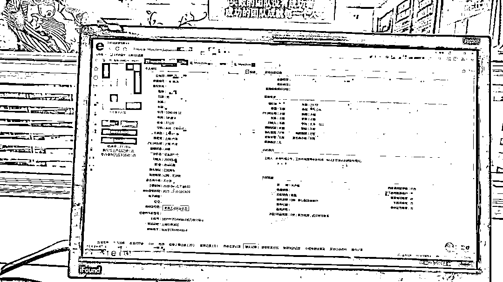

销售登陆后台系统后，将会员捞取至自己的资源库，可以看到的用户个人详细信息。(图片来源：澎湃新闻）

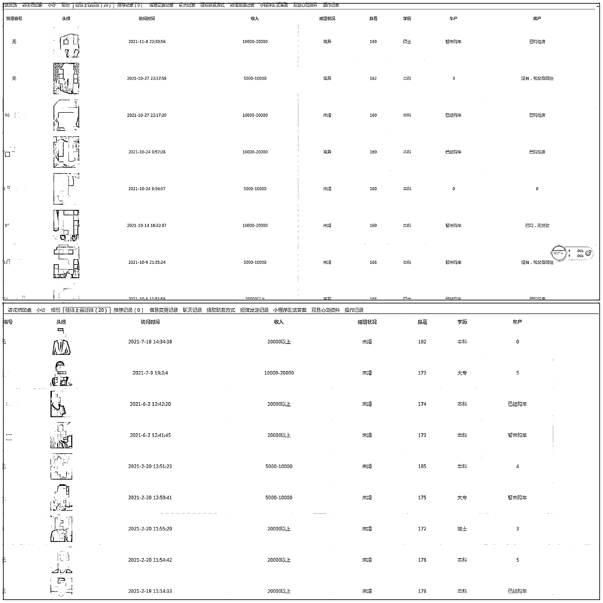

记者随机截取捞取的会员曾在线上浏览过的异性信息，包括个人照片、身高体重、是否购房购车等情况。(图片来源：澎湃新闻）

世纪佳缘还存在部分销售人员会故意注册成为其他婚恋平台会员或者参加线下相亲活动，以套取客户资源这类恶意竞争行为。

随后世纪佳缘发表声明，称该公司出现了“滥用职权”查阅用户信息的严重违规行为，公司负有不可推卸的责任，并称目前公司已经在后台去除此功能。

另外，官方的致歉声明称，世纪佳缘进行了三项整改：

1、报道中提及的门店即日起整改，全员再度深入学习相关法律法规以及公司的规章制度，考核通过后再上岗。

2、对调查中发现的相关责任人员按公司规定予以处罚。

3、全国各门店全面开展会员信息安全保护的培训和教育工作。

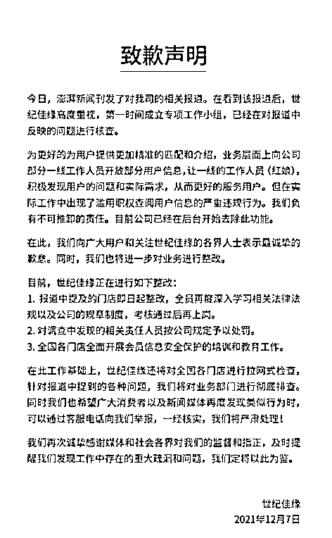

图片来源：官方声明

2021 年 12 月，针对个别婚恋机构侵犯个人隐私、欺骗套路消费、恶意营销、服务条款含糊不清等问题，上海市婚姻介绍机构管理协会曾约谈百合佳缘、珍爱网、我主良缘、壹嘉缘等四家婚介机构。

上海市婚介机构管理协会指出，以上四家机构都是投诉量较大、投诉问题较为突出的企业。协会要求，相关机构须全面开展自查自纠，立即整顿。

值得注意的是，2020 年 7 月，工信部通报的 58 款侵害用户权益行为的 APP 中，世纪佳缘赫然在列，具体原因为私自收集个人信息；私自共享给第三方；强制用户使用定向推送功能。

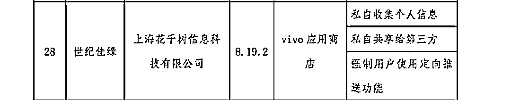

今年 6 月，工信部公众号“工信微报”发布了《工信部通报 84 款存在侵害用户权益行为 APP》。其中，由上海花千树信息科技有限公司开发的应用《世纪佳缘》（版本号：9.5.1）名列榜单。该应用来源为 360 手机助手，所涉问题包括：**超范围收集个人信息。 **

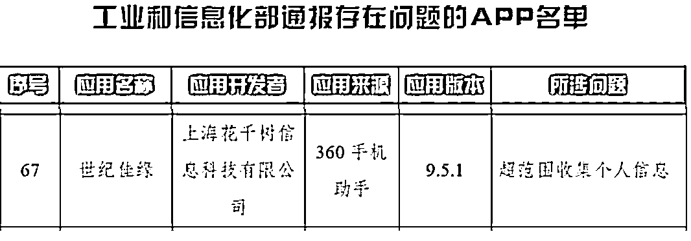

**线上相亲信息或有假？**

**网友透露曾遭遇“诈骗”**

江苏省消保委于 2021 年 9 月 26 日发布了《婚恋交友平台服务状况消费调查报告》，调查发现所涉平台世纪佳缘、百合网（两家已合并为“百合佳缘”）、珍爱网、我主良缘等 5 家存在包括但不限于退费规则不明确、宣传承诺不兑现、会员信息审核形同虚设等问题，严重侵犯了消费者的知情权、公平交易权和信息安全权等合法权益。

江苏省消保委于 2021 年 12 月 10 日上午进行了线上“云约谈”。

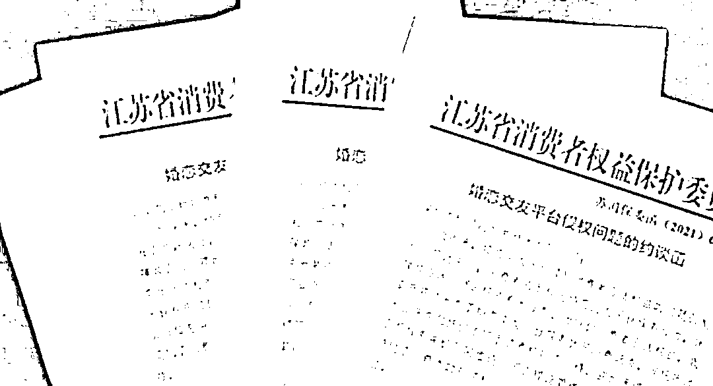

图/江苏消保委约谈函

**网友透露相亲被骗经历**

近年来曾多次有媒体报道，网友在世纪佳缘相亲遭遇诈骗事件。如北京广播电视台旗下的“法治进行时”，4 年前曾报道《女子上世纪佳缘网相亲，被诈骗 90 万》，澎湃新闻报道称，“男子在世纪佳缘同时交友，骗了她们 400 多万”。

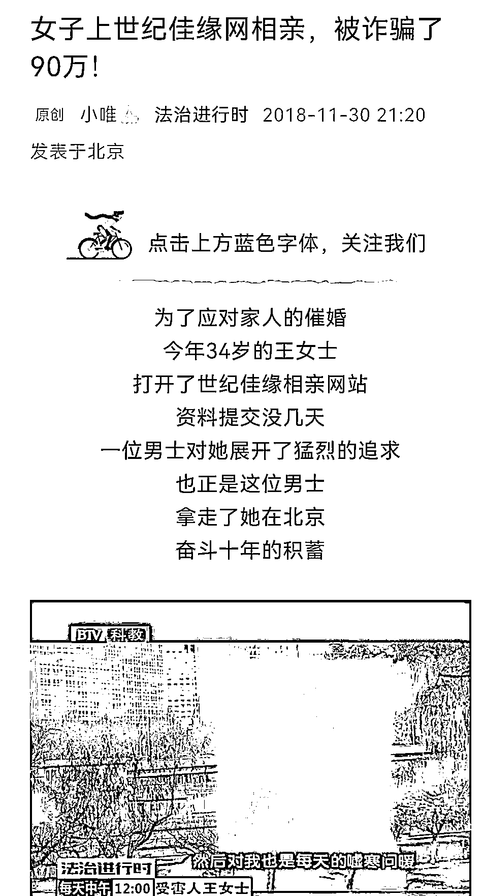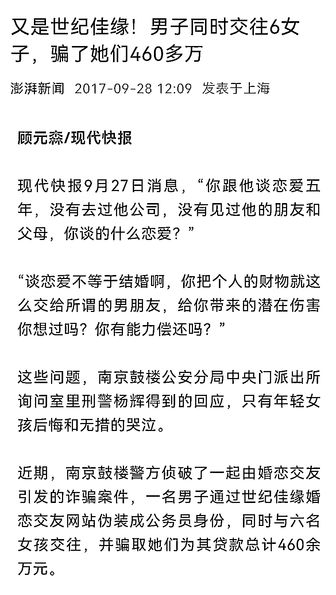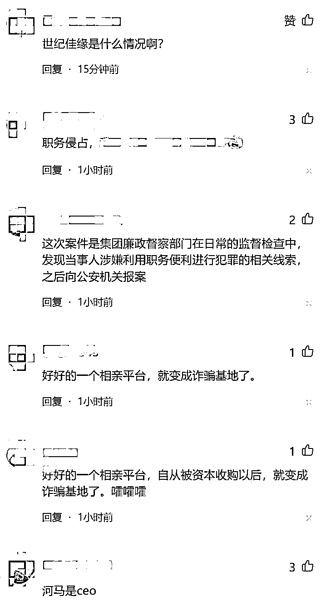

图片来源：网友评论 

目前，世纪佳缘官方小程序 7 月 11 日已暂停服务。不过，世纪佳缘部分门店的销售红娘仍在微信朋友圈发布牵手匹配成功信息。

来源：每日经济新闻综合自红星资本局、工信部、江苏消保委，21 世纪经济报道、澎湃新闻、@世纪佳缘

← 向右滑动与灰产圈互动交流 →

