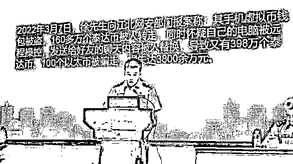
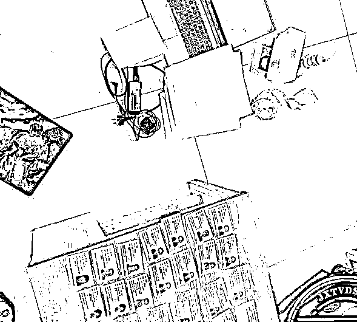
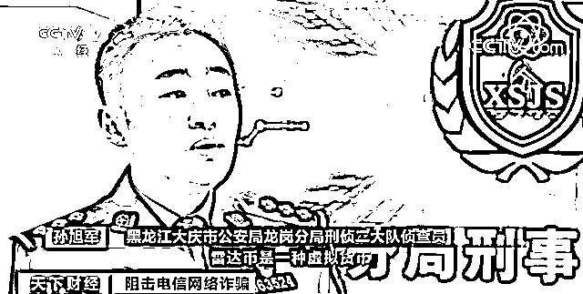
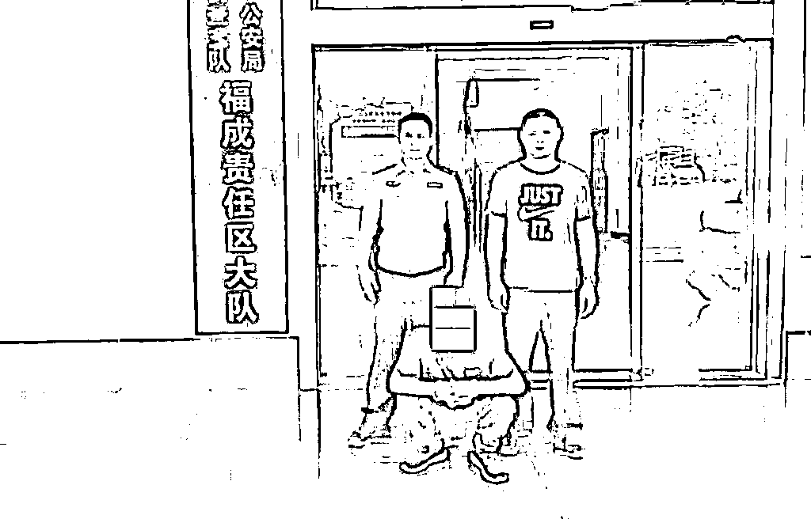
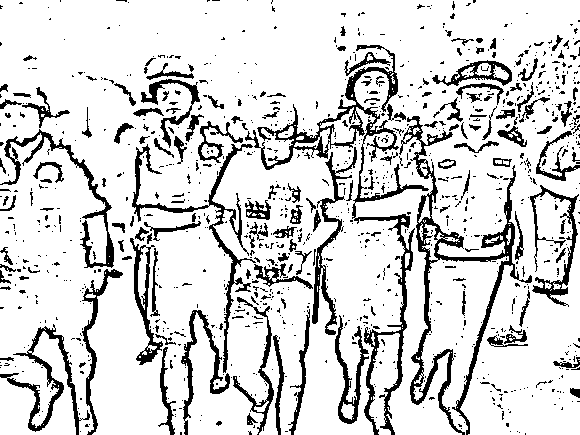

# 价值 3800 多万虚拟货币奇异失踪，江北警方：真相只有一个

> 原文：[`mp.weixin.qq.com/s?__biz=MzIyMDYwMTk0Mw==&mid=2247540509&idx=6&sn=abb771ff114c01613c1f955ffdaaa80d&chksm=97cb9425a0bc1d33f436e7c46a79425e341d3f00f9c0009567179b57ad57ed936e1d7859a4d8&scene=27#wechat_redirect`](http://mp.weixin.qq.com/s?__biz=MzIyMDYwMTk0Mw==&mid=2247540509&idx=6&sn=abb771ff114c01613c1f955ffdaaa80d&chksm=97cb9425a0bc1d33f436e7c46a79425e341d3f00f9c0009567179b57ad57ed936e1d7859a4d8&scene=27#wechat_redirect)

1

**“我要报警”**

**“我的 160 万个泰达币被人转走了”**

**“还被骗走了 398 万个泰达币和 100 个以太币”**

**558 万个泰达币、100 个以太币！！！**七星锤刚看到新闻时，就被这庞大的数字震惊到了。这么多的虚拟货币是如何丢失的呢？

**超 500 万个虚拟货币被盗**

2022 年 3 月 7 日，一市民向江北公安网安部门报案，称其手机上的虚拟币被盗，160 多万个泰达币被人转走。同时，他怀疑自己的电脑被远程操控，发送给好友的聊天内容被人替换，导致又有 398 万个泰达币、100 个以太币被骗走。他自称这些虚拟币的价值达 3800 余万元。因为虚拟币常会被黑灰产团伙用于“洗钱”，因此民警介入调查，并对被害人电脑开展分析取证，然后就发现了名为 svchsot.exe 的可疑恶意程序。进一步侦查后，警方锁定了嫌疑人的身份。2022 年 6 月 9 日，专案组奔赴广东廉江，一举抓获黑客盗币团伙成员苏某等 6 人。经查，犯罪嫌疑人通过钓鱼网站发送伪装成社工文档的木马程序等方式，诱导用户下载，实现远程控制被害人电脑，非法获取他人电脑内的敏感文件。这伙人盗窃、诈骗虚拟币进行套现，已获利百余万元。这 6 人因涉嫌非法获取计算机信息系统数据、非法控制计算机信息系统罪被采取刑事强制措施。另外，就报案人持有大额虚拟币的情况，公安部门已通报相关主管部门予以关注。目前，相关侦查工作还在进一步推进中。

近年来，随着虚拟货币的火热，盗币事件时有发生，某些案件涉案金额近亿元。

01

**@江西首例比特币特大盗窃案，涉案 1450 万 ** 

2021 年 2 月 26 号，南昌市市民黄某报案称，在 2 月 23 号晚上 18 点左右，他的手机号码被人莫名挂失，然后他发现自己手机号绑定的某外域账号中的虚拟货币，包括雷达币和比特币被人全部转走，失窃的这些虚拟货币价值近 1450 万元。

接警后民警迅速立案侦查，专案组反诈民警通过摸排走访调查发现，案发前曾有 5 名江苏连云港籍男女开车流窜至南昌，持有伪造的受害人身份证件挂失、补办受害人手机卡的犯罪踪迹。根据研判线索，专案组最终陆续抓获邓某、张某、王某苗、张某 2、曾某、张某某 6 名嫌疑人。经查，犯罪嫌疑人邓某利用购买的黑客技术盗取虚拟货币交易平台“雷达网”后台用户信息，再雇佣犯罪嫌疑人王某、张某等伪造证件冒充受害人补办“雷达网”账户所捆绑手机号码，又通过补办的手机号由犯罪嫌疑人张某接受平台登录验证码，最后登陆受害人存有虚拟币的账户盗取账户内的虚拟货币。

02

**@约 200 万“雷达币”被黑客团伙盗走**

2021 年 3 月 18 日，赵先生突然发现手机信号没了，打电话给客服，却被告知手机卡被人补走了，但赵先生根本没有补过卡。

随后赵先生第一时间将自己的手机卡补回，但他发现一直绑定“雷达币”的 App 却不能正常登录了。且在 3 月 19 日，赵先生发现自己雷达币账户里，陆续有货币在转出，于是报警。警方调查发现，这是一起利用黑客网络技术，非法获取计算机系统数据的犯罪案件。犯罪嫌疑人采用黑客手段盗取他人虚拟货币交易平台账户，并使用假证补办他人手机卡，从而破解了虚拟平台账户交易密码。随后警方实施抓捕行动，抓获 6 名犯罪嫌疑人，冻结涉案资金 1000 余万元。

03

**@银海破获一起案值超 300 万虚拟货币盗窃案 **

2022 年 3 月初，福成刑侦大队接到群众李女士报警称，其在某数字货币交易平台帐户中约 58 万个虚拟币不翼而飞，按市价估算价值超人民币 300 万元人民币，要求警方处理。

接报后，经侦查发现，李女士的电脑并无黑客侵入账户盗窃虚拟币的迹象。办案民警经过深入研判，认为其身边熟人作案可能性很大！李女士的朋友中只有武某曾经帮其操作过虚拟货币交易，有重大作案嫌疑。4 月 13 下午，抓捕时机成熟，在有关单位的支持下，福成刑侦大队办案民警在海城区某小区将涉嫌盗窃虚拟币的嫌疑人武某抓获。现该案正按程序进一步侦办中。

04

**@两男子盗取 5000 万虚拟货币获刑 12 年**

2020 年 10 月，凌某 1、凌某 2 在广东省云浮市云城区暂住地内，利用信息技术非法侵入北京某信息技术有限公司服务维护的一数字资产交易平台系统，通过非法修改网络请求包方式，虚增凌某 2 等人账户内虚拟货币数量后进行提现，盗取泰达币 620000 个，以太币 12687．9956 个、比特币 149.99627927 个，平台交易价值共计人民币 5000 余万元。后二人在虚拟货币交易平台出售部分虚拟货币，实际获利共计人民币 200 余万元，用于购买宝马车等支出。

最终两人被告犯盗窃罪，判处有期徒刑 12 年，罚金 20 万元，剥夺政治权利 2 年。

05

**@西安一用户被黑客盗窃价值上亿虚拟货币**

2018 年 3 月 30 日，西安市公安局经开分局接到受害人张某报警，称其个人电脑疑似被非法入侵，大量比特币、以太坊等虚拟货币被洗劫一空，市值达上亿元。

西安市公安局迅速成立专案组开展侦破工作。经初步调查，犯罪嫌疑人通过高超的网络黑客技术，在受害人没有任何操作的情况下，远程控制盗取安全性较高的虚拟货币账户，而且几乎没有留下任何作案痕迹。专案组派出大量警力，奔赴全国多个省市，在国内多家知名互联网公司大力协助下，最终将 3 名犯罪嫌疑人全部抓获。经审查，3 名犯罪嫌疑人均为高级黑客，曾通过多次非法入侵、控制公司企业和个人网络系统，获取大量非法收益，初步查明的涉案金额就达 6 亿元。该案仍在进一步调查中。

除了以上案例，虚拟货币被盗事件还非常多，给民众带来巨大的财产损失。

有人会问，2021 年 9 月中国人民银行、中央网信办等十部门联合发布了《关于进一步防范和处置虚拟货币交易炒作风险的通知》中说：个人投资虚拟货币引发的损失由其自行承担，那这类盗币案件会受到法律的制裁吗？从上述案例我们可以看到，案件中的犯罪嫌疑人最终均被抓获归案，并可能面临盗窃罪或者非法获取计算机信息系统数据罪的处罚。因为虚拟货币的“致富神话”，越来越多的人开始进入“炒币”行列，但是请大家注意，在我国虚拟币不具有与法定货币等同的法律地位，不具有法偿性。所以无论你已是币圈一员，或者有想要去币圈逐金的想法，我们都希望大家可以对虚拟货币投资有一个清醒的认识，不要被某些“暴富”个例蒙蔽，误入虚拟货币投资陷阱，导致资产损失，甚至触犯法律底线。

← 向右滑动与灰产圈互动交流 →

