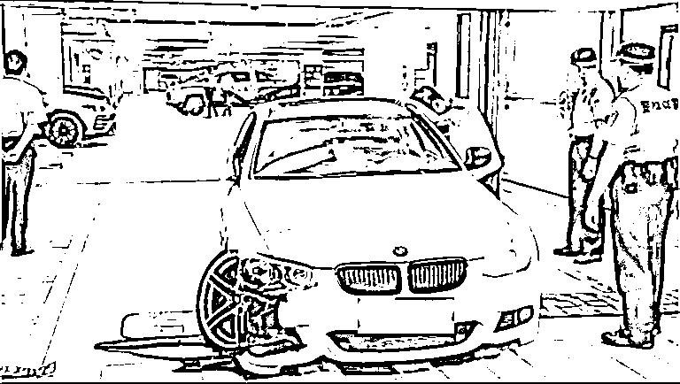
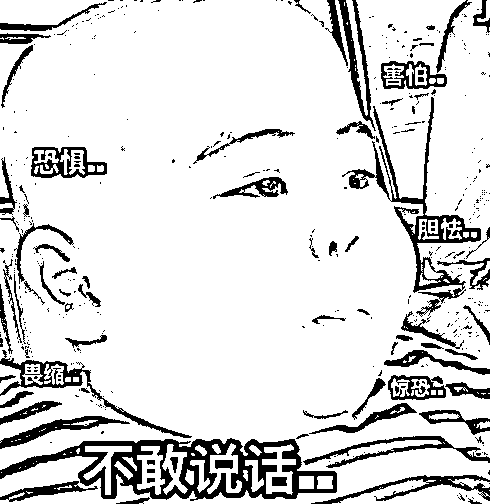

# 一男子深夜在翠湖地库醉驾，撞到了 RR 库里南、RR 魅影、保时捷 taycan，还好布加迪没事！

> 原文：[`mp.weixin.qq.com/s?__biz=MzIyMDYwMTk0Mw==&mid=2247540572&idx=1&sn=7293e930914f665669bfd4211336e30c&chksm=97cb9464a0bc1d72c607384ae1f962d7dfd21777d916534543a9b4653ffa760fa9a9c6ed2331&scene=27#wechat_redirect`](http://mp.weixin.qq.com/s?__biz=MzIyMDYwMTk0Mw==&mid=2247540572&idx=1&sn=7293e930914f665669bfd4211336e30c&chksm=97cb9464a0bc1d72c607384ae1f962d7dfd21777d916534543a9b4653ffa760fa9a9c6ed2331&scene=27#wechat_redirect)

大家可能都已经看过这个醉汉

在翠湖天地的地下车库里闯祸的结果了

那叫一个惨烈... 

据上海市公安局黄浦分局

7 月 21 日凌晨 1 时许

黄浦公安分局接到 110 报警称：

济南路某地下车库有车辆被撞坏

接报后，民警迅速到场处置

经查，罗某（男，41 岁）驾驶一辆小客车 

在驶离该车库过程中

先后撞坏多部停放在该处的车辆

及车库内设施

其间未造成人员伤亡

民警当场将罗某控制

**经酒精测试，罗某已达到醉驾标准。**

目前，案件正在进一步审理当中。

醉汉开着宝马在翠湖的地库里 

撞了一排车

连消防栓都没放过

地方也是蛮会挑的

不管实际房价是不是上海第一名

但在很多人的心目中

翠湖天地，是永远的上海第一名！

这样的小区的地库

里面停的车，当然是不得了的

所以这位醉汉可能是提前完成了

**上海本年度最贵地库车祸 ******

有一辆正在充电的

**保时捷 taycan**

车头已经被撞到隔壁车位去了

价值：百万左右 💸

然后是一辆**劳斯莱斯魅影**

**前脸剐蹭明显**

**车牌也不知所踪，大概是被宝马撞飞了**

****

**价值：五百万以上 💸💸💸💸💸**

****

**劳斯莱斯魅影隔壁这辆**宾利****

****不知道有没有伤到****

****小视频里看感觉没有很明显的痕迹****

********

****再隔开一根柱子****

****是一辆**劳斯莱斯库里南******

****属于是已经破相了...****

********

****价值：六百万以上 💸💸💸💸💸💸****

****心里一算****

****这库里南，是买十辆宝马还有的剩！****

********

****但大家看了网传的小视频之后****

****都在关心****

****库里南隔壁的那辆**布加迪！******

********

****可能是因为****

****库里南又大又重，扛住了宝马的横冲直撞****

****所以****

******布加迪，安！******

************************

****不然的话****

****随手搜了一下布加迪的价格****

******两三千万以上******

****💸💸💸💸💸💸💸💸💸💸****

****💸💸💸💸💸💸💸💸💸💸****

****💸💸💸💸💸💸💸💸💸💸****

****************

****对比之下，脑子里居然出现了一句：****

******“还好只撞了劳”  ******

********

****如果让布加迪也破相了****

****那... 可能要卖房了... ？****

********

****关于肇事车辆怎么样****

****已经不重要了，但也看看吧****

****************

****车子都已经撞成这样了****

****还漏了一地的油****

****宝马司机还想当着警察的面上车呢****

****是真的醉到不行...****

********

****关于**这司机喝得有多醉**这件事呢****

****大家再看看这部分动图 ****

********

****宝马司机趴在地上****

****警察就拍拍他说：**醒醒 醒醒****** 

****宝马司机头也不抬：**滚 麻痹******

****警察就让他看看清楚自己是谁**** 

****然后站起来****

********

****宝马司机看清楚之后，就想起身**** 

****但用手撑起自己都有点勉强****

****只能从趴在地上，变成坐在地上****

****边上的人大概是物业，都要上去扶一把了****

********

****这宝马司机的醉，是已经溢出屏幕了****

****除了大家看看笑话****

******笑得最大声的，大概是保险公司******

********

****因为宝马司机属于醉驾****

****保险公司一概不赔，只能司机自己赔****

************************

****网友这边建议：****

****宝马呢，好歹还是块沪 A 牌照****

****要留下的话****

****要么就先卖套房吧 ****

********

****撞了这么些豪车****

****宝马司机一觉醒来****

****会觉得自己倾家荡产伐？****

********

****不知道还有没有人记得**** 

******去年 7 月**上海的一出车祸**** 

******也是地库，也是宝马肇事，也是豪车受伤******

********

***** 21 年的事故和今天的翠湖天地，不是同一个地下停车场****

****************

****但去年那起车祸的豪车级别更高了****

****撞到最贵的两辆车是****

******法拉利 GTC4Lusso，****和保时捷 918Spyder******

****************

****深色宝马撞到法拉利 GTC4Lusso 之后****

****隔着法拉利****

****又撞到了整个车库最贵的保时捷 918Spyder****

****当时据说总的车损近千万****

****************

****这两起事故告诉我们一个道理：****

****大家在地库里开宝马的时候****

****一定要注意安全！****

****来源：脊梁 in 上海 SH****

************](http://mp.weixin.qq.com/s?__biz=Mzg5ODAwNzA5Ng==&mid=2247488051&idx=1&sn=1ad64c0293a2731910bb4823694deb98&chksm=c0687b64f71ff27226524aa2a4d77cc1119ffb9ff5938f2973505bb619c73402a8a6b2e59e60&scene=21#wechat_redirect)****

****← 向右滑动与灰产圈互动交流 →****

********