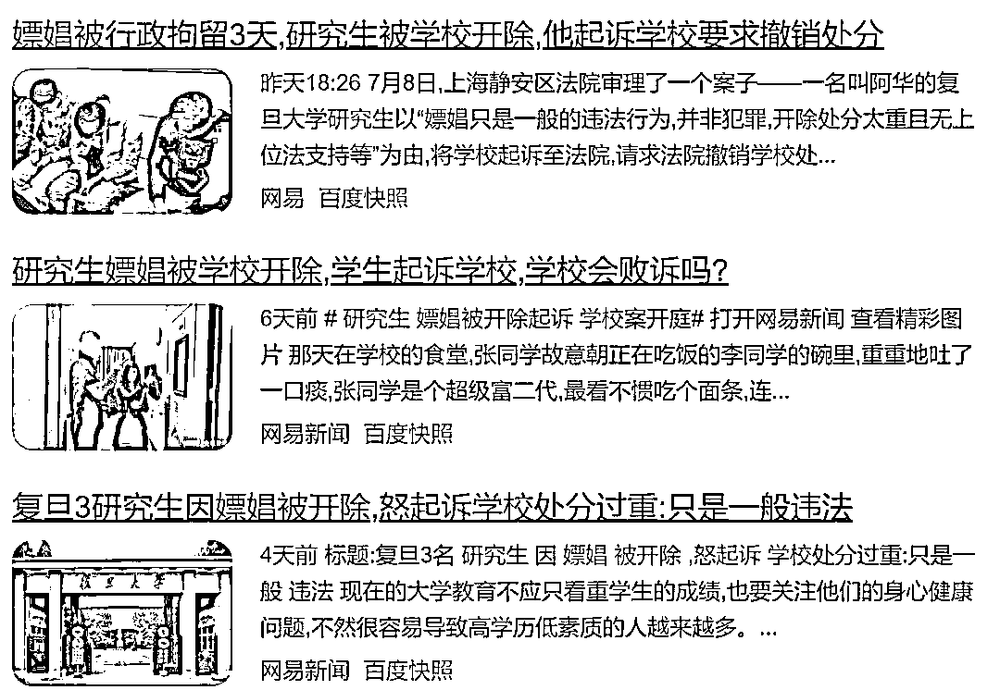
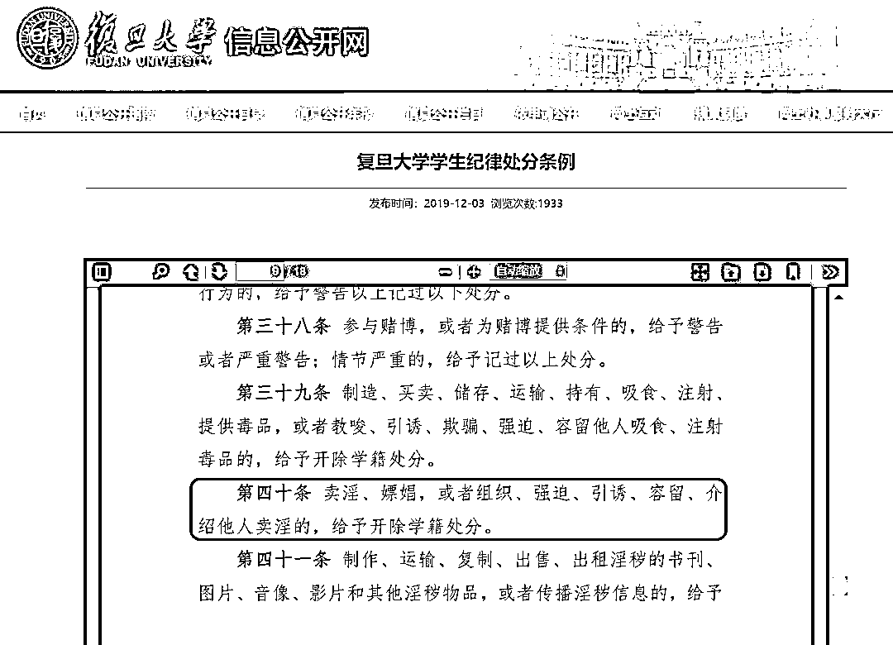
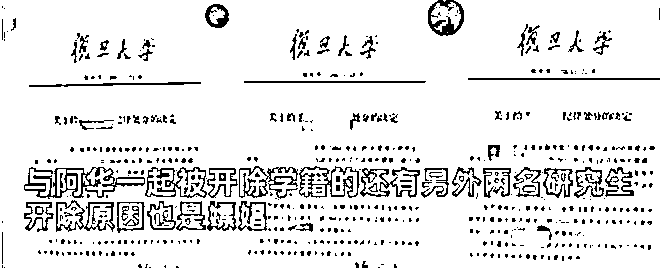
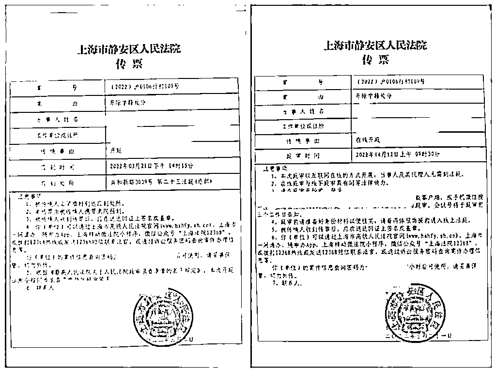
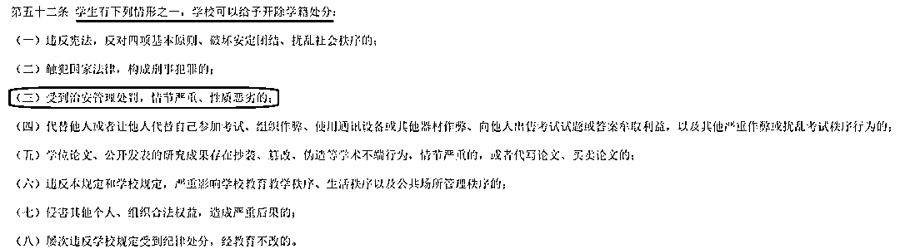
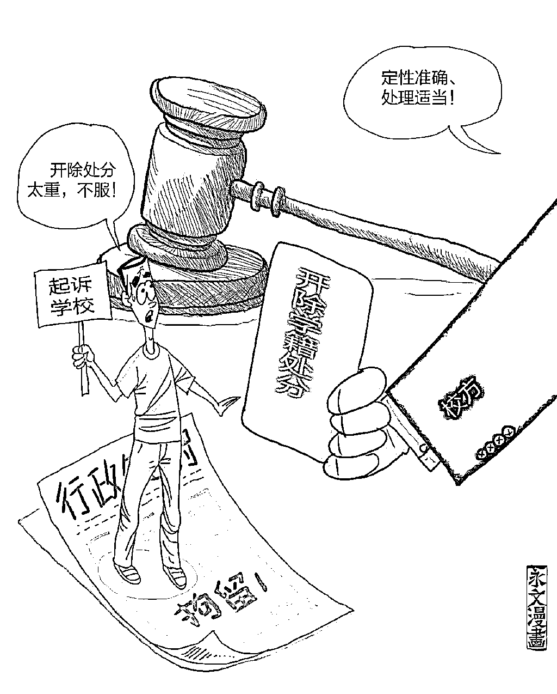
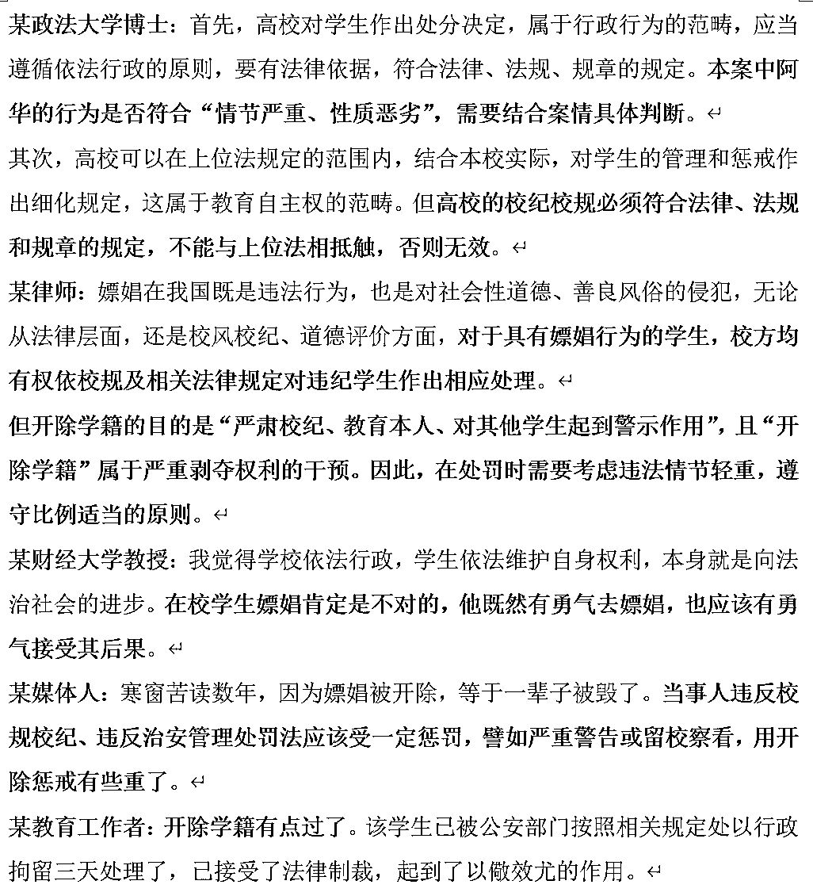
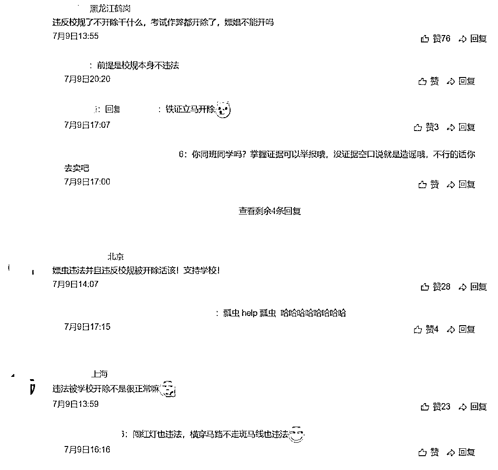
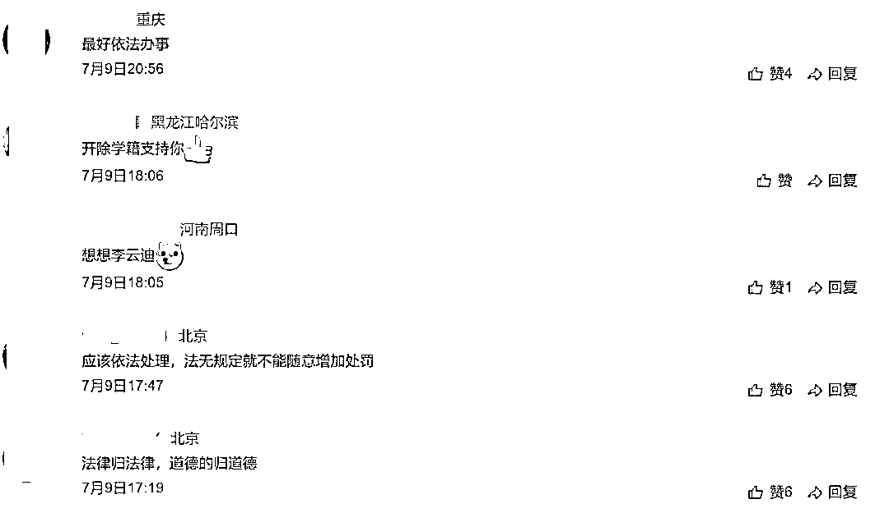

# 嫖娼被开除，研究生怒告复旦！律师助拳：校方决定违法…

> 原文：[`mp.weixin.qq.com/s?__biz=MzIyMDYwMTk0Mw==&mid=2247540572&idx=3&sn=fd2a9f3f765065188200380e1f8e8d2d&chksm=97cb9464a0bc1d726bb20479e7c2bb1f27fe74a0ec90dafb5d74a67f2870ac9fab94e6516840&scene=27#wechat_redirect`](http://mp.weixin.qq.com/s?__biz=MzIyMDYwMTk0Mw==&mid=2247540572&idx=3&sn=fd2a9f3f765065188200380e1f8e8d2d&chksm=97cb9464a0bc1d726bb20479e7c2bb1f27fe74a0ec90dafb5d74a67f2870ac9fab94e6516840&scene=27#wechat_redirect)

近日，**复旦大学被已开除研究生起诉的新闻在网上引起了广泛关注。**原来，该学生曾因嫖娼被复旦开除，但他认为自己是一般的违法行为，校方此举处分过重，遂将学校诉诸法庭，要求撤销处分。近日法院进行了案件审理，下面让我们了解一下具体情况。

◀

**事件回顾**

**▶**

****1. ****研究生因嫖娼被抓并被行政拘留****

**2020 年 9 月，复旦大学一研究生阿华（化名）在宾馆嫖娼被上海警方当场抓获。考虑到阿华尚还年轻，认错态度良好，最终，**阿华被处以行政拘留三日的处罚**。**

**2021 年 6 月，警方向复旦大学通报了阿华违法、受到行政处罚的情况。另外**与阿华一同被通报的还有其他两位同学。****

****2. ****学校依据纪律条例做出开除学籍处分****

**2021 年 7 月，**复旦大学收到警方通报后，认为学生嫖娼行为违反了该校学生纪律处分条例相关条款规定，遂决定给予三名学生开除学籍的处分。****

****

**7 月 4 日，阿华向学校提交了《异议书》。**他认为，嫖娼只是一般的违法行为，并非涉嫌犯罪，开除的处分过重且无上位法支持。****

****9 月，**校方驳回阿华诉求，并出具了处分决定书给予阿华开除学籍处分。**同时，**还将三名学生的处分决定以实名的方式在公示栏公示。**此举，引发轩然大波。****

********

******3. ****被开除学生认为处分不合法，将学校起诉至法院******

****被学校开除后，阿华不服，**以“处分决定程序严重违法，认定事实、法律适用均错误，目的不合法”为由，于 2021 年 10 月将学校起诉至上海市静安区法院，**请求法院撤销学校作出的处分决定，同时要求对学校学籍管理相关内容进行合法性审查。****

********

****2022 年 7 月 8 日，法院审理了相关案件，并充分听从了辩护双方的意见。法庭称合议庭将对此案深入讨论，**将择日宣判**。****

******4. ****代理律师观点******

******代理律师：开除处分无上位法依据，应予撤销******

****7 月 8 日，阿华的代理律师称，阿华所在的高校对阿华作出开除学籍处分的依据是该校学生纪律处分条例第 40 条“卖淫、嫖娼，或者组织、强迫、引诱、容留、介绍他人卖淫的，给予开除学籍处分”这一条款。****

******“我们对上述条款是有疑问的，因为它不合法。”**律师指出，高校学生纪律处分条例的上位法是教育部颁发的《普通高等学校学生管理规定》。而该规定第五十二条明确指出：**学生受到治安管理处罚，情节严重、性质恶劣的，学校可以给予开除学籍处分。******

************

******律师认为，**涉事学校相关条款删除了“情节严重、性质恶劣”这两个限定词**，会导致所有“受行政处罚的学生”被开除学籍，**违反了教育部“情节严重、性质恶劣”才被开除学籍的规定。********

********“事实上，阿华受到的治安管理处罚较轻，不适用教育部‘情节严重、性质恶劣’规定。”律师指出，《治安管理处罚法》第六十六条规定：卖淫、嫖娼的，处 10 日以上 15 日以下拘留，可以并处 5000 元以下罚款；情节较轻的，处 5 日以下拘留或者 500 元以下罚款。**本案公安机关对阿华作出的是行政拘留三日的处罚，显然已经认定阿华的行为 “情节较轻”。由此可见，涉事学校相关规定明显不合法，**“对阿华开除学籍的处分决定事实认定错误”。********

************

******此外，律师强调，学校只能对教育部的规定予以细化，不能随意扩大。**“情节严重、性质恶劣是评判的一种依据和适用条件，是一个限制范围，说白了，就是学生受到一般的情节不重的、性质不恶劣的治安处罚，学校不用开除学籍。**阿华所在的高校校规删除了情节严重、性质恶劣限定，一刀切对受到治安处罚的学生予以开除学籍处分，显然是扩大化（执法），权利明显超过了上位法的规定。”******

******此外，律师认为，**校方将阿华等人因嫖娼被行政拘留而开除学籍的信息张贴在校园内，严重侵犯个人隐私权。********

****************

**********5. ****校方观点**********

********复旦大学：定性准确、处理适当，请求法院驳回当事人全部诉讼请求********

******学校称，**该校学生纪律处分条例第四十条的有关规定与《高等教育法》《普通高等学校学生管理规定》的规定并行不悖，应当予以肯定。另外，学校作出给予阿华开除学籍处分的决定，符合《普通高等学校学生管理规定》和该校学生纪律处分条例的要求，**保护了阿华的合法权利，程序正当；同时，学校的处分决定证据充分、依据明确、定性准确、处理适当，应当予以维持，希望法院依法裁判，驳回阿华的全部诉讼请求。******

********6. ****其他人观点********

************

********对此，网友们也是众说纷纭，各持己见…********

************

************

********对此，你怎么看？********

********欢迎文底留言，发表你的看法********

******来源：律新观察，微算云平台，学术志，宾曰语云******

************************

******← 向右滑动与灰产圈互动交流 →******

************