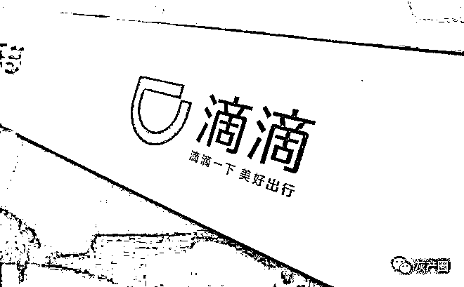
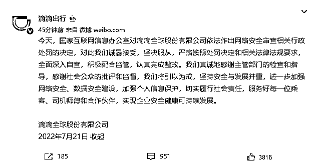

# 滴滴被罚 80.26 亿，存 16 项违法事实

> 原文：[`mp.weixin.qq.com/s?__biz=MzIyMDYwMTk0Mw==&mid=2247540572&idx=6&sn=219530a78511cdf9642eb09d90d86fe8&chksm=97cb9464a0bc1d7211607abd50aacfc34f6efeef07365dd81afa659e530d6d7e2dce9d532ff0&scene=27#wechat_redirect`](http://mp.weixin.qq.com/s?__biz=MzIyMDYwMTk0Mw==&mid=2247540572&idx=6&sn=219530a78511cdf9642eb09d90d86fe8&chksm=97cb9464a0bc1d7211607abd50aacfc34f6efeef07365dd81afa659e530d6d7e2dce9d532ff0&scene=27#wechat_redirect)

[`v.qq.com/iframe/preview.html?width=500&height=375&auto=0&vid=c3348dwz2o2`](https://v.qq.com/iframe/preview.html?width=500&height=375&auto=0&vid=c3348dwz2o2)

根据网络安全审查结论及发现的问题和线索，国家互联网信息办公室依法对滴滴全球股份有限公司涉嫌违法行为进行立案调查。经查实，滴滴全球股份有限公司违反《网络安全法》《数据安全法》《个人信息保护法》的违法违规行为事实清楚、证据确凿、情节严重、性质恶劣。

7 月 21 日，国家互联网信息办公室依据《网络安全法》《数据安全法》《个人信息保护法》《行政处罚法》等法律法规，**对滴滴全球股份有限公司处人民币 80.26 亿元罚款，对滴滴全球股份有限公司董事长兼 CEO 程维、总裁柳青各处人民币 100 万元罚款。**国家互联网信息办公室有关负责人就案件相关问题回答了记者提问。

**一、问：请简要介绍案件的背景和调查经过？**

答：2021 年 7 月，为防范国家数据安全风险，维护国家安全，保障公共利益，依据《国家安全法》《网络安全法》，网络安全审查办公室按照《网络安全审查办法》对滴滴公司实施网络安全审查。

根据网络安全审查结论及发现的问题和线索，国家互联网信息办公室依法对滴滴公司涉嫌违法行为进行立案调查。期间，国家互联网信息办公室进行了调查询问、技术取证，责令滴滴公司提交了相关证据材料，对本案证据材料深入核查分析，并充分听取滴滴公司意见，保障滴滴公司合法权利。经查实，滴滴公司违反《网络安全法》《数据安全法》《个人信息保护法》的违法违规行为事实清楚、证据确凿、情节严重、性质恶劣，应当从严从重予以处罚。

**二、问：滴滴公司存在哪些违法违规行为？**

答：经查明，滴滴公司共存在 16 项违法事实，归纳起来主要是 8 个方面。一是违法收集用户手机相册中的截图信息 1196.39 万条；二是过度收集用户剪切板信息、应用列表信息 83.23 亿条；三是过度收集乘客人脸识别信息 1.07 亿条、年龄段信息 5350.92 万条、职业信息 1633.56 万条、亲情关系信息 138.29 万条、“家”和“公司”打车地址信息 1.53 亿条；四是过度收集乘客评价代驾服务时、App 后台运行时、手机连接桔视记录仪设备时的精准位置（经纬度）信息 1.67 亿条；五是过度收集司机学历信息 14.29 万条，以明文形式存储司机身份证号信息 5780.26 万条；六是在未明确告知乘客情况下分析乘客出行意图信息 539.76 亿条、常驻城市信息 15.38 亿条、异地商务/异地旅游信息 3.04 亿条；七是在乘客使用顺风车服务时频繁索取无关的“电话权限”；八是未准确、清晰说明用户设备信息等 19 项个人信息处理目的。

此前，网络安全审查还发现，滴滴公司存在严重影响国家安全的数据处理活动，以及拒不履行监管部门的明确要求，阳奉阴违、恶意逃避监管等其他违法违规问题。滴滴公司违法违规运营给国家关键信息基础设施安全和数据安全带来严重安全风险隐患。因涉及国家安全，依法不公开。

**三、问：本案的违法主体是如何认定的？**

答：滴滴公司成立于 2013 年 1 月，相关境内业务线主要包括网约车、顺风车、两轮车、造车等，相关产品包括滴滴出行 App、滴滴车主 App、滴滴顺风车 App、滴滴企业版 App 等 41 款 App。

滴滴公司对境内各业务线重大事项具有最高决策权，制定的企业内部制度规范对境内各业务线全部适用，且对落实情况负监督管理责任。该公司通过滴滴信息与数据安全委员会及其下设的个人信息保护委员会、数据安全委员会，参与网约车、顺风车等业务线相关行为的决策指导、监督管理，各业务线违法行为是在该公司统一决策和部署下的具体落实。据此，本案违法行为主体认定为滴滴公司。

滴滴公司董事长兼 CEO 程维、总裁柳青，对违法行为负主管责任。

**四、问：对滴滴公司作出网络安全审查相关行政处罚的决定的主要依据是什么？**

答：此次对滴滴公司的网络安全审查相关行政处罚，与一般的行政处罚不同，具有特殊性。滴滴公司违法违规行为情节严重，结合网络安全审查情况，应当予以从严从重处罚。一是从违法行为的性质看，滴滴公司未按照相关法律法规规定和监管部门要求，履行网络安全、数据安全、个人信息保护义务，置国家网络安全、数据安全于不顾，给国家网络安全、数据安全带来严重的风险隐患，且在监管部门责令改正情况下，仍未进行全面深入整改，性质极为恶劣。二是从违法行为的持续时间看，滴滴公司相关违法行为最早开始于 2015 年 6 月，持续至今，时间长达 7 年，持续违反 2017 年 6 月实施的《网络安全法》、2021 年 9 月实施的《数据安全法》和 2021 年 11 月实施的《个人信息保护法》。三是从违法行为的危害看，滴滴公司通过违法手段收集用户剪切板信息、相册中的截图信息、亲情关系信息等个人信息，严重侵犯用户隐私，严重侵害用户个人信息权益。四是从违法处理个人信息的数量看，滴滴公司违法处理个人信息达 647.09 亿条，数量巨大，其中包括人脸识别信息、精准位置信息、身份证号等多类敏感个人信息。五是从违法处理个人信息的情形看，滴滴公司违法行为涉及多个 App，涵盖过度收集个人信息、强制收集敏感个人信息、App 频繁索权、未尽个人信息处理告知义务、未尽网络安全数据安全保护义务等多种情形。

综合考虑滴滴公司违法行为的性质、持续时间、危害及情形，对滴滴公司作出网络安全审查相关行政处罚的决定的主要依据是《网络安全法》《数据安全法》《个人信息保护法》《行政处罚法》等有关规定。

**五、问：下一步网络执法的重点方向和领域有哪些？**

答：近年来，国家不断加强对网络安全、数据安全、个人信息的保护力度，先后颁布了《网络安全法》《数据安全法》《个人信息保护法》《关键信息基础设施安全保护条例》《网络安全审查办法》《数据出境安全评估办法》等法律法规。网信部门将依法加大网络安全、数据安全、个人信息保护等领域执法力度，通过执法约谈、责令改正、警告、通报批评、罚款、责令暂停相关业务、停业整顿、关闭网站、下架、处理责任人等处置处罚措施，依法打击危害国家网络安全、数据安全、侵害公民个人信息等违法行为，切实维护国家网络安全、数据安全和社会公共利益，有力保障广大人民群众合法权益。同时，加大典型案例曝光力度，形成强大声势和有力震慑，做到查处一案、警示一片，教育引导互联网企业依法合规运营，促进企业健康规范有序发展。

**滴滴方回应**

[`v.qq.com/iframe/preview.html?width=500&height=375&auto=0&vid=o3348jyis3w`](https://v.qq.com/iframe/preview.html?width=500&height=375&auto=0&vid=o3348jyis3w)

今天，国家互联网信息办公室对滴滴全球股份有限公司依法作出网络安全审查相关行政处罚的决定，对此我们诚恳接受，坚决服从，严格按照处罚决定和相关法律法规要求，全面深入自查，积极配合监管，认真完成整改。我们真诚地感谢主管部门的检查和指导，感谢社会公众的批评和监督，我们将引以为戒，坚持安全与发展并重，进一步加强网络安全、数据安全建设，加强个人信息保护，切实履行社会责任，服务好每一位乘客、司机师傅和合作伙伴，实现企业安全健康可持续发展。

[`v.qq.com/iframe/preview.html?width=500&height=375&auto=0&vid=a33481qkh2d`](https://v.qq.com/iframe/preview.html?width=500&height=375&auto=0&vid=a33481qkh2d)

来源：澎湃新闻

← 向右滑动与灰产圈互动交流 →

