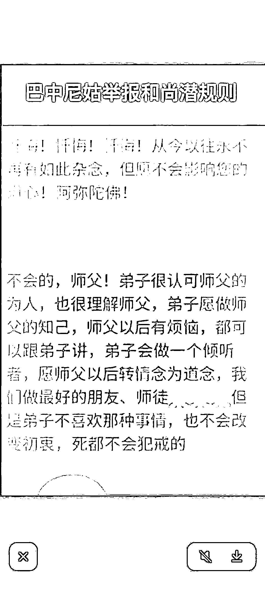
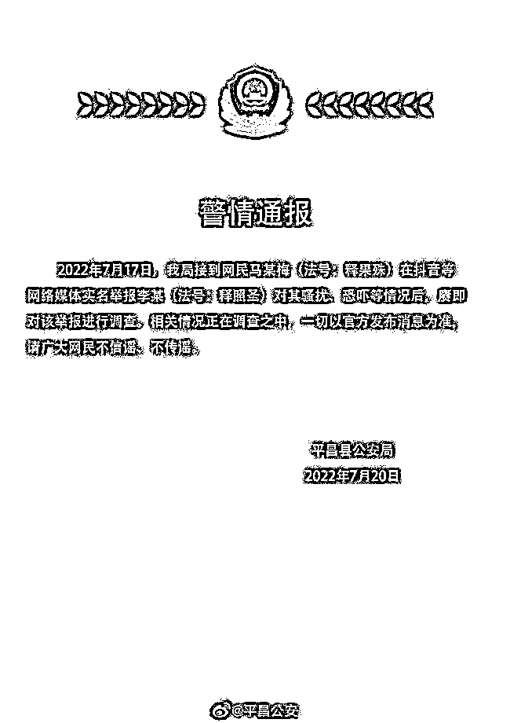

# 尼姑实名举报巴中佛教协会会长性骚扰，多次威逼利诱让发生不正当关系，聊天记录和语音曝光

> 原文：[`mp.weixin.qq.com/s?__biz=MzIyMDYwMTk0Mw==&mid=2247540651&idx=2&sn=5e5825b6d80d7653d55a82c5daad358f&chksm=97cb9493a0bc1d858825233ac1941603b8cb71877b8fd86173cac0efdcef6dea82f640c8f611&scene=27#wechat_redirect`](http://mp.weixin.qq.com/s?__biz=MzIyMDYwMTk0Mw==&mid=2247540651&idx=2&sn=5e5825b6d80d7653d55a82c5daad358f&chksm=97cb9493a0bc1d858825233ac1941603b8cb71877b8fd86173cac0efdcef6dea82f640c8f611&scene=27#wechat_redirect)

[`v.qq.com/iframe/preview.html?width=500&height=375&auto=0&vid=h334867j7ch`](https://v.qq.com/iframe/preview.html?width=500&height=375&auto=0&vid=h334867j7ch)

据环球时报 7 月 21 日报道，近日，一位尼姑发视频实名举报四川巴中佛教协会会长照圣法师**对其潜规则提出不正当要求****。**

[`mp.weixin.qq.com/mp/readtemplate?t=pages/video_player_tmpl&action=mpvideo&auto=0&vid=wxv_2496477414970146816`](https://mp.weixin.qq.com/mp/readtemplate?t=pages/video_player_tmpl&action=mpvideo&auto=0&vid=wxv_2496477414970146816)

尼姑实名举报某和尚骚扰恐吓 录音曝光：去你房间

其称对方步步挖坑，三番五次威逼利诱让其与他发生不正当关系，**目前迫于压力她已从四川离开**。

7 月 20 日，四川省平昌县公安局官方微博@平昌公安  发布通报称： 

7 月 17 日，该局接到网民马某梅（法号：释果殊）在抖音等网络媒体实名举报李某（法号：释照圣）对其骚扰、恐吓等情况后，赓即对该举报进行调查。 

相关情况正在调查之中，一切以官方发布消息为准，请广大网民不信谣、不传谣。 

佛教里有一段流传甚广的释迦牟尼佛祖和魔王波旬的对话，最有名的就是佛将要涅槃，魔王来了和佛有一番对答。

释迦牟尼佛在世，讲经说法四十九年，应得度者皆得度。魔王波旬看到释迦牟尼佛度了很多人，心里很不舒服，他来见佛，请佛赶快涅磐：“你度了那么多人了，可以涅磐了。”　　

佛祖觉察到自己与娑婆众生的缘分已到，就答应了波旬的请求。

魔王波旬道：“你涅磐后，我一定要破坏你的佛法。”　　

佛说：“佛法是正法，没有任何力量能破坏。”　　

魔王波旬道：“呵呵，正义永存，邪恶也不会消失。你在世时也不是人人都信仰你，我的徒子徒孙不也很多吗？人性本恶，学坏容易学好难。你入灭之后，信仰你的人会越来越少，信仰我的人会越来越多。”

佛说：“你破坏我的佛法对你没好处。佛光是普照之光，照耀着善良的人，也照耀着邪恶如你之人。如果正法时代一旦结束，你的福报也就完了，等待你的就是无间地狱，你会在地狱中受无量种种苦。”　　

魔王波旬道：“我知道佛祖是不说谎的，但是，佛祖你也知道命由心造。我会设法避免地狱之苦的。”　　

佛说：“多行不义必自毙，哪里能避免得了！”　　

魔王波旬道：“圣人无常心,以百姓心为心。我亦无常心，以百姓心为心。在顺应百姓方面，佛祖你是比不上我的。你戒律森严，极力强调贪欲的危害，教人远离贪欲。而我顺应百姓的欲望，满足百姓的欲望。众生没有贪欲那里有我波旬？”

佛说：“我有佛经留世。”

魔王波旬道：“经典是死文字，要教化众生，还是需要人来解释。”

佛说：“我有僧宝留世。”

魔王波旬道：“你要教化众生得引进新人吧。你老人家不会拒绝我的弟子接受你的教诲吧。”

佛说：“不会。”

魔王波旬道：“到你末法时期，我叫我的徒子徒孙混入你的僧宝内，穿你的袈裟，破坏你的佛法。他们曲解你的经典，破坏你的戒律，以达到我今天武力不能达到的目的.....”　佛祖听了魔王的话，久久无语，不一会，两行热泪缓缓流了下来。魔王见此，率众狂笑而去。

其实还有后话，就是佛说会率领弟子走出寺庙一世修成。所以末法时期在寺院未必是真，在家也未必是假。而楞严经就像一面照妖镜，是佛留下教我们怎样辨别邪师。

末法时期依法不依人。佛经戒律才是真的。

**你对此有什么看法** 

**欢迎在评论区留言**

来源:宾曰语云（ID：Lzkj328）综合自搜狐新闻客户端、环球时报、@平昌公安、南无地藏王菩萨

← 向右滑动与灰产圈互动交流 →

