# 林志颖失控前画面曝光！车身瞬间起火燃烧，被拉出时满脸鲜血无法说话

> 原文：[`mp.weixin.qq.com/s?__biz=MzIyMDYwMTk0Mw==&mid=2247540651&idx=3&sn=5cc5c789f6f9c15adb76c57411d33588&chksm=97cb9493a0bc1d851e72e6f194a4cfc517b7ea2a458b0106ff0f5d38f3b1678c56e3162be6b7&scene=27#wechat_redirect`](http://mp.weixin.qq.com/s?__biz=MzIyMDYwMTk0Mw==&mid=2247540651&idx=3&sn=5cc5c789f6f9c15adb76c57411d33588&chksm=97cb9493a0bc1d851e72e6f194a4cfc517b7ea2a458b0106ff0f5d38f3b1678c56e3162be6b7&scene=27#wechat_redirect)

7 月 22 日，据台媒报道，林志颖父子俩开车外出时突然发生车祸，轿车瞬间自燃，好在父子俩已经送往医院紧急就医，消息引发热议。

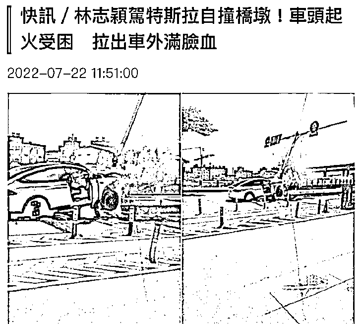

据悉，事件发生于上午十一点左右，从现场曝光的画面中可以看出，一辆白色轿车撞到了路边的指示牌，指示牌已经严重变形了，直接嵌入了轿车内，可见撞击力度之大，而轿车前段也燃起了熊熊大火，画面十分危险。

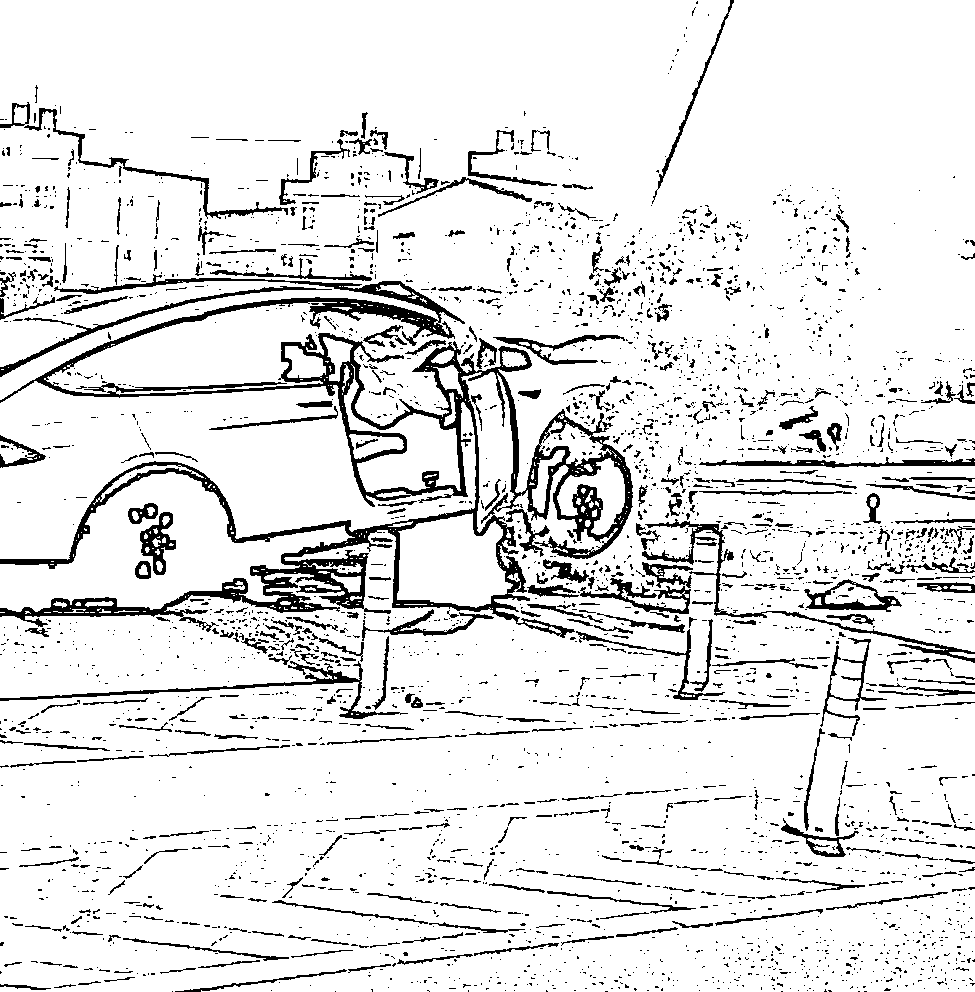

这场事故立马引起了路人的关注，随后群众便发现轿车的驾驶位坐着林志颖，他的儿子也在车内。

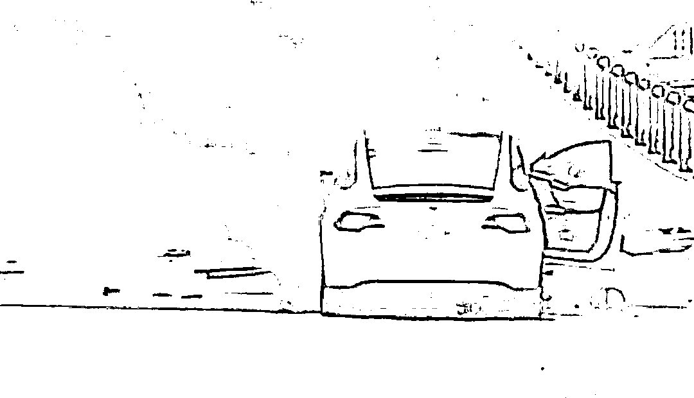

据现场群众透露，林志颖的伤势比较严重，身体也卡在了车内，是在大家合力的帮忙下才脱困的，而车上的小孩伤势并不严重，脸上有些擦伤，似乎只是受到了惊吓。

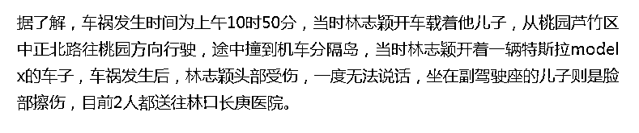

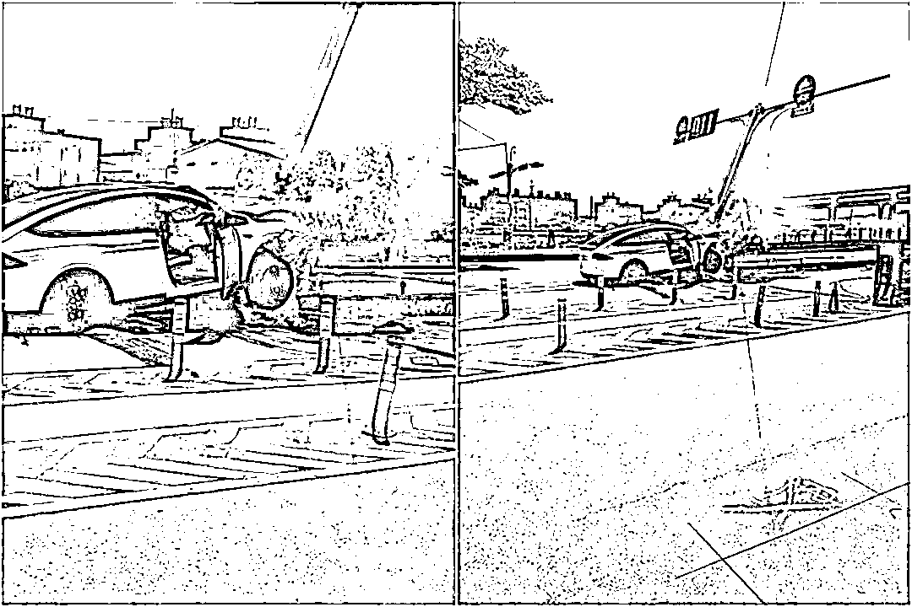

林志颖被拖出车时满脸都是血，头部受伤，当时一度无法说话。

当时还有网友曝光了现场照片，画面十分恐怖，但随即就被林志颖的经纪人出面否认了。

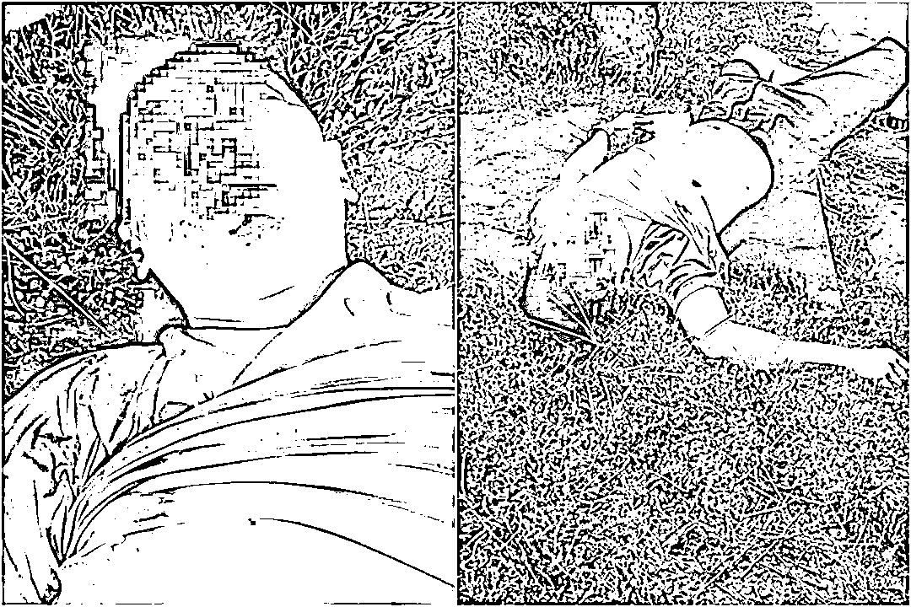

照片中的男子脸部肿胀，肚皮袒露，和林志颖有着很大的区别，但手腕上的限量版手表却引起了网友的关注。

据悉，这款手表全球限量 500 只，该男子的衣服也和林志颖的一模一样，所以虽然林志颖经纪人否认了，但还是有无数网友认为该男子就是林志颖。

在林志颖父子被救出之后，轿车仍在继续燃烧，虽然消防人员及时赶到，但当大火扑灭时，这辆车也已经被烧得不成样子了。

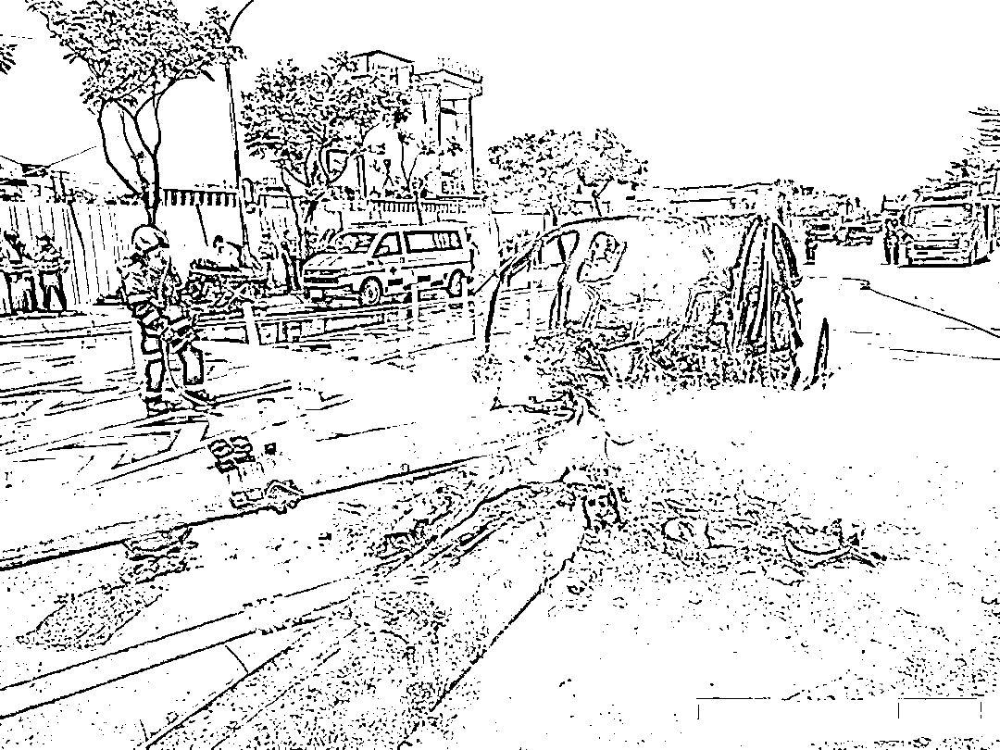

现场视频——

[`v.qq.com/iframe/preview.html?width=500&height=375&auto=0&vid=l334835znf1`](https://v.qq.com/iframe/preview.html?width=500&height=375&auto=0&vid=l334835znf1)

事件发生后，记者马上联系了林志颖的家人，对方回应表示“目前在医院，应该无大碍”。

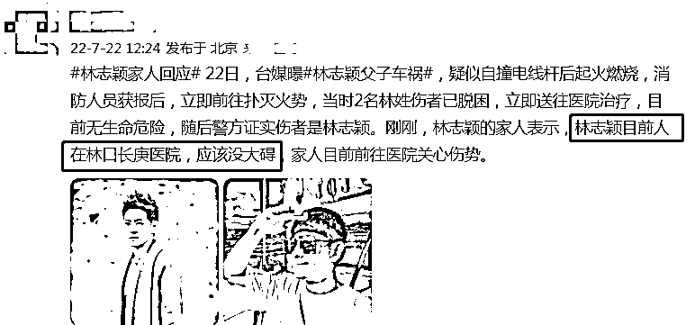

消息曝光后引发热议，很多网友都在思考事故的起因，还有人直言“他不是赛车手吗”。

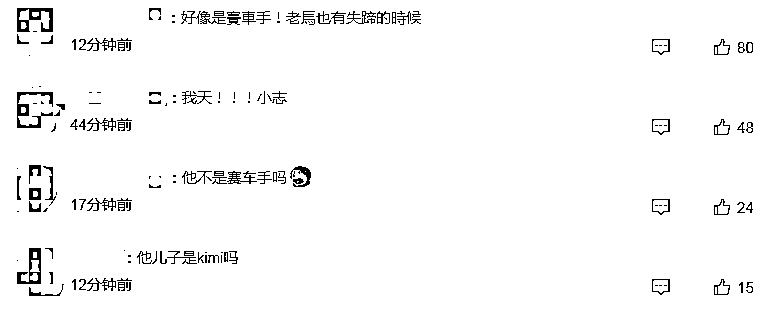

虽然林志颖的家人透露无大碍，但模棱两可的态度依然让网友倍感担忧，而车上小儿子的身份也无法确定。

失控前画面曝光——

[`mp.weixin.qq.com/mp/readtemplate?t=pages/video_player_tmpl&action=mpvideo&auto=0&vid=wxv_2497752931706830849`](https://mp.weixin.qq.com/mp/readtemplate?t=pages/video_player_tmpl&action=mpvideo&auto=0&vid=wxv_2497752931706830849)

根据最新曝光的路口监视器画面显示，林志颖的驾驶的车辆在路口掉头后，车速并不快，但一路往车道右边偏离，接着就撞上分隔岛信号灯杆后起火。

警方调阅了监视器画面，并根据初步调查结果后表示，林志颖疑似因未注意车前状况，不慎碰撞分隔岛和信号灯杆，随后车辆便起火燃烧。

警方表示，事故原因有待进一步调查厘清，现场对驾驶实施呼气酒精浓度测试，其酒测值为零，并未有酒后驾驶的情况。

众所周知，林志颖不仅是位演员还是名出色的赛车手，曾在赛场上拿到过无数优秀的成绩。

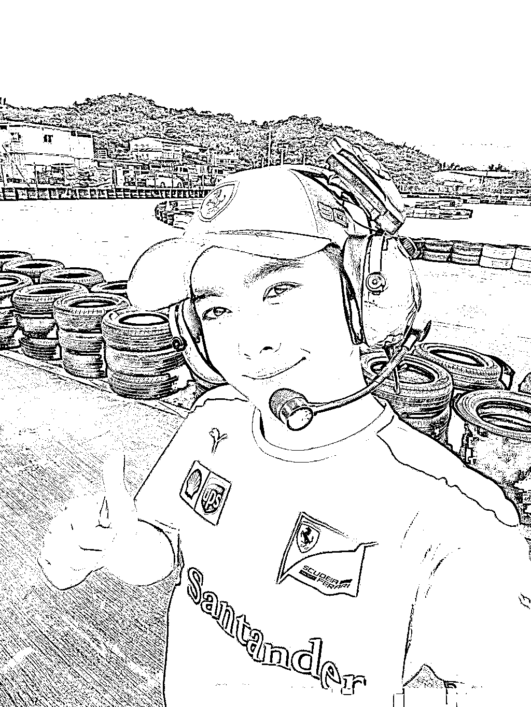

翻看林志颖的社交平台会发现他的日常几乎都是和赛车相关的，即便是难得和孩子团聚享受亲子时光，林志颖也会带着儿子去赛车场看比赛。

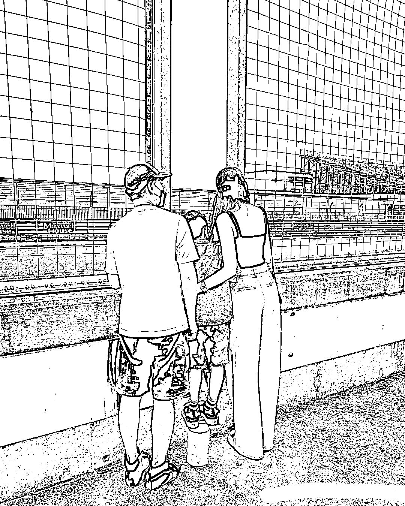

同样，林志颖的妻儿也对赛车十分迷恋，此前林志颖妻子还晒出过小儿子痴迷赛车的模样，一看到赛车就会拿出相机拍个不停，和爸爸林志颖十分相似。

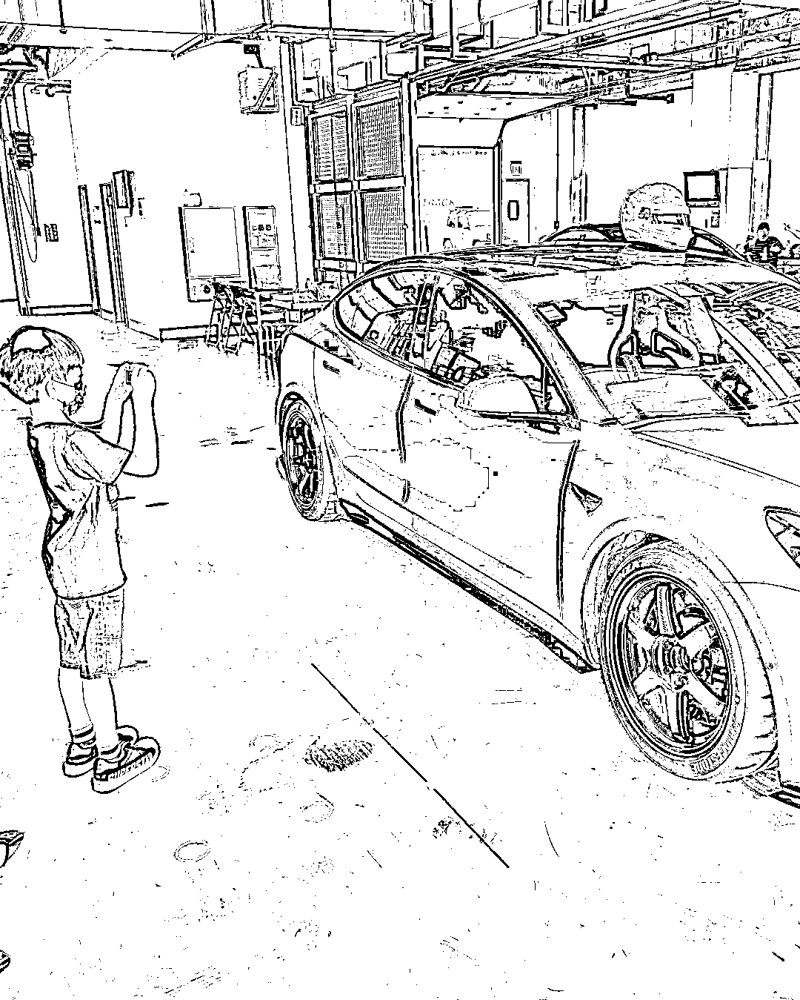

近段时间，林志颖和妻子带着三个孩子过暑假，夫妻俩也经常在社交平台晒出外出游玩的画面，一家五口每次同框的画面都十分温馨。

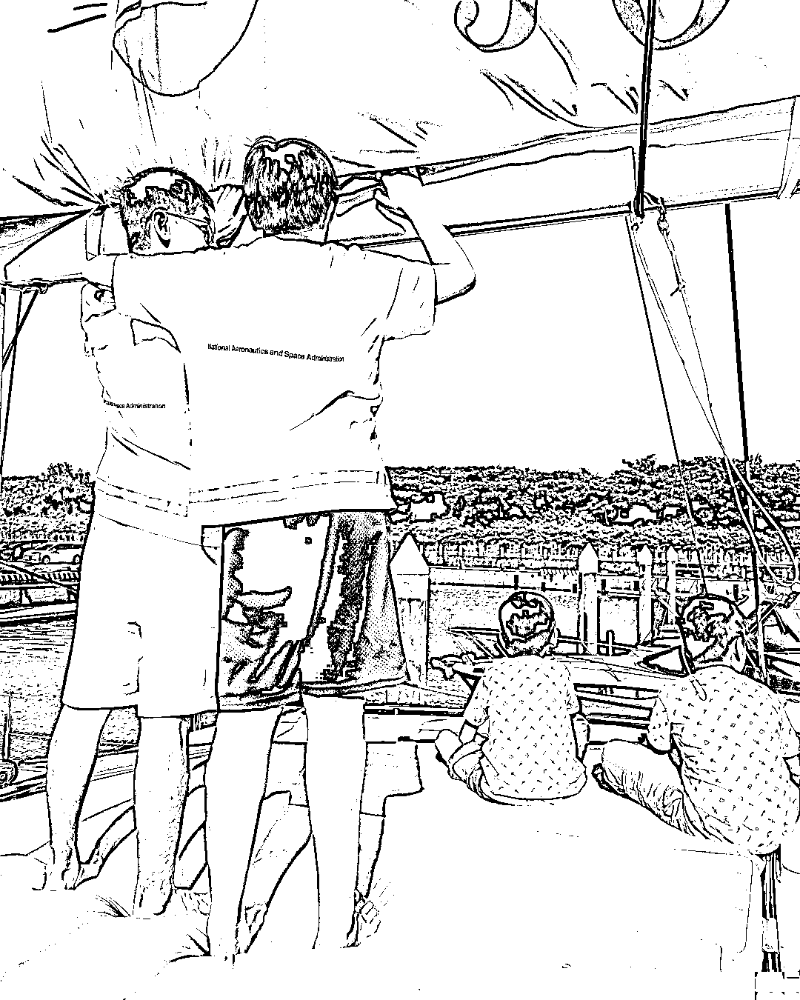

而这次意外的发生实在让人不敢相信，按道理讲，有着丰富赛车经验的林志颖不可能会犯自撞这样的低级失误，对此有网友怀疑是轿车失控，也有人认为可能是林志颖的身体突发异常。

如今事件仍在跟进，无论是什么原因造成的，还是希望林志颖父子能够平安无事，早日恢复健康。

来源：盖饭娱乐官方号 分享：吃瓜不吐葡萄皮（ID：xbzavi）

← 向右滑动与灰产圈互动交流 →

