# 起底南京玄奘寺及原住持传真法师

> 原文：[`mp.weixin.qq.com/s?__biz=MzIyMDYwMTk0Mw==&mid=2247540651&idx=4&sn=20d3204de30ddc4db924840369f7b143&chksm=97cb9493a0bc1d85cc1ce0f8d43346584ecb97ed13e8290ea50e908e2213bdadaea7ae95b44e&scene=27#wechat_redirect`](http://mp.weixin.qq.com/s?__biz=MzIyMDYwMTk0Mw==&mid=2247540651&idx=4&sn=20d3204de30ddc4db924840369f7b143&chksm=97cb9493a0bc1d85cc1ce0f8d43346584ecb97ed13e8290ea50e908e2213bdadaea7ae95b44e&scene=27#wechat_redirect)

近日，有网友发文指出，在曾经发生“南京大屠杀”这一历史惨剧的城市里，一座名叫“玄奘寺”的寺庙竟然供奉着多名日本战犯的长生牌位。消息一出，举国愤慨。

7 月 22 日，微信公众号“南京发布”发布消息，公布南京玄奘寺事件处理情况，寺庙主要负责人被撤换。此后，纪检监察机关、公安机关将对相关单位和人员作进一步调查，并依规依纪依法作出处理。

据最初的爆料网友小北（化名）称，这些日本战犯牌位的供奉人署名为“吴啊萍”，警方也正在全力调查寺庙和此人。那么，为何日本战犯的牌位会出现在南京玄奘寺？玄奘寺究竟是一个什么样的寺庙？还有，已被撤换的该寺庙原住持传真法师又是何人？

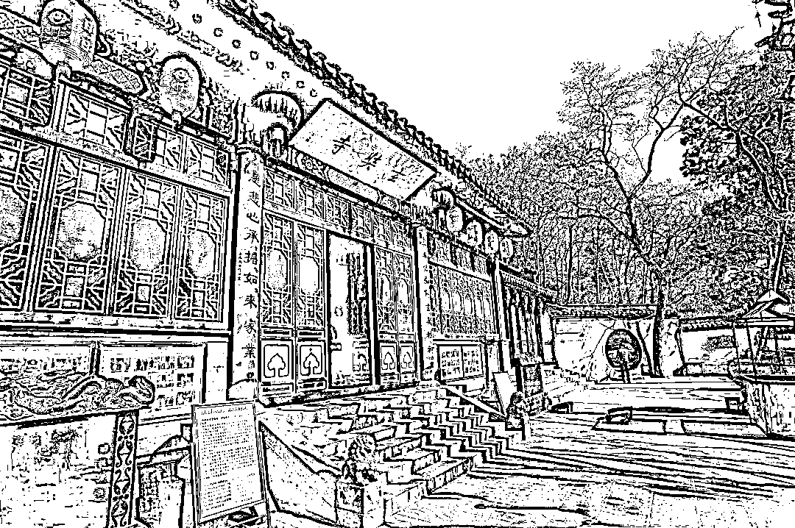

南京玄奘寺

**玄奘寺的历史，就曾与日军侵略有关**

玄奘寺位于南京市玄武区北京东路九华山公园内，北临玄武湖，东接太平门，西邻台城。

1942 年初冬，日本侵略者在雨花台大报恩寺三藏塔遗址挖到一石函，函内供奉有玄奘大师的顶骨舍利，并记载了唐代高僧玄奘顶骨舍利来南京安葬的经过。日军妄想占为己有，在南京人民的抗议下，日军将玄奘大师部分顶骨舍利归还给南京人民。

1943 年初，汪伪政府在九华山上建了一座砖塔，供奉玄奘大师的顶骨舍利，得名三藏塔。2003 年，南京市玄武区政府及区建设局在小九华山重修寺庙，即为现在的玄奘寺，由栖霞古寺监院传真法师住持管理。

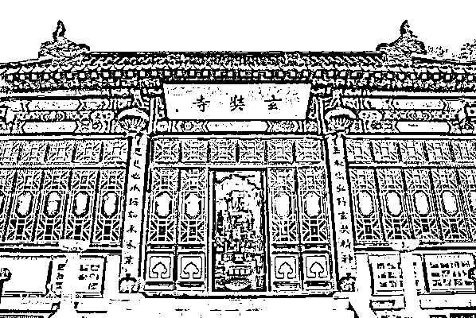

南京玄奘寺

那么，这个传真法师又是怎样一名僧人呢？

**僧人传真——开公司、拍电影、爱当官……**

传真法师，法号正宏，俗名李义将。1968 年生，安徽颍上人。他于 1987 年在南京栖霞寺出家，1990 年在常州天宁寺受戒，1988 年在栖霞山佛学院学习，1993 年入南京大学历史学系，研修历史、中文、佛学及外文等课程，是改革开放后较早进入大学（非佛学院）学习的僧人。此外，他还是南京栖霞寺监院兼知客、溧水无想寺监院。

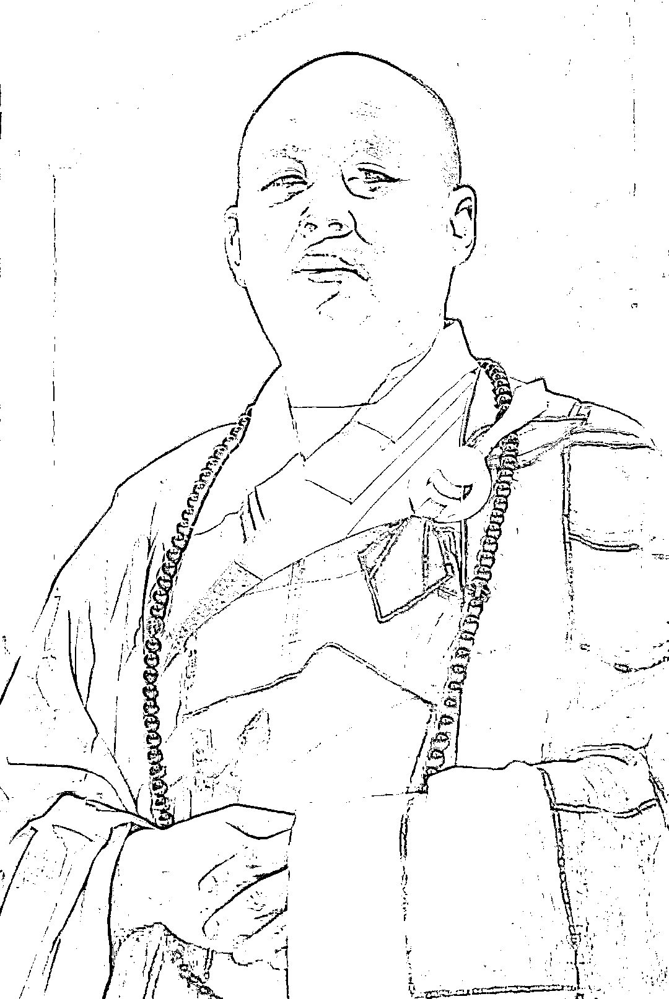

传真法师

大多数人认为，出家人本该“六根清净”，正所谓“跳出红尘外，不在五行中”。但这位传真法师，却似乎非常热衷于红尘俗世。公开资料就显示，他还有着相当规模的“商业版图”。

天眼查 APP 显示，传真担任 2 家宗教组织的负责人，包括南京玄奘寺和南京市溧水区无想禅寺。此外，传真还关联 6 家公司，其担任法人的南京三藏精汇文化传媒有限公司和南京诚之堂投资顾问有限公司禅那文化传播分公司皆已注销。

而仍处于存续状态的公司还有 4 家，包括南京慈愿养老服务有限公司、南京真爱圣地国际旅行社有限公司、南京三藏文化传媒有限公司、安徽省颍上县大河湾粮油食品有限公司。传真任上述 3 家南京公司的法定代表人、执行董事并持股，任安徽省颍上县大河湾粮油食品有限公司监事。

从中可以看出，这些公司的经营范围很广，包括养老服务；会务服务；日用百货销售；旅游服务；学术研究；文化交流；影视制作、发行；佛教文化用品开发与经营等。

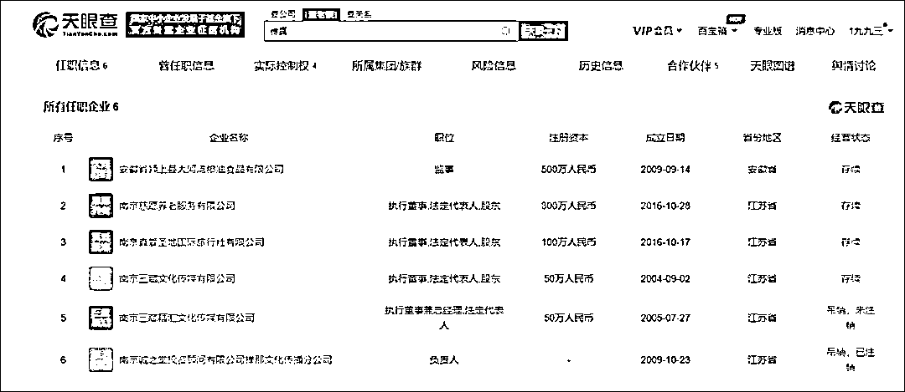

此外，传真曾先后筹拍了两部抗日电影《栖霞寺 1937》和《三藏塔 1942》，被誉为中国版《辛德勒名单》的《栖霞寺 1937》，内容正是关于栖霞寺供奉舍利的故事。传真是这两部影片的编剧和制片人，南京三藏文化传媒有限公司出品了这两部电影。

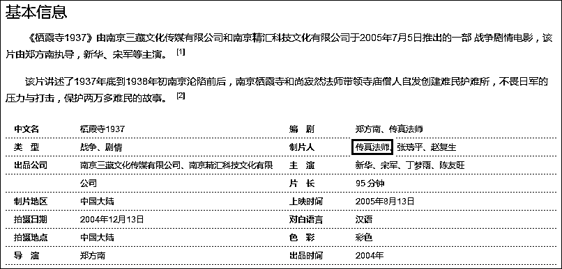

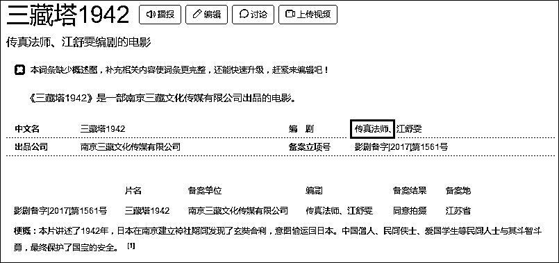

不过，《栖霞寺 1937》因经费账目不明等原因，其影片出品人传真法师与合作方南京精汇科技文化有限公司后来打起了官司，公映 6 年经历 5 场诉讼，争议不断。

除了开公司和拍电影，作为僧人的传真竟还热衷于“投身官场”。

2005 年 10 月，传真曾报名参选南京市宗教局副局长一职。当时，南京市委组织部向媒体证实，传真法师确实到报名点咨询过，并递交了报名材料，后因“不符合条件”未通过初审，组织部门通知其将报名材料收回。

后来，传真还是如愿当了“官”，包括南京市政协委员、江苏省佛教协会理事、南京市青联常委、南京市佛教协会副会长等等，都曾是他的头衔和身份。

**官方公布南京玄奘寺事件处理情况**

7 月 21 日，有网友爆料称，位于南京九华山公园里面的玄奘寺，供奉着四名日军战犯的长生牌位，供奉人署名为“吴啊萍”，该消息随即在网上引发网民愤怒。

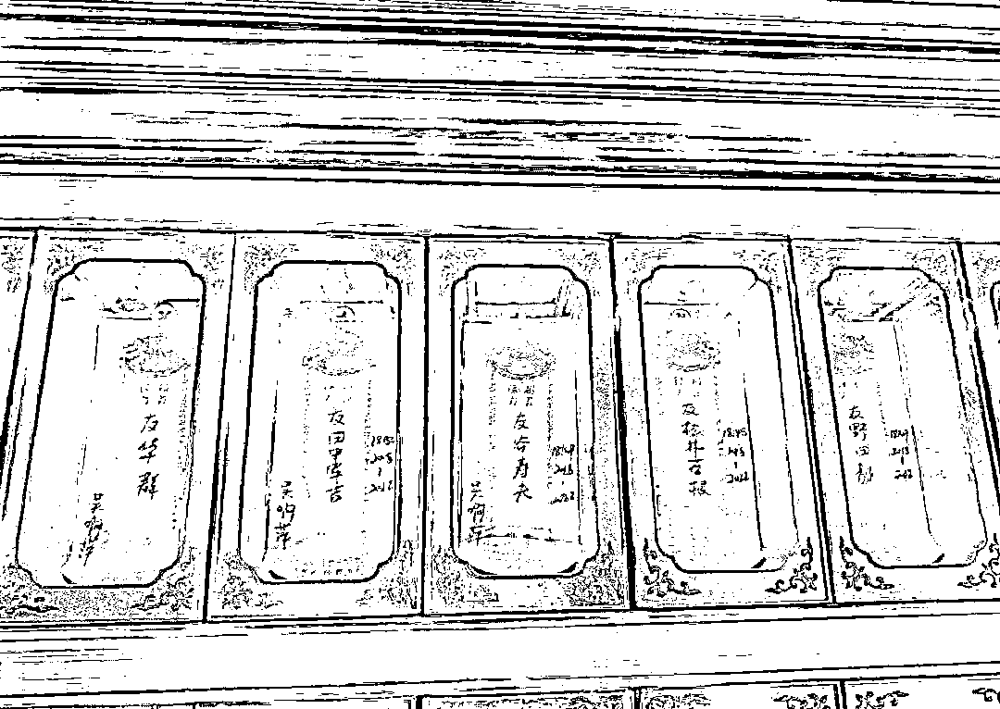

网传图片

这四名战犯中，包括南京大屠杀的主要负责人之一的甲级战犯松井石根，南京大屠杀首恶、乙级战犯谷寿夫，以及在南京制造了“百人斩”杀人竞赛的的丙级战犯野田毅和用军刀斩杀手无寸铁中国军民逾 300 人的田中军吉。

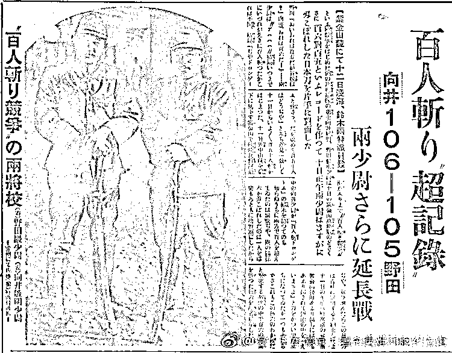

1937 年 11 月下旬开始，野田毅等人在南京制造骇人听闻的“百人斩”比赛，图为当时日媒报道。

7 月 22 日清晨，南京市民族宗教事务局官方微博（@南京民宗）发布情况通报称，21 日晚，玄武区民族宗教事务局接到玄奘寺供奉牌位有关情况的举报后，立即会同公安等部门连夜赶往现场调查。据初步了解，今年 2 月份，寺方发现相关情况后，已予以纠正。针对上述情况，玄武区民族宗教事务局决定对该寺开展整顿。通报还称，将对伤害民族感情的行为一查到底，有关调查处理情况将及时公布。

同日，当时身为南京玄奘寺住持的传真法师回应媒体称，牌位曾摆放位置是寺中的地藏殿，挂牌位需要审核。关于牌位审核等相关问题，他称调查组已进驻调查。

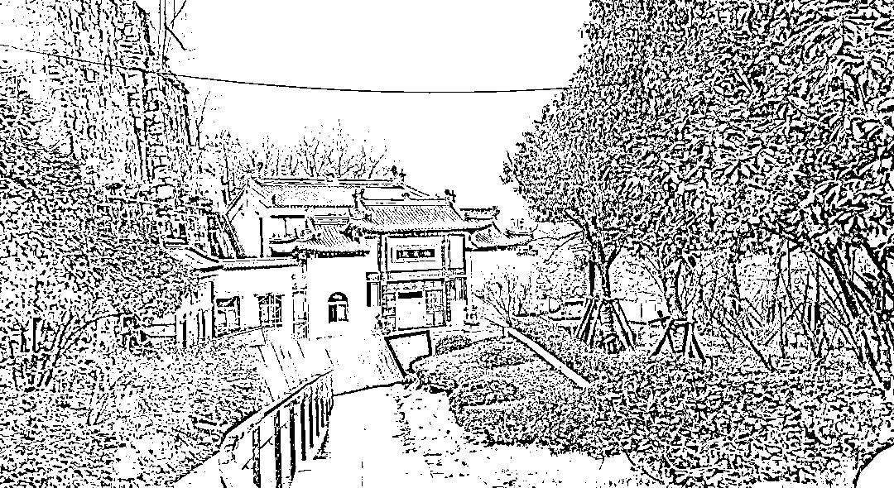

玄奘寺地藏殿 资料图

@侵华日军南京大屠杀遇难同胞纪念馆 22 日则回应稍早前南京市玄武区民族宗教事务局通报玄奘寺曾供奉涉大屠杀日军战犯牌位一事，称“我们任何时候都不能忘记侵略者所犯下的严重罪行！民族感情不容伤害，期待一查到底！”

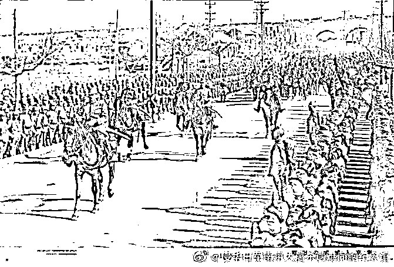

1937 年 12 月 17 日，日军举行占领南京入城式。图为当日松井石根等骑马从中山门入城检阅部队。

据微信公众号“南京发布”7 月 22 日发布消息称，玄奘寺供奉南京大屠杀战犯牌位事件造成恶劣影响，对此，南京市委市政府高度重视，迅速成立工作专班进行调查处置并决定：

责成玄武区民族宗教事务局撤换传真(俗名李义将)玄奘寺主要负责人职务；责令玄奘寺停止日常活动，并会同相关部门立即对其进行整顿。责成玄武区委按程序免去区民族宗教事务局局长胡圆圆职务。对市民族宗教事务局局长苏宇红予以诫勉。对市民族宗教事务局副局长纪勤予以停职检查。

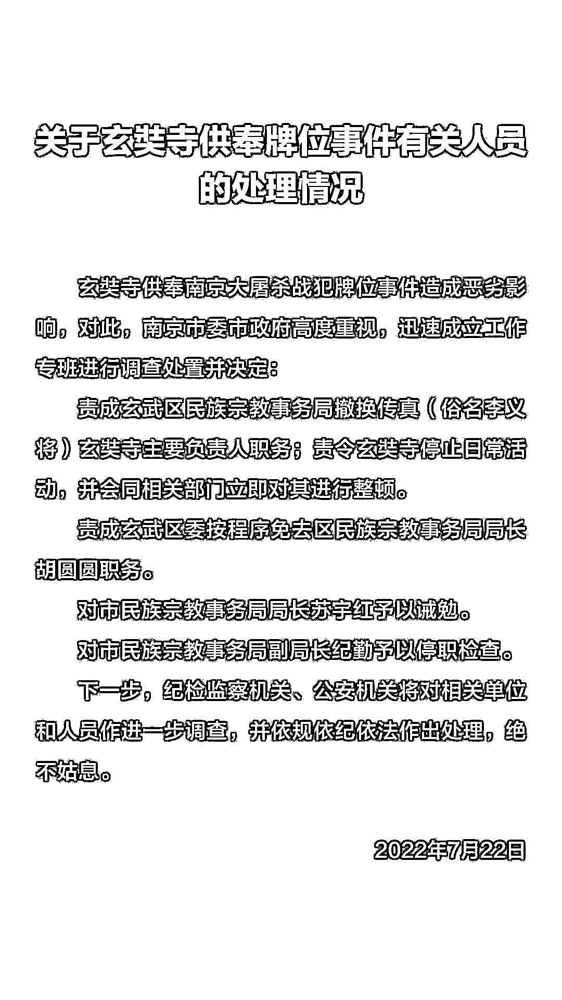

图自微信公众号“南京发布”

下一步，纪检监察机关、公安机关将对相关单位和人员作进一步调查，并依规依纪依法作出处理，绝不姑息。

（本文部分资料内容参考综合上游新闻、凤凰网、百度百科及网络公开信息等）

来源：观察者网综合

← 向右滑动与灰产圈互动交流 →

