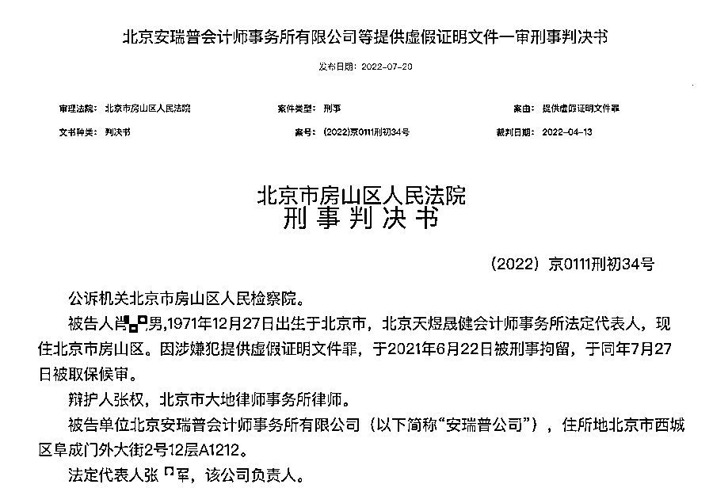
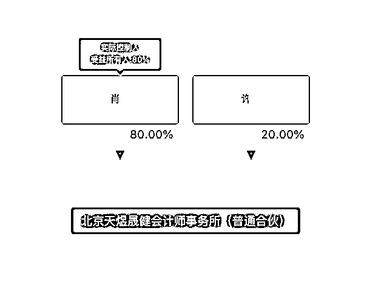
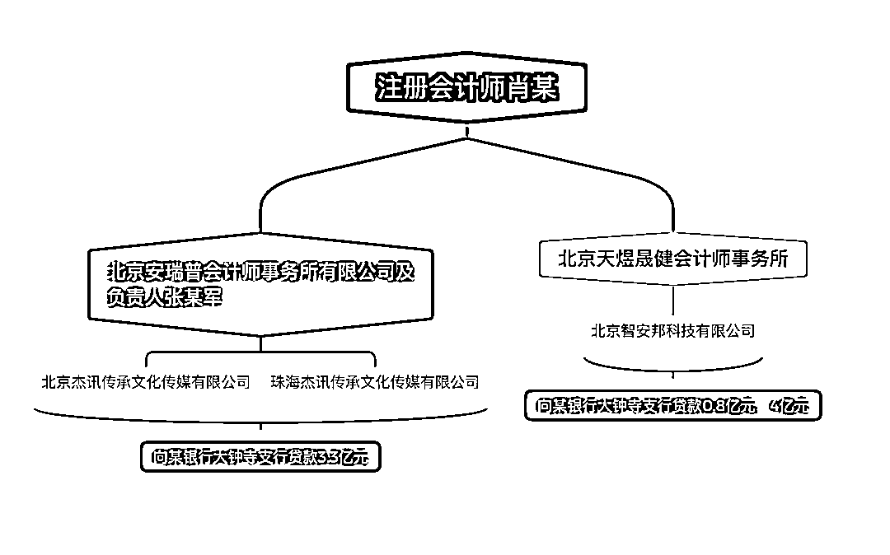

# 银行遭遇“连环骗贷”，总计损失 8 亿元！背后牵出两位会计师：为 10 多万“好处费”编造审计报告

> 原文：[`mp.weixin.qq.com/s?__biz=MzIyMDYwMTk0Mw==&mid=2247540651&idx=5&sn=0f07305b3fbb19a82156280ef6a346a3&chksm=97cb9493a0bc1d857f007c6bc5efa6e1d90b7311eae47908abaed3066550c13c36e655b0a9e9&scene=27#wechat_redirect`](http://mp.weixin.qq.com/s?__biz=MzIyMDYwMTk0Mw==&mid=2247540651&idx=5&sn=0f07305b3fbb19a82156280ef6a346a3&chksm=97cb9493a0bc1d857f007c6bc5efa6e1d90b7311eae47908abaed3066550c13c36e655b0a9e9&scene=27#wechat_redirect)

编造审计报告，收了 10 多万元“好处费”，结果审计师自己卷入一场涉及 8 亿元的骗贷案，自己也因此被判刑。

7 月 20 日，北京法院审判信息网披露了一份一审刑事判决文书，揭露了注册会计师编造虚假审计报告底稿，并通过长期合作的会计师事务所出具正式审计报告，用于相关企业向银行套取贷款的过程。 

为三家企业编造全套审计文件的注册会计师肖某仅收取十万余元，会计所更是仅获利 3300 元，但却给银行造成了超 8 亿元的经济损失。

最终，肖某与会计所负责人张某军分别被判处有期徒刑一年和八个月，各自缓刑一年，并处相应罚金。

**获利 3300 元**

**会计所出具虚假审计报告**

案件发生于 2019 年，2021 年年中案发。作为主犯，注册会计师肖某经营着一家于 2019 年才成立的会计师事务所——北京天煜晟健会计师事务所（普通合伙）（下称“北京天煜”），该所只有他与另一名合伙人，持股比例 8：2。

肖某与另一家成立于 2004 年会计师事务所——北京安瑞普会计师事务所有限公司(下称“安瑞普”）长期合作，该所负责人为张某军。安瑞普注册资本为 50 万元，在中注协登记的注册会计师共有 9 人，合伙人 5 名，从业人数 20 人。相比之下，安瑞普显得更为正规，肖某与其“长期合作关系”也不难理解。

经法院审理查明，2019 年 5 月，肖某在北京市房山区，编造虚假的北京杰讯传承文化传媒有限公司和珠海杰讯传承文化传媒有限公司 2017 至 2018 年度审计报告底稿，并要求安瑞普公司出具正式审计报告。

随后，被告单位安瑞普公司和被告人张某军在没有履行任何审计职责的情况下，直接为北京杰讯公司和珠海杰讯公司出具 2017 年至 2018 年度审计报告。

无独有偶，2019 年 8 月，肖某编造虚假的北京智安邦科技有限公司 2016 年至 2018 年度审计报告，并以北京天煜晟健会计师事务所名义出具正式审计报告。

2019 年 10 月，肖某再次编造虚假的智安邦公司 2016 年至 2018 年度审计报告底稿，并要求安瑞普出具正式审计报告。同样，安瑞普和张某军在没有履行任何审计职责的情况下，直接为北京智安邦公司出具 2016 年至 2018 年度的审计报告。

图片来源：每经编辑 程鹏制图 

“一顿操作”之下，**肖某获利共计 10.9 万元，而安瑞普会计所出具两份虚假审计报告的获利却只有 3300 元。**

**企业骗取贷款**

**银行直接损失逾 8 亿元**

肖某与安瑞普会计所制作的虚假审计报告，却给银行带来了重大损失。

虚假审计报告所为何来？自然是被企业用于向银行贷款。其中，肖某、安瑞普会计所为北京杰讯和珠海杰讯出具的 2017-2018 年审计报告，被用于向某银行大钟寺支行贷款**3.3 亿元。**

为智安邦出具的两份 2016-2018 年度审计报告，同样被用于向某银行大钟寺支行贷款**0.8 亿元、4 亿元。**而前述贷款均逾期无法收回。

小编获取的一份该银行大钟寺支行与北京杰讯等金融借款合同纠纷判决书显示，2019 年 5 月，该银行大钟寺支行向北京杰讯提供 3.3 亿元借款，借款期限为 1 年，珠海杰讯及北京杰讯法定代表人李某提供连带责任担保，且有 7 套房屋抵押。

在贷款发放后，北京杰讯均未按约定支付相应利息。2020 年 4 月，银行大钟寺支行宣布贷款提前到期，要求北京杰讯立即清偿债务，但各方一直未履行还本付息义务。在庭审中，北京杰讯、珠海杰讯及多名保证人均未出庭及答辩。虽然该银行大钟寺支行最终胜诉，但未出现的被告往往意味着后续执行不畅，仍有可能产生损失。

为什么几份虚假审计报告“伤害”的总是上述银行大钟寺支行，这个问题判决书中并没有给出回答，但上述银行的确成为了本案的被害单位。

据检察院指控，肖某编造的虚假审计报告给银行造成直接经济损失 8 亿余元，安瑞普出具的虚假审计报告给银行造成直接经济损失 7 亿余元。

**会计师+会计所双双被判**

2021 年 6 月，肖某、张某军被公安机关电话传唤到案，最终东窗事发。

公诉机关指出，被告人肖某作为承担审计职责的中介人员，故意提供虚假证明文件，情节严重，应当以提供虚假证明文件罪追究其刑事责任；被告单位安瑞普会计所及被告人张某军作为承担审计职责的中介方，严重不负责任，出具的证明文件有重大失实，造成严重后果，应当以出具证明文件重大失实罪追究其刑事责任,提请法院依法处理。

肖某及张某军对公诉机关的指控未提出异议，均当庭表示认罪认罚。安普瑞会计所在认罪认罚之外辩称，其不知道出具审计报告的用途，是出于对长期合作的肖某的信任才出具审计报告。

被害单位的诉讼代理人则提出，认为肖某的行为构成骗取贷款罪的共犯，应当以该罪追缴其刑事责任，不应对肖某适用缓刑；天煜晟健会计所构成单位犯罪，建议追究其刑事责任。

北京市房山区法院认为，公诉机关指控被告人肖某提供虚假证明文件罪、指控被告单位安瑞普会计所及被告人张某军犯出具证明文件重大失实罪的事实清楚，证据确实、充分，指控的罪名成立，法院予以支持。

此外，由于二人经民警电话传唤自动到案，到案后如实供述自己的主要犯罪事实，系自首，亦自愿认罪认罚，且被害单位的损失系多种因素作用在一起所造成，可依法对其从轻处罚并适用缓刑。安普瑞会计所在公安机关立案前积极配合公安机关调查并提供相关证据材料，系自首，可对其从轻处罚。

最终，法院判决如下：

一、被告人肖某犯提供虚假证明文件罪，判处有期徒刑 1 年，缓刑 1 年，并处罚金 5 万元。

二、被告单位北京安瑞普会计师事务所有限公司犯出具证明文件重大失实罪，判处罚金 2 万元。

三、被告人张某军犯出具证明文件重大失实罪，判处有期徒刑 8 个月，缓刑 1 年，并处罚金 5000 元。

四、向被告人肖某追缴犯罪所得 10.9 万元，向被告单位北京安瑞普会计师事务所有限公司追缴犯罪所得 3300 元，均予以没收，上缴国库。

五、随案移送的笔记本电脑一台、手机二部，均予以没收。

来源：每日经济新闻综合自北京法院审判信息网、中国裁判文书网

← 向右滑动与灰产圈互动交流 →

