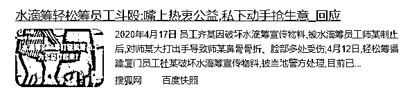

# 做公益还是做生意？“职业筹款人”抽走七成救命钱！

> 原文：[`mp.weixin.qq.com/s?__biz=MzIyMDYwMTk0Mw==&mid=2247540651&idx=6&sn=d859aa975ab510182493d165944efa09&chksm=97cb9493a0bc1d85e7ead6fffb52f07c0482a0169bcbd742cb897c3c6325d2d095b2eebb9947&scene=27#wechat_redirect`](http://mp.weixin.qq.com/s?__biz=MzIyMDYwMTk0Mw==&mid=2247540651&idx=6&sn=d859aa975ab510182493d165944efa09&chksm=97cb9493a0bc1d85e7ead6fffb52f07c0482a0169bcbd742cb897c3c6325d2d095b2eebb9947&scene=27#wechat_redirect)

前些日子有呸友提问：有人重病无力医治，筹款无力，

有人为他们转发众筹，但是要抽走最多七成的爱心款。

这些人究竟是有善心的好人还是骗子？ 

**01**

** 职业筹款人 **

大伙刷微博的时候有没有遇到过这种情况，

浏览在热榜上的新闻，时不时会出现一些“求助热评”。

“儿子身患重病，已倾家荡产无力承担后续，跪求好心人帮帮他！”

“本人没有文化已无力承担，求求好心人救救我的孩子吧！”

这些热评当事人多以朴实的“自拍”为头像，有时也是受苦受难求援助的当事人照片。

他们简述病痛带来的折磨，说出自己的辛酸事，请求得到社会的好心人伸出援助的手，他将感激不尽。

点进他们的个人主页，入眼就是关于**家中小孩身患重症求助的链接**，链接跳转到的是一个挺有名的众筹平台，齐全的资料能够证明这确实是一位苦命人。

世上苦难多，我们若是能帮衬点也倒是一件好事。

第一次你捐了，数量不多，但心意已到。

事情再过三两天，你回去翻看这个人的微博，日子停留在求助的那一天，没有一丝后续信息。

然后又在另一条微博上遇到另一位“苦命人”，同样悲苦的人生被病痛折磨，**同样微博里仅有寥寥两条相关信息，一条是感谢捐款，一条是“救救我的孩子”。**

难道被骗了？？

但是他们的信息都来自正规的众筹平台，照片也不像是造假的啊？！

不止微博，微信群、qq 群里，这种“求助”漫天撒网。

这些人，不是苦主，他们是苦主的筹款推广人。

**02**

**推手最多可抽 7 成**

#**大病众筹职业推手日入千元**#被曝光了。

不知道大伙看过**王女士为食道癌母亲众筹**的消息没？

这个报道说的是王女士家庭拮据，积蓄花光，却还得面临母亲高昂的癌症治疗费。

实在无力支付的王女士决定靠众筹想想法子。

她在朋友圈发布了筹款链接，起初筹款还算不错，但再往后，捐款金额就越来越少。

王女士自己发布了两次众筹，她第 1 次发布筹款，目标金额 20 万，一周后她共收到 2 万多的捐款，这其中平台要收 3%的服务费，还有 0.65%的提现手续费。

第二次目标金额是 30 万，转眼 10 天快过去了，才筹到了 3000 多元。

王女士觉得她真的没有办法了。

这时有人主动向王女士抛出推广的主意：**需要帮忙众筹吗？**

我们帮你转发筹款链接，**转发后筹到的钱，我们收 70%左右，剩余的 30%给你。**

（不同的推广人不同的价）

推手们转发推送患者的筹款链接，和“网络水军”是一个路子，利用流量曝光筹集爱心款。

他们允诺“日筹千元”，但要收取一定的酬金作为“服务费”。

大量推手的出现与模式化的运作，让许多爱心人士对公益链接的真实性存疑。

后来更在网络上疯传为水滴筹抽了 7 成救命钱。

6 月 28 日，水滴筹就此问题回应：**从未授权**任何第三方组织或个人向筹款人提供所谓的推广服务。

对于“职业筹款推广人”这种灰色链条，水滴筹表示将进一步完善风控机制，封堵恶意推广，并配合公安机关严厉打击筹款推广过程中的诈骗行为，且此前已有人因此类诈骗行为被抓，且任何高于筹款额 3.6%的费用都不是水滴筹平台收取的。

**03**

**众筹背后骗局多**

这些推广的众筹内容属实吗？ 

如果属实，那也确确实实是在做公益、是慈善，

能让更多的人了解到这些需要帮助的人的情况，

双方“互惠互利”，听起来似乎也是可以接受？

首先，**这并不能看作一场“自由买卖”的交易。**

求助者们本身已是亟待拯救的“弱势”状态，当推手们以绝对的“强势”姿态出现时，求助者们根本没有什么选择的余地。

**推广人和求助者并不对等。**

当大部分的筹款都流向了私人的口袋，这无疑有违众筹的初衷。

再者，**推广的手段是否合规，信息是否透明，同样是一个大问题**。

有的“职业筹款推广人”混迹在各种社群，比如假冒成求助者的亲友，向其他人呼吁求助，以达到筹款的目的。

试想下，如果所谓众筹，都是各种冒充亲友在推广，以公益的名义赚钱，谁还会敢轻易捐款？

一个人没有歹心，千千万万个人里没有人起歹意吗？ 

今年 3 月小陈向公安报案：其父亲陈某某因脑出血住院急需用钱，一名自称“水滴筹”客服的人员到医院声称能用其公司的公益捐款平台无偿为困难病人筹款。

**该客服让其提供陈某某的住院资料办理网络筹款**，并向其发送了“爱心筹助”筹款平台的链接，让其发送至自己的朋友圈、微信群筹款，共得筹款 16204 元。

经反复催促和提出报警后，陈某海才从该筹款平台提现 11100 元，被平台诈骗了 5000 多元人民币。

这件事甚至不是个别“推手作乱”，这是一个有组织、有预谋的团伙实施的诈骗，受害者也不仅仅是小陈一人。

后经调查，2019 年 9 月起，以郭某某为首的诈骗团伙，利用身边亲人、朋友的名义注册多个“空壳公司”，**搭建多个非法网络众筹平台，**并安排地推人员从网上购买或从医院垃圾桶捡取各种陪护手腕带，冒充住院病人的陪护人混入医院，将“爱心筹款”“爱心帮助”等非法平台伪装成全国性合法众筹平台进行众筹推广，或伪装成“水滴筹”“轻松筹”等合法公益平台的推广人员骗取危重病人家属的信任，

**谎称为困难病人无偿在其公司的筹款平台发起众筹，故意隐瞒要收取 30%费用的事实，骗取病人 30%以上众筹款。**

（已被抓获） 

**04**

**众筹引发的信任危机，让无数人寒心**

2016 年《罗一笑，你给我站住》感动全网，成为至今最出色的“推手演出”。 

女儿罗一笑感染白血病，父亲罗尔在公众号发布文章诱导读者打赏捐款，文章爆火之后，连续多天的打赏金额超过公众号最高上限值。

可后经网友爆料，**罗尔本身有不少资产，甚至根本无需众筹**。

也许是从这件事中获得了启示，感人肺腑的求助一旦被流量光顾，迎来的可能是巨额财富。 

于是筹款人文化水平低的，可以由业务员代写；水平高的可以自己写，也可以用筹款模板；

当患者成了潜在客户，当众筹变成了可以计件的生意，当文案可以被代写，当行业使命被利益取代，

即便你只是一位旁观者，可能也看得出公益事业本身模式上的问题，听到时不时爆出又爆出公益相关的丑闻。

众筹引发的信任危机，让人渐渐对这类公益寒心。

当家庭面临难以负担的医疗费用时，尽管几乎“零门槛”的众筹发挥了一定救助作用，但是，有关部门也要对社会救助体系的完善多加反思。

如何让更多救命药纳入大病医保，进一步提高参保人员重大疾病保障水平？如何构建社区互助机制，更好地为困难群众解决实际困难？如何完善社会救助兜底工作，减轻重特大疾病家庭负担？

**众筹，不该成为底层人民唯一的求助门路，**

**也不该成为某些人求财的手段。**

← 向右滑动与灰产圈互动交流 →

