# “吴啊萍”共供奉 6 个牌位，此人究竟是谁?网友竞猜，真实身份即将水落石出

> 原文：[`mp.weixin.qq.com/s?__biz=MzIyMDYwMTk0Mw==&mid=2247540713&idx=1&sn=c5dfc52ab5b93f29165800c150ceb3b0&chksm=97cb94d1a0bc1dc75eafd13b25b0f3a95267c4730496e37fef82216c81133d7f2cadbbb14aa2&scene=27#wechat_redirect`](http://mp.weixin.qq.com/s?__biz=MzIyMDYwMTk0Mw==&mid=2247540713&idx=1&sn=c5dfc52ab5b93f29165800c150ceb3b0&chksm=97cb94d1a0bc1dc75eafd13b25b0f3a95267c4730496e37fef82216c81133d7f2cadbbb14aa2&scene=27#wechat_redirect)

近日有网友爆料，南京玄奘寺的牌位上，供奉着日本战犯四年之久。寺庙的管理者在这四年间，竟然没有发现，而牌位的供奉者吴啊萍又是何人？寺庙也没有给出答案。

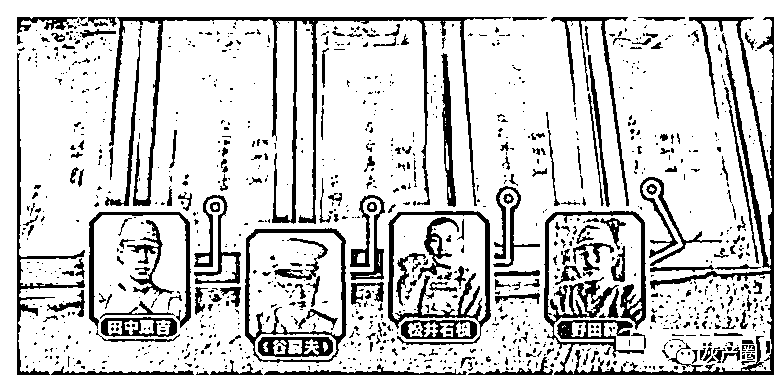

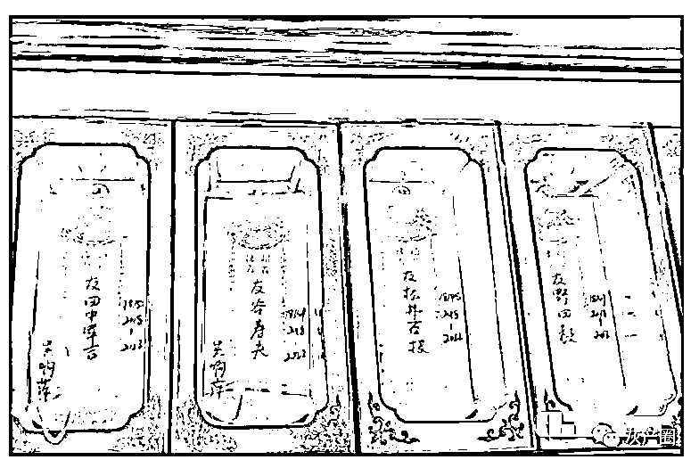

据悉，吴啊萍其实在玄奘寺内供奉有六个牌位，五位日本战犯，另一位是美国人，曾保护过中国人的女性教育家明妮·魏特琳，中文名字叫华群，资料记载，她在南京沦陷之时，曾收留保护了一万多名中国妇女和儿童，这个叫吴啊萍的应该就是用华群掩人耳目。

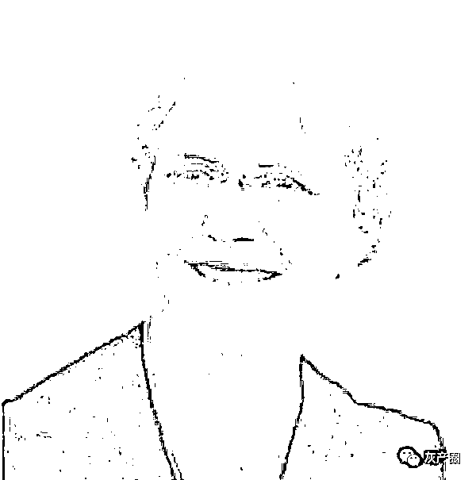

虽然现在还不知道吴啊萍的确切身份，但网友试着用这个名字对应的日文分析。

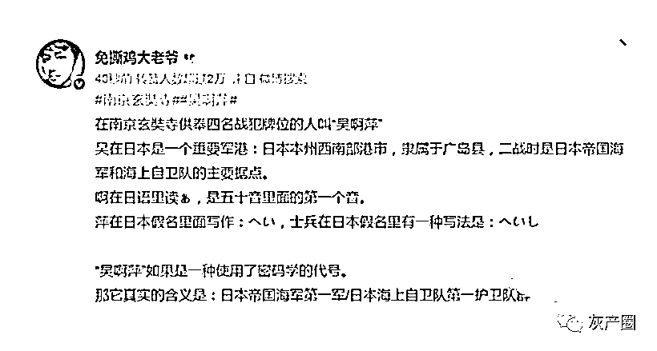

吴是日本一个非常重要的军港，而啊在日语中的发音，是五十音里面的第一个音，萍在日文中跟士兵的假名一致，吴啊萍可能是一种代号，她的真实含义或许是日本海上自卫队第一护卫队群。

在此基础上，又有网友分析认为，这个吴爱萍应该是日本人在中国的后代，吴表示的是地理位置，就是现在的江苏南部和浙江北部，啊在日语中经常使用，萍字所指的意思就是浮萍无根，连在一起大致表示的可能是，生活在江南地区的日本人后裔。

还网友非常肯定地说，吴啊萍应该是他同事的前同事，原本是医院的护士，后来离职出家了，而且名字，人设，字迹都能对得上号！

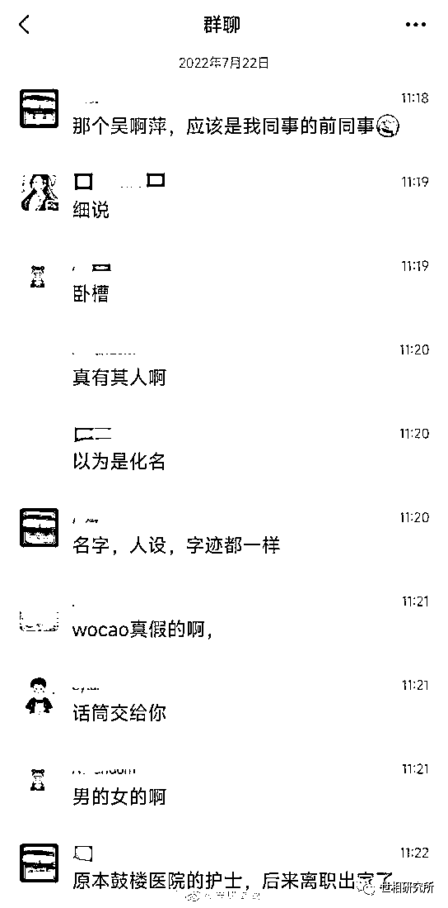

还有网友用吴啊萍，江苏，南京，等关键词，在网上搜索，还真扒出了河海大学一位同名的学生，她是 2013 级护理专业的毕业生，名字就是叫吴啊萍。

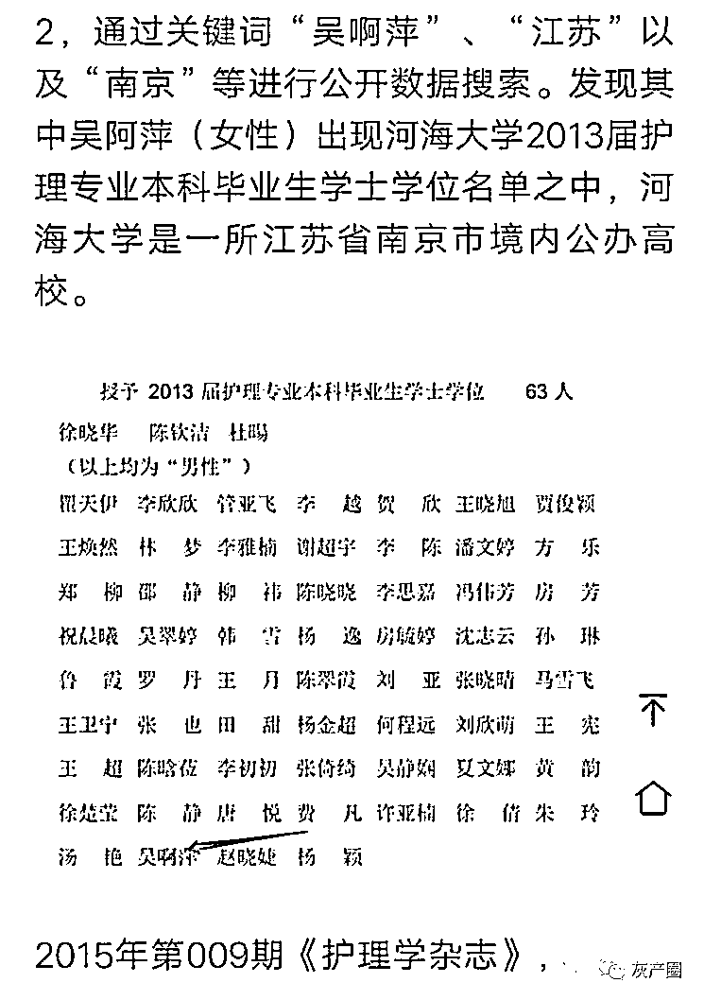

其实呢，网友们提供的这些线索，看似有用，实则用处不大，这个吴啊萍极大可能是个假名字，还是应该从寺庙里的登记记录查起。还有重要的一点就是，四年之间，供奉这些牌位需要几十万的费用，不可能每次都是带着现金去的吧！银行的转账记录也是有迹可循的。

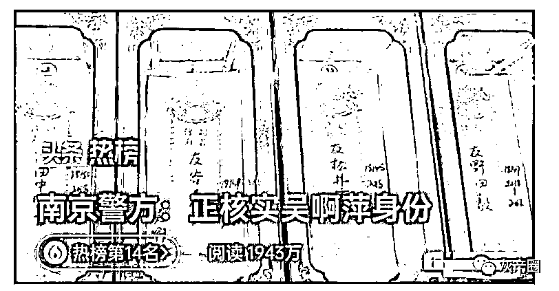

7 月 22 日下午，新京报记者致电**南京市公安局玄武分局玄武门派出所**，工作人员称，**已开展工作核实“吴啊萍”身份。**

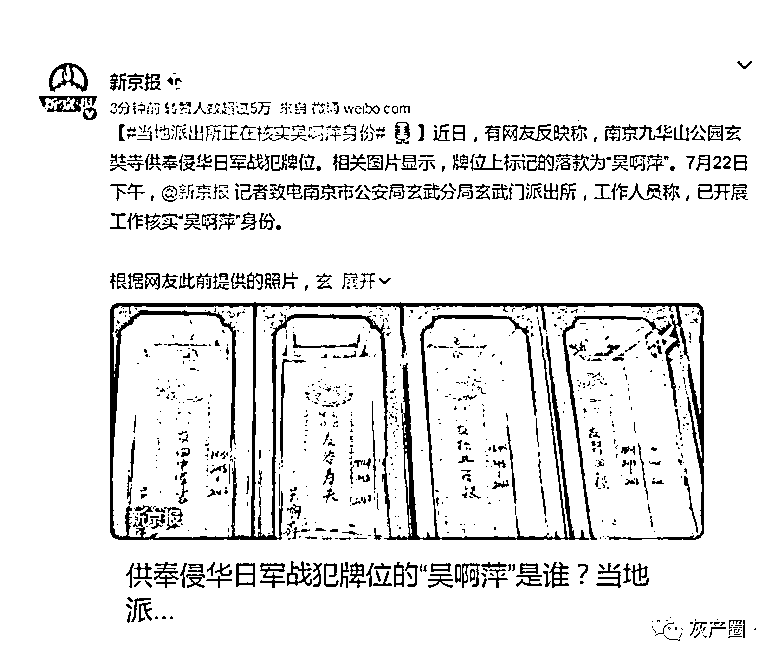

# 延伸阅读：玄奘寺负责人与多名落马官员有交情，被停职副局长曾遭 33 名僧人实名举报

让人不可思议！ 

7 月 22 日下午，随着南京玄奘寺供奉日本战犯牌位事件持续发酵，南京市发布《关于玄奘寺供奉牌位事件有关人员的处理情况》。

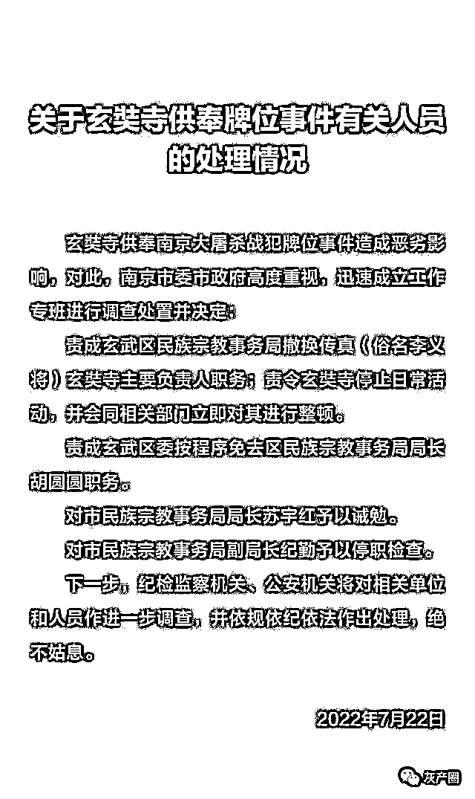

通报称：

已责成玄武区民族宗教事务局撤换传真（俗名李义将)玄奘寺主要负责人职务；

责令玄奘寺停止日常活动，并会同相关部门立即对其进行整顿：

责成玄武区委按程序免去区民族宗教事务局局长胡圆圆职务：

对市民族宗教事务局局长苏宇红予以诫勉；

对市民族宗教事务局副局长纪勤予以停职检查； 

下一步，纪检监察机关、公安机关将对相关单位和人员作进一步调查，并依规依纪依法作出处理。

近日，有网友发文表示，在南京九华山公园玄奘寺地藏殿内，一排长生牌位竟然供奉着侵华日军战犯。

网友举报的照片显示，玄奘寺地藏殿内“供奉”的战犯牌位至少包括“田中军吉”“谷寿夫”“松井石根”“野田毅”等，供奉人署名为“吴啊萍”。

玄奘寺位于南京市玄武区北京东路九华山公园内，北临玄武湖，东接太平门，西邻台城。

1942 年初冬，日本侵略者在雨花台大报恩寺三藏塔遗址挖到一石函，函内供奉有玄奘大师的顶骨舍利，并记载了唐代高僧玄奘顶骨舍利来南京安葬的经过。

日军妄想占为己有，在南京人民的抗议下，日军将玄奘大师部分顶骨舍利归还给南京人民。

1943 年初，汪伪政府在九华山上建了一座砖塔，供奉玄奘大师的顶骨舍利，得名三藏塔。

2003 年，南京市玄武区政府及区建设局在小九华山重修寺庙，即为玄奘寺，由栖霞古寺监院传真法师住持管理。

公开资料显示。传真法师，法号正宏，俗名李义将，安徽颍上人。

1987 年在南京栖霞寺出家，目前担任南京玄奘寺、溧水无想寺主持。同时，传真还拥有南京市政协委员、江苏省佛教协会理事、南京市青联常委、南京市佛教协会副会长等头衔。

2019 年，传真（李义将）还登上了安徽颍上县文化名人榜单。

传真最有名的一次亮相是 2004 年他自筹资金 800 万，作为主要出品人和编剧，参与了电影《栖霞寺 1937》 的拍摄。 

讽刺的是，该片讲述了 1937 年底到 1938 年初南京沦陷前后，南京栖霞寺和尚寂然法师带领僧人自发创建难民护难所，不畏日军的压力与打击，保护两万多难民的故事。

传真其实更是一个商人。目前，传真名下与其关联的公司有 6 家，涉及养老、旅游、文化传媒、寺庙经营等多个领域。

6 家公司中，其中存续状态的有 4 家，包括南京慈愿养老服务有限公司、南京真爱圣地国际旅行社有限公司、南京三藏文化传媒有限公司、安徽省颍上县大河湾粮油食品有限公司。

此外，玄奘寺还曾陷借贷诉讼纠纷，被游客投诉卖字画骗钱。

不仅如此，今天媒体曝出：

玄奘寺还曾虚报 3000 万维修费。 

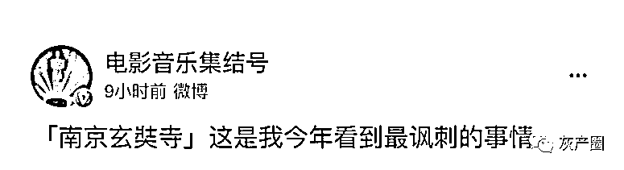

有网友表示，这是今年看到最讽刺的事情。

值得一提的是，2015 年，传真在接受南方周末专访时曾讲述他与南京多名官员交往故事。 

传真称，他的朋友圈有 6 万人，还有 400 多个聊天群。

因九华山灯光亮化方案，他曾给季建业提过一个方案。传真曾向媒体回忆与季建业的交往时称，最后一次见季建业，他曾在市政府门口送了个“提拔”（鞋拔）给他做纪念品。

但第二天便得知季建业落马。

传真还提到，首先跟领导打交道，然后才跟秘书打交道，南京市玄武区原区委副书记、区长傅成就是其中之一。

传真称傅成曾是江苏省人大常委会原副主任王武龙的秘书，他通过王武龙认识了傅成。

在传真的落马官员朋友圈里，除了季建业、傅成、王武龙外，他与落马的江苏省原省委常委、南京市委书记杨卫泽，南京市委原常委、建邺区委书记冯亚军也有交情。 

传真曾向媒体表示：“我常常跟来聊天的官员说，做官啊，第一有文化没文化要学会听话；第二，得过且过太阳出来暖和；第三有一些矛盾就要睁一只眼闭一只眼。”

实际上，对于传真与多名官员交往过密的情形，在南京宗教及官场一直颇受争议。

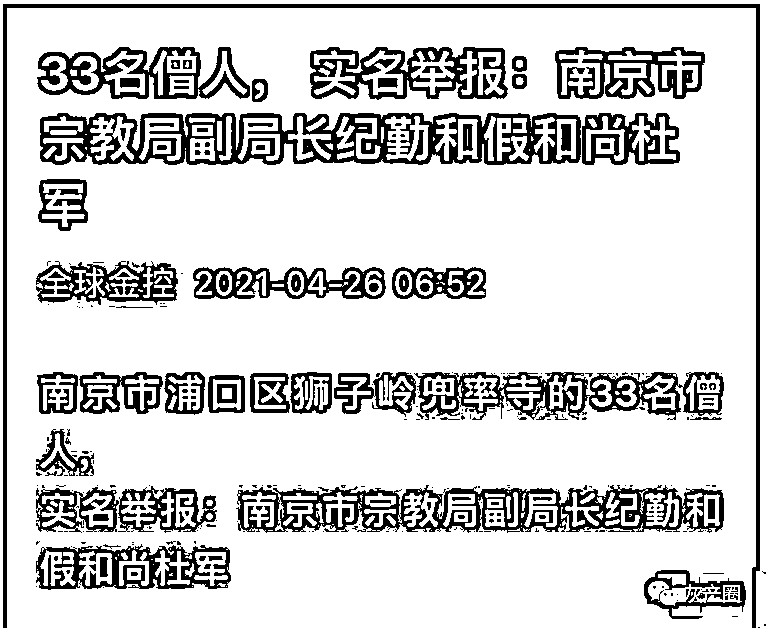

值得一提的是，去年，被停职检查的南京市民族宗教事务局副局长纪勤，传遭到 33 名僧人的联名举报。

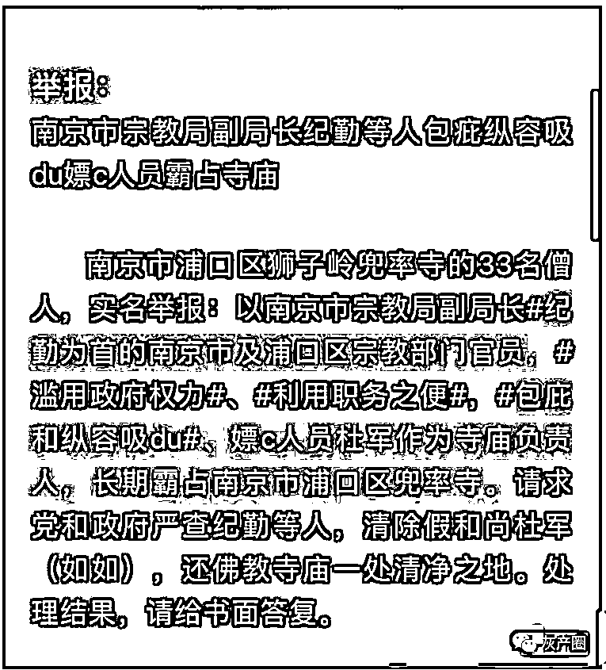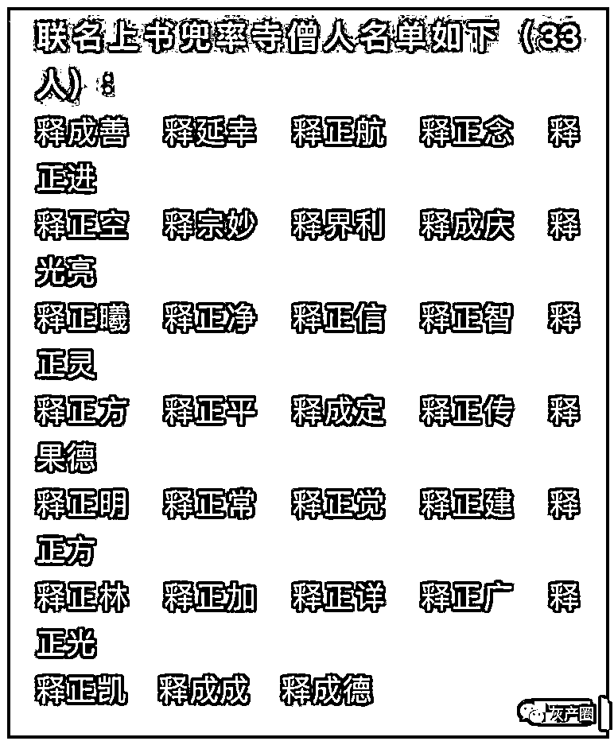

检索公开报道，官方似乎并未对此有所回应。

来源：知灼综合上游新闻等媒体报道，世相研究所

](https://mp.weixin.qq.com/s?__biz=Mzg5ODAwNzA5Ng==&mid=2247487973&idx=1&sn=1b62da6f2018402862a5c375e10c355e&chksm=c06878b2f71ff1a4fbe7df4dec626aa7e696154751693bf16f6c6a302ceaa4d1959040c70518&scene=21#wechat_redirect)

← 向右滑动与灰产圈互动交流 →

