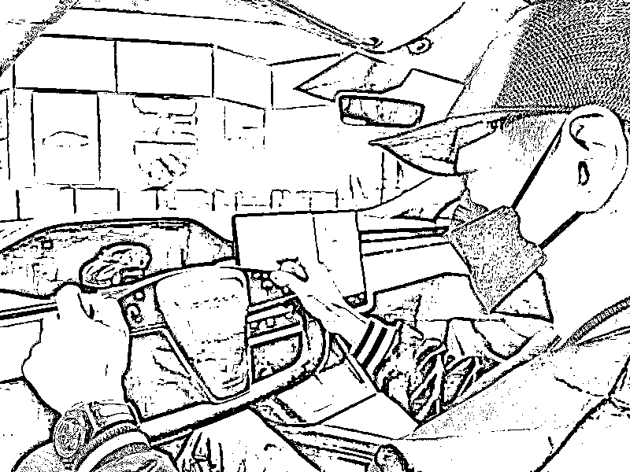
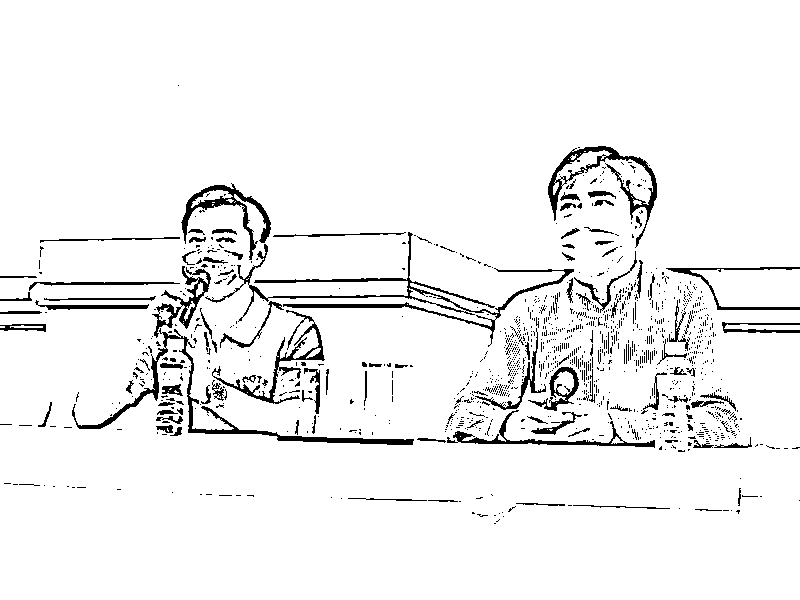
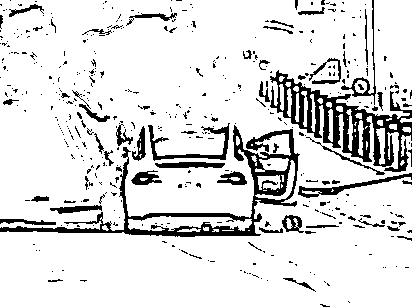

# 林志颖仍在昏迷，这两三天是关键

> 原文：[`mp.weixin.qq.com/s?__biz=MzIyMDYwMTk0Mw==&mid=2247540713&idx=2&sn=a10d6b30083a6716acc44aa74150c235&chksm=97cb94d1a0bc1dc7ca64a18bb48c8d72bb9677fa4d332487bdda9bca0576c4c3c902ca30fa6f&scene=27#wechat_redirect`](http://mp.weixin.qq.com/s?__biz=MzIyMDYwMTk0Mw==&mid=2247540713&idx=2&sn=a10d6b30083a6716acc44aa74150c235&chksm=97cb94d1a0bc1dc7ca64a18bb48c8d72bb9677fa4d332487bdda9bca0576c4c3c902ca30fa6f&scene=27#wechat_redirect)

综合 | 徐观 

7 月 22 日，艺人林志颖发生严重车祸，后经好心路人一起帮忙才脱困火海，他与儿子 Jenson 双双被送往医院救治。目前，其子并无大碍，但是林志颖仍处于昏迷当中。

22 日傍晚，林志颖工作室发布声明公开林志颖父子车祸情况，同时林志颖弟弟林志鑫和经纪人也召开了新闻发布会。当晚的声明指出，林志颖有多处受伤及骨折，已由长庚医疗团队进行手术评估，病情暂时无法详细说明。

林志颖经纪人与林志颖弟弟林志鑫发表声明

林志鑫则在发布会上透露，哥哥目前相对稳定，接下来两三天将是关键，其他暂不愿多作说明，希望让他静养。同时林志鑫还代表家属向社会大众和粉丝表达了感谢，表示后续也会在和家人讨论后进一步和大众说明。

根据台媒报道，警方公开的路况监视器画面显示，当时车祸路边刚好出现一辆救护车，加上目击路人第一时间上前抢救，直接在救护车协助下送至医院，这才让林志颖逃过死劫。

林志颖车祸现场

22 日下午，该医院某医师向媒体透露，林志颖目前没有生命危险，但因受到剧烈撞击，加上脸部、肩膀骨头都受损，胸腔、腹部都还是要持续观察。此外，林志颖颜面骨折、肩膀的肱骨粉碎性骨折，还有轻微的脑受伤，需要观察，待情况稳定后会进行肩膀、颜面手术。该医师指出，林志颖的手术将由神经外科、骨科和整形外科跨团队进行。

林志颖车祸后，兄弟姐妹先后赶到，大哥林志杰也于第一时间赶往医院。林志杰于 22 日晚间表示，全家都很好奇这场车祸发生的真正主因，“其实车速没有很快，到底什么原因没有人知道”，一切仍有待警方查清。此外林志杰表示他离开前，弟弟林志颖虽然仍处于昏迷，但确定的是状况稳定。

据台媒 23 日最新消息，林志颖目前已接受手术治疗，经纪人表示“一切还在观察中”，并感谢外界关心，称如果有最新情况会跟大家说明。

希望林志颖早日康复。

来源：南风窗综合自中新文娱、北青娱见、新浪电视

](https://mp.weixin.qq.com/s?__biz=Mzg5ODAwNzA5Ng==&mid=2247487973&idx=1&sn=1b62da6f2018402862a5c375e10c355e&chksm=c06878b2f71ff1a4fbe7df4dec626aa7e696154751693bf16f6c6a302ceaa4d1959040c70518&scene=21#wechat_redirect)

← 向右滑动与灰产圈互动交流 →

