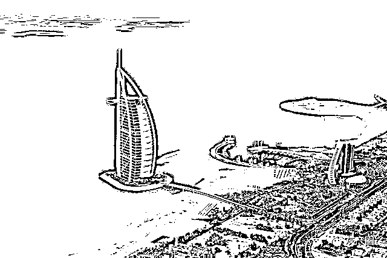
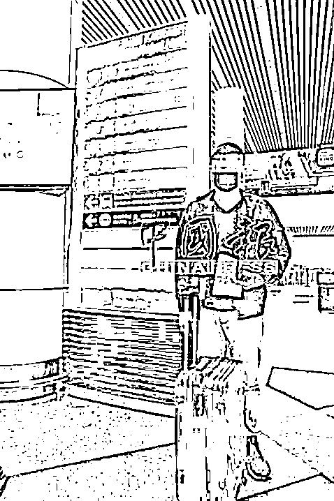

# 获知自己将从迪拜被转卖到柬埔寨，男子冒险逃跑

> 原文：[`mp.weixin.qq.com/s?__biz=MzIyMDYwMTk0Mw==&mid=2247540713&idx=3&sn=4038286f93d56bafd307cab3f3a6fd1d&chksm=97cb94d1a0bc1dc7544d003495d2ece16e7268eb6742030fd460c0ab29401bd35f1d7a5259a4&scene=27#wechat_redirect`](http://mp.weixin.qq.com/s?__biz=MzIyMDYwMTk0Mw==&mid=2247540713&idx=3&sn=4038286f93d56bafd307cab3f3a6fd1d&chksm=97cb94d1a0bc1dc7544d003495d2ece16e7268eb6742030fd460c0ab29401bd35f1d7a5259a4&scene=27#wechat_redirect)

据马来西亚媒体**中国报**消息，最新一名被救回马来西亚的猪仔揭露（陈先生，33 岁），他起初是遭诱骗到迪拜，被强逼进行诈骗活动，随后遭到不法集团在迪拜内多次转卖；

后来，他因意外获知自己即将跨国转卖到柬埔寨，他唯有冒着性命危险逃走。 

这名华裔男子于去年误信社交媒体张贴的高薪招聘广告，遭以 1 万 3000 人民币月薪被诱骗到迪拜，结果在当地被迫进行诈骗活动长达 1 年多。

最终，他因一次意外窃听到诈骗集团欲把他转卖的消息后设法逃跑，才得以脱险，免于掉入另一个炼狱。

由于男子的护照当时已被集团没收，他事后先是求助当地朋友开车接应，趁着凌晨时分，偷偷从诈骗基地逃跑后，到当地警局报案，声称遗失护照，并向当地的马来西亚领事馆申请补办护照后，再求助家人筹钱购买飞机票，最终才得以顺利登机，安全回马来西亚。

他说，他是于去年 4 月在社交媒体发现一则高薪招聘的广告，被骗去迪拜从事诈骗活动。

他说，他被转卖至最新的诈骗集团基地后，和约 40 名各国籍人士一起受困，被迫从事诈骗活动，所有人的护照全被没收，一举一动皆被集团监控，若有猪仔 的“诈骗业绩”不达标，则被殴打和扣钱作为对付。

他说，他上月经过一间隔音不太好的房间，无意中听到“主管们”的谈话，得知集团即将转卖猪仔到柬埔寨后，吓出一身冷汗，过后趁他们全部睡觉后，凌晨拿走钥匙逃跑。他受访时仍心有余悸，形容过程犹如电影情节，并庆幸自己最终重获自由，得以回国和家人团聚。

**相信迪拜仍有很多大马猪仔**

陈先生透露，他获悉集团欲转卖猪仔到柬埔寨后，因害怕有“反骨”猪仔给集团告密，以致逃跑计划落空，因此只敢暗示并婉转地提醒其他猪仔逃跑要趁早，不要继续逗留当地。

“我相信在迪拜还有很多大马的华裔猪仔，也猜测当地的不法集团目前正策划把在当地的猪仔全部转卖到柬埔寨。”

**柬埔寨逃跑机会渺茫**

有猪仔为了赚更多的钱，暂缓逃回大马的计划，结果“人算不如天算”，最终反被诈骗集团卖到柬埔寨，落入另一个炼狱，生死不明！陈先生指出，在他所在的诈骗基地中，曾有两名大马猪仔为了要赚取更多的钱，暂缓逃跑计划，打算赚够钱后，才策划逃离基地。

他说，未料两人提早被集团转卖到柬埔寨，由于当地的诈骗基地“保卫森 严”，不法分子持枪在基地范围驻守戒备，因此逃跑机会非常渺茫，两人迄今受困该国。

来源：我在柬埔寨](https://mp.weixin.qq.com/s?__biz=Mzg5ODAwNzA5Ng==&mid=2247487973&idx=1&sn=1b62da6f2018402862a5c375e10c355e&chksm=c06878b2f71ff1a4fbe7df4dec626aa7e696154751693bf16f6c6a302ceaa4d1959040c70518&scene=21#wechat_redirect)

← 向右滑动与灰产圈互动交流 →

