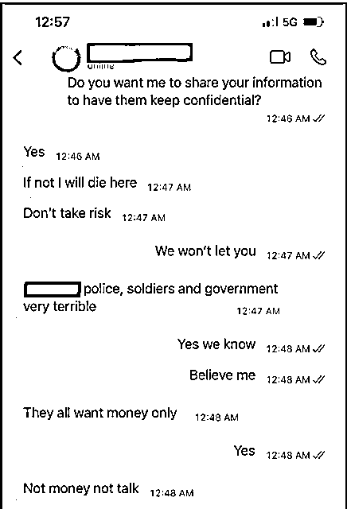

# 深度 I 杀猪盘揭秘：骗你钱的人，可能是被贩卖到东南亚的受害人

> 原文：[`mp.weixin.qq.com/s?__biz=MzIyMDYwMTk0Mw==&mid=2247540766&idx=4&sn=ccf97fbb80ea305afbb6939d7749f6a6&chksm=97cbeb26a0bc62300820c792842c087820a94593edefd49c420ce5b8f383ee56f57241969baa&scene=27#wechat_redirect`](http://mp.weixin.qq.com/s?__biz=MzIyMDYwMTk0Mw==&mid=2247540766&idx=4&sn=ccf97fbb80ea305afbb6939d7749f6a6&chksm=97cbeb26a0bc62300820c792842c087820a94593edefd49c420ce5b8f383ee56f57241969baa&scene=27#wechat_redirect)

**“给你发来的‘杀猪盘’消息可能来自数千名身处东南亚的工人，而他们中很多人自己也是人口贩卖的受害者。”**

金边的中餐馆。自疫情开始以来，诈骗活动在柬埔寨、老挝和缅甸激增。

一个周五下午 2 点出头，辛迪·蔡（Cindy Tsai）的手机上弹出了一条通知。这是来自一个未知号码的 WhatsApp 消息，只是简单地说：“你好。” 

蔡女士没理会。三个小时后，又传来一条信息：“你是宠物店的琳达吗？”她觉得有必要回复一下。 

“我在 WhatsApp 上从来没有收到过发错的信息，”她在波士顿的家中告诉 VICE 世界新闻。“我认为对方可能真的是搞错了。我回复说，‘不好意思，你发错了’。” 

短短几个字，作为对电话另一端的人的一种礼貌，将被证明是她发过的最昂贵的信息。不到两个月，她损失的钱就超过了普通美国人一辈子赚的钱。 

“我是在 2021 年 10 月 15 日遇到我的骗子的，”她谈到周五的那次短信交流时说。“总而言之，我损失了大约 250 万美元。” 

她与一个名叫吉米的聪明英俊的年轻男子展开了一段网络准恋情，她相信他住在洛杉矶。他们的日常对话涉及生活、体育、经济、文学，最终还聊到了加密货币。 

在通过吉米推荐的一个网站试探性地开始买卖以太币后，最初的利润促使蔡女士冒险购买了大量加密货币。当这个加密投资平台提醒她，要想提现，她必须经历一个永无止境的审计、费用和税收迷宫时，她已经投入了巨额资金。 

但这一切都是骗局——平台不是真的，钱也没了。（她向 VICE 世界新闻提供了显示她亏损的财务报表。） 

她的损失是一个惊人的数字，更引人注目的是，**蔡女士是一名成功的项目融资律师。**但她当时不知道的是，她陷入的是一个复杂的骗局，这个骗局在过去 18 个月里迅速爆发，在全球范围内窃取了数十亿美元。 

在东南亚工业规模的诈骗中心，犯罪集团利用疫情完善了一种复杂的浪漫与投资相结合的杀猪盘骗局。骗子团队使用复杂的脚本来“养肥”他们的目标，培养像蔡女士这样的人，引诱他们加入越来越以加密货币为中心的投资计划，然后动手“杀猪”，偷走他们的钱。 

然而，尽管这种被骗的受害者和网络捕食者的故事与互联网一样古老，但在网络欺诈的世界里，另一个事实是，支撑该行业的劳工可能也是受害者，他们是成千上万陷入人口贩卖、债务、强迫劳动和暴力循环的人；人们被虚假的招聘广告吸引到老挝、缅甸和柬埔寨的诈骗中心，在那里他们被迫实施对蔡女士使用的那种诈骗。 

以蔡女士为例，她之所以被吉米打动，是由一系列毁灭性的生活事件催化的。9 月，在他们开始聊天的一个月前，她被医生告知她患上了胃癌晚期。几周后，她与丈夫正式分居。 

“我绝对比以往任何时候都更脆弱，”蔡女士说，她描述了吉米是如何成为一个令人欣慰的存在的。**“当我接受免疫治疗时，他们就在那里，和我聊天。当我做各种检查的时候，他们就在那里。” **

**“他们一直都在那里。” **

 蔡女士的骗子利用了她的脆弱，当时她正在接受癌症晚期的化疗。 

蔡女士遭遇的是一个再清楚不过的案件：一个身患绝症的妇女被抢劫了数百万美元。然而，蔡女士的目标并不是在她剩下的时间里追回资金或将骗子绳之以法，而是将注意力转向了行业的另一边。 

“免疫疗法控制了癌症的扩散，但我能被治愈吗？不能，”她说。“与此同时，我正在尽我所能帮助受害者。我现在的重点是人口贩卖受害者。” 

**“如果我们不救他们，他们就会死” **

陆祥日（音译）是在柬埔寨第一线协助人口贩卖受害者的一名工作人员。过去两年半，柬埔寨的诈骗活动以最快的速度激增。他在金边运营着一个安全屋，专门为那些逃离诈骗中心但无法马上回家的人服务。 

在柬埔寨首都金边郊区，这家破旧的酒店位于一条昏暗的小巷里，柜台后面有一块金色的牌子，上面写着钟点房每小时 15 美元，麻将室每小时 25 美元，但付费的客人很少。**在这个重新改造过的酒店里，大约有 30 名中国受害者，他们在等待时机，直到筹到足够的钱离开这个国家。 **

“他们都在等着回家，”陆通过翻译告诉 VICE 世界新闻。“没有人敢出去。他们害怕一旦走出这扇门，就会被绑回诈骗中心。” 

逃离诈骗中心的受害者躲在金边郊区的一个安全屋里，直到他们能够回家。 

去年 10 月初，来自中国南方的陆祥日自己也被关在一个诈骗中心。他原本在柬埔寨开餐馆，疫情期间受到了严重的影响，因此在朋友的推荐下申请了这份工作。当他意识到这项工作的性质后，他打电话给当地警方寻求帮助，并在 10 天后被释放。 

他在 Facebook 上发布了自己的经历后，收到了来自其他人的大量回复。这让他加入了“中柬慈善团队”（Chinese-Cambodia Charity Team），这是一个由志愿者运营的组织，是柬埔寨当地为数不多的帮助诈骗中心受害者的组织之一。自那以后的几个月里，对援助的请求从未停止过。 

“我没有选择，这些人每天都告诉我，他们不想再当骗子了，”陆说。“但如果他们没法行骗，他们就会被打。” 

陆估计，自去年 11 月以来，他和他的志愿者们已经帮助至少 50 人从骗局中解救出来，其中许多人来自中国大陆，还有来自台湾、香港、泰国、越南和马来西亚。当联系到他们时，他会收集他们的个人信息，了解他们被关在哪里，他们为什么希望被解救，然后向当局报告他们的案件。 

“如果我们不救他们，他们就会死，”他说。“我们只想看到他们活着回家。” 

陆祥日的担心不无道理。在过去的一年里，我们看到了一系列的新闻报道，详细描述了柬埔寨的奴隶劳动条件、强奸威胁以及针对受害者的极端暴力。一段视频显示，一些讲中文的年轻人被关押、殴打和电击。更令人担忧的是，在已知的骗局发生地附近发生了一连串的神秘死亡事件——最近一次发生在上周。 

**以为的合法工作变成诈骗 **

陈万庆（Bilce Tan）上个月在柬埔寨时曾担心自己会遭遇同样的命运。 

“那三个星期就像一部好莱坞电影，”这名马来西亚男子告诉 VICE 世界新闻。“我每天都很害怕，我每天都很害怕。但我仍然需要保持头脑清楚。” 

“我知道如果我做了什么蠢事，我就会被打死，再也见不到父母。” 

今年 4 月，陈万庆看到了一则招聘柬埔寨团队负责人的广告，月薪 1.2 万马来西亚林吉特（约合 2700 美元）。他听说过有关诈骗中心的传言，但确信这则由一家据称是马来西亚数字营销公司发布的广告经过了招聘网站的审查。进行了两次视频面试之后，他坐上了飞往金边的航班。 

陈万庆的不安几乎立刻就开始了。在前往西哈努克港的 5 个小时车程中，四名男子让他不要问问题。在 2016 年前后，柬埔寨南部沿海这座曾经沉寂的小镇涌现出了 100 多家赌场。如今，西哈努克港是一座建筑工地和摩天大楼林立的半成品城市，在柬埔寨 2019 年的在线赌博禁令以及随后的疫情重创该国经济后，它与犯罪的关联有所增加。 

在过去两年半的时间里，有报告显示，曾经靠赌博或旅游赚钱的企业现在转向在自己的地盘内从事不法活动，包括网络诈骗。陈说，这包括胜利天堂度假村和赌场，他计划工作的这家“数字营销公司”就位于那里。 

招聘广告承诺“周边设施包括按摩、健身房、足球场和羽毛球场。”事实上，这个天堂般的度假胜地在三周内成了他的监狱。陈说，他的护照被没收，整个建筑群的持枪男子阻止他离开。他立刻理解了工作的诱骗性质。 

陈说，为了这个新角色，**他接受了两天的培训，熟悉复杂的脚本，以便在网上与陌生人建立融洽的关系。**他还要学习如何操作不同的平台，这些平台被用来把人们的钱分开——包括一个虚假的赌博网站，以及一个虚假的加密货币投资平台，就像用来欺骗蔡律师的那个平台。 

“（我的）任务是进行大量搜索，并开始与陌生人在网上聊天。我需要在 Facebook 和 Instagram 上找到我的潜在客户，”他说。**他描述的是一个房间里约有 10 个人每天花 15 个多小时做同样的事情，**他们所有的屏幕都连接到一个中央屏幕，在那里，一名主管监控他们的对话。 

他说：“**我们将努力引导他们，教他们如何在 USDT （Tether 加密货币）上开设账户，并为这个账户充值。**目前，骗子们主要做这个。USDT 无法追溯；政府和国际刑警组织都追查不到这笔钱。” 

虽然陈万庆说他从未成功骗过任何人，但他描述的骗局机制与 VICE 世界新闻采访的被骗受害者的经历相吻合。领先的区块链数据公司 Chainalysis 的调查合伙人经理贾斯汀·迈勒（Justin Maile）将杀猪盘犯罪活动描述为类似于合法业务，“有单独的培训、人力资源、运营和洗钱部门”。 

他告诉 VICE 世界新闻：“他们使用大量的剧本和详细的策略来联系目标受害者。他们经常建立虚假网站，用虚假数据展示巨额利润……在‘杀猪’之前，这些集团会允许小额提款或给受害者小额利润，让他们相信平台是合法的。” 

迈勒还描述了一个与蔡女士所经历的过程类似的步骤，即受害者“被诱骗数周或数月，最终窃取资金”。 

他说：“一旦受害者开始怀疑或试图提取资金，他们通常会被告知，在资金解锁之前，他们必须为收益纳税。**骗子会利用沉没成本谬论，将巨额利润悬在受害者面前，试图从受害者那里榨出最后一点油水。” **

陈万庆说，他的中心是由马来西亚人运营的，但在度假村内也有中国和缅甸人运营的大型机构。他说，虽然他避免了其他人经历的那种严重的身体虐待，但由于拒绝配合，导致他被枪指着，在小黑屋里被关了好几天，手机被没收，他还被威胁卖到缅甸的另一个中心，那里的条件要糟糕得多。 

不合作的工人会被反复售卖，这种交易有时甚至是通过对公众开放的 Telegram 频道进行的。VICE 世界新闻联系到的一个卖家表示愿意以 2000 美元的价格将工人送到金边。一名要求匿名的被救受害者告诉 VICE 世界新闻，他曾两次被贩卖到不同的中心。 

5 月底，陈成功地从他的住所逃脱，因为担心会牵连到那些帮助他的人，他要求对细节保密。VICE 世界新闻无法独立核实陈的说法，但他提供了他在柬埔寨的出入境印章、工作邀请、员工手册，以及证明他在柬埔寨的视频和照片，显示他受雇于所谓的数字营销公司，在这家度假村工作。 

胜利天堂度假村没有回应记者的置评请求。另一名受害者告诉 VICE 世界新闻，他们在度假村工作，在那里他们被迫从事骗术，遭受身体虐待。由于担心他们的安全，他们要求不要公开他们案件的细节。 

VICE 世界新闻还联系了这家马来西亚数字营销公司，该公司承认收到了问题，但拒绝回答。 

**“就算死，我也想知道我是怎么死的”  **

回到了在马来西亚槟城的家中后，陈万庆公开了自己的故事，公司的一名成员威胁要对他采取法律行动，并要求他公开撤回自己的故事。 

由于别无选择，他求助于全球反诈骗组织（GASO）。这个由志愿者组成的组织帮助救助和支持像陈这样的被拐卖的受害者，同时也代表着世界上越来越多的像蔡女士这样被骗的受害者。 

“我们的工作真的很独特，”该组织的创始人、30 多岁的新加坡女性杰西（Jess）说。由于担心自己的工作成为犯罪集团的目标，她要求使用化名。“我们想要支持骗局的受害者，我们想要支持人口贩卖的受害者，我们想要找到正义。从来没有人这样做过。” 

杰西于 2021 年 6 月创立了 GASO，当时她在约会应用 Tinder 上与一名男子配对，成为了杀猪盘受害者。她说，她的骗子把自己塑造成她理想中的男人，然后让她把 1.6 万美元投进一个虚假的加密货币投资网站。 

她说：“我认为我不可能被骗。但我是一个非常好奇的人。如果我被骗了，我想知道是谁骗了我，我会紧盯不放，直到我得到我的答案。” 

她补充说，“就算死，我也想知道我是怎么死的。” 

杰西最终与她的骗子对质，**与他建立了更坦诚的关系，学习了杀猪盘的技巧。**她现在领导着一个由 80 名志愿者组成的团队，这些志愿者中有 60%是女性，而且大多受过大学教育，他们都曾是受害者。 

GASO 创始人杰西在金边。今年 6 月，她访问了柬埔寨，协助营救人口贩运受害者。 

布莱恩是为 GASO 进行调查的一名志愿者。这名 46 岁的田纳西州居民要求只透露自己的名字。去年 8 月，他在领英上与某人建立了商业关系，在一个基于加密技术的杀猪骗局中损失了 19 万美元。布莱恩并不符合典型的骗局受害者形象，他拥有商学双硕士学位，从事物流工作，拥有多家企业，用他的话说，他总是“有一种投入和解决问题的诀窍”。 

现在，他把解决问题的诀窍转向了杀猪盘。自 2021 年底以来，他一直在跟踪加密钱包地址并进行区块链分析，他说这让他找到了柬埔寨的一个主要洗钱者。他还利用各种方法确定骗子的位置，具体细节他要求不要公布。他说，GASO 在定期会议上与 FBI 共享这些信息。 

布莱恩戴着“多重帽子”与骗子打交道，使用各种形式的“骗局诱饵”来挖掘信息，包括假扮成骗子本人，假扮成受害者，甚至转向那些不愿逃跑的骗子。 

“他们告诉我：‘我不想这么做；你能帮我出去吗？这里很危险，如果他们发现我在聊这些，我就死定了。我会被他们拿电击，’”布莱恩说，随后他把自己的对话实时展开的截图发了过来。 

“他们在院子里拍摄视频和照片。他们给我内部消息，告诉我他们所在的大楼号码。”该组织通过联系大使馆和当地执法部门协助解救被贩运受害者。 

**“一场真正的人道主义危机” **

考虑到杀猪盘和加密货币的一般性质模糊不清，被集团窃取的确切金额很难估计。GASO 提供的最新统计数据显示，仅该组织就在全球 1652 名受害者中记录了超过 2.85 亿美元的总损失，平均每个受害者 17.3 万美元。 

“我们的受害者有人损失了 160 万美元，350 万美元，120 万美元，180 万美元，”布莱恩说。“都是数百万美元计。” 

加密货币令这种盗窃行为更易操作，由于其去中心化的性质，加密货币已成为犯罪集团窃取和洗黑钱的有力工具。Chainalysis 发布的《2022 年加密货币犯罪报告》称，2021 年全球范围内使用加密货币诈骗的金额达到 77 亿美元，比 2020 年增长了 81%，不过该组织没有详细统计杀猪盘的金额占比。 

但盗窃数十亿美元的行为与柬埔寨实地的观察结果相吻合。国际正义使团（International Justice Mission）是一个与人口贩卖和强迫劳动受害者合作的国际非政府组织，其柬埔寨分部主任雅各布·西姆斯（Jacob Sims）从那些逃离诈骗中心的人那里得到了每日利润的粗略估计。 

他告诉 VICE 世界新闻：“据我们所知，**这些园区的工人平均每天为他们的雇主创造 300-400 美元的利润。**”他指出，自从 2021 年 5 月记录了他们的第一个案件以来，诈骗中心的受害者已经成为国际正义使团工作的很大一部分。 

他说：“人们迫切希望得到帮助。这些里发生的事情感觉像是一场真正的人道主义危机。” 

虽然柬埔寨诈骗中心的人数还不得而知，但从各种来源拼凑起来的最佳估计显示，在柬埔寨的西哈努克港、金边以及边境地区波贝和巴维特的诈骗中心有数万人。今年 4 月，泰国助理警察局长表示，近几个月来，有 800 名泰国公民从柬埔寨的诈骗中心获得解救，还有 1000 名泰国公民仍被困在柬埔寨各地。一名越南工人估计，他的 300 名同胞被关押在一幢办公大楼的一层，被迫从事诈骗活动。 

陈估计，仅胜利天堂度假村就有 7000 人，其中多数来自中国大陆，但也有印尼人、新加坡人和菲律宾人。据《高棉时报》报道，在西哈努克港有一个由 10 栋高楼组成的综合体容纳了 8000 到 1 万人参与各种骗局，每个工人每天 300 美元，这些劳动力每年将产生大约 10 亿美元的利润。 

柬埔寨诈骗中心内的一张照片。电脑屏幕上的群聊提供诈骗提示。 

（不清楚有多少员工是被强迫的，更成功、更听话的骗子因他们的工作获得了丰厚的回报。陈估计，胜利天堂度假村的员工中有一半是自愿的，而一位匿名人士估计，他的中心有 60%的员工是自愿的。） 

除了柬埔寨，东南亚其他地区的诈骗活动也在增加。7 月初，老挝官员宣布，在过去的一年里，他们从金三角地区解救了 500 多名人口贩卖的受害者。金三角是靠近缅甸和泰国的一个毒品泛滥的边境地区。自疫情爆发以来，它也转向了开设诈骗中心。由于该区域由私人保安部队管理，老挝当局很难进入，因此获救的 500 名受害者可能只是该区域总人数的一小部分。 

在缅甸 Myawaddy 镇，耗资 150 亿美元的巨型开发项目 Shwe Kokko 于 2018 年落成，计划成为赌客的乐园，配备大型豪华酒店和娱乐设施。但疫情导致这里变成大规模的诈骗中心，据一名获救的受害者估计，只是在他所在的诈骗中心就住着 1000 名马来西亚人。 

**转向富裕的西方受害者 **

这个潜在价值数十亿美元的行业的起源仍不明朗。 

大约是在 2017 年年底，一些犯罪集团在东南亚设立了分支机构。到了 2020 年初，东南亚博彩旅游业受到了新冠疫情和柬埔寨 2019 年禁止网上赌博的双重打击。随着世界封锁，西哈努克港曾经为旅游业和博彩业服务的房地产被转而用于网络诈骗活动，缅甸和老挝的赌场也发生了类似的变化。 

这个谜团的最后一个关键因素是疫情对普通工人的经济打击，**一大批绝望的劳动力被柬埔寨、老挝和缅甸承诺提供高薪客服工作的广告所吸引。**这条时间线与布莱恩和内部人士的对话一致。 

布莱恩说：“我和很多骗子交谈过，他们告诉我，他们已经在诈骗中心工作两年，两年半了。”他补充说，杀猪盘在 2021 年底真正达到高潮。“大多数被骗的人可能是在去年 6 月至 12 月之间。” 

金边，一个为稳定币 USDT 做广告的商店招牌。 

近几个月来，人们对这种骗局的认识减缓了新受害者涌入的速度，但布莱恩说，骗局仍在蓬勃发展。要使这种持续成功，就必须定期改变目标和方法。早期的诈骗活动以中国大陆和台湾的受害者为目标，然后转移到新加坡、日本、泰国和马来西亚等国，而过去 10 个月里，越来越多的案件发生在美国和欧洲等更远的地方。 

Chainalysis 的迈勒表示：“这些犯罪集团以前主要局限于亚太地区，现在已经扩大了业务范围，将富裕的西方投资者和加密领域的新手作为诈骗的目标。” 

统计数字显示，目前美国的受害者占绝大多数，在脸书互助群组上，人们分享着关于损失、骗局以及最近的加密货币大崩溃的故事。 

托德·斯拉凡特（Todd Slavant）在被骗走 5.3 万美元后，于去年 12 月成立了一个互助小组。他估计，这个社区的平均损失为每人 10 万美元，整体损失超过 2600 万美元。 

“我们有两三个人损失了超过 100 万美元，”他告诉 VICE 世界新闻。 

乔治就是其中一位。现年 60 多岁、来自罗德岛的他要求使用化名。去年 10 月，他在 Instagram 上认识了他的骗子，并与一名他认为来自新加坡的女子开始了一段网恋，几周后，加密货币被引入。 

乔治最初在合法平台 Coinbase 的一个钱包中存入了 2000 美元，并将其与她推荐的一个欺骗性加密平台连接起来。他和所有的受害者一样，享受着最初的成功，看着收入从精心设计的图表中稳步流出，同时还能提现。到 12 月 23 日，他已经赚了 10 万美元——这就是他的骗子们打开开关的时候。 

“突然，在那天结束的时候，我去 Coinbase 查看我的账户余额，我想：‘我的钱都去哪儿了？’”他告诉 VICE 世界新闻。乔治不知道的是，骗子拥有他的 Coinbase 钱包的全部访问权。 

“我又去查了挖矿应用，发现那里的余额还在增加。” 

由于他的钱现在存储在这个欺诈网站上，他被迫经历了曾诱骗蔡女士的一系列无休无止的税收、审计和费用。在接下来的六个星期里，为了提现，乔治不断地向这个欺诈网站投钱。到 2 月初，他已经清空了自己的退休基金，重新抵押了自己的房子，并申请了大量的个人贷款。 

“我试图弄清楚，**我是应该牺牲我投入的资金然后走开，还是应该追着要回我的钱。我真傻，我选了 B，**”他说。“考虑到之后发生的一切，我真应该放弃那 10 万多美元然后自认倒霉……这将是一个很好的结果。” 

他总共损失了 150 万美元，从即将拿着一笔稳健的储蓄金退休变成了债台高筑。和蔡女士一样，他的职业生涯可能会让人感到意外：他是一家教育机构的网络工程师，但和蔡女士一样，他的个人际遇可能导致他更容易被骗。 

“我是一个鳏夫；2020 年我的妻子在跟肺癌斗争了两年后去世了，”他解释说。“我刚刚鼓起勇气重新涉足约会领域，骗子就出现了，她看起来很有趣，引起了我的注意。” 

尽管损失巨大，乔治说他已经放弃了收回资金或抓住骗子的希望。从源头上对杀猪盘进行打击，目前看来也不太可能。尽管偶尔会有突袭，但老挝和缅甸的行动——尤其是那些隐藏在自治经济特区背后的行动——实际上是不受惩罚的。 

在对源头进行严厉打击之前，GASO 和斯拉凡特的脸书小组等人倡导努力试图通过提高意识切断骗子的收入来源。这在一定程度上鼓励了像蔡女士这样的受害者公开他们的故事。蔡女士说，在向媒体讲述了自己的遭遇后，她被人笑话，被贴上天真的标签，她作为律师的能力被攻击。 

她说，**这种人身攻击让受害者感到羞愧，使他们缄口不言，使骗局长期存在，并掩盖了问题的真相。**蔡女士认为，如果当时她在网上看到更多的故事，她自己可能就不会落入圈套。所以现在她认为，自己有责任“教育人们”，以避免其他人成为受害者。 

“很多受害者不想公开自己的故事，因为他们觉得丢脸，”她说。“你知道吗，我愿意。我非常乐意分享我的故事来引起大家的关注。” 

毕竟，自满是骗子最好的朋友，即使是最精明的人也可能在一时的判断失误中失去一切。GASO 有一名志愿者是一位生物学博士，被骗走了 15 万美元，她回忆起自己看过的一本杀猪盘手册中的一句话。 

“没有不被骗的人，”它写道。“只有不适合的脚本。” 

来源：纽约时间

← 向右滑动与灰产圈互动交流 →

