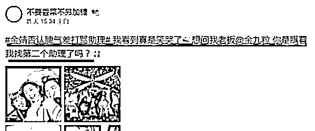
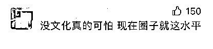
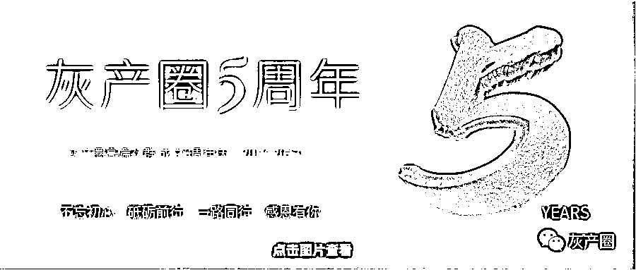

# 冲上热搜！知名女艺人道歉，反而引发了争议，网友：这样发工资交税了吗？

> 原文：[`mp.weixin.qq.com/s?__biz=MzIyMDYwMTk0Mw==&mid=2247540766&idx=5&sn=d0ada75cf00a4f66576ca32eca809c9e&chksm=97cbeb26a0bc6230609dda947d158449fc0ce8389c6f5bb0dea3403e0a84ea7796e8614d39e2&scene=27#wechat_redirect`](http://mp.weixin.qq.com/s?__biz=MzIyMDYwMTk0Mw==&mid=2247540766&idx=5&sn=d0ada75cf00a4f66576ca32eca809c9e&chksm=97cbeb26a0bc6230609dda947d158449fc0ce8389c6f5bb0dea3403e0a84ea7796e8614d39e2&scene=27#wechat_redirect)

近日 

**#金靖道歉#**出现在热搜第一 

怎么回事？ 

[`mp.weixin.qq.com/mp/readtemplate?t=pages/video_player_tmpl&action=mpvideo&auto=0&vid=wxv_2501032893910171650`](https://mp.weixin.qq.com/mp/readtemplate?t=pages/video_player_tmpl&action=mpvideo&auto=0&vid=wxv_2501032893910171650)

原来昨天，女艺人金靖在微博长文否认自己脾气差、打骂助理等传闻，她在文中表示：

**“最近有朋友告诉我，有些账号在说我私下脾气差，打骂助理。我有一瞬间很生气！很想解释。因为我真的很讨厌这种误会，我的人生目标就是成为快乐天使。但后来我又不在意了，因为我遇见的人都不在意。”**

随后，她又在评论区回复粉丝道：**“我真的不骂助理，她犯错了我就扣她钱，一次扣一千，比骂人管用多了。”她还表示：“扣个大概 5 千块后（助理）就很少犯错了，真的很 love and peace”。**

但金靖所谓的惩罚却引发了大家的质疑。**这样随意克扣工资也不比打骂助理好多少，金靖却用以此澄清自己的骂助理的传闻，难道是认为扣助理工资是一件稀松平常的事情吗？**

****

****

随着网友不断质疑，针对“助理犯错扣钱”一事，**金靖道歉称助理每月工资八千元，去年已把工作中扣掉的钱乘以 5 倍还给她了。**

随后 ，金靖助理发博回应金靖“脾气差打骂助理”一事，表示“看到真是笑哭了，想问我老板是瞒着我找第二个助理了吗？”**还在评论区晒出了金靖的转账记录，工资加年终奖一共三万元。**

然而此举又遭到网友质疑：**用转账付工资？交税了吗？**

金靖，1992 年出生于上海市，中国内地女演员。她早年作为常驻嘉宾参与录制东方卫视综艺节《今夜百乐门》，从而正式出道，后参与了综艺节目《饭局的透惑第二季》《人偶总动员第三季》《演员请就位》，抗疫剧《最美逆行者》而被大众所熟知。

**网友评论：**

**这事大伙怎么看？**

来源：钱江晚报、新闻晨报、极目新闻、北京青年报

← 向右滑动与灰产圈互动交流 →

