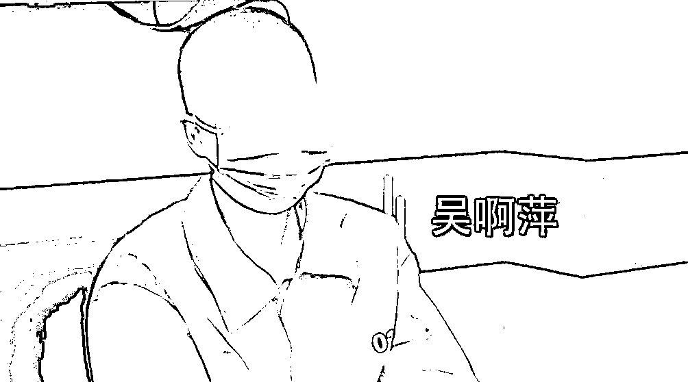

# 吴啊萍受审画面曝光，“特别想跟所有人忏悔”，南京玄奘寺原住持哽咽道歉：犯下不可饶恕的错误

> 原文：[`mp.weixin.qq.com/s?__biz=MzIyMDYwMTk0Mw==&mid=2247540937&idx=2&sn=af58781863a4885716c859254defa0d6&chksm=97cbebf1a0bc62e73f1e2578585da9d2de7ced8893e37233227fcdcce7a36477d01441ebcf21&scene=27#wechat_redirect`](http://mp.weixin.qq.com/s?__biz=MzIyMDYwMTk0Mw==&mid=2247540937&idx=2&sn=af58781863a4885716c859254defa0d6&chksm=97cbebf1a0bc62e73f1e2578585da9d2de7ced8893e37233227fcdcce7a36477d01441ebcf21&scene=27#wechat_redirect)

据南京发布 7 月 24 日消息，经调查核实，在南京玄奘寺供奉侵华日军战犯牌位者，为吴啊萍（女，1990 年 9 月生，大学学历，无曾用名）。7 月 22 日，吴啊萍被南京市公安机关依法立案调查。

25 日凌晨，南京广播电视台发布了相关视频。南京市公安局玄武分局玄武门派出所民警李东升介绍，接到工作指令后，警方进行了大量调查走访工作，最终将吴啊萍锁定。

在明确其位置后，警方 7 月 22 日找到吴啊萍，为争取时间，在就近联系公安机关后对吴啊萍进行了突审工作。

吴啊萍交待作案过程并道歉忏悔。吴啊萍称：“特别想和所有被我伤害到的人道歉，特别想跟所有人忏悔。真的不知道做什么才能弥补，我也愿意接受法律给我的任何制裁。”

据南京广播电视台消息，玄奘寺原住持传真得知供奉牌位有问题后，要求严禁外传，并一直未向主管部门报告。面对采访镜头，传真一度哽咽，说：“我非常惭愧，我真诚地向全国人民道歉，犯下了不可饶恕的错误，给全国人民造成了巨大的伤害。

以下为视频——

[`v.qq.com/iframe/preview.html?width=500&height=375&auto=0&vid=h3348q9s3mm`](https://v.qq.com/iframe/preview.html?width=500&height=375&auto=0&vid=h3348q9s3mm)

来源：每日经济新闻、南京发布、南京广播电视台

](http://mp.weixin.qq.com/s?__biz=Mzg5ODAwNzA5Ng==&mid=2247488098&idx=3&sn=638c5dd62ca652e1a1f2fd5b8420b00f&chksm=c0687b35f71ff223bca5031da035e3ab56f77f3ecfe42e587322e6e0f1302dc4d3e3fb354f18&scene=21#wechat_redirect)

← 向右滑动与灰产圈互动交流 →

