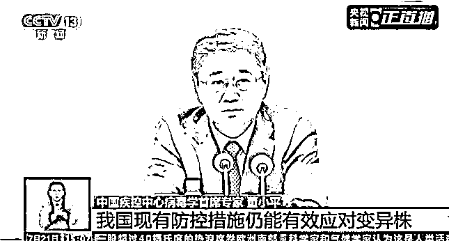
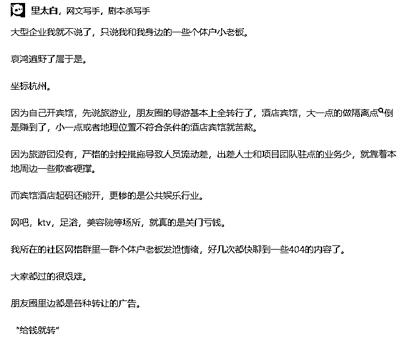

# “免费核酸检测”真的免费吗？原来你已经给过钱了......

> 原文：[`mp.weixin.qq.com/s?__biz=MzIyMDYwMTk0Mw==&mid=2247540937&idx=3&sn=4655ec8647671e7f5e2f687fbecb64a2&chksm=97cbebf1a0bc62e755b9bfa2bdaa08220b7bc75b9f0934b3fa6e761858cd80567bb637f706ed&scene=27#wechat_redirect`](http://mp.weixin.qq.com/s?__biz=MzIyMDYwMTk0Mw==&mid=2247540937&idx=3&sn=4655ec8647671e7f5e2f687fbecb64a2&chksm=97cbebf1a0bc62e755b9bfa2bdaa08220b7bc75b9f0934b3fa6e761858cd80567bb637f706ed&scene=27#wechat_redirect)

这两年多来，新冠病毒离我们时远时近，不变的是，新冠病毒一直和我们生活在一个空间。

7 月 21 日，在国务院联防联控机制新闻发布会上，中国疾控中心病毒学首席专家董小平介绍，国内外大部分学者认为，**新冠病毒的变异是长期存在的**，**奥密克戎变异株不大可能是最后一个变异株**。

张文宏也在上上个月表示：新冠疫情在短期内不会结束，我们需要更长的时间，更多的耐心，还有更多的勇气、更多的智慧和科技来战胜这一切。

这似乎在昭示着，我们未来的生活也和另一样东西脱不了钩。那就是——核酸。

疫情暴发以来，特别是今年，做核酸的次数猛增，这件事已经变得和吃饭睡觉一样重要，有时候不吃饭不睡觉都必须去把核酸给做了。

很多网友都有这样的疑问：为什么我所在的地区已经很久没有出现阳性感染者了，却还得连续搞大规模核酸呢？

就在昨天下午，这个问题得到了初步的解答。

国务院联防联控机制召开的发布会宣布：如经流调研判满足以下 3 个条件，则**无需对发生疫情的区开展全员核酸检测**，**只需重点对风险区域和有时空交集的人员开展核酸筛查即可**。

1.  感染来源明确

2.  传播链清晰

3.  未发生社区传播

中央是这么发话了，但是地方有没有落实到位又是另外一回事。政策层层加码，受苦的永远是最底层。

有的人总爱说，地方规定就这么定了，你也改变不了。况且核酸都是免费的，又不会花费很长时间，去做一下能扒了你一层皮不成？

可是，免费核酸真的不用钱吗？

常态化核酸检测必须坚持，那就得用钱说话。

这就只有一个选择：**羊毛出在羊身上**，加税。

昨天有条新闻是：上海免费的核酸检测延长至 8 月 31 号。

这是第二次延长了，上一次是延长至 7 月 31 号。

为什么不在 6 月直接宣布免费至 8 月底或者更晚呢？

这其实是一个看菜吃饭的问题。

要注意上海 7 月的一个新政策：上海社保最低基数由原来**5975 元**调整为**6520 元**，原来最低缴费**2250 元**调整为**2455 元**每月，增加了**205 元**。

按照混检最高 3.5 元的价格，以及每人每月 15 次的检测频率，一人多缴纳的这 205 元，能够支撑**4 个人的免费核酸检测**。

上海的社保缴纳人数是 400 万，由于有很多人的缴费基数超过最低标准，因此上海此次上调社保基数，增加的缴纳额足够覆盖全上海的核酸检测费用。

当然，上海不是孤例，今年 7 月，全国 31 个省市都公布了最新的社保基数，没有一个是下调。

也就是说，原来实际上我们已经付过“免费核酸”的费用了，只不过是通过另一种方式进行支付。

这是前几天的一则新闻标题：

核酸检测行业原来这么赚钱，怪不得现在大家开玩笑的时候都说想入行核酸行业了。

有的行业借着时机经营得风生水起，而有的行业却在苟延残喘，强撑着经营。

还有最近这段时间频频传出的互联网大厂裁员的消息，许多员工被迫“毕业”。

就连我们日日守在抗疫一线的医护人员，薪资待遇也受到了影响。

这是“医学界”在 2022 年 4-5 月间，对分布在不同地区、不同级别医院、职称不同的 1250 名医生和护士进行的调研。《调研报告》还显示，6 成医护人员在经历疫情后降低了幸福感打分。

疫情之下，不仅是实体经济、个体工商户受到重创，一些从事公认为是“铁饭碗”职业的人员的工资也被下调，不少公务员和事业单位编制人员的薪水都在往下降。

这种情况对民生和人的心理都造成了消极的影响，总不能一直持续下去吧？问题的源头在哪，是不是应该对其采取措施了？否则一些行业富得流油，一些行业却快饿成皮包骨了！

国家颁布的政策无疑都是基于民生和经济状况而制定的，但是最终能否贯彻落实就要看后续的实际措施和效果了。

只有抛弃私心，不被利欲熏心，大家一起扭成一股绳，合力合理抗疫，才能跨过疫情这座大山，才能看到下一站的起点啊。

**资料来源**

**[1]中疾控说新冠变异会一直存在，那核酸？？ 竹不倒**

**[2]刚刚！国家明确，核酸检测再调整 基层医师公社**

**[3]核酸检测也出现离职潮？！**

**来源：医学之声，实测**

******](http://mp.weixin.qq.com/s?__biz=Mzg5ODAwNzA5Ng==&mid=2247488098&idx=3&sn=638c5dd62ca652e1a1f2fd5b8420b00f&chksm=c0687b35f71ff223bca5031da035e3ab56f77f3ecfe42e587322e6e0f1302dc4d3e3fb354f18&scene=21#wechat_redirect)**

**← 向右滑动与灰产圈互动交流 →**

****