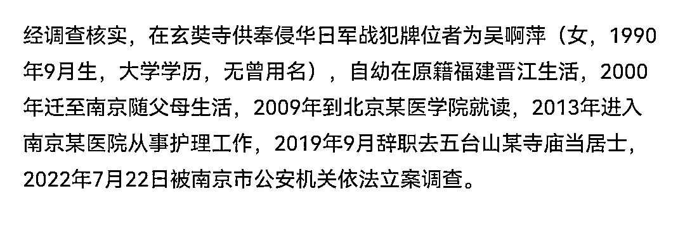
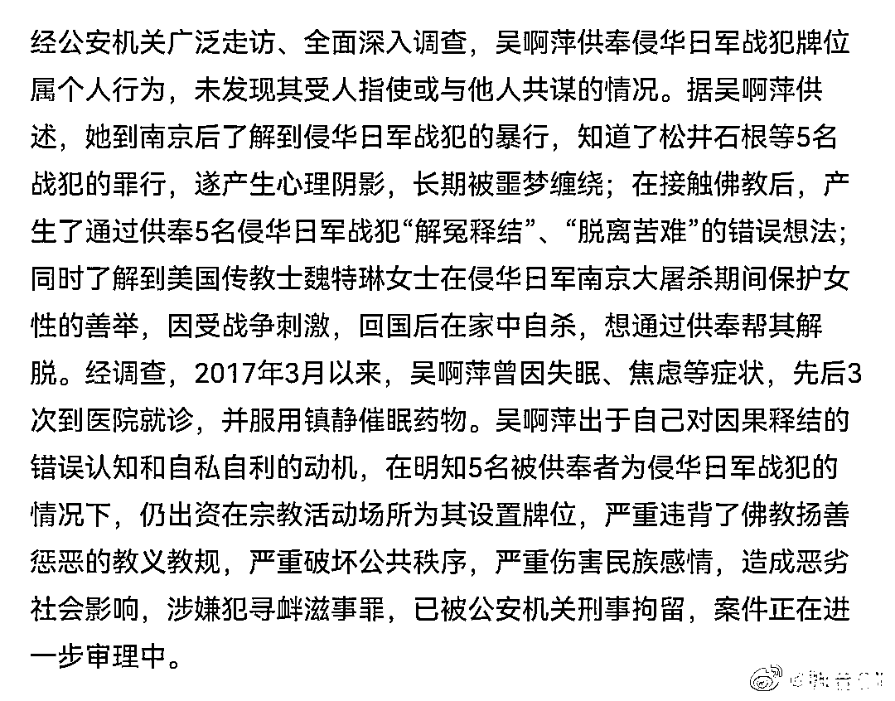
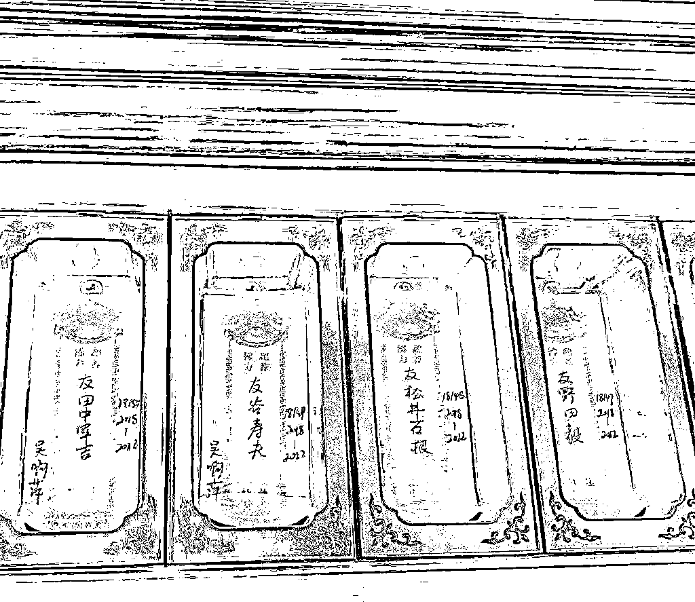
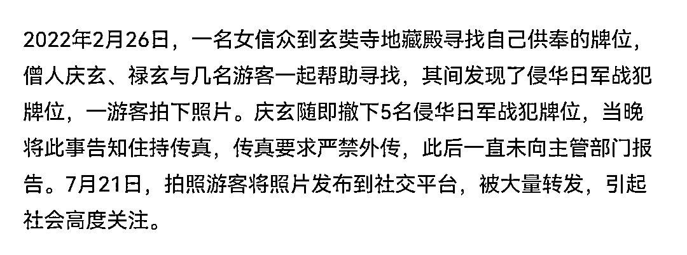
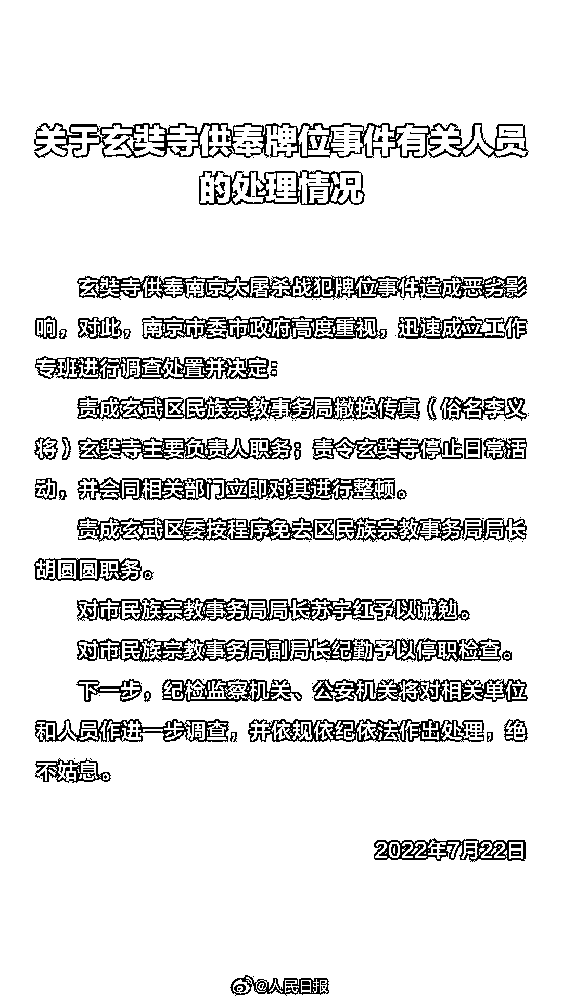
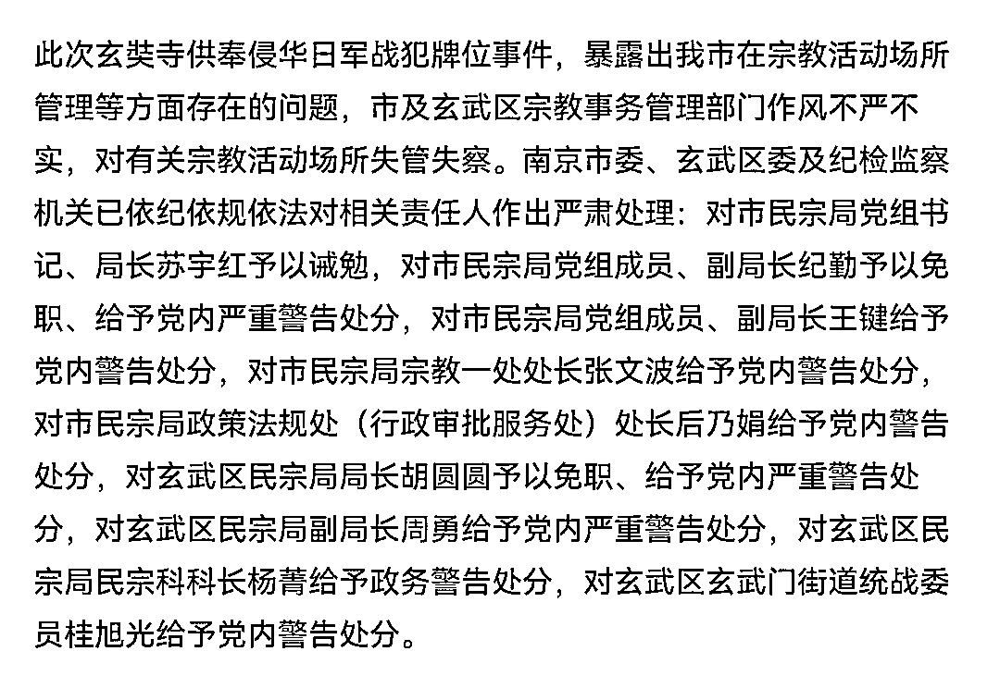
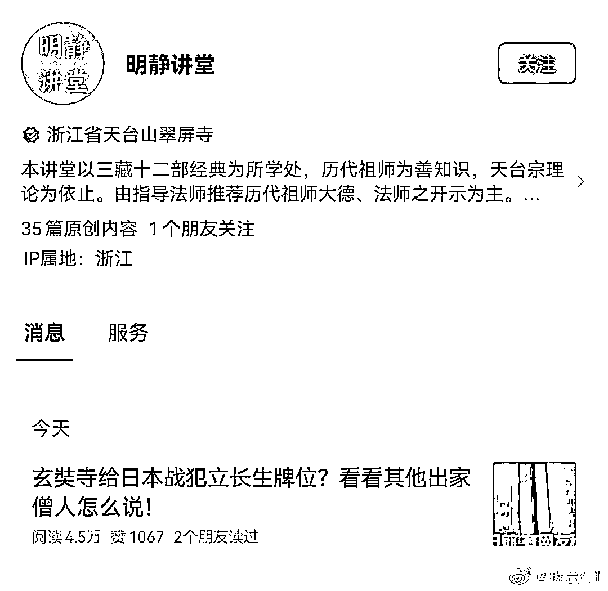
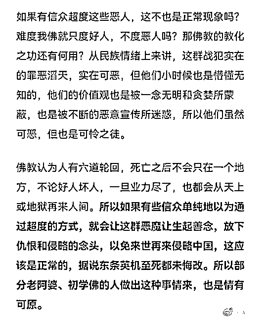

# 供奉日本战犯的吴啊萍是谁，终于查清了！

> 原文：[`mp.weixin.qq.com/s?__biz=MzIyMDYwMTk0Mw==&mid=2247540937&idx=4&sn=c878807685333f892c6bbc0ceb389e00&chksm=97cbebf1a0bc62e77e9ffa884b639a61cb978224a95f3109ec0026448a74d10f2f90af835daf&scene=27#wechat_redirect`](http://mp.weixin.qq.com/s?__biz=MzIyMDYwMTk0Mw==&mid=2247540937&idx=4&sn=c878807685333f892c6bbc0ceb389e00&chksm=97cbebf1a0bc62e77e9ffa884b639a61cb978224a95f3109ec0026448a74d10f2f90af835daf&scene=27#wechat_redirect)

7 月 24 日夜，针对玄奘寺供奉日本战犯牌位事件，南京发布公布了调查结果，大概包括以下几方面内容：

第一，吴啊萍是谁？

与我的此前猜测不同，吴啊萍不是精日化名，而是真实姓名。

官方通报称，战犯牌位供奉者吴啊萍系 1990 年生人，大学学历，自幼在原籍福建晋江生活，2000 年迁至南京随父母生活，2009 年到北京某医学院就读，2013 年进入南京某医院从事护理工作，2019 年 9 月辞职去五台山某寺庙当居士，2022 年 7 月 22 日被立案调查。

第二，吴啊萍为何要供奉日本战犯？

答案让人大跌眼镜，既非受他人指使，也未与他人共谋，纯粹是其个人行为。

根据官方通报，吴啊萍到南京后了解到侵华日军战犯的暴行，知道了松井石根等 5 名战犯的罪行，遂产生心理阴影，长期被噩梦缠绕，在接触佛教后，产生了通过供奉 5 名侵华日军战犯“解冤释结”、“脱离苦难”的错误想法。与此同时，吴啊萍还了解到美国传教士魏特琳女士在侵华日军南京大屠杀期间保护女性的善举，因受战争刺激，回国后在家中自杀，想通过供奉帮其解脱。

于是，在 2017 年 12 月 18 日，吴啊萍到玄奘寺要求供奉牌位，并在登记表上填写了“松井石根、谷寿夫、野田毅、田中军吉、向井敏明“等 5 名日本战犯，以及美国传教士魏特琳等名字。

值得注意的是，当值僧人灵松还曾就此询问这些人是其亲属还是朋友，吴啊萍谎称是其朋友。

第三，这些被供奉牌位的收费如何？

官方通报称，寺庙按照每个牌位每年 100 元标准、供奉 5 年共收费 3000 元，供奉时间为 2018 年-2022 年。

官方通报还显示，2018 年底，由于地藏殿修缮，玄奘寺陆续将牌位全部撤下，直至 2021 年 12 月修缮完毕，牌位又被摆回原处。

第四，玄奘寺被调查处理冤不冤？

答案当然是不冤枉。

根据官方通报，2022 年 2 月 26 日，一名女信众到玄奘寺地藏殿寻找自己供奉的牌位时，意外发现了侵华日军战犯牌位，一游客当时还拍下了照片。

僧人庆玄随即撤下 5 名侵华日军战犯牌位，并于当晚将此事告知住持传真，但传真不但要求严禁外传，此后也没向主管部门报告。

直到 2022 年 7 月 21 日，拍照游客将照片发布到社交平台被大量转发，这才引起社会高度关注。

官方通报还显示，除了最开始就被处分的苏宇红、纪勤及胡圆圆外，包括王键、张文波、后乃娟、周勇、杨菁、桂旭光等干部也遭处分。

总而言之，就整起事件的处理结果而言，我个人感觉是适宜的。

回过头来再说说吴啊萍的所作所为。

按照常理，其所作所为很难说服我等正常人。

**毕竟，没有谁会闲着没事供奉自己的仇人，更别说是与我们有着国仇家恨的日本战犯。**

但倘若按照部分宗教徒的逻辑看，似乎合乎其逻辑。

还记得我之前谴责过的那篇洗白文吗？

里面有这么段话：

“**如果有信众超度这些恶人，这不也是正常现象吗？难道我佛就只度好人，不度恶人吗？那佛教的教化之功还有何用？**从民族情绪上来讲，这群战犯实在罪恶滔天，实在可恶，但他们小时候也是懵懂无知的，他们的价值观也是被一念无明和贪婪所蒙蔽，也是被不断的恶意宣传所迷惑，所以他们虽然可恶，但也是可怜之徒。

“**佛教认为人有六道轮回，死亡之后不会只在一个地方，不论好人坏人，一旦业力尽了，也都会从天上或地狱再来人间。**所以，如果有些信众单纯地以为通过超度的方式，就会让这群恶魔让生起善念，放下仇恨和侵略的念头，以免来世再来侵略中国，这应该是正常的，据说东条英机至死都未悔改。所以部分老阿婆、初学佛的人做出这种事情来，也是情有可原。”

而对于某些魔怔的佛教徒而言，他们也确实能够做出供奉仇人的事情。

但存在并非合理。

于我等正常人而言，地狱倘若空荡荡，恶魔自然在人间。

总而言之，我还是坚持之前的观点：

“金刚努目，所以降伏四魔；菩萨低眉，所以慈悲六道。”

以德报怨，何以报德？以直报怨，以德报德。

归根结底，日本终归没有为其先辈当年的兽行道歉，我们自然也要永生不忘这段血海深仇。

欲灭其国，必去其史。

前事不忘，后事之师。

七月二十五日。

来源：拆台

](http://mp.weixin.qq.com/s?__biz=Mzg5ODAwNzA5Ng==&mid=2247488098&idx=3&sn=638c5dd62ca652e1a1f2fd5b8420b00f&chksm=c0687b35f71ff223bca5031da035e3ab56f77f3ecfe42e587322e6e0f1302dc4d3e3fb354f18&scene=21#wechat_redirect)

← 向右滑动与灰产圈互动交流 →

