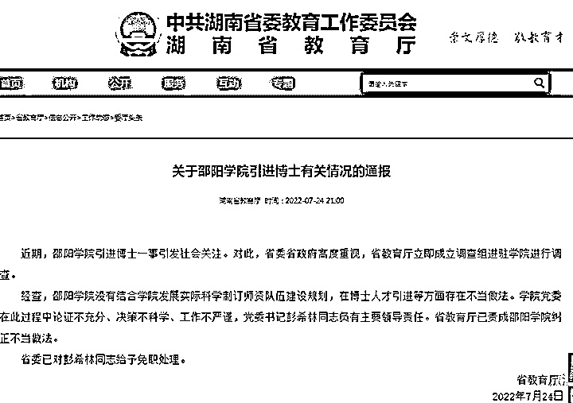
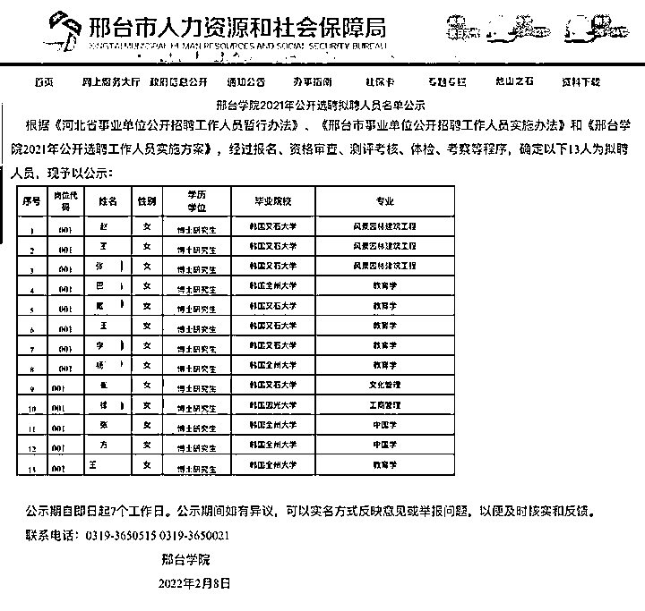
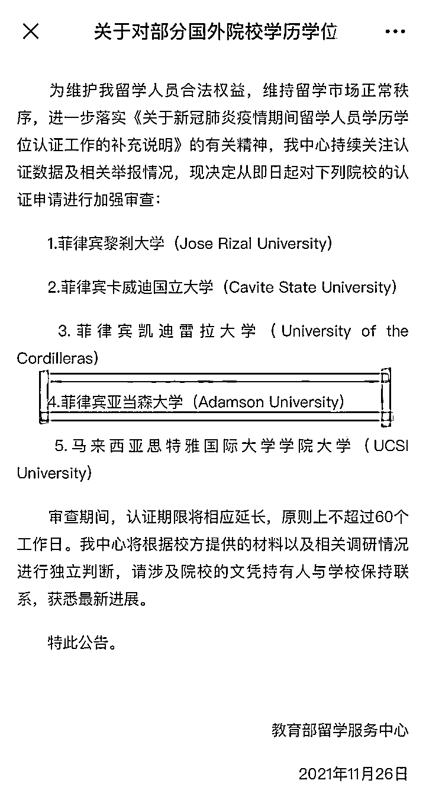
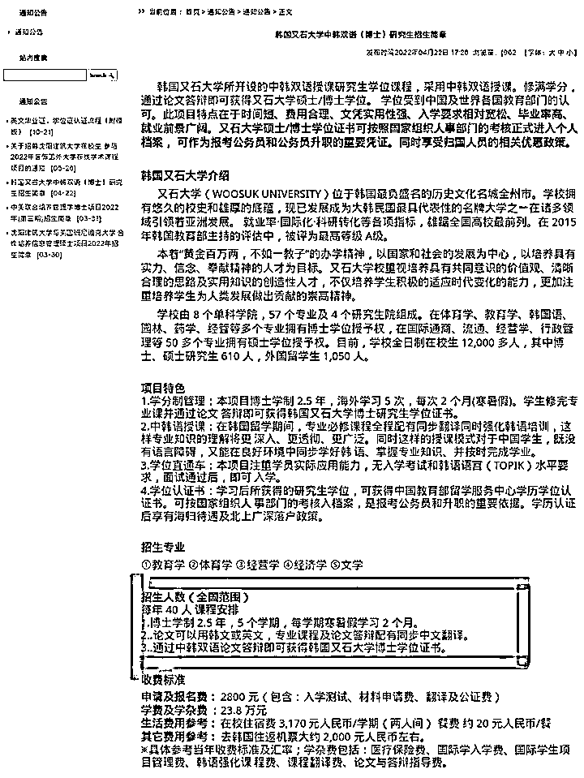
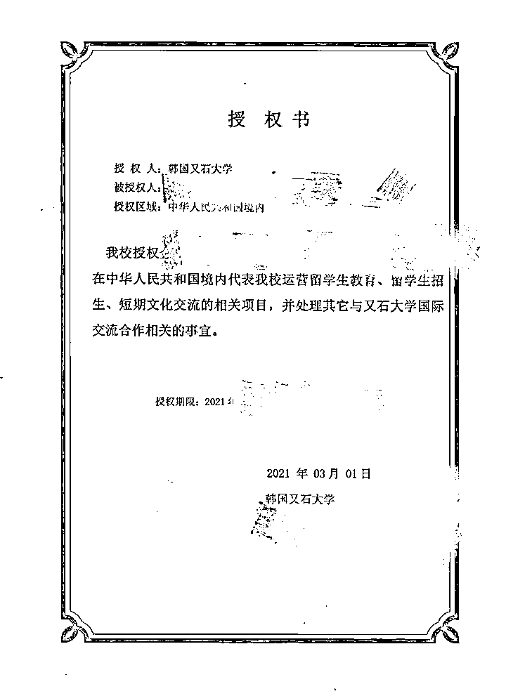
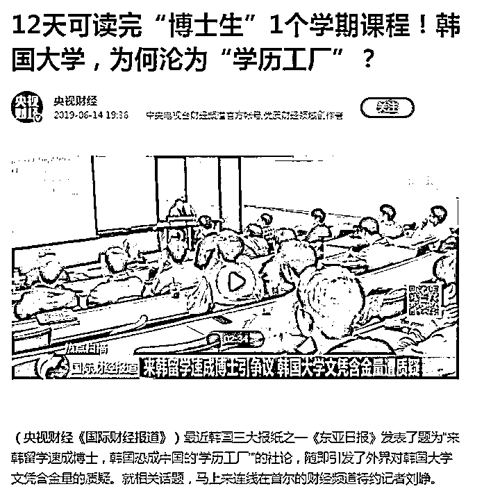
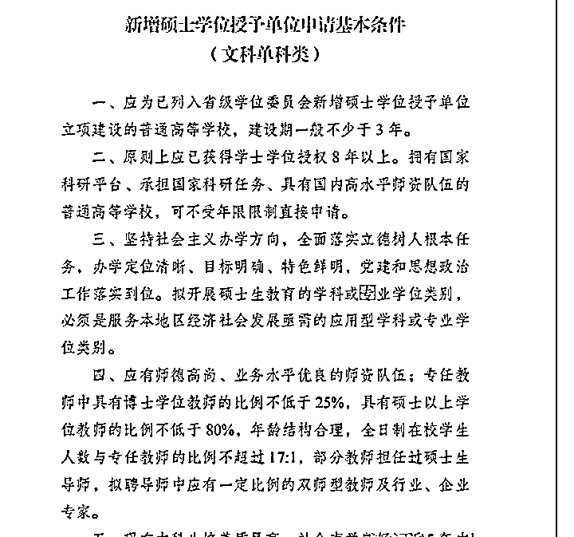

# 又一起！这次是韩国博士，起底“速成博士”产业链

> 原文：[`mp.weixin.qq.com/s?__biz=MzIyMDYwMTk0Mw==&mid=2247540937&idx=6&sn=43bbfa77fad50a29b965930593cfa0af&chksm=97cbebf1a0bc62e7d80eaa631ffecf7174d5a251a127afe977251cfa523a7597514ecd68c4dc&scene=27#wechat_redirect`](http://mp.weixin.qq.com/s?__biz=MzIyMDYwMTk0Mw==&mid=2247540937&idx=6&sn=43bbfa77fad50a29b965930593cfa0af&chksm=97cbebf1a0bc62e7d80eaa631ffecf7174d5a251a127afe977251cfa523a7597514ecd68c4dc&scene=27#wechat_redirect)

日前，邵阳学院斥巨资引进菲律宾博士一事在网络上引起轩然大波，7 月 24 日晚，湖南省教育厅针对此事发出通告，已责成邵阳学院纠正不当做法，并对相关责任人给予免职处理。（→[**此前报道**](http://mp.weixin.qq.com/s?__biz=MzIyMDYwMTk0Mw==&mid=2247540509&idx=7&sn=c114ed33c8421ebf62d1f619128d2b0b&chksm=97cb9425a0bc1d3322893112f3d3cf6ec2ecbe71f730979cea87ad43fa1db726036ea1ee0d53&scene=21#wechat_redirect)**）**

无独有偶，继邵阳学院之后，邢台学院也被曝出疑似存在批量引进“速成博士”的情况。**据了解，今年 2 月邢台学院公布了一份 2021 年公开选聘拟聘人员名单，共 13 人，均为韩国高校博士，有网友根据名单发现，这批博士此前或为邢台学院在职教师。**

****质疑声让“高校引进速成博士”成为热议话题。“速成博士”的背后是否隐藏着巨大的产业链？新黄河记者了解到，在不少有申博需求的高校以及群体周围，充斥着大量的申博留学中介广告，而这类广告往往主打“学制短”“门槛低”“通过率高”，以“速成”为噱头招生。****

 ****令网友不解的是，“速成博士”争议较大，且含金量低，为何部分高校仍在批量引进？对此新黄河记者查阅资料发现，博士研究生学位专任教师的占比是决定高校更名、申硕以及申博的硬性指标。专家分析，对于地方高校而言，鼓励在职教师攻读“速成博士”比招聘其他高校博士更加可行，但“速成博士”本身并不可取，高校教师队伍的建设，必须摆脱唯学历论。****

******网友爆料：
邢台学院选聘韩国博士引争议****** 

****近日，有网友爆料，邢台学院公开选聘了 13 名毕业于韩国高校的女博士，并曝出选聘人员名单。“这则面向社会的公开招聘，最终入选的人员均毕业于韩国高校，而且中国留学生赴韩攻读博士，学的竟是中国学和教育学等专业，未免有些荒唐。”网友质疑：邢台学院此次选聘。是否与此前邵阳学院选派本校教师出国深造后返校任教情况类似？随后有网友从邢台学院公布的此次选聘人员名单中发现，这批博士此前或为邢台学院的在职教师。****

********

****针对爆料，新黄河记者检索邢台学院官网以及邢台市人力资源和社会保障局官网，证实了该校引进 13 名韩国博士这一消息，但关于 13 位博士的详细资料，该校官网并没有公布。记者对比邢台学院 2021 年选聘博士名单发现，一篇发表于 2020 年名为《学前儿童美术类课程教育教学研究》的论文中，作者栏显示为戴某某，作者单位为韩国又石大学和邢台学院，这两项信息与邢台学院选聘博士名单中戴某某的信息高度吻合。此外，在邢台学院官网一篇发布于 2018 年的主题报道中，也出现了戴某某的部分信息，显示戴某某为邢台学院美术与设计学院教师。记者通过检索论文作者以及该校新闻报道所关联的人物名称发现，的确存在与多位选聘博士同名的现象，但无法确认为同一人。针对网友的质疑，记者多次致电邢台学院各科室，工作人员均称并不了解相关情况。随后记者根据邢台学院选聘名单公示中的监督电话，联系到邢台市教育局，工作人员称，此事需要核实由哪个科室负责，随后再作回复。截至记者发稿，暂未得到相关回复。****

****有业内人士认为，无论是邵阳学院公开选拔本校教师，前往国外攻读博士再引进回来任教，还是邢台学院面向社会公开选聘却被质疑入围者是本校教师，这类引进模式已经成为公开的秘密，其实选送本校教师赴外读博本身没什么争议，高校也有培养教师的义务，但是结合近几年部分高校批量引进博士的情况来看，这种模式存在一定的“注水”，有“速成博士”之嫌。****

 ******记者调查：
“速成博士”背后的产业链****** 

****邵阳学院斥巨资引进菲律宾博士引发争议的同时，也将菲律宾亚当森大学推向舆论的风口浪尖。“亚当森博士两年速成”，引发网友质疑，因此，有人调侃亚当森大学是“学历加工厂”。****

********

****而邢台学院也遭到了和邵阳学院同样的质疑，该校选聘的韩国博士中有超半数的人毕业于韩国又石大学，紧接着这所韩国高校也引发热议。一份沈阳建筑大学官网发布的关于韩国又石大学博士研究生的招生项目简章在网络上流传开来。简章介绍，该项目学制为 2.5 年，每次学习 2 个月均在寒暑假，且采取中韩双语授课，无入学考试和韩语语言水平要求，学生修完专业课并通过论文答辩即可获得该校博士研究生学位证书。这份招生简章被网友称作“韩国速成博士班”招生资料，而记者检索发现，这样的资料在各大网站上都以广告的形式存在着，“速成博士”俨然已经成为一条产业链。****

********

****7 月 23 日，记者以咨询赴韩读博的名义联系到一家留学中介公司，并获悉，申请韩国又石大学部分博士研究生学位最快可两年毕业，弹性学制，入学无需语言成绩且通关率高。记者咨询多家赴韩留学中介公司了解到，即使是申请同一家韩国高校，各中介公司的报价也都不同。据一位工作人员透露，“我们和韩国高校有协议，达到他们的招生人数要求后，我们会跟学校方面协商，因此不会再单独收取服务费。”但有业内人士表示，这些中介公司收取的费用通常是官方学费的好几倍。****

********

****在完成所申请学校专业课程的前提下，能否保证顺利毕业呢？面对记者的疑惑，一位咨询顾问介绍，“不少高校之所以会收取教务管理费、翻译费和项目管理费，就是因为这些高校采取小班双语授课，而双语博士在毕业答辩时，学校会提前找好教授，对论文的要求也不会太严格。”该咨询顾问告诉记者，“对语言要求较低的高校一般都比较容易申请，而这类学校在当地排名相对一般，但通过率很高。”该咨询顾问表示，越好的学校，要求越高，学制也会更长，因为他们不缺生源，也不会为了挣钱降低学校的入学和结业要求，毕竟到了博士阶段，是需要出学术研究成果的。****

 ******考核要求：
博士研究生学位专任教师的占比******

******是重要指标****** 

****记者了解到，关于“速成博士”的争议并非从邵阳学院事件开始。据媒体报道，2019 年，我国不少地方本科院校与韩国高校合作，组织教师赴韩读博，12 天便可读完博士一学期课程。一时间“速成博士”“韩国大学沦为学历加工厂”等话题引发关注。随后韩方要求高校严格管理大学学位制度，相关涉事大学也停止了有关项目。如今“速成博士”项目依旧在源源不断地招生。****

********

****面对公众的质疑，为何国内高校还要批量引进“速成博士”？邵阳学院一名二级学院院长在接受媒体采访时给出答案：“这也是没有办法的办法，但确实有利于提高教师队伍中博士学历的比例，对以后升级为大学、申请硕士点都有帮助。”****

****新黄河记者查阅资料发现，在邵阳学院的发展规划中明确了其未来十几年的发展目标，“2023 年升格为硕士学位授予权单位，2030 年前升格为大学，2035 年前升格为博士研究生学位授予权单位。”而要完成邵阳学院这些目标，博士研究生学位专任教师的占比是一项极为硬性的指标。****

 ****根据国务院学位委员会发布的《学位授权审核申请基本条件（2020 年）》规定，除艺术体育类院校外，新增硕士学位授予单位申请的基本条件中，专任教师中具有博士研究生学位教师的比例不低于 25%。而根据教育部 2006 年颁布的《普通本科学校设置暂行规定》，称为大学的专任教师中具有研究生学位的人员比例一般应达到 50%以上，其中具有博士研究生学位的专任教师占专任教师总数的比例一般应达到 20%以上。因此邵阳学院想要在 2023 年升格为硕士学位授予权单位，并在 2030 年前由学院更名为大学，其具有博士研究生学位的专任教师占比则是最为重要的指标。****

********

****图片均来源于网络****

******专家分析：
高校教师队伍建设必须摆脱唯学历论****** 

****既然具有博士研究生学位的专任教师是申硕以及升级为大学的硬性指标，那么这些院校为何不从国内高校引进博士，却要从国外引进“水博士”？针对此疑问，21 世纪教育研究院院长熊丙奇在接受新黄河记者采访时分析，“地方高校要靠自己的办学实力，吸引优秀博士毕业生应聘是有难度的，而原有专任教师又占有大量编制。因此鼓励有硕士学位的在职教师攻读博士是一个可行的方法。但是不论读国内博士还是国外博士，都需要较长的周期，没有四五年时间，很难拿到学位。有的教师拿到学位之后，还会跳槽。权衡下来，由高校组织在职教师，去国外一些不知名大学统一攻读博士研究生学位，是较好的办法。”熊丙奇称，这些在职教师拿到的博士研究生学位虽然含金量低，甚至被质疑是“水博”，但也是博士研究生学位，而且在职教师拿到博士研究生学位后，大多不会跳槽。****

 ****“但回到这件事的本质上，要加强我国高校的教师队伍建设，这样的‘速成博士’并不可取，高校必须摆脱唯学历论。这并不是说不看教师的学历，而是要在学历之外，关注教师的真实教育能力和学术能力。客观上说，高校批量引进‘速成博士’，不是看重教师的学历，而是看重这背后的学历指标，是让具有博士研究生学位的教师比例大幅提升，以此展示学校师资队伍建设成绩、学科建设成绩，并进而获得更多办学资源。”熊丙奇认为，我国必须要推进高等教育管理与评价改革，以引导高校安于自身定位，聚焦提升办学质量。尤其在管理改革方面，要落实和扩大学校办学自主权，推进高校建立现代大学制度，实行现代治理，比如应提高对高校的生均经费拨款，减少按学校身份拨款。在评价改革方面，也要淡化对高校的行政评价，推进专业评价，破除高校存在的唯学历、唯论文、唯职称评价问题。****

****来源：澎湃新闻****************](http://mp.weixin.qq.com/s?__biz=Mzg5ODAwNzA5Ng==&mid=2247488098&idx=3&sn=638c5dd62ca652e1a1f2fd5b8420b00f&chksm=c0687b35f71ff223bca5031da035e3ab56f77f3ecfe42e587322e6e0f1302dc4d3e3fb354f18&scene=21#wechat_redirect)****

****← 向右滑动与灰产圈互动交流 →****

********