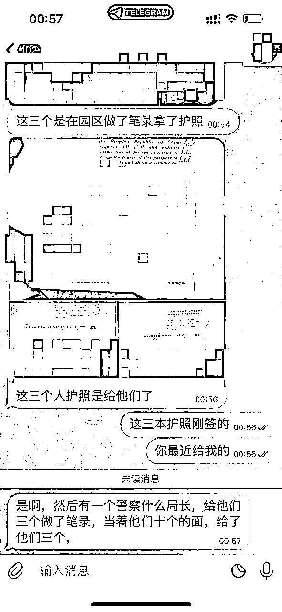

# 中国男子向柬媒求助：13 名同胞遭非法拘禁，还有求救视频！

> 原文：[`mp.weixin.qq.com/s?__biz=MzIyMDYwMTk0Mw==&mid=2247540937&idx=8&sn=9d55904651a15cc20002ff37e765c311&chksm=97cbebf1a0bc62e782fcccfeb6412fc7dcf24f21ed66ba3fb16f4c5eeca4fd186161a5ec077a&scene=27#wechat_redirect`](http://mp.weixin.qq.com/s?__biz=MzIyMDYwMTk0Mw==&mid=2247540937&idx=8&sn=9d55904651a15cc20002ff37e765c311&chksm=97cbebf1a0bc62e782fcccfeb6412fc7dcf24f21ed66ba3fb16f4c5eeca4fd186161a5ec077a&scene=27#wechat_redirect)

据柬媒消息，一名 37 岁的中国男子王某某称，至少有 13 名中国公民在西

港某赌场遭到非法拘禁。

王某某表示自己不仅报警了，还于 7 月 25 日上午到达了一家柬埔寨新闻公司曝光这件事。

他说，6 月 23 日，13 名中国公民被西港第 4 区第 5 村的某赌场拘留至今。而他手上也有受害者的视频和护照复印件，因此请求西港省长的帮助。

他在求助信中写道：

尊敬的省长阁下，2022 年 6 月 23 日，我的 13 位朋友被非法拘留在西哈努克省西哈努克市第 4 区第 5 村的赌场，他们联系我说他们被拘留了，并已经向警方报警了。

但是在警方到达现场之前，赌场的人威胁我的朋友不准说出真相。因为害怕受到伤害，他们只能说自己没有被拘留。

2022 年 7 月 18 日下午 3 点左右，我的朋友再次联系我寻求帮助，所以我决定向省长报警，请求您帮忙解救我的朋友。

据我的朋友反映，**他们 13 人全部被关押****在 3 号楼的 502 室、516 室、519 室和 562 室。**

如上所述，西哈努克省省长阁下，请介入以释放我所有的 13 位朋友。阁下，请接受我最崇高的敬意。

2022 年 7 月 25 日上午，西港省长郭宗仁回应说：“**西港省政府已经介入调查此案了。但是重要的是现在连我自己都不知道怎么找。如果你看到原告，请告诉他到省政府来，我会帮助他的。**”

另外，西港警察局长尊那林少将表示，西港警方仍未获得相关消息，如果报案人有受害人的具体地址和遭受酷刑的照片，可以通过**Telegram**向西港省警察局提供地址和证件，西港警方将立即介入调查。

来源：nokorwatnews，天下有诈

](http://mp.weixin.qq.com/s?__biz=Mzg5ODAwNzA5Ng==&mid=2247488098&idx=3&sn=638c5dd62ca652e1a1f2fd5b8420b00f&chksm=c0687b35f71ff223bca5031da035e3ab56f77f3ecfe42e587322e6e0f1302dc4d3e3fb354f18&scene=21#wechat_redirect)

← 向右滑动与灰产圈互动交流 →

