# 欺负老实人起家的“校园贷鼻祖”又来了？1 分钱酸菜鱼预制菜吸引宝妈加盟…

> 原文：[`mp.weixin.qq.com/s?__biz=MzIyMDYwMTk0Mw==&mid=2247541006&idx=1&sn=2923b32fb1858e9def89f4f3c0a61e50&chksm=97cbea36a0bc6320bd4a354213851efcbc4fc44717fcb74b5ab6ed334b93ea119f94e61ae17b&scene=27#wechat_redirect`](http://mp.weixin.qq.com/s?__biz=MzIyMDYwMTk0Mw==&mid=2247541006&idx=1&sn=2923b32fb1858e9def89f4f3c0a61e50&chksm=97cbea36a0bc6320bd4a354213851efcbc4fc44717fcb74b5ab6ed334b93ea119f94e61ae17b&scene=27#wechat_redirect)

最近很多薅羊毛的朋友

**都在沉迷“1 分钱送酸菜鱼”吧？**

贾乃亮、傅首尔一起

在“趣店罗老板”直播间带货预制菜

**送出了很多酸菜鱼和 500 台 iPhone13**

19 个小时的直播

观看人次达 9587 万

单日累计销量为 956 万份

59.9 元的水煮鱼

销售额就达到了 7507.3 万

一场**直播累计销售额达到 2.5 亿元**

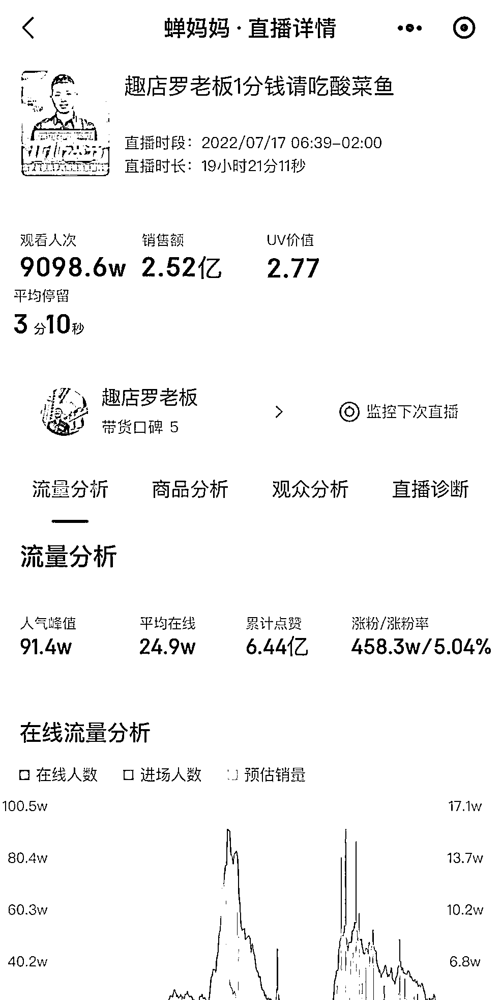

本来想想是蛮好

你赚流量 网友们薅个羊毛

但好像，不是这么简单啊！

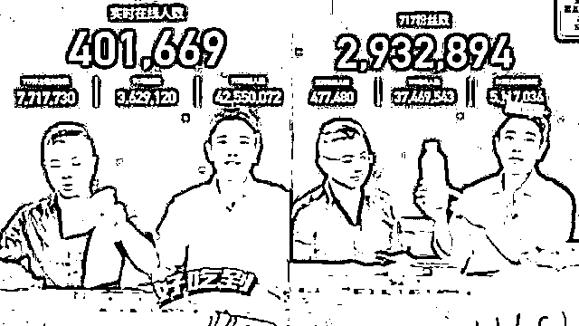

**靠校园贷起家的 CEO**

直播结束没多久，罗敏开了一场

预制菜品牌战略发布会

趣店预制菜要开始线下加盟

“未来 3 年支持 10 万用户创业开设线下门店”

宣传里是这么说

只要宝妈们

在小区几百米的附近开一家预制菜门店

每天只需要卖出 50 份菜

每月就能轻松赚个大几千的收入

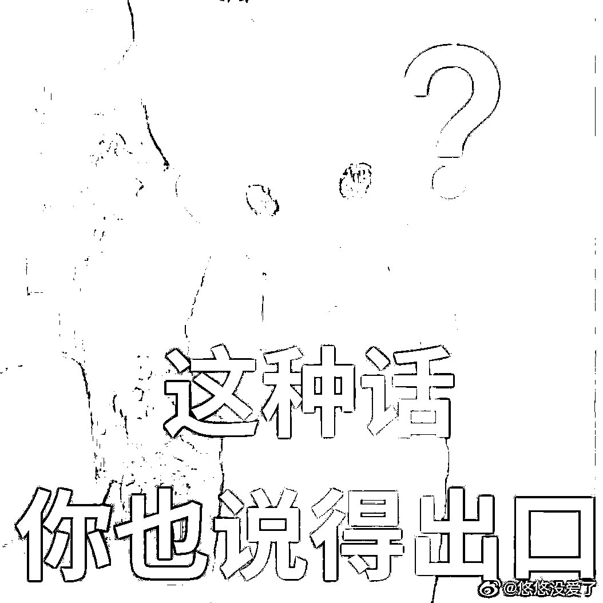

而罗敏是靠什么发家呢？

——搞校园贷起家的

最高的时候，利息都要百分之三十六

这么高的利息

钱要不上来自然有各种手段

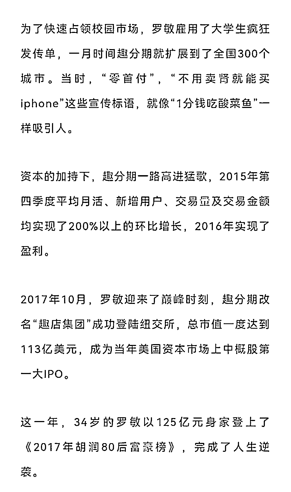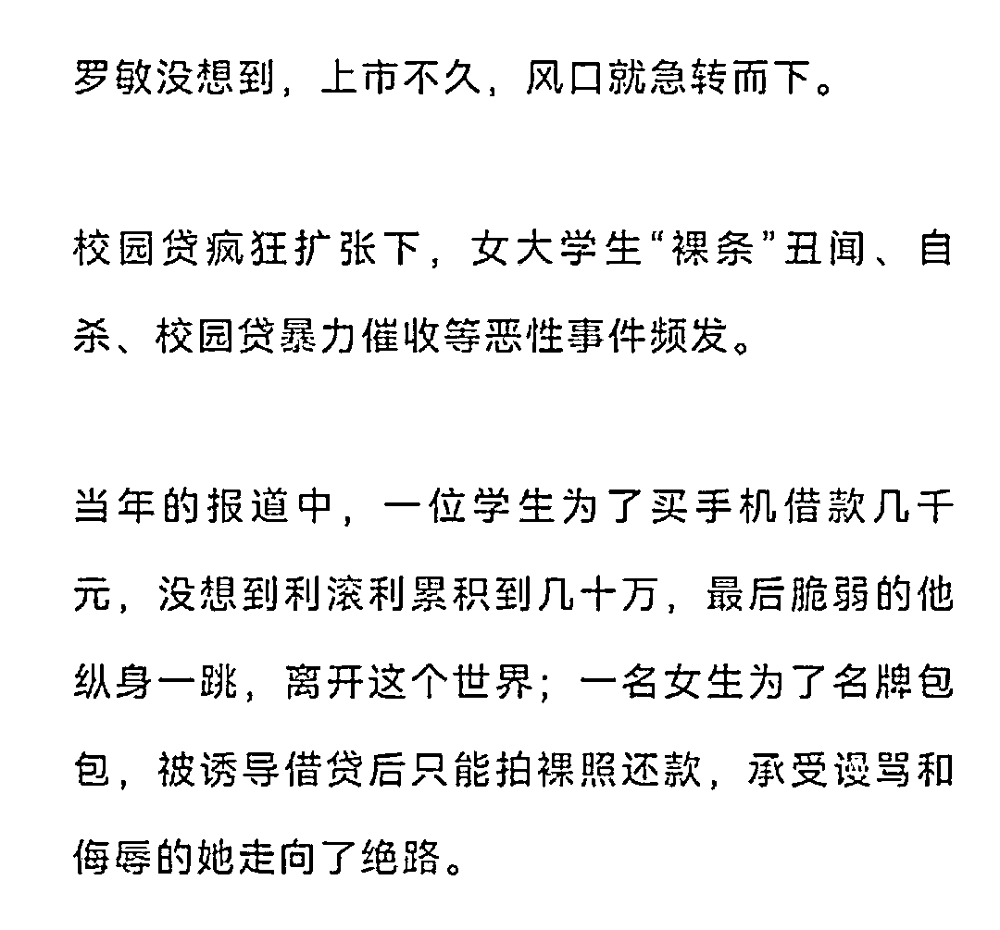

这则微博讲很清楚了 

这个人祸害了多少个家庭啊！

用裸照催债，手段令人发指

太可怕了……本来还不清楚

为什么大家反应这么大

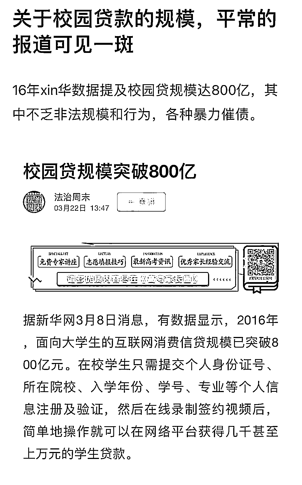

而罗敏一路收割青年学子

挺进了纽交所

巅峰时期的市值超过百亿美元

不过在“校园贷”被监管紧急叫停后 

趣店的好日子也走到了头

这几年罗敏尝试转型

汽车零售、奢侈品电商、少儿素质教育

都没啥水花

直到这次的酸菜鱼预制菜…

**给东方甄选刷礼物 被拉黑**

18 日，罗敏又到东方甄选直播间狂刷礼物

董宇辉老师也是马上发现

**还一边劝罗敏别再刷礼物**

**建议他不如买点农产品走**

“不要再刷了，这是卖菜的直播间

新东方现在还是上市公司

我们的财力还是比较让大家放心的”

这次他跑去东方甄选直播间

打赏上榜一蹭流量

被东方甄选拉黑

随即开直播说自己多委屈，接着蹭

虽然罗敏回应的言辞恳切

甚至还有几分委屈，但网友并不吃这一套

" 一个老师，面对一个给学生放贷的资本家

没骂人已经保持了一个读书人的素质了 "

" 放贷他比较在行，卖菜还是算了吧 "

" 互联网是有记忆的，罗敏

你以为我们忘记了

你搞的校园贷趣分期吗？"

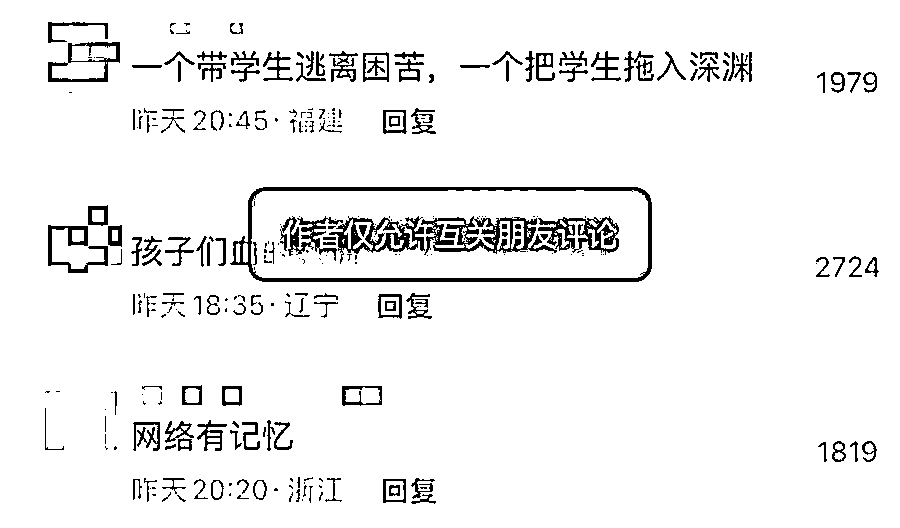

7 月 26 日，和他一起直播的

傅首尔@傅妈 发文

回应与趣店合作称

和趣店预制菜的合作是单次

没有深度合作，也没有后续合作

对品牌前身确实缺乏了解

没有做好企业及市场背调

接错了一份工作，疏忽又愚蠢，满心后悔

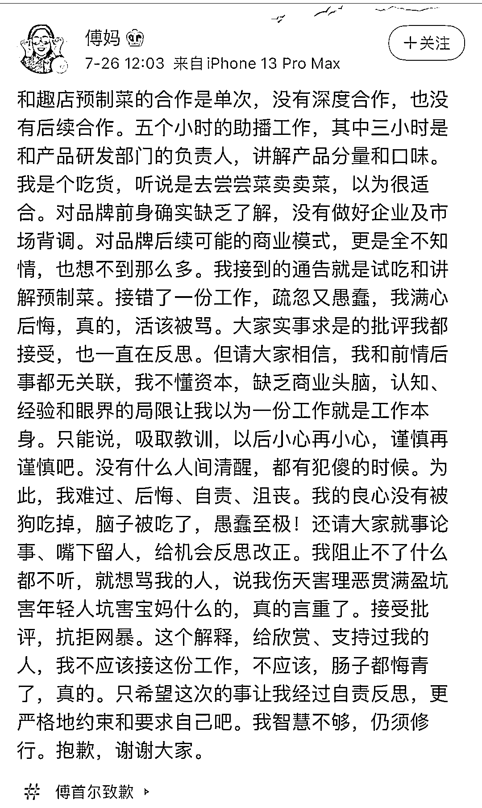

不愧是辩手，把自己摘得挺干净

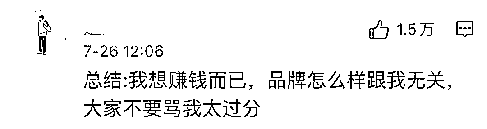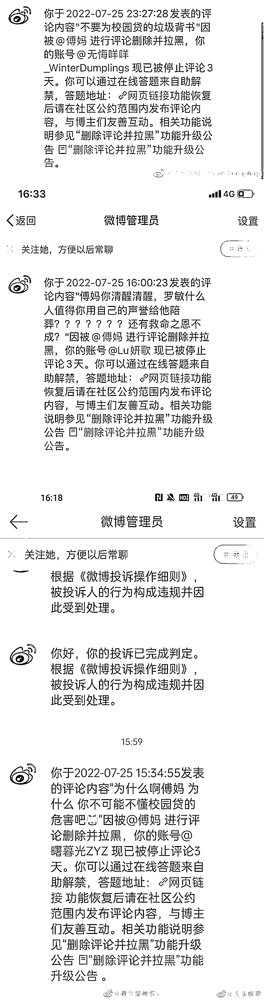

再说一下，他现在并不是卖预制菜赚钱

而是吸引人们去加盟他的店

然后放贷，还是放贷

蜜雪冰城正新鸡排这样的店不过 2w 加盟

他已经画饼说 10w 加盟

不要被骗，预制菜只不过

被他 1 分钱和送 iPhone 炒热了

并不是以后年轻人的首选

成为不了风口，理性投资啊！！

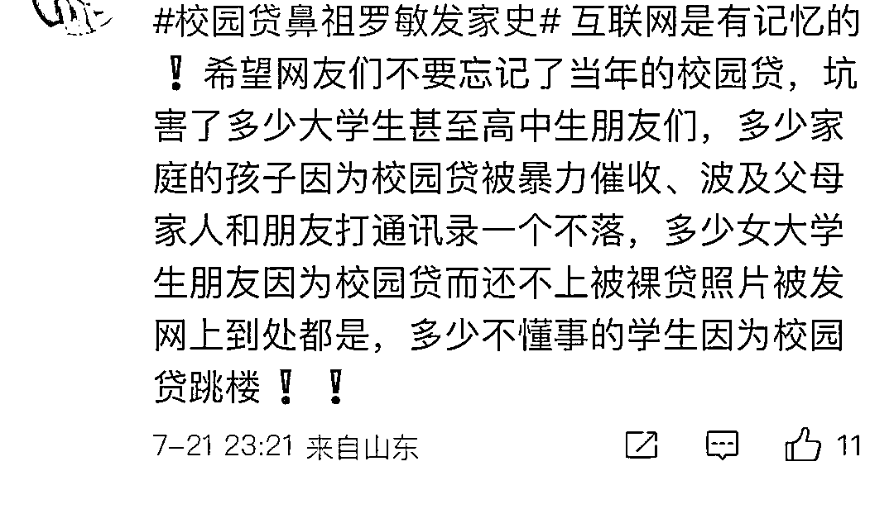

当时的大学生成家立业了

又可以割韭菜了

是不是想着我能割你韭菜一次

那么我就能割你的韭菜二次？

毕竟宝妈带孩子累

没有精力来分辨，需要更多的情感需求了

他就提供情绪来割韭菜

然后又踏入贷款的坑

这时候更多家庭的分崩离析就不远了

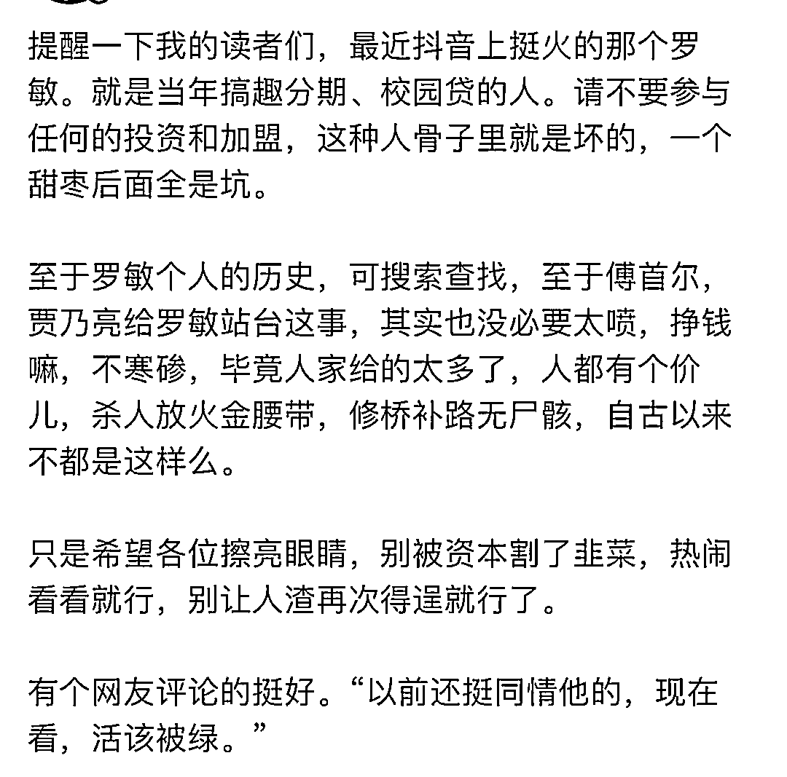

来源：脊梁 in 上海 SH，实测

](http://mp.weixin.qq.com/s?__biz=Mzg5ODAwNzA5Ng==&mid=2247488098&idx=3&sn=638c5dd62ca652e1a1f2fd5b8420b00f&chksm=c0687b35f71ff223bca5031da035e3ab56f77f3ecfe42e587322e6e0f1302dc4d3e3fb354f18&scene=21#wechat_redirect)

← 向右滑动与灰产圈互动交流 →

