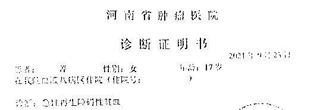
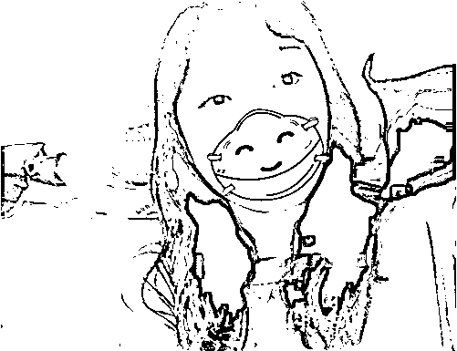
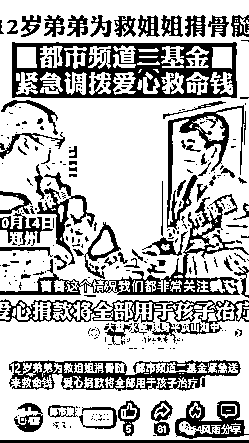
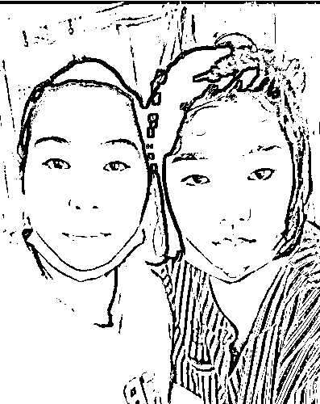
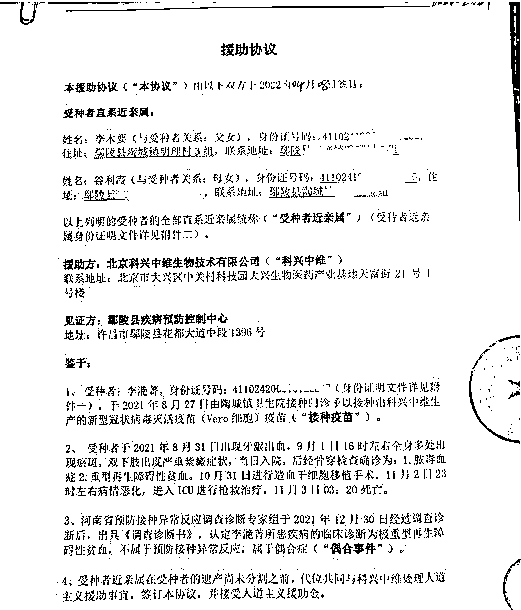
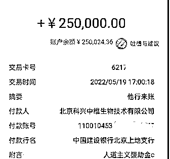
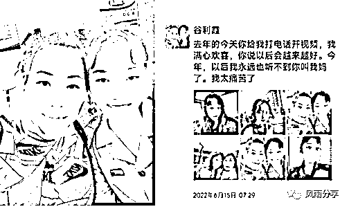
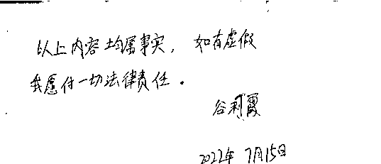

# 花季女儿死了，他们让我先签保密协议

> 原文：[`mp.weixin.qq.com/s?__biz=MzIyMDYwMTk0Mw==&mid=2247541006&idx=3&sn=8798aaf788128ce422ff5379370f3af5&chksm=97cbea36a0bc6320973aa59d19b93c75d4b617cd2184fbd2b41246188660974a4779d9027764&scene=27#wechat_redirect`](http://mp.weixin.qq.com/s?__biz=MzIyMDYwMTk0Mw==&mid=2247541006&idx=3&sn=8798aaf788128ce422ff5379370f3af5&chksm=97cbea36a0bc6320973aa59d19b93c75d4b617cd2184fbd2b41246188660974a4779d9027764&scene=27#wechat_redirect)

‍

<main role="main" data-mpa-powered-by="yiban.io" mp-original-font-size="17" mp-original-line-height="27.200000762939453" style="outline: 0px;max-width: 100%;box-sizing: inherit;color: rgb(34, 34, 34);font-family: system-ui, -apple-system, BlinkMacSystemFont, Helvetica Neue, PingFang SC, Hiragino Sans GB, Microsoft YaHei UI, Microsoft YaHei, Arial, sans-serif;letter-spacing: 0.544px;caret-color: rgb(34, 34, 34);text-size-adjust: inherit;background-color: rgb(255, 255, 255);visibility: visible;line-height: 27.2px;overflow-wrap: break-word !important;">

最近，网上流传一份北京科兴中维生物技术有限公司的《援助协议》以及付款 25 万元的截图，一名叫李滟菁的女子接种新冠疫苗后死亡，科兴给予了 25 万的人道主义赔款，但表示这是偶合事件不属于接种异常反应，与疫苗无关，科兴无过错。到底是怎么回事？

这份协议的落款显示，受援助者系该女子的父母。最近，我们联系到了李滟菁的母亲，她向我们介绍了事件的来龙去脉。

我叫是谷利霞，是河南省许昌市鄢陵县陶城镇明理村的农民。

我的女儿叫李滟菁，今年 18 岁了。2021 年 8 月 27 日，女儿在陶城镇卫生院接种了第一针新冠疫苗，三天之后，牙龈出血、全身多处出现瘀斑。

8 月 31 日晚，当时我们在许昌农村老家，听到女儿的情况，让她赶紧去医院检查，我们当晚摸黑从村里赶到县里，又找了出租车匆匆赶到郑州

</main>

<main role="main" mp-original-font-size="17" mp-original-line-height="27.200000762939453" style="outline: 0px;max-width: 100%;box-sizing: inherit;color: rgb(34, 34, 34);font-family: system-ui, -apple-system, BlinkMacSystemFont, Helvetica Neue, PingFang SC, Hiragino Sans GB, Microsoft YaHei UI, Microsoft YaHei, Arial, sans-serif;letter-spacing: 0.544px;caret-color: rgb(34, 34, 34);text-size-adjust: inherit;background-color: rgb(255, 255, 255);line-height: 27.2px;overflow-wrap: break-word !important;">

9 月 1 日，女儿紧急送入郑州大学第一附属医院、后又送到河南肿瘤医院，经骨穿检查确诊为：脓毒血症、重型再生障碍性贫血。

这犹如一个晴天霹雳，女儿怎么会突然患此严重的疾病。她前几天才离开的家，身体一切都是好好的。

当时，我的女儿刚从郑州一职业院校毕业，在郑州实习，她希望成为一名高铁乘务员。毕业前，她做过各项体检，身体健健康康。

重型再生障碍性贫血，我们家族从来没有过这种疾病，我后来才了解到，这属于再生障碍性贫血的一种，一般起病急、病情重。

我的女儿是在打了疫苗之后出现的情况，住院之后，她的血小板很低，后来肺部出现了真菌感染，头部左侧也检查出有不明物体，住院几周，身体日渐消瘦、憔悴，到后来无法下床。

为了救女儿，我倾尽了全力，拿出了所有的积蓄，还找亲朋好友借了十多万，治疗费用不够，我们还借了高利贷，没办法，该借的都借了，还用上水滴筹筹钱。

医院说，再生障碍性贫血需要移植，为了救女儿，孩子爸和她弟弟都做了骨髓配型检查，弟弟的匹配度更高，最后弟弟给她做了骨髓移植。当时河南的电视台都市频道作了采访报道：12 岁弟弟为救姐姐捐骨髓。

在移植前，我无时不刻地为女儿祈祷，希望她渡过此劫，希望她能获得重生。10 月 31 日，女儿进仓进行造血干细胞移植，几天后，病情恶化，11 月 3 日，女儿永远的离开了我。

我的女儿，从打疫苗到得病到离世，只有短短两个多月时间，太快了。我们总共花了 70 多万治疗费，儿子还做了骨髓移植，最终还是没能救回女儿的命。

女儿的离开，让我感到撕心裂肺的痛，我真的很恨疫苗，一针新冠疫苗要了我闺女的命，我要为女儿讨个说法。

处理完孩子的后事，我向鄢陵县疾控中心反映情况，他们说没有尸检报告，省里不接我们的案子。我又找到当地卫健委，向他们讨说法，他们各种踢皮球，在我们的持续上访下，后来他们答应让省里作鉴定。

2021 年底，河南省预防接种异常反应调查诊断专家做了鉴定，并出具了一份《调查诊断书》，认定我女儿所患疾病诊断为极重型再生障碍性贫血，不属于预防接种异常反应，属于偶合症。落款时间是 12 月 30 日。

但我们拿到鉴定报告已经是两个月后了，我们表示不服，上面写着如果不服有 60 天的上诉期，也可以找河南省医学会进行鉴定。

我们县疾控中心的官员说你们不服、上诉还是这个结果，我又不断地向省信访办发信息、上访，最后这事又推到了县里。他们说，这个结果没法改变，但可以让科兴进行人道主义救援。

今年 4 月，县里、乡里、村里的领导干部轮番来找我们谈话，说现在签协议，还能赔钱，如果你们再往上走医学鉴定，一分钱都不给，到北京上访也是白搭，像西天取经一样遥遥无期，他们还放出狠话“再上访最终还是到我们手里，你们看着办。”

我们当时被逼没有什么路可走，是无奈才签的协议。女儿治病花了 70 多万，我们欠了一屁股的债。

4 月 27 日那天，我们在县里签了协议。协议上说，女儿接种疫苗出现的偶合事件不属于接种异常反应，与疫苗安全性和质量无任何关联，科兴无过错。但科兴出于善意，愿意向接种者亲属无偿提供 25 万人道主义经济援助。协议还约定：亲属不得因同一偶合事件以任何形式向科兴或其他单位提出任何权利主张或索赔请求。

他们还让我们签了保密协议，让我们不要对外说，15 个工作日后钱打到了卡上。他们各种威逼利诱，我们是很无奈地签下的协议。

我知道我的女儿是打疫苗死的，我也知道鉴定报告有问题，但苦于当时没有更多证据，但我从未放弃过为女儿讨说法。

我后来上网发现全国远不止我女儿一个接种疫苗出现了再障性贫血，还有很多人得了白血病，他们遇到情况和我女儿的一样，最终给的都是偶合鉴定。

再后来，疫苗受害者越来越多，一千多人打出了白血病、一千多人打出了 1 型糖尿病，还有对科兴的举报。国务院专家也对疫苗接种副作用问题作了回应。

有些疫苗受害者家属找到我，他们的家人孩子接种疫苗后得的重型再障，很快就离开了人世，我感到心酸、心痛。

我的女儿就是打疫苗打死的，她死的很冤，17 岁的花季，说没了就没了。女儿走后，我无时不刻的想念她，我都快疯了，我吃不好睡不好，我也病了。为女儿讨公道，成了我生命的信念。

在我不断上访之际，今年 5 月，我了解到女儿的鉴定确实存在大问题，当时多位专家鉴定的结果是“不排除疫苗的异常反应”，但上面却不让这样写，上面强制要求让鉴定结果写成“偶合”，于是专家最后的鉴定结果就成了偶合，但异常反应鉴定书上面没有一个专家的签字。

我问了县疾控中心的樊科长为什么会是这样的，他说这是专家的事，他们谁也改变不了，他说他当时看到结果比较气愤，都和专家吵了起来。他在电话里进一步说，“定偶合是省级专家定的，那他定的偶合就是偶合，不是哪个领导定的偶合。”

关于与疾控中心领导的对话，我这有全程录音。

今年 5 月我录制了视频发到了网上，我要继续为女儿讨一个公道，被疫苗打死了，不是一个偶合可以打发的，那么多的受害者，一个个鲜活的生命被这样残害了。

对于家属来说，我们要的绝对不只是钱，那是对亲人的一个交待，是对一个国家良心的考评。

闺女啊，我知道你死的冤啊！我有证据证明你是疫苗害死的，可我给你申不了冤啊。记得去年今天你给我打电话视频，我满心欢喜，你说日子会越来越好，今年，以后我永远听不到你叫我妈妈了。我太痛苦了。

闺女，妈妈想你了！我相信老天总会还我们一个公道的。

求大家帮忙转发，还孩子一个公道。

下面是一个女同志与樊科长的电话录音，考虑到当事人的隐私，所以只展示电话部分内容，樊科长确定的说是上级让偶合的，

女：我很理智，我也没有不理智。

樊科长：这种事，我能给你办的话就给你办了，包括我该做的不该做的我都给你做了，包括你那个申请都是我给你写的。

女：我感激你，樊科长。

樊科长：李主任的电话是我给你找的，严格来说，这都不属于我去做的

女:但是你咋跟李主任说那个话呀，李主任说你处理过这事，好像上面要求不排除不愿意，这是李主任电话里给我说的。

樊：啥要求不排除啊

女：肯定樊科长处理过这事，以前有个不排除不愿意，上面要求必须得弄个偶合，这是李主任说的原话，我说那我这次去医学会鉴定肯定也会是偶合，他说那肯定偶合的可能多一些，他说因为上面要求不能弄不排除。

樊：医学会和专家诊断组那是两码事

女：那为啥该弄不排除的非得弄个偶合，上面是有文件？

樊：不是有文件

女：怎么了？

樊：你要文件干什么，他都不可能有文件

女：那是口头传的？

樊：不是口头文件，那是专家定的

女：专家定的？专家也是昧良心。

樊：省一级的专家定的，那他定的偶合就是偶合，不是哪个领导定的偶合

女：因为你处理过，有那不排除的最后不愿意，上面还是定个偶合

樊：那他定啥和我没关系啊

女：我知道啊，你不是也处理过，当时是不排除，到最后还是弄个偶合，你不是也见过？

樊：还是那个陶城的那个？（这里说的就是我家的情况）

女：原来定的不排除是吧。。。。（这里樊科长没有回答）最后还是定的偶合是吧。。。。是这样吧樊科长？怎么不回答？

以上所说句句属实，如有虚假我愿负法律责任。

                                                    谷利霞

</main>

来源：窗外镜，实测

← 向右滑动与灰产圈互动交流 →

