# 苹果应用商店被曝大量色情 App，看完脸红

> 原文：[`mp.weixin.qq.com/s?__biz=MzIyMDYwMTk0Mw==&mid=2247541006&idx=4&sn=9e29b2c40a5e0a2e96def43124ee1755&chksm=97cbea36a0bc6320b414683b3335624dcec55f445cb6c4c01272d6f5867c676c0322bbba9852&scene=27#wechat_redirect`](http://mp.weixin.qq.com/s?__biz=MzIyMDYwMTk0Mw==&mid=2247541006&idx=4&sn=9e29b2c40a5e0a2e96def43124ee1755&chksm=97cbea36a0bc6320b414683b3335624dcec55f445cb6c4c01272d6f5867c676c0322bbba9852&scene=27#wechat_redirect)

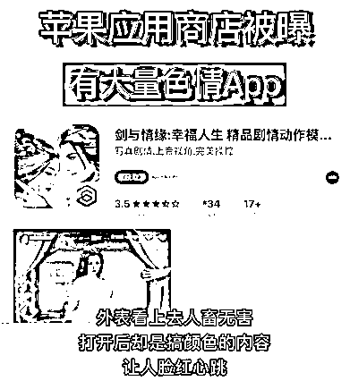

相信很多用户都知道，苹果应用商店有很多套着马甲的 APP，比如很多电影 APP，由于版权问题无法正常上架，那么就套一个壳，APP 名称和图片看似正常，打开后却是另外一种内容。

不巧的是，这个套壳技术早就被一些搞颜色的人给利用了，搞得现在一些 APP 直接出现了带色内容，****这让小编脸红心跳。

这些 APP 的存在，难道苹果官方就不知道吗？因为 APP 上架苹果应用市场是需要经过严格的审核，其实，这些不良内容 App 之所以存在，和苹果官方审核有着很大关系。他们正是利用苹果生态的各种漏洞，为它们制造了生存空间。 

这些颜色的 App，无疑可能危害到青少年儿童，出现这些搞颜色应用后，还能让人放心使用吗？

***01***

**** 搞颜色的“**伪 B 站**”****

****在苹果应用商店，******小编发现一款名叫“Small fat answer”的 App，不论从名字还是简介来看，都是个答题类的小游戏；但是下载打开后，却发现这个 App 里的内容，真 TM“黄”。打开 App，时长 5 秒钟的开屏广告，就让小伙伴瞬间脸红。******

******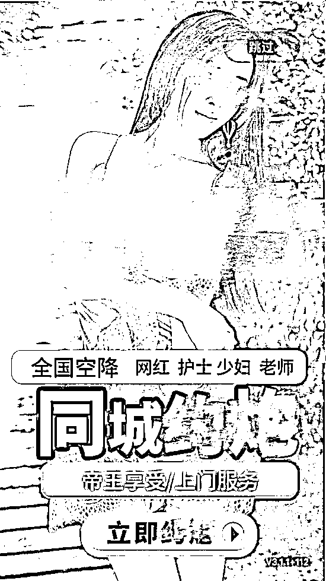******

******等进入软件，马甲名字不见了，露出软件的真名“逼哩逼哩”，这个 App 从名字到 UI，都和 B 站高度相似，简直就是个搞颜色的“伪 B 站”。******

******在其主页，各种小电影、约会信息遍布，喜欢飙车的老司机，立刻就上了高速。******

******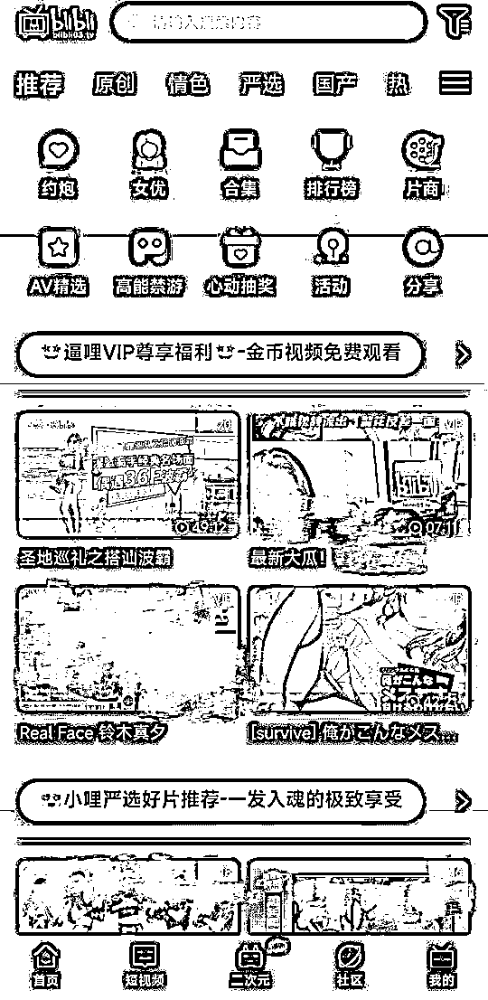******

******更为离谱的是，在这款 App 中，还出现了“大白”题材的小电影****** 

******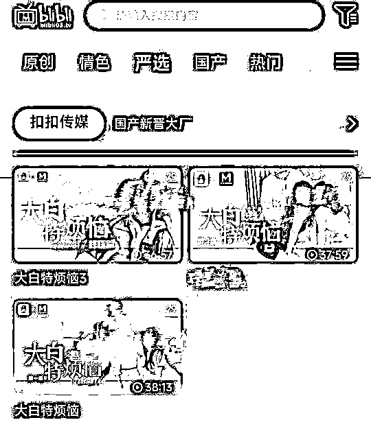******

******当小编打算一起对这款 App 进行批判时，进入苹果应用商店后，却发现这款真名“逼哩逼哩”的 App，早已换了马甲。曾经的秘密通道入口，变成了另一组英文字母，如果不是同道中人，很难发现其中蹊跷。******

*********02*********

**********不仅能看还能约？**********

**********一款名叫“91 短视频”的 App，在页面交互上高度模仿抖音，但里面的内容，却全都是少儿不宜的视频。**********

**********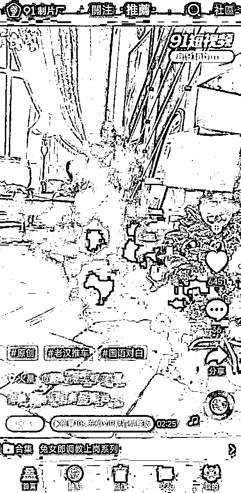**********

**********在这款 App 中，用户只需动动手指、向上滑动，就能看到一段段几十秒的颜色短视频，而想要对视频内容，进行深入了解的话，就需要发挥自己的“钞能力”，充值 VIP 会员了。**********

**********同时，这款 App 为了防止被下架，还在应用内放上了二维码，只要扫码下载 App，无数老司机们，就不至于“迷失了回家的路”。**********

**********除了这些光明正大的搞颜色 App，苹果应用商城里，还有一些擦边球 App，用充满暗示的词汇，吸引着不明真相的老实人。**********

**********比如，苹果应用商店中，一款 App 名叫“luo 聊直播交友”，不仅名字起的耐人寻味，图标也非常羞耻。**********

**********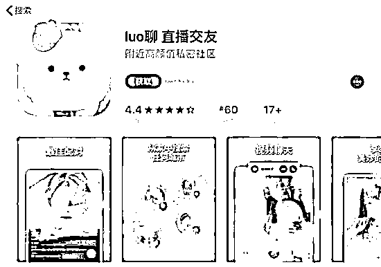**********

**********比如，一款 App 名叫“按个陌”，其推广文案中特意标注：同城上门泡约单平台，让人浮想联翩。**********

**********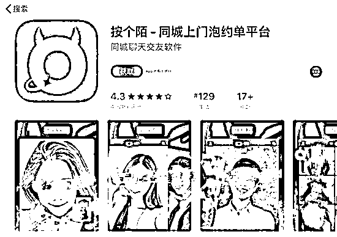**********

**********注册这两款 App 后，发现它们的套路极为相似，都是利用人类的原始交友欲望，来诱导你付费充值。至于充值后的效果如何，似乎就“谁用谁知道了”。**********

**********在苹果的游戏应用中，类似的擦边球同样层出不穷。一款名叫“剑与情缘”的游戏，不仅宣传图片十分“辣眼睛”，开发者还在其宣传文案中写道：高能刺激，老司机准备好了吗？**********

**********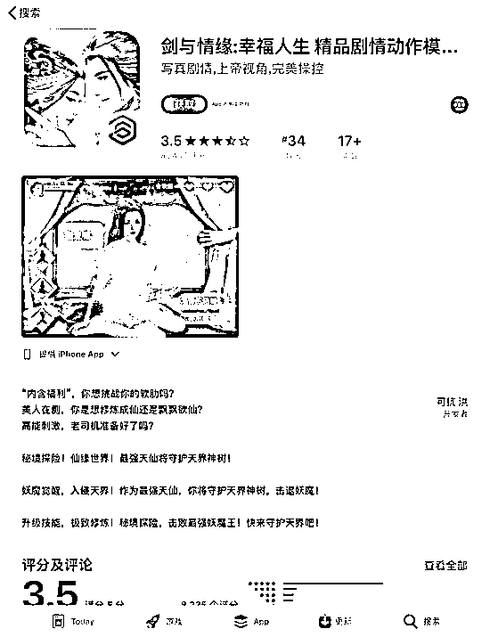**********

**********而另一款号称拥有元宇宙剧情的游戏“三生三世”，则在宣传文案中提醒玩家要“谨慎上车”，并留下了一组含有“高能福利”的神秘代码。**********

**********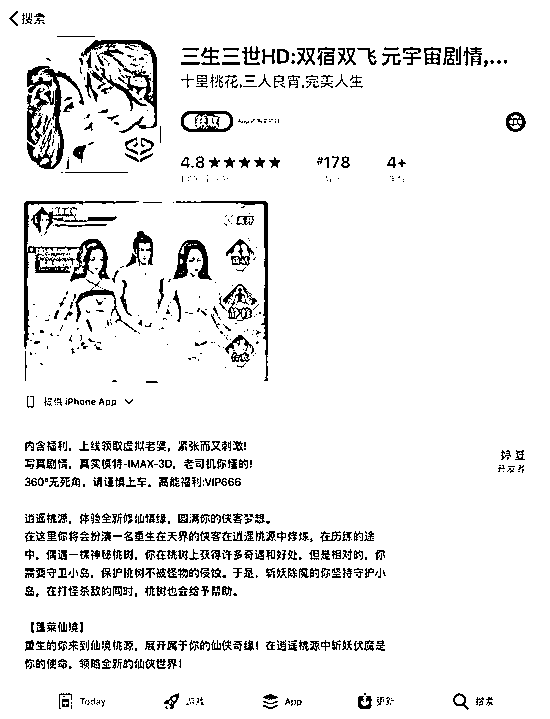**********

*************03*************

************如何能通过苹果审核？************

************一款 App 在正式登陆苹果应用商店前，需要通过苹果的官方审核。但是，很多不良应用的开发者，在提交审核的初版 App 中，并不会加入违规内容，而是等到应用上架后，再对 App 进行更新迭代，露出其本来面目。************ 

************靠着这招“偷天换日”，很多原本无法过审的 App，顺利地出现在苹果 App Store 中。************

************在苹果应用商店中，有个名叫“**Test Flight**”的 App，是开发者在苹果正式审核前，发布的测试版应用集中地。************

**********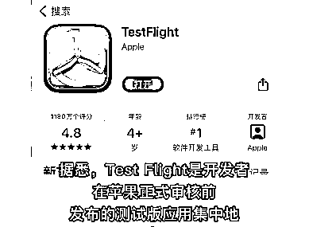**********

**********由于测试版应用，本身就没有进行审核，因此很多搞颜色的 App，都选择在这里进行发布，为自己做推广。**********

*************04*************

**************苹果阻止色情 APP**************

************实际上，在消灭色情 App 这件事上，苹果做出了诸多努力。************ 

************初期面对 App，采取了“分级机制”。************

************不仅标明了适用年龄，还会在用户下载时弹出警告。************

************************

************可是这种举措，根本无法阻止色情 App 的滋生，开发者照常上架，用户仍下载无阻。************

************不仅影响了苹果的口碑，还遭到了大量用户的举报，以至于引起了相关部门的重视。************

************当时曾有消息传出，苹果由于应用商店存在涉黄的情况，有可能被封禁。************

************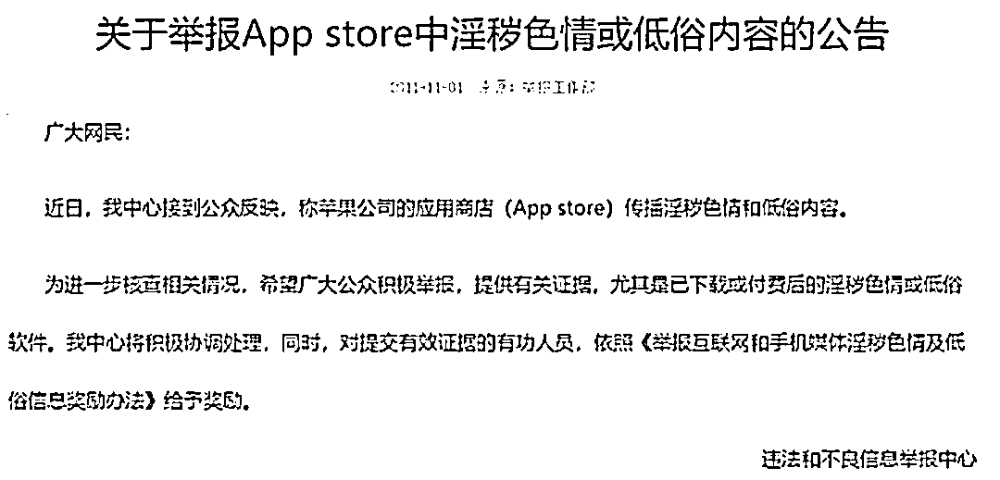************

************后来，苹果下定决心，和色情 App 不共戴天。************

************一方面，提高审核的标准，在审核阶段拒绝所有存在色情内容的 App 上架。************

************另一方面，但凡是用户举报有涉及色情内容的 App，就会直接下架。************

************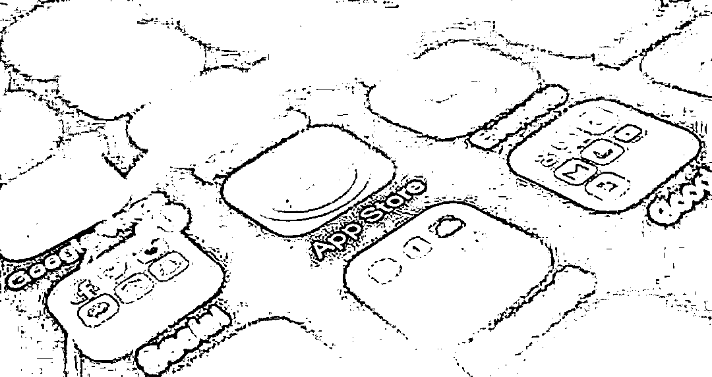************

************在苹果的雷霆手段之下，许多色情 App 确实偃旗息鼓了。************

************可是道高一尺、魔高一丈，没多久又卷土重来了，即便审核政策再严格，也总有人能想出对策。************

************因为上架此类 App，通过诱导用户消费，会获得巨额的利益；有了利益的驱使，就永远有人会动歪心思，想要杜绝基本是不可能的事情。************

************来源：大 R 说安全************ 

************************************************

************← 向右滑动与灰产圈互动交流 →************

************************