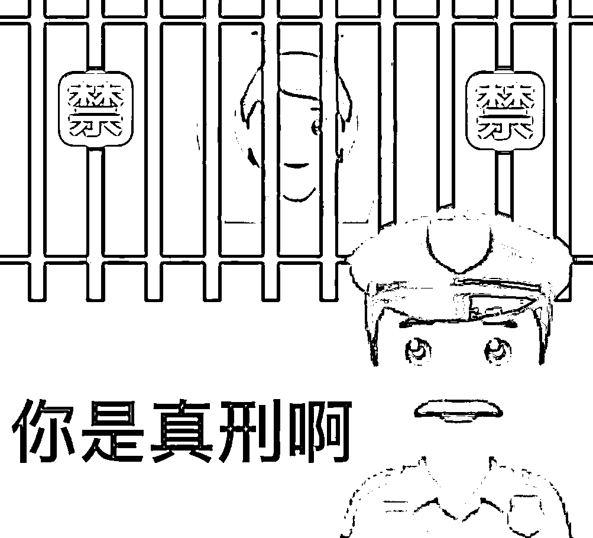
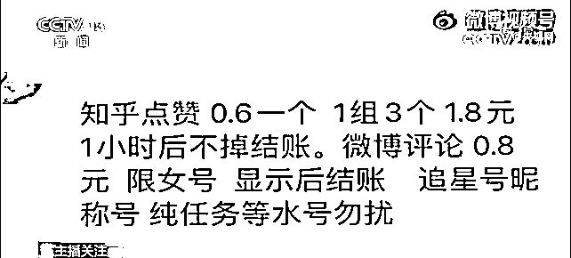
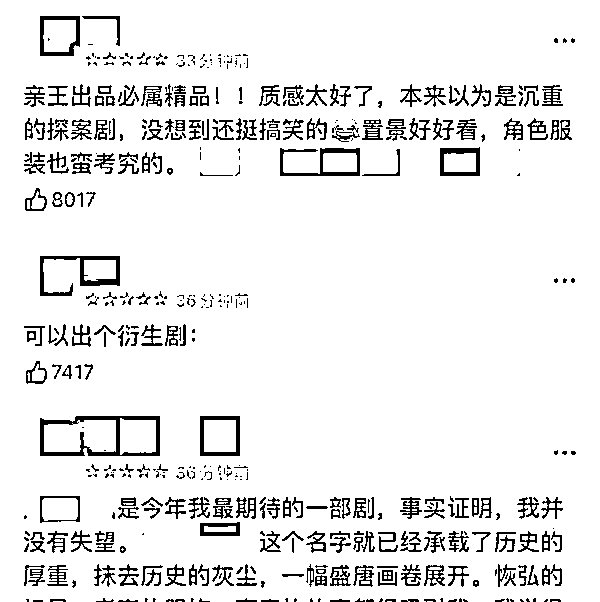
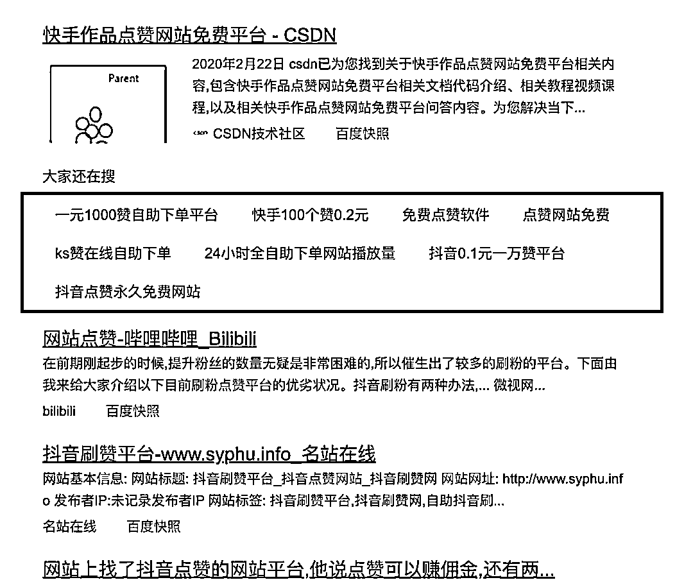
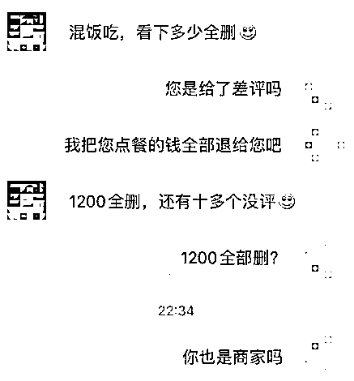
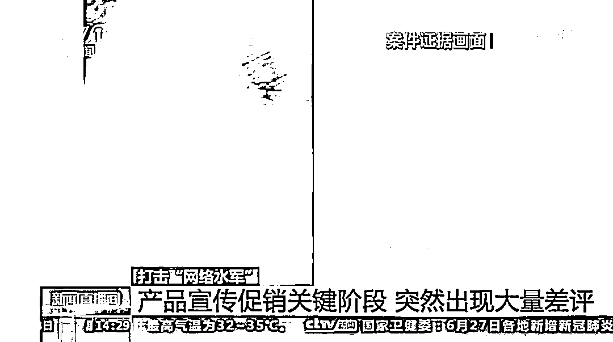
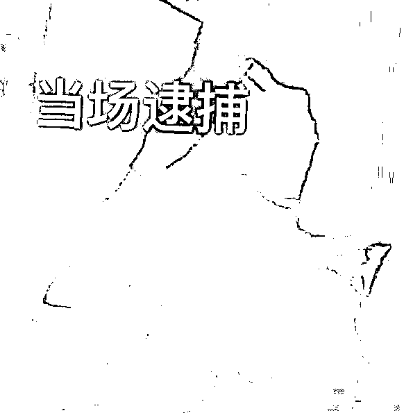
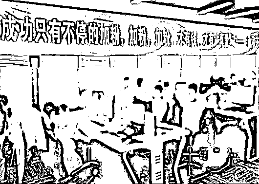
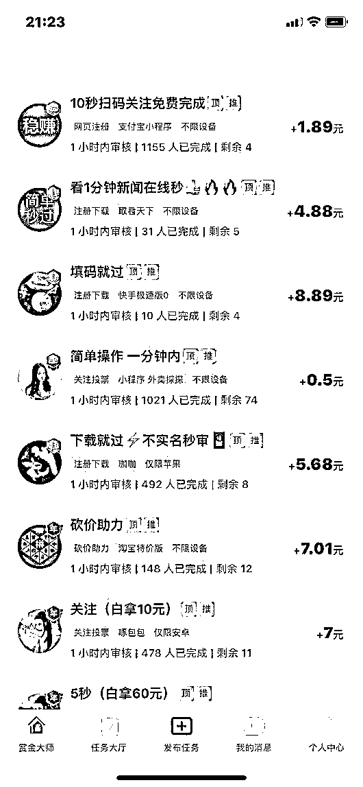

# 水军控评？你是真刑啊

> 原文：[`mp.weixin.qq.com/s?__biz=MzIyMDYwMTk0Mw==&mid=2247541006&idx=5&sn=4c88402045d1671c70a7fca84fa15f9f&chksm=97cbea36a0bc6320e6dc90d1cd4df74ab1683e797b40be11510245f1056acaa1fa13cbd6de0b&scene=27#wechat_redirect`](http://mp.weixin.qq.com/s?__biz=MzIyMDYwMTk0Mw==&mid=2247541006&idx=5&sn=4c88402045d1671c70a7fca84fa15f9f&chksm=97cbea36a0bc6320e6dc90d1cd4df74ab1683e797b40be11510245f1056acaa1fa13cbd6de0b&scene=27#wechat_redirect)

**一个人的心理防线是**如何快速被击垮的**？**

可能垮于一句句恶评，一次网暴。

**那么一个企业又是**如何快速被击垮的**？**

可能垮于一次负面新闻，一堆炮制的差评。

这些都是水军的“常规操作”。

互联网时代，“水军”已经成为不能回避的乱象。

网络水军之所以称为“军”，就因为其运作通常有一个明显的特征：**人数众多，涉及的范围相当广泛。**

**一些派单任务动辄会动用几百、上千人，它们在网络上制造了大量的虚假跟帖、评论，形成流量泡沫。**

**有偿删帖、捧人造势、刷量、控评......给钱什么都发，甚至借此敲诈勒索。**

****

**在网络水军的背后，往往潜藏**规模庞大、层层分发的黑灰产业链条**。**

**他们人员构成相对复杂，但是分工明确。**

**核心人员主要包括**网络公关公司**及其雇用的**“写手”**和**“水军”**。** 

**一般流程是：**

**这些网络公关公司**在各平台、黑论坛发布「有偿删帖」等信息**，甚至还会**将木马病毒植入网页**，刷新网页点击率以博取广告商“眼球”、招揽业务。**

**网络公关公司作为“网络水军”的幕后老板，**负责接受“客户”请求，策划组织网络炒作、有偿删帖等活动**。**

****

**△此前，央视曝光的网络水军派单群**

** ©“央视网”微信公众号**

**接到需求后的公关公司会先**组织“写手”做好内容库**，写手熟悉网民心理，专职撰写内容、**提供炒作素材**。**

**然后**组织“水军”去具体实施**。**

**水军的**上游**一般是**广告商、委托人、爆料人**，他们希望通过“水军”攻击炒作指定单位、人员，达到某些诉求。**

**水军的**下游**主要由**专业推手、小型非法网站运营者**和**知名网站“内鬼”**构成。主要通过各种手段协助“水军”删除、置顶帖文等，从中谋取非法利益。**

********

****按照作用，水军可分为「刷好评」与「炮制坏评」两类。**** 

****刷好评者目的多是为了标榜自己，增加美誉度，或者是为了**获得好看的流量数据**。****

**比如你在网上买东西，明明质量不行，但发现评价留言一致全是好评。**

**还有一些影视剧，可能还没有播出，一些虚假好评就提前占领了网络点评平台，堪称未卜先知了咱就是说。**

****

**△图源网络**

**这种“水军控评”的现象不只出现在影视剧评论区，**网店评价、直播间互动、明星社交平台评论区**等场景中，“控评”现象也屡见不鲜。**

**基本上都是花钱买的。**

**比如在某度上检索**“点赞平台”**，会出来非常多的链接，显示可以帮助你在各大网络平台都可以刷高流量。**

****

**小珊发现，他们刷量的具体操作方式主要可以分为两种：**

**一是**利用“网赚”类 APP 收集闲散用户流量**。例如在一些 APP 上，用户按照要求进行转评赞操作，便可获取一定的积分报酬，完成代刷业务，赚取差价。**

**二是**利用技术模拟人工操作，进行批量转评赞**，较为常见的是群控软件。**

****还有一类就是职业差评了。****

****他们要么是竞争对手付费，去恶意诋毁一个品牌或者一个人的声誉，要么就是利用差评威胁勒索，获取报酬。****

****

**为勒索钱财的差评师们，要价金额小到 800，大则几千。**

****

**△图源网络**

**被雇佣的差评师则常见于市场恶性竞争中。**

**前不久，央视就报道了某企业遭到职业差评师攻击的现象。** 

****

**每到大促节点，该企业某产品都会在各大平台出现批量的差评内容。**

**老板对比发现，评论内容的图文有 80%的相似度。**

****

**所以，这明显是一场“水军”有组织的有偿发帖活动，其背后有一条黑灰产利益链条支撑。**

**在此，小珊想要郑重提醒所有刷评的水军**，****刷评是要被判刑的。****

**根据《刑法》及《最高人民法院、最高人民检察院关于办理敲诈勒索刑事案件适用法律若干问题的解释》相关规定：**

## 

**敲诈勒索公私财物数额较大（财物价值二千元至五千元以上），或多次敲诈勒索（二年内敲诈勒索三次以上），处三年以下有期徒刑、拘役或者管制，并处或者单处罚金；敲诈勒索公私财物数额巨大（财物价值三万元至十万元以上）或有其他严重情节，处三年以上十年以下有期徒刑，并处罚金；敲诈勒索公私财物数额特别巨大（财物价值三十万元至五十万元以上）或有其他特别严重情节，处十年以上有期徒刑，并处罚金。**

**“职业差评师”通常对多家商家实施敲诈勒索行为，如果多家敲诈勒索累计金额达到敲诈勒索财物数额较大的起刑标准，且符合多次敲诈勒索的情形，则构**「敲诈勒索罪」**。**

****

**近年来，公安部组织各地公安机关重拳出击，依法深入开展侦查调查，成功侦破多起“网络水军”团伙犯罪案件。**

****

**上图为 2020 年 11 月侦破的公安部督办的一起自媒体“网络水军”专案现场，涉案团伙在办公区域张贴刷量标语。**

****

**△广州警方提供的手机截图**

**内容是某下单平台 APP 上发布的刷单任务及价格**

**另外，为进一步遏制“网络水军”及相关黑灰产业的滋生蔓延趋势，维护网络生态、市场经济秩序和广大人民群众合法权益，公安部网安局自今年 6 月 26 日起在全国范围内启动**为期 6 个月的依法打击整治“网络水军”专项工作**。**

**作为网络空间的使用者和参与者，普通网民一定要时刻擦亮自己的眼睛，谨防被有心之人坑害，尤其是现在**正值暑期，想要兼职的学生要提高辨别能力，不要成为网络水军的工具人。****

**网络不是法外之地，如发现水军控评现象，可搜索“互联网违法和不良信息举报中心”，查询相应举报渠道，向网信部门提供线索，共同维护健康网络生态。**

**来源：微信珊瑚安全，利箭在行动**

********

**← 向右滑动与灰产圈互动交流 →**

****