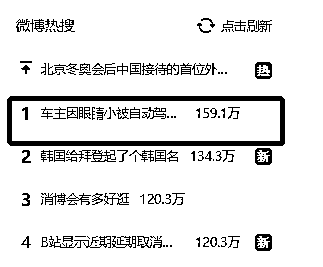
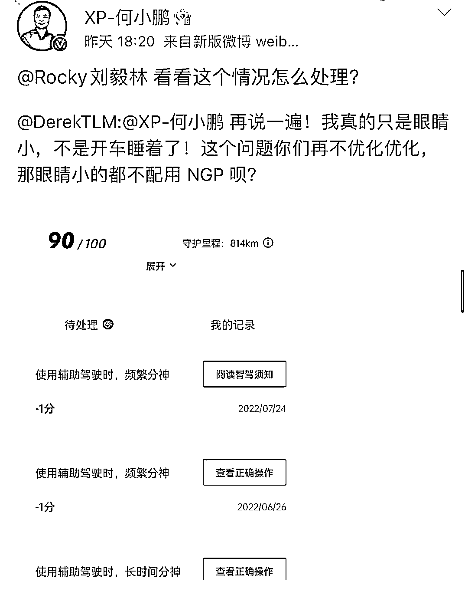
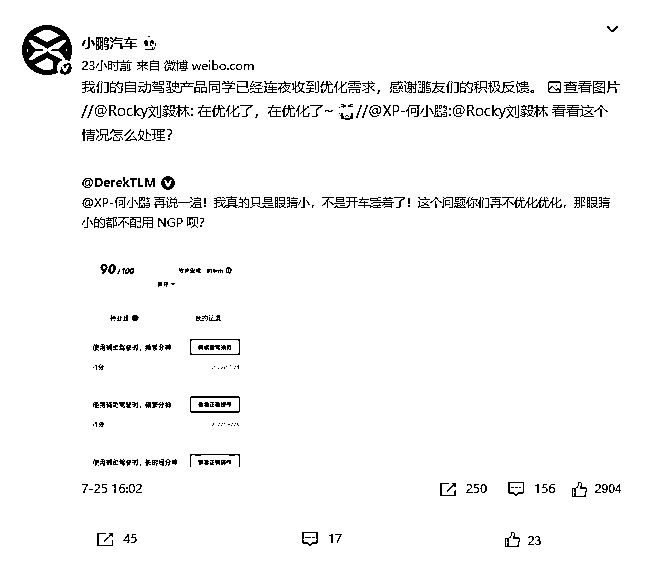
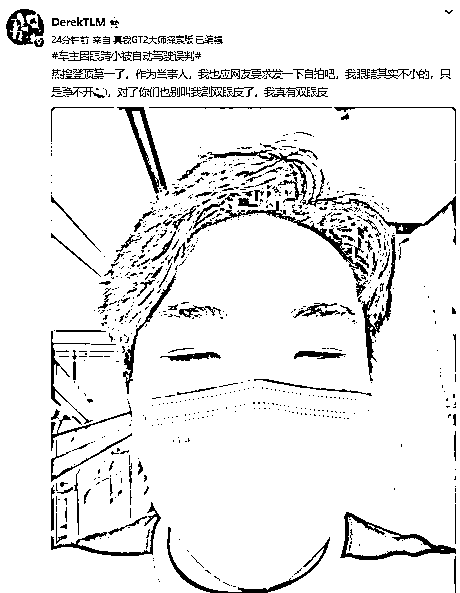
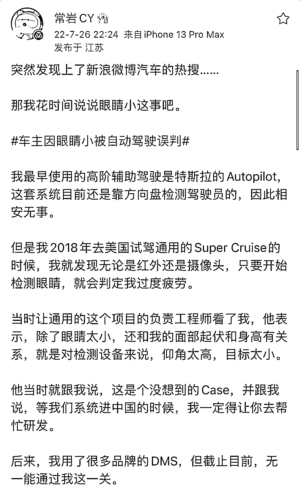
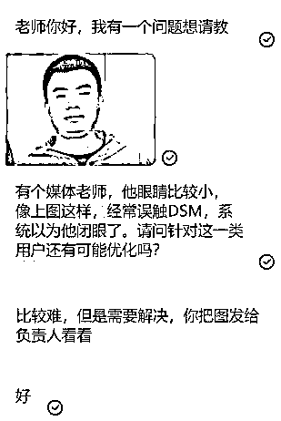

# 惊呆！车主因眼睛小被辅助驾驶误判为开车睡觉，何小鹏亲自回应！

> 原文：[`mp.weixin.qq.com/s?__biz=MzIyMDYwMTk0Mw==&mid=2247541006&idx=6&sn=bfc84cd9cd13e7ced228f5ebe468a6aa&chksm=97cbea36a0bc6320f60352c635d8b9078ab1765c8d22309dfb9c7a5398fc32bc8e027c2a3d51&scene=27#wechat_redirect`](http://mp.weixin.qq.com/s?__biz=MzIyMDYwMTk0Mw==&mid=2247541006&idx=6&sn=bfc84cd9cd13e7ced228f5ebe468a6aa&chksm=97cbea36a0bc6320f60352c635d8b9078ab1765c8d22309dfb9c7a5398fc32bc8e027c2a3d51&scene=27#wechat_redirect)

7 月 27 日，一则“车主因眼睛小被自动驾驶误判”的话题登顶热搜第一。

事情是这样的，近日，一位汽车博主（微博名为“DerekTLM”）表示，**他在驾驶小鹏汽车，使用小鹏辅助驾驶功能的时候，因为自己的眼睛比较小，所以被系统判定为“开车睡觉”**，从而被扣除了智驾分。 

据了解，“智驾分”是小鹏汽车根据是否脱手、是否及时接管、是否疲劳驾驶、是否分神等 4 个指标判断用户是否正确使用智能辅助驾驶功能。由于这位博主眼睛小，小鹏汽车认定他开车睡觉，因此认为他使用辅助驾驶时，“频繁分神”、“长时间分神”，从而分别在 6 月、7 月分别扣过 3 次，共计 4 分的智驾分。

同时，该博主还发文@小鹏汽车创始人何小鹏称：“我真的只是眼睛小不是开车睡着了，小鹏汽车的辅助驾驶功能需要优化，否则岂不是眼睛小的人都不能用 NGP 呗？”

图片来源：新浪微博

随后，**小鹏汽车董事长兼 CEO 何小鹏特别@小鹏汽车互联网中心副总经理刘毅林，要求处理该问题**。刘毅林立刻回复，在优化了。同时小鹏汽车官方微博也回应称，**自动驾驶产品同学连夜收到优化需求**。

图片来源：新浪微博

此后，该博主回应称，作为当事人，我也应网友要求发一下自拍吧，**我眼睛其实不小的，只是睁不开**，对了你们也别叫我割双眼皮了，我真有双眼皮。

对此，有网友评论称：“眼小不配开智能汽车吗？”“心疼但有点好笑。”“突然想到李荣浩，李荣浩表示有被冒犯到……”“要不开个眼角试试？”“伤害性不大，侮辱性极强。”

# **智能汽车误判小眼睛人士为闭眼**

# **情况不在少数**

值得注意的是，智能汽车误判小眼睛人士为闭眼的情况不在少数，此前另一位汽车博主（微博名为“常岩 CY”）也表达过自己的类似困扰。该博主发帖称，**他因为眼睛小触发过很多汽车品牌辅助驾驶系统的实时警告。通用汽车的 Super Cruise 会判定他过度疲劳；岚图 FREE 会在冬天为了让他别困打开冷风；蔚来 ET7 认定他开车疲劳和走神……**

图片来源：新浪微博

据了解，上述汽车品牌辅助驾驶系统是通过车内的摄像头或红外装置等，对驾驶员进行进行疲劳、分神以及危险驾驶行为的监测。**当驾驶员出现异常驾驶行为时，实时警报和视频上传**。

其工作原理是，其通过单一视觉对驾驶员面部特征抓取以进行判断。**通过驾驶员面部特征将眼睛睁闭程度、嘴巴张合程度进行量化指标的分级，从而进行驾驶员疲劳驾驶与分神驾驶的判断**。不过，该系统尴尬之处在于，**由于驾驶员的眼睛大小、身高、面部起伏等方面有差异，该系统或出现误判**。

值得一提的是，在上述博主说明情况后不少车企也进行了快速的反应。7 月 26 日，在小鹏汽车回应微博名为“DerekTLM”的博主之后，**蔚来也连夜成立研究小组，专门以微博名为“常岩 CY”的博主为研究对象，以对小眼睛车主所遇到的问题进行优化**。

# **车载 DMS 应用**

# ****仍处于早期阶段****

****据红星新闻，车载 DMS 主要是对驾驶进行疲劳、分神以及危险驾驶行为的监测。当出现异常驾驶行为时，实时警报和视频上传。****

****目前的主流感知方案是视觉感知为主，其它信息为辅。例如在方向盘、A 柱或内后视镜上安装摄像头，来监测驾驶员的状态。红外摄像头和红外补光灯可在夜间甚至驾驶员戴墨镜时有效检测驾驶员状态。****

****当前主流的方式多以通过单一视觉对驾驶员面部特征抓取以进行判断。通过驾驶员面部特征将眼睛睁闭程度、嘴巴张合程度进行量化指标的分级，从而进行驾驶员疲劳驾驶与分神驾驶的判断。再搭配上检测驾驶员手部是否放在方向盘上的扭矩传感器和电容式 HOD 传感器，以及车辆状态参数融合检测。****

****有业内人士指出，“DMS 的算法有一套判断规则，**其中之一是根据眼睛闭合到一定程度的时间比例，当闭合多的时候就判断为瞌睡。但这套方法对小眼睛司机无效，这也是这位汽车博主总是被 DMS 判定为疲劳驾驶的原因**。当前没有行业统一的量化指标与判断标准，而是 DMS 供应商和车企自己标注与判断。”****

******车载 DMS 应用在国内乘用车市场仍处于早期阶段**。高工智能汽车研究院监测数据显示，2021 年，标配有 DMS 的中国乘用车（不含进出口）新车上险量为 54.33 万辆，搭载率为 2.66%，但同比增速达 228.87%。随着 3D 成像、光学镜头、红外摄像等视觉技术，以及 AI 算法的广泛应用，DMS 功能在辅助驾驶行业的发展助推下，实现持续的增长。****

****亿欧汽车分析师李浩诚指出，随着整车智能化的深入发展，L2+及以上的高等级智能驾驶功能加速上车。当前“人机共驾”阶段，疲劳驾驶、驾驶分神、激进驾驶等主观因素已经成为公路事故和死亡的主要原因，占比高达 37%。而造成这种情况的主要原因是，当前“人机共驾阶段”大多数驾驶操作还是需要驾驶员亲自完成，因此确保驾驶员可以随时接管车辆便成了避免交通事故发生的重要解决方案，这也正是 DMS 功能所扮演的角色。****

****目前已经有部分 AI 算法企业在尝试将车载 DMS 与智能座舱域、智能驾驶域以及智能交互功能的融合。中科创达（300496.SZ）创始人赵鸿飞认为，“车载 DMS 应该成为座舱域、自驾域、车控域以及人机交互的策略中枢。”****

****来源：每日经济新闻  ****

****************

****← 向右滑动与灰产圈互动交流 →****

********