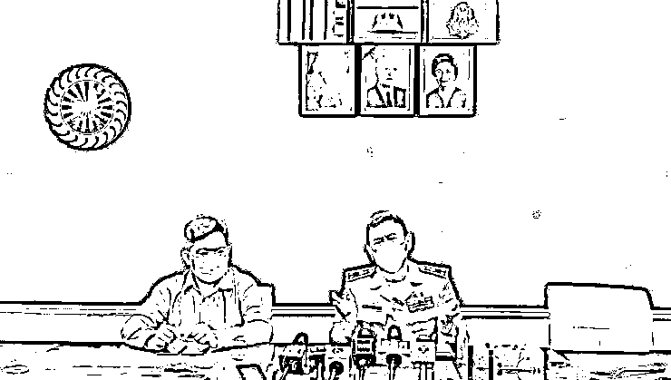
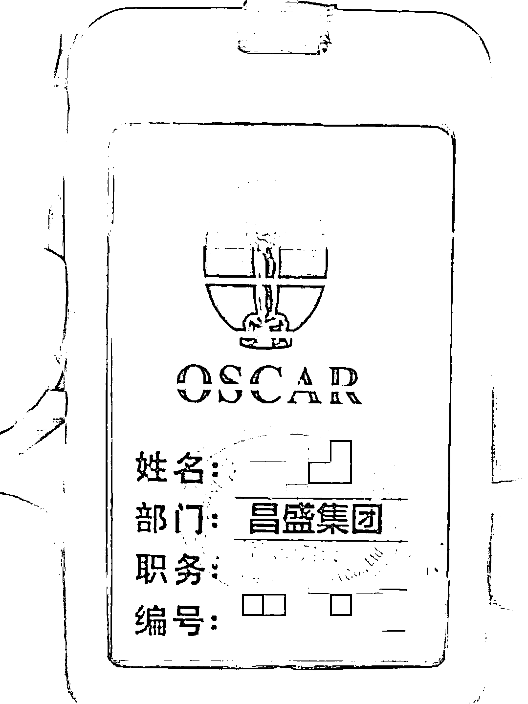
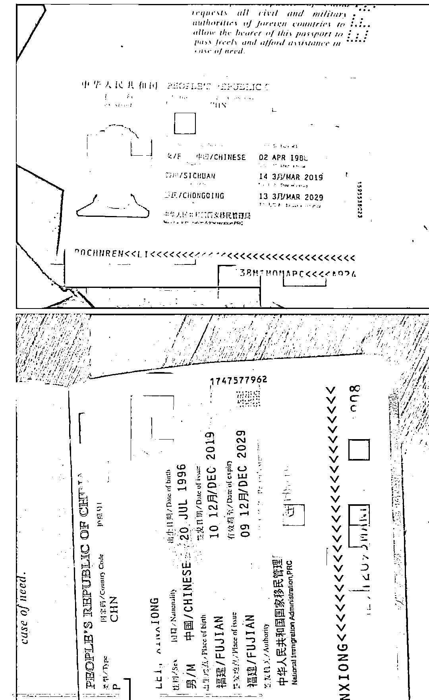
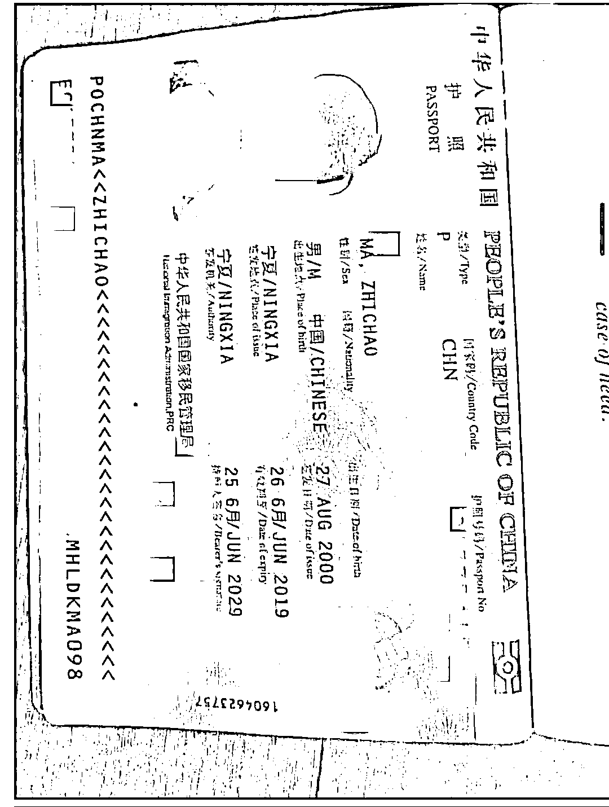
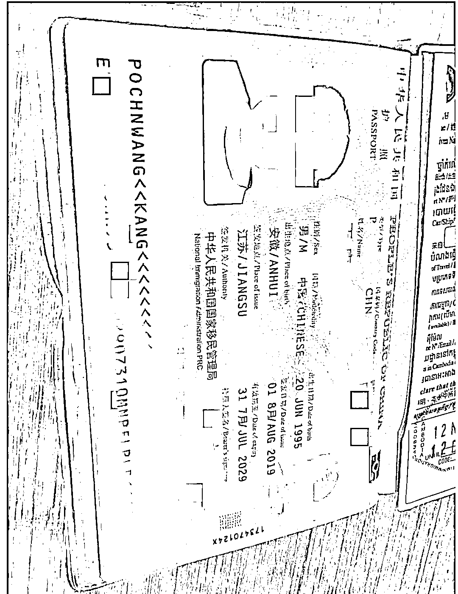
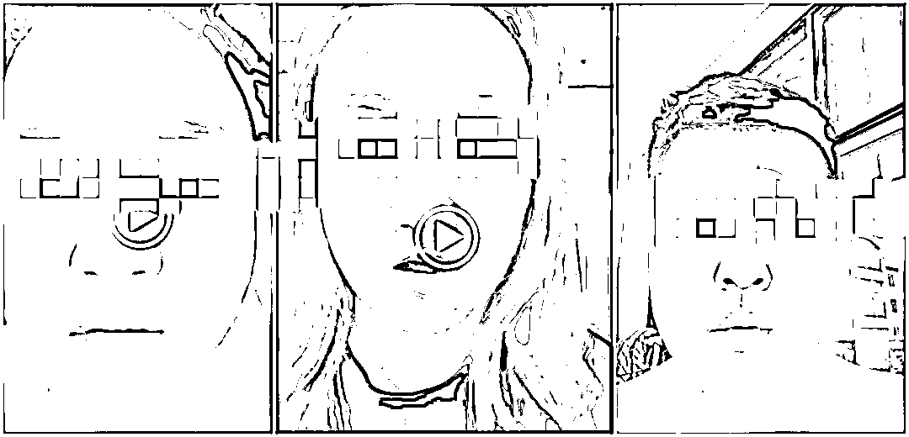
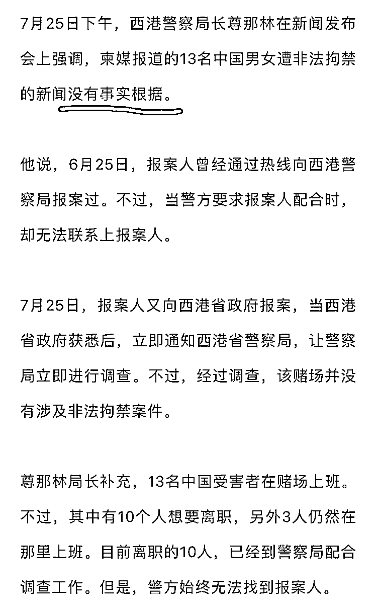

# 13 名中国人被非法拘禁？西港警方：没有事实依据。13 人求救视频都不是依据？

> 原文：[`mp.weixin.qq.com/s?__biz=MzIyMDYwMTk0Mw==&mid=2247541077&idx=2&sn=1cbb8f251abc111c1a04c1109254eed8&chksm=97cbea6da0bc637bc3a13d82db1fb1b99d431361b57490693edbc326257c4de587dd064e781f&scene=27#wechat_redirect`](http://mp.weixin.qq.com/s?__biz=MzIyMDYwMTk0Mw==&mid=2247541077&idx=2&sn=1cbb8f251abc111c1a04c1109254eed8&chksm=97cbea6da0bc637bc3a13d82db1fb1b99d431361b57490693edbc326257c4de587dd064e781f&scene=27#wechat_redirect)

7 月 25 日柬媒曝出 13 名中国人被西港诈骗园区非法拘禁后，当晚西港省政府及警方召开新闻发布会，对此事做出回应。 

25 日晚发布会 

西港省政府发言人倩比伦及西港省警察局局长尊那林 25 日晚召集一部分柬文媒体记者，就该事件召开发布会。

 尊那林表示，警方认为该案件并不是非法拘禁。西港警方共收到两次报案，第一次是在 6 月 25 日，受害者通过热线电话报警，谎称自己被非法拘禁，但警方到达该园区后没找到拨打求救电话的受害者。

第二次是最近报案人向西港省政府报案，在省长指示下，警方派同一批警员前往该园区，这次警方找到了受害者。

找到受害者后，其中一些人表示想要离开该园区。最终 10 名受害者跟警方离开，目前在西港警察局。另 3 名受害者称自己有稳定的收入，不想离开。尊那林认为该案件来龙去脉比较复杂，但并不是非法拘禁。 

尊那林表示，警方作为执法人员接到所有报案后都会处理，但需要见到所有报案人，第二次报案的报案人现在警方还没见到，警方还在等报案人来警察局接受调查。 

求救人的工作牌 

警方目前要求 10 名受害者及报案人配合警方调查，但未提及是否将该园区人员带至警察局配合调查。 

西港省政府发言人倩比伦强调，西港省政府对于所有报案都会处理，不管报案人是本地居民还是外国游客，省政府都会要求警方前往事发地进行调查，报案人可去警察局报案，也可通过热线电话报案。 

13 名中国求救人部分护照截图 

据柬媒 NokorWat 新闻昨日公布的 11 名受害者录制的求救视频显示，求救者表示自己等 13 人被困在西港某园区，希望获得救助。 

受害者求救视频截图 

由于有视频又有真实的护照照片，该事件曝光后，引发舆论的广泛关注。

有在柬同胞表示，10 个人被救出来了，不容易。 

[`mp.weixin.qq.com/mp/readtemplate?t=pages/video_player_tmpl&action=mpvideo&auto=0&vid=wxv_2503794866565398528`](https://mp.weixin.qq.com/mp/readtemplate?t=pages/video_player_tmpl&action=mpvideo&auto=0&vid=wxv_2503794866565398528)

[`mp.weixin.qq.com/mp/readtemplate?t=pages/video_player_tmpl&action=mpvideo&auto=0&vid=wxv_2503796495733735427`](https://mp.weixin.qq.com/mp/readtemplate?t=pages/video_player_tmpl&action=mpvideo&auto=0&vid=wxv_2503796495733735427)

[`mp.weixin.qq.com/mp/readtemplate?t=pages/video_player_tmpl&action=mpvideo&auto=0&vid=wxv_2503798082690596865`](https://mp.weixin.qq.com/mp/readtemplate?t=pages/video_player_tmpl&action=mpvideo&auto=0&vid=wxv_2503798082690596865)

[`mp.weixin.qq.com/mp/readtemplate?t=pages/video_player_tmpl&action=mpvideo&auto=0&vid=wxv_2503795836674359300`](https://mp.weixin.qq.com/mp/readtemplate?t=pages/video_player_tmpl&action=mpvideo&auto=0&vid=wxv_2503795836674359300)

13 名被困诈骗园区的部分求救视频，共 13 人求救视频。 

也有在柬同胞质疑，为什么都是同一批警察，第一次报案没找到人并说报案人撒谎，而第二次媒体曝光、省长介入后，就找到人了？ 

还有人质疑警方结论，如果不是被非法拘禁，为什么警察到场后 10 个人要离开？“如果不是强迫，谁会放着好好的工作不做跟警察走？”

一名曾从园区救受害者出去的救援志愿者表示，“如果在园区求救后警方来查，一定要坚持说真话不要改口，像那 10 个人就可以获救。如果被威胁后改口或者撤诉，就会像那 3 个人一样出不来了。” 

柬埔寨中文媒体截图

13 名中国公民在柬埔寨实名求救，在柬埔寨本地媒体上发布了 13 人的护照和签证以及本人照片，并且全部拍摄了求救视频，这样的群体性求救事件引起了巨大反响，但是，13 名中国公民发出的求救视频，仍然被西港警方认定为没有事实根据。 

 我们看不懂警方这个结论，真心看不懂，相信有很多人都看不懂，为什么 13 名中国公民拼了性命发布真实身份，并且拍摄本人求救视频，仍然被认定是没有事实依据呢？

这 13 人就在诈骗园区里被警方解救出来的，如果他们可以自由离开诈骗园区，那他们 13 人为何会冒着生命危险发出求救视频呢，这确实解释不通，你可以说一个人发布了虚假言论，说是不实信息，可是，这是 13 个人同时发出求救，而且，他们确实被困园区，是警方从诈骗园区里解救出来的。

警方说 13 人没有被非法拘禁和虐待，也没有被勒索，那这 13 人为什么要共同录视频发求救？

那这到底算什么呢，我估计大家已经清楚了。

来源：柬埔寨媒体，阿龙闯荡记

← 向右滑动与灰产圈互动交流 →

