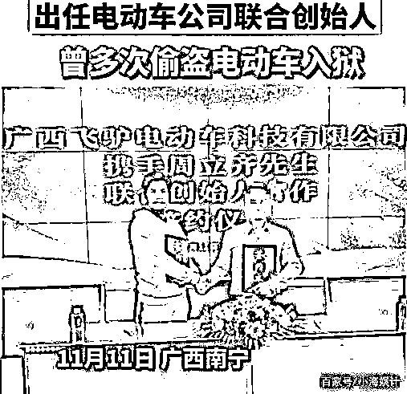

# “窃格瓦拉”还是得打工？出狱后当老板接连翻车……

> 原文：[`mp.weixin.qq.com/s?__biz=MzIyMDYwMTk0Mw==&mid=2247541077&idx=3&sn=8169d09ea4b8c8d923ed5ec3e1e8afdc&chksm=97cbea6da0bc637bcce77d25ab70268cd3c6fb7468d5f7e809ab74a074de97186a9bed79f30c&scene=27#wechat_redirect`](http://mp.weixin.qq.com/s?__biz=MzIyMDYwMTk0Mw==&mid=2247541077&idx=3&sn=8169d09ea4b8c8d923ed5ec3e1e8afdc&chksm=97cbea6da0bc637bcce77d25ab70268cd3c6fb7468d5f7e809ab74a074de97186a9bed79f30c&scene=27#wechat_redirect)

不知道最近，大家有没有关注网红“窃·格瓦拉”周立齐的最新消息。

哎？提到周立齐这个名字，可能很多人并不清楚他是谁。

但下面这张图，以及“这辈子不可能打工”的“至理名言”，大家一定知道。 

图片来源：@网易视频

咱言归正传，最近‍有消息称，他在南宁开业 8 个月的**“周某烤吧”**要转让了。 

图片来源：@新浪热点

网红开店不应该很火爆吗，为啥还干不下去，要转让呢？

至于原因，鸭鸭在找资料的时候发现，“周某烤吧”在大众点评 App 中的评分并不高，只有 3.4 分。 

不少到店就餐的网友表示：

**“环境差，上菜慢，价格贵。”**

图片来源：大众点评

而且，在时代财经的报道中，周围商家称： 

**“最初一两个月，一到晚上就能坐满人。但此后，店里经常只有零零散散几桌人。”** 

图片来源：@时代财经

嗐，顾客消费体验较差，加上网红效应减弱，自然生意大不如前。

值得一提的是，除了自己开的“周某烤吧”要转让，周立齐曾投资的“忘情水鱼头火锅店”也早已停业。

图片来源：@时代财经、大众点评 App

可能不少人和鸭鸭一样好奇，**说出“这辈子都不可能打工”的周立齐，是如何实现自己的夙愿，当上烧烤店大老板的？** 

这要从 2020 年 4 月，周立齐出狱说起。

因为文章开头那段采访视频的爆火，周立齐刚出狱就收到 30 多家媒体公司的邀约。

甚至传闻某网红孵化基地开出**1500 万****的天价年薪**。

媒体公司在监狱门口等周立齐

图片来源：@人物故事品鉴

然而，周立齐并没有被天价年薪所打动（后证实 1500 万的年薪只是网红公司在炒作）。而是直奔老家，看望父母。 

周立齐直接坐上司法局的车，回家

图片来源：@时代财经

在老家的这些天，周立齐在邻居的帮助下开通了短视频账号，分享自己的农村生活，快手粉丝量一度高达 300 万。

在这期间，周立齐时常也会搞搞直播，可以说是他第一次创业。 

图片来源：@快手 App

但不久，他的短视频账号便被封禁了。 

据时代财经报道，被封禁原因可能是**外界关于周立齐的舆论风向发生变化，负面评价越来越多，平台不得不将其账号封禁。** 

图片来源：@时代财经

鸭鸭之前详细写过周立齐拍短视频这一事件，感兴趣的朋友可以戳蓝字查看：[《“窃格瓦拉”出狱后当网红，拍短视频遭网友怒喷：一个偷电瓶的也配？！》](http://mp.weixin.qq.com/s?__biz=MzIyMDYwMTk0Mw==&mid=2247504274&idx=1&sn=f6f46b07841813fd48b52642887b84e0&chksm=97cb1aaaa0bc93bc590ac513f23e8e1c65c46f2c42abb7a83486ca5b00688e47e1402d0a2dd6&scene=21#wechat_redirect)

网红之路走不成，周立齐开始了第二次创业。 

2020 年 11 月，他与广西飞驴电动车科技有限公司签署合作，成为了联合创始人。

图片来源：百家号/小海娱计

不过，当时周立齐在该公司并没有太多的股份。

也可能这并不是真正意义上的老板，没多久周立齐便“不干了”。

等时间到了 2021 年 11 月，便传来周立齐第三次创业——开烧烤店的消息。 

当地小有名气的网红都前来捧场。 

而这次，周立齐终于如愿以偿，当了一次名正言顺的大老板。

但目前看来，他的老板梦刚圆没多久，这第三次创业就要以失败告终。

不过鸭鸭觉得，希望他以后还是能够脚踏实地，不再去炒作自己以前的东西，靠自己的能力闯出新天地~

部分图片、资料来源：时代财经 “这辈子不可能打工”的周某当不好老板！火锅店停业，烧烤店 15 万转让 来源：躺倒鸭

← 向右滑动与灰产圈互动交流 →

