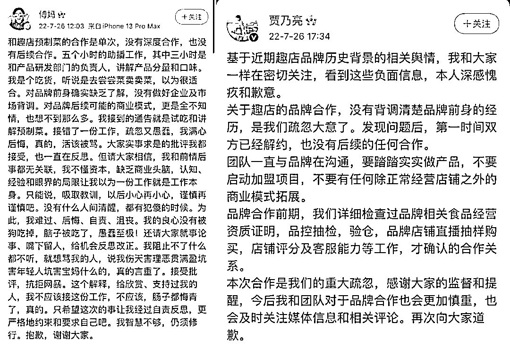
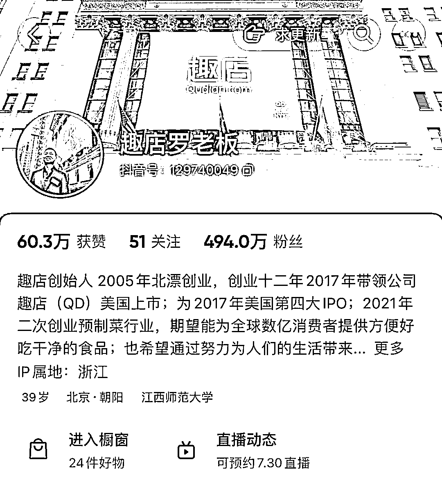
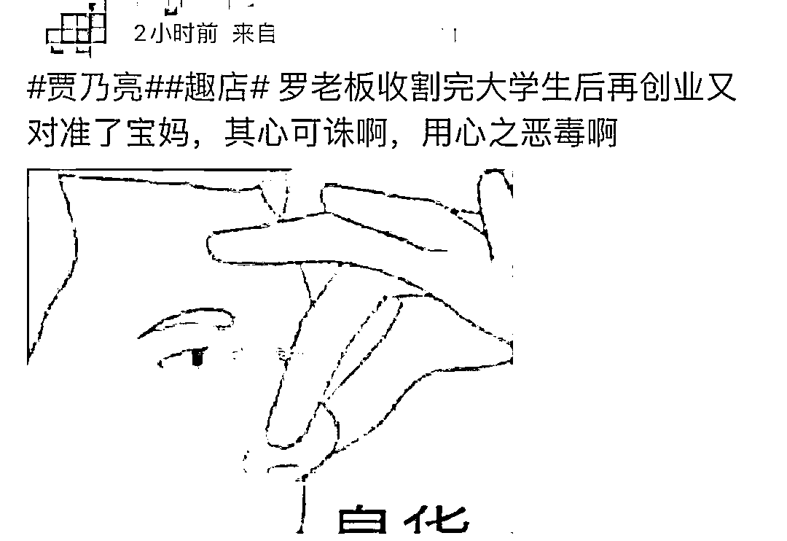
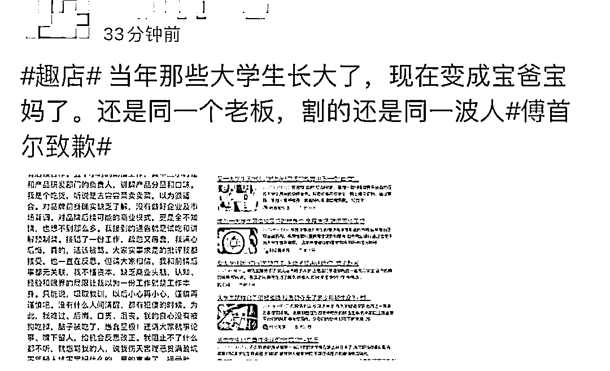
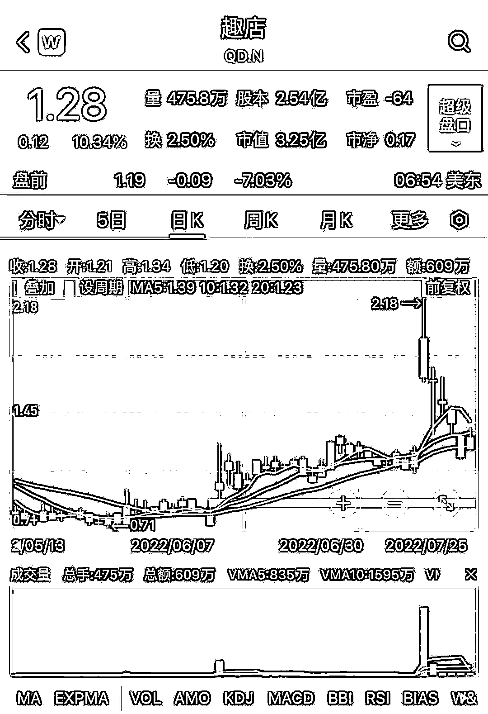

# 傅首尔、贾乃亮道歉！趣店被指“收割完大学生，又收割宝妈”

> 原文：[`mp.weixin.qq.com/s?__biz=MzIyMDYwMTk0Mw==&mid=2247541077&idx=6&sn=da360fb87dffa89440faad9942f95c9e&chksm=97cbea6da0bc637bf911b5a38240f2f7c2efbe9f8a7d6de2bfcd2f7eff0b1b92b729ad518256&scene=27#wechat_redirect`](http://mp.weixin.qq.com/s?__biz=MzIyMDYwMTk0Mw==&mid=2247541077&idx=6&sn=da360fb87dffa89440faad9942f95c9e&chksm=97cbea6da0bc637bf911b5a38240f2f7c2efbe9f8a7d6de2bfcd2f7eff0b1b92b729ad518256&scene=27#wechat_redirect)

曾靠校园贷起家的趣店近日靠直播卖菜火了，但也招来了大量网友的口水。以至于，与趣店合作的明星都急着出来“划清界限”。

7 月 26 日，参与趣店预制菜直播的《奇葩说》辩手傅首尔通过其微博账号“傅妈”致歉：“我接到的通告就是试吃和讲解预制菜。接错了一份工作，疏忽又愚蠢，我满心后悔，真的，活该被骂。大家实事求是的批评我都接受，也一直在反思。”

同日晚间，演员贾乃亮也发布微博称，“关于趣店的品牌合作，没有背调清楚品牌前身的经历，是我们疏忽大意了。发现问题后，第一时间双方已经解约，也没有后续的任何合作。”

 网友的大部分“声讨”均指向趣店以往的校园贷业务。

**“上市公司 CEO 卖菜”，被董宇辉拉黑**

 7 月 17 日，趣店创始人兼 CEO 罗敏在其“趣店罗老板”直播间，以“上市公司 CEO 卖菜”“一分钱抢酸菜鱼”等噱头，热炒其进军预制菜领域 。直播期间，傅首尔和贾乃亮相继进行吃播带货，单场累计观看人数破九千万人次。 

 这已不是罗敏首次开播宣传其预制菜。早在 6 月中旬，罗敏就在抖音开启直播，称“自己和新东方的俞老师一样，在做业务转型。”7 月 18 日晚，他进入新东方在线旗下东方甄选直播间连刷十个嘉年华礼物，被网友质疑“抢流量”。后罗敏发布视频回应，称自己已被东方甄选直播间主播董宇辉拉黑。

罗敏似乎依旧“野心勃勃”。7 月 18 日，罗敏在“趣店预制菜”品牌战略发布会上宣布，将正式进军预制菜赛道，并称未来三年将帮助 10 万用户开线下店，且提供免费贷款。罗敏声称，即便没有足够资金开店，“我们可以为创业伙伴提供一年期免息贷款”。

目前，罗敏的抖音账号“趣店罗老板”粉丝量为 494.4 万，简介显示“趣店创始人 2005 年北漂创业，创业十二年，2017 年带领公司趣店（QD）美国上市；为 2017 年美国第四大 IPO；2021 年二次创业预制菜行业，期望能为全球数亿消费者提供方便好吃干净的食品；也希望通过努力为人们的生活带来一些微小又美好的改变。”其商品橱窗里挂着的均为趣店生鲜旗舰店的预制菜菜品，其中最热销的产品是传统酸菜鱼菜品，单品销售量超 200 万。

 相较于预制菜菜品的质量和口味，网友的关注点更多在趣店和罗敏身上。据悉，趣店预制菜的招商目标群体为宝妈，罗敏曾称粉丝级别高才有资格合伙，并在直播中呼吁宝妈们加入预制菜开店队伍，并号称宝妈们只要在小区几百米附近开一家预制菜门店，每天只需卖出 50 份菜，每月即可轻松赚大几千的收入。

前述商业模式随之引发热议，开店提供贷款的服务更是让网友产生质疑，纷纷联想到趣店以往的校园贷业务。有网友犀利认为，趣店是在“收割”了大学生之后，又来“收割”宝妈。

**校园贷起家、“上市即巅峰”**

 傅首尔在道歉声明中写道，“对（趣店）品牌前身确实缺乏了解，没有做好企业及市场背调。对品牌后续可能的商业模式，更是全不知情，也想不到那么多。我接到的通告就是试吃和讲解预制菜。”为了进一步表明立场，她还表示，“和趣店预制菜的合作是单次，没有深度合作，也没有后续合作”。 

令傅首尔始料未及的是，一场看似简单的吃播带货却牵起了网友对校园贷的回忆，引来了网友大量抨击。“接受批评，抗拒网暴“，她在声明中表示。

澎湃新闻记者发现，罗敏的“趣店罗老板“橱窗里均为趣店生鲜旗舰店商品，趣店生鲜旗舰店由厦门万里目科技有限公司认证。据天眼查 App，该公司由厦门趣店科技有限公司 99.9%持股，后者则由罗敏 100%持股。

厦门趣店科技有限公司成立于 2017 年。同年，趣店（QD）登陆纽交所，上市当天股价即上涨至 34.35 美元，市值一度达到 113 亿美元。但“上市即巅峰”的趣店股价在半年时间就跌直 10 美元以下，随后长期徘徊在 1 美元之下。直到近期趣店预制菜直播，其股价才涨至 2.18 美元。7 月 26 日，傅首尔和贾乃亮接连公开致歉后，趣店美股盘前跌近 5%。 

近期趣店股票走势图

趣店的上市还伴随着一个更广为人知的名字：趣分期。2014 年，罗敏着眼新风口，创立了面向大学生的“分期购物平台”趣分期，即趣店前身。当时，“零首付”、“不用卖肾就能买 iphone”的借贷宣传语，就和现今预制菜的“1 分钱吃酸菜鱼”口号一样吸引了不少粉丝。 

随着深入校园市场，以及资本加持，趣分期在 2016 年实现了盈利，并于 2017 年改名“趣店”登陆纽交所。彼时，34 岁的罗敏曾以 125 亿元人民币的身家列入《2017 年胡润 80 后富豪榜》。

罗敏

好景不长，在校园贷各类产品愈演愈烈下，诸如女大学生“裸贷”丑闻频现。2016 年，甚至有女大学生 10G“裸条”照片和视频被发布在网络。也是这一年开始，国内相关监管政策收紧，明确提出未经允许的机构不得从事校园贷业务。自此，趣店不得不放弃校园贷业务，转向职场白领等其他用户群体。

从校园贷到预制菜，罗敏在五年多里尝试了多个风口，包括创立大白汽车、奢侈品电商平台“万里目”、万里目少儿教育项目等，但均以失败告终。趣店此次尝试预制菜是否会迎来转机？

据艾媒咨询，2021 年中国预制菜市场规模为 3459 亿元，同比增长 19.8%，预计未来中国预制菜市场保持较高增长速度，2026 年预制菜市场规模将达 10720 亿元。但不少网友似乎对趣店的转型依旧“不买账”。截至发稿前，趣店生鲜旗舰店仍在直播，不少网友在评论里多次提及“暴力催收”“借贷”等字眼，也有一些网友在评论其预制菜菜品及口味，呼吁理性看待。

来源：澎湃新闻

](http://mp.weixin.qq.com/s?__biz=Mzg5ODAwNzA5Ng==&mid=2247488098&idx=3&sn=638c5dd62ca652e1a1f2fd5b8420b00f&chksm=c0687b35f71ff223bca5031da035e3ab56f77f3ecfe42e587322e6e0f1302dc4d3e3fb354f18&scene=21#wechat_redirect)

← 向右滑动与灰产圈互动交流 →

