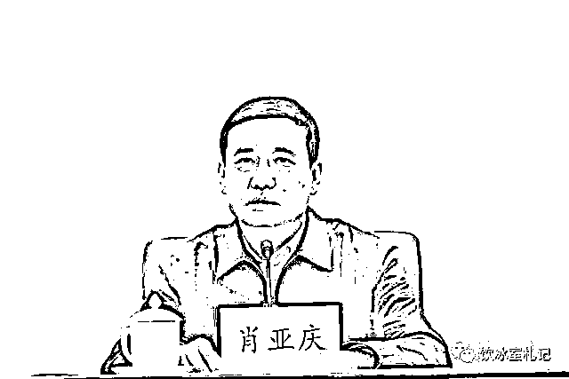
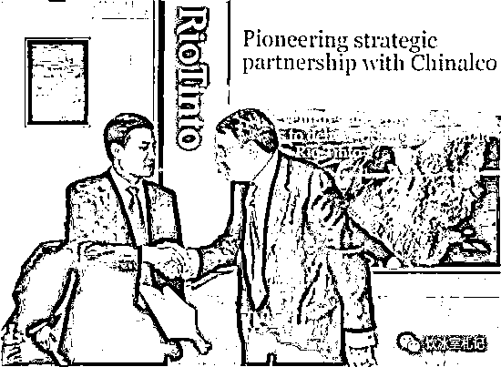

# 工信部长肖亚庆被查 此前已有征兆

> 原文：[`mp.weixin.qq.com/s?__biz=MzIyMDYwMTk0Mw==&mid=2247541169&idx=2&sn=7d4545414fa75f9df44db1b472796d44&chksm=97cbea89a0bc639f51dbc6730c0ac623e5b53c648a11ab107d0b48f3dedf13b16beafb75e4b6&scene=27#wechat_redirect`](http://mp.weixin.qq.com/s?__biz=MzIyMDYwMTk0Mw==&mid=2247541169&idx=2&sn=7d4545414fa75f9df44db1b472796d44&chksm=97cbea89a0bc639f51dbc6730c0ac623e5b53c648a11ab107d0b48f3dedf13b16beafb75e4b6&scene=27#wechat_redirect)

中央纪委国家监委网站讯  工业和信息化部党组书记、部长肖亚庆同志涉嫌违纪违法，目前正在接受中央纪委国家监委审查调查。

63 岁的肖亚庆毕业于中南矿冶学院，曾任西南铝业首任董事长，2004 年出任中国铝业公司总经理、党组书记，任内使得中国铝业不断的发展壮大，后来担任国务院副秘书长，2016 年出任国务院国有资产监督管理委员会主任，晋升为正部级，三年后改任国家市场监督管理总局局长，2020 年调任工信部部长。 

此前，官方公布名单显示，几乎所有中央部委一把手都是二十大代表，独缺工信部部长肖亚庆。央视新闻联播画面显示，肖亚庆也缺席省部级主要领导干部专题研讨班，引发外界各种猜测。

# 延伸阅读：肖亚庆往事

阔别国资国企 7 年之后，57 岁的肖亚庆，再次站在了他熟悉的舞台之上，只不过这一次，他从曾经的国企经营者变成了国资监管者。

2 月 15 日，中国政府网正式公布，国务院任命肖亚庆为国务院国资委主任。同时，免去肖亚庆的国务院副秘书长职务；免去张毅的国务院国资委主任职务。

国资委网站显示，肖亚庆负责国资委业务和行政管理工作，分管政策法规局。原国资委主任张毅保留国资委党委书记一职。

可以肯定的是，在国资改革亟待破题、央企重组何去何从、国资委自身角色面临转换的改革攻坚期，一个更熟悉央企的第五任国资委主任，无论是决策层还是 3000 万国企职工，都对他抱有期待。

**从中铝到国务院，从台前到幕后**

现年 57 岁的肖亚庆毕业于中南大学材料加工工程专业，博士研究生，教授级高级工程师。此前历任东北轻合金有限责任公司总经理，西南铝业（集团）有限责任公司董事长、总经理，中国铝业副总经理，中国铝业公司总经理、党组书记兼中国铝业股份有限公司董事长、首席执行官，国务院副秘书长、机关党组成员。

在肖亚庆的履历中，中铝时期的工作表现无疑最为抢眼。公开资料显示，1999 年，肖亚庆从东北轻合金有限责任公司转任西南铝加工厂厂长，通过债转股改造、强化销售、剥离企业办社会职能等大刀阔斧的改革，在不到两年时间内，就把已经连续 9 年累计亏损 16.29 亿元、年产量只有 7 万吨左右的老国有企业扭亏为盈，2000 年当年产量突破 10 万吨,实现销售收入 21 亿元。

比起“点石成金”的能力，2004 年执掌中铝总部后，肖亚庆主导下的一系列中铝并购，体现了他更大的能力和抱负。

在国内，中铝先后与山西关铝、 焦作万方、连城铝业、白银红鹭铝业、河南中迈铝业等签订合作协议；在国外，中铝在澳洲、新加坡等地频出重拳海外收购，特别是 2009 年 2 月 12 日，中铝宣布以 195 亿美元注资铁矿石巨头力拓。至此，这起当时几经波折的中国企业最大一笔海外投资尘埃落定。

肖亚庆执掌中铝时期，中铝于 2008 年进入世界 500 强。

2012 年 4 月，肖亚庆被母校中南大学评为“杰出校友”。校方的颁奖词是其 10 年中铝生涯的生动浓缩：“他是中国铝业的中流砥柱。从基层实业到高层管理，高瞻远瞩，革故鼎新，继承中南学统，瞄准国家重大需求，紧扣经济发展命脉，着眼国计民生大局，替铝业忧，为铝业谋，整合铝业资源，破解铝业困局，开创铝业新程。”

不过，中铝当年一系列的海外巨额资产收购，在金融危机的大背景下，产品价格暴跌，利润大幅减少，给中铝公司随后带来了巨大的负担和压力。

2009 年 2 月 17 日，肖亚庆被任命为国务院副秘书长。

坊间普遍认为，决策层当时对肖亚庆的“提拔”，除了看好其综合能力等基本条件外，还释放出一种强烈的信号，那就是鼓励众多有实力的大型国企走出去，到海外去“抄底”收购那些有国家战略意义的资产和资源。

在现行体制架构下，国务院副秘书长的工作主要配合、保障国务院副总理的工作，该职位接近政府决策层核心，并且能够熟悉宏观全局，因此常常被视为晋升更重要职务的过渡。比如现任国务院副总理汪洋、中宣部部长刘奇葆、国家发改委主任徐绍史、财政部部长楼继伟、福建省委书记尤权等，都曾担任过国务院副秘书长一职。

与掌舵中铝时行走在攻城略地的风口浪尖上相比，进入国务院的 7 年，肖亚庆堪称低调。除了陪同国务院有关领导参加相关会议或调研活动外，公开资料中鲜有其报道。因为还兼任国务院安全生产委员会副主任的缘故，在马航 MH370 失联、天津港爆炸、东方之星客轮沉没等重大事故的善后处理中，也都可以看到肖亚庆奔走的身影。

2009 年 2 月 12 日，中铝宣布以 195 亿美元注资铁矿石巨头力拓；图为时任中铝总经理肖亚庆（左）与力拓董事长保罗·斯金纳在协议签署仪式上握手。新华社

**“注重细节、情商很高、谨慎低调”**

一位曾在中铝总部供职的人士向《中国经济周刊》记者回忆曾经的中铝掌门人肖亚庆，“注重细节、情商很高、谨慎低调。”据该人士透露，肖在会见客人时，经常对会议室灯光、空调甚至是打什么领带这样的细节都会想到并过问。

肖亚庆自己也不避讳对细节的青睐。他曾对媒体表示：“我觉得小事积累起来就是大事，出的问题全是细节，这些例子太多了，现在说细节决定成败，眼前的事都管不好，这么大公司能管好吗？”

肖亚庆的“情商”则帮助中铝在“重人情”的中国商业文化环境中屡屡出奇制胜。业界耳熟能详的一个例子是，2006 年氧化铝价格高涨的时刻，下游的电解铝企业受成本高企的影响生存艰难。中铝此时却宁愿损失利润，以每吨低于市场价 1000 元的价格供货，总共让出 150 亿元利润帮助很多陷于危机的企业渡过难关，有些企业自此则成为中铝系的成员。

“整个铝业发展是一个生态链,在生态链中把别人打死的人,你也不会有好结果。”多年后回看肖亚庆曾经的这句“名言”，依然可以感受到这位曾经的中铝掌门人的治企思路。

一位中铝地方公司人士向《中国经济周刊》记者回忆：中铝并购地方企业时，肖亚庆特别注重与当地政府的沟通。“几乎每起并购都得到了地方领导的理解和支持，这在央企兼并地方企业时是不多见的。”该人士同时表示，“肖总那个时候经常要求中铝的干部考虑问题要有远见，要有战略高度。”

而低调谨慎似乎是央企老总的普遍特质，肖亚庆也不例外。时任中铝掌门人的肖亚庆曾说：“我经常上网，经常看各种媒体，如果别人说你哪儿做得不对，我也很乐意听。另外，我很少接受各种荣誉、称号什么的。我担心自己和身边的人有骄傲的心理。”

在少见的接受媒体采访中，肖亚庆面对记者提问“你会在意别人的误解吗”时这样回答，“我不是很在意，当一把手，有一点误解是正常，哪有一帆风顺的。”

**“更懂企业”的国资委主任**

据某媒体援引知情人士的介绍，“肖亚庆一直有很大的政治抱负，希望能在仕途上一展宏图。”

“有很大抱负”的肖亚庆此番担纲国资委主任，在从“副部”晋升“正部”之后，终于迎来在更高层面一展宏图的舞台和机会。

如果说两年多前“老纪检”张毅统管国资委，是直指国资系统贪腐问题，那么如今“老国企”肖亚庆的任务也十分明确，就是要利用自己的“实战”经验，在国企系统“刮骨疗毒”之后，全方位推进国企改革，并啃下包括混改、供给侧改革等多块硬骨头。

在中国企业研究院首席研究员李锦看来，2016 年将是央企的阵痛转型之年，如何去产能、清退僵尸企业，完成重组与清退等重要任务，是放在国资委面前的首要挑战。“仗从哪里打响、怎么打，都是摆在肖亚庆面前最急迫的事情。”李锦说。

和前几任国资委主任相比，“更懂企业”，既是肖亚庆过往履历展示给公众的深刻印象，也是舆论对其操盘国企改革抱有期待的共识基础。肖亚庆曾在中国企业联合会 2012 年举办的一次活动中表示：各级政府和全社会要为企业发展创造更好的社会环境，更加关心、更加理解、更加爱护和全力支持企业家。

“企业是社会经济发展的主力军，企业家是发展市场经济必不可少的宝贵资源。要加快转变政府职能，提高办事效率，改善公共服务，真心实意为企业排忧解难，为企业的发展做好服务。”肖亚庆说。

国资委网站显示，2 月 2 日，肖亚庆参加了国资委老部长团拜会；2 月 4 日，肖亚庆又来到中航工业北京航空制造工程研究所、中国石化北京石油分公司东方油库，就企业提质增效、安全生产和“双创”等有关工作进行调研。

来源：中国经济周刊   作者：曹煦

← 向右滑动与灰产圈互动交流 →

