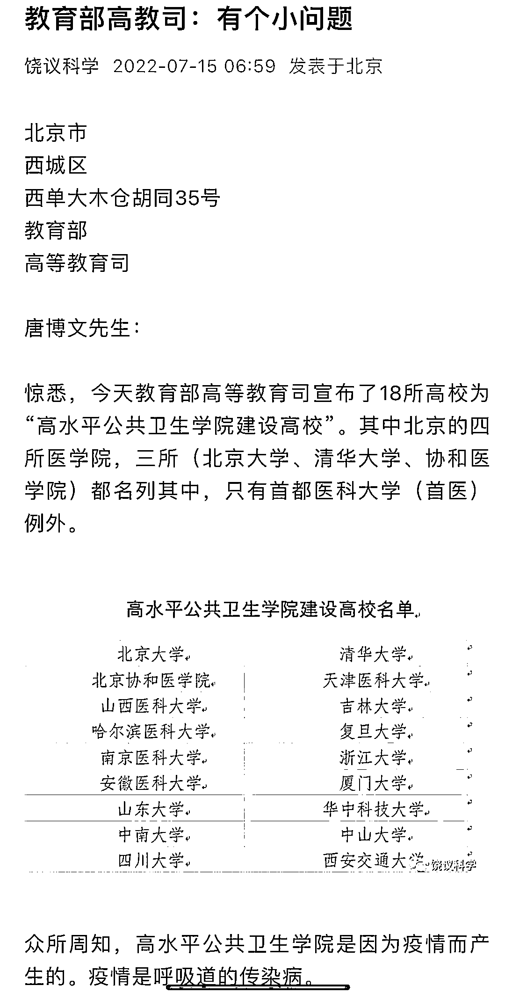

# 饶毅曝李兰娟秘密，扒出不为人知的内幕…

> 原文：[`mp.weixin.qq.com/s?__biz=MzIyMDYwMTk0Mw==&mid=2247541169&idx=3&sn=144759ba004d8eef26a0c92658325519&chksm=97cbea89a0bc639f2b3fe8e26fb5952e1c1502853bf28743e5ef592d4c61e7c414bb7c465ff2&scene=27#wechat_redirect`](http://mp.weixin.qq.com/s?__biz=MzIyMDYwMTk0Mw==&mid=2247541169&idx=3&sn=144759ba004d8eef26a0c92658325519&chksm=97cbea89a0bc639f2b3fe8e26fb5952e1c1502853bf28743e5ef592d4c61e7c414bb7c465ff2&scene=27#wechat_redirect)

昨天，饶毅科学公众号曝出李兰娟的一个内幕，知乎网友接力跟进，结果扒出更多的不为人知的事。 

整个事情的起因很简单，来自饶毅公众号一个编辑的回复。

针对这个回复，有好奇的网友在知乎提出问题了。

很快有网友在底下回复了。

还有机灵的网友找出了当时媒体报道的原文，白纸黑字地写在这里，详细地披露了当年轰动一时的“戴备军案”内幕。

这些都是当年的媒体报道。

作为李兰娟儿媳的张琰，以一己之力干倒了两个厅级干部。

有懂财务的网友则找到了这样一个股权表，上面白纸黑字地写着张琰和郑杰的名字。

尽管当时李兰娟方面聘请了律师发出通告。

但依然有媒体报道了张琰与郑杰的关系，也就是李兰娟儿媳这个说法，比如三湘都市报。

这是三湘都市报的报道原文。

于是网友们得出了这样的结论。

这是网友所表达的观点，我想让大家看看。

网友们感兴趣的问题是，面对饶毅和知乎网友的联手爆料，李兰娟方面又会作何反应呢，是直面回应，还是沉默？

都说人性是复杂的，现在李兰娟及家人身上，我们再一次看到这一点了。

不仅如此，饶毅又和华大基因 CEO 尹烨杠上了。

7 月 23 日，首都医科大学校长饶毅在其朋友圈炮轰：“尹哥聊基因”、“生命认知学”视频号内容，直指上市公司华大基因（300676.SZ）CEO 尹烨所言是“伪科学”，且“愚蠢无比”。 

对于尹烨与新东方创始人俞敏洪的另一条对话视频“如何摆脱负面情绪”，饶毅称：“俞敏洪被尹烨骗的团团转，里面每一句涉及科学的话，尹烨都是欺骗”。

他说，“这个视频有十万加，也就是中国至少有十万个人与俞敏洪一样被尹烨骗的团团转，还不自知。”

他还称俞敏洪为“傻瓜团团长”。 

在另一个名为“生命认知学”的视频号中，尹烨谈及了“人类为什么要做梦”“爱因斯坦仅靠数学推测就预测了未来”等话题。

对此，饶毅直指尹烨“愚蠢无比”“100%瞎编”“尹烨的物理是尹烨教的”……

不仅在朋友圈内容中不断指出问题，饶毅还在其个人微信公众号平台发布的文章《信、达、雅：说起来容易 做起来…》一文中提到尹烨，称其“本身生物的背景就比较局限”

“有相当多故意哗众取宠的内容”，有关生物的演讲内容存在“伪科学”，超出生物涉及其他科学的部分“错误百出”。

他表示，“尹烨主动出来大范围忽悠就比较奇怪”，这种行为“无异于主动说谎”。

同时，饶毅也在文中解释了自己的出发点——“批评他是为了破除人们误认为企业高管就可以随心所欲宣传伪科学。”

在文章评论区，有网友表示支持称：*“饶先生终于揭开华大的画皮”，称尹烨为“大忽悠”“破了三观”；*

*也有网友认为批评人应该批评某一观点而非概括；还有网友指出**这篇只点名批评，没有“摆事实，讲道理”，期待补充。*

对于饶毅的上述观点，7 月 24 日，尹烨在其个人公众号“尹哥聊基因”做出回复：谢谢指教。

三人行，必有我师焉。评论区网友纷纷表示“敞亮”“不用理他”“不值一驳”等。

图源自“尹哥聊基因”微信公众号

今天，饶毅又在其个人微信公众号“饶议科学”再次发文——《智力小测试》回击部分网友评论：

“因为文科朋友告知，而看了几个尹烨的适配，结果发现错误连篇，基本是个个都有错，但有些错误需要懂一些专业的人才知道。”

他再次指出，尹烨在“人类为什么要做梦”视频中的讲述是“满口胡言”。

饶毅还在文末致华大基因员工称：“应该劝尹烨的上级开除他，而不是歇斯底里反对批评，因为这是国际科技企业的常规。”

## **饶毅与华大基因“那点事**

早在 2012 年，饶毅就与原华大基因 CEO 王俊（现碳云智能创始人）公开过招，在当年北大举办的生物交叉学科学术论坛上，饶毅与王俊就华大是不是在造福老百姓、华大如何做学术等议题公开辩论。 

此后，饶毅也在博客上公开炮轰华大基因创始人之一杨焕明，对其科学家身份发出质疑，并称其为“流氓企业家”。

不止与华大基因“开撕”，在学术界，饶毅也敢说敢做，其文风犀利，常常直击要害。

前段时间饶毅曾发文公开质疑教育部。

2019 年，饶毅还曾写信国家自然基金委员会，质疑三位科研工作者涉嫌学术造假，信件在网络上流传之后迅速发酵为“饶毅打假事件”。

耿直 boy 饶毅因其较真的科学态度，得罪过不少圈内人。

但，我们国家现阶段缺的就是这样较真的人，尤其是在科学领域。

来源：和美之音，看见，饶毅科学，有晖即写，钛媒体等

← 向右滑动与灰产圈互动交流 →

