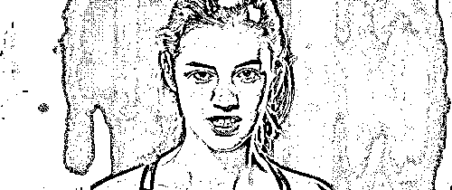
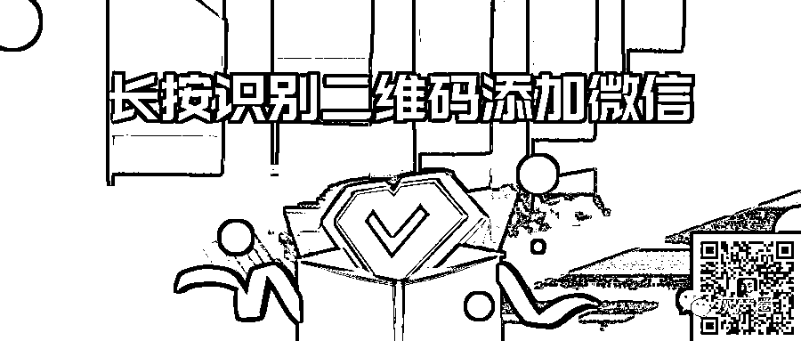

# 寻衅滋事罪 2022 年最新标准：稀里糊涂要坐牢！

> 原文：[`mp.weixin.qq.com/s?__biz=MzIyMDYwMTk0Mw==&mid=2247541169&idx=5&sn=7ab118fdd979ea0b7e871352d849e125&chksm=97cbea89a0bc639fa3873093c81b5dbef8cd96e5fbcd796fe3f97df07d94ed3b87e5beb7d797&scene=27#wechat_redirect`](http://mp.weixin.qq.com/s?__biz=MzIyMDYwMTk0Mw==&mid=2247541169&idx=5&sn=7ab118fdd979ea0b7e871352d849e125&chksm=97cbea89a0bc639fa3873093c81b5dbef8cd96e5fbcd796fe3f97df07d94ed3b87e5beb7d797&scene=27#wechat_redirect)

南京玄奘寺供奉侵华日军将领排位事件的官方调查情况通报在全网刷屏。

▲ 吴啊萍的身份信息

结论是吴啊萍因为了解到了松井石根等战犯的罪行，产生了心理阴影，长期被噩梦困扰，在接触佛教后产生了通过供奉战犯排位解冤释结，脱离苦难的错误想法，遂以友人名义在玄奘寺内立牌供奉。

公安机关认为：吴啊萍出于自己对因果释结的错误认知和自私自利的动机，在明知 5 名被供奉者为侵华日军战犯的情况下，仍出资在宗教活动场所为其设置牌位，严重违背了佛教扬善惩恶的教义教规，严重破坏公共秩序，严重伤害民族感情，造成恶劣社会影响**，已涉嫌犯寻衅滋事罪，对其刑事拘留**。

上一分钟你还是悠然自得的吃瓜群众，下一分钟就可能成为全城通缉的犯罪嫌疑人。今天我们又不得不说说，这几年让人没想到的寻衅滋事罪的那些事。

** 1 **

**缠访闹访，寻衅滋事罪**

# 曾经八旬老妪因多次上访被以寻衅滋事罪判入狱 2 年半，申请保外就医被拒的新闻，引发关注。

# 85 岁李淑贤母女三人，因 2013 年村里启动土地平整项目，所种树木被毁，举报他人非法毁林，滦平县国土资源局滥用职权、包庇纵容。她们跑遍了镇、县、市级信访单位，并多次出现在北京，最终三人相继被捕入狱。李淑贤母女因到权力中枢周边撒大量上访材料抛，扰乱公共秩序，被判寻衅滋事罪。

本来是维权、讨说法，而且是这么大岁数的老妪，谁也无法把她跟寻衅滋事为非作歹的“坏人”联系在一起，而且这些平时老实巴交的农民，谁也不会想到会触犯刑法。近年来，寻衅滋事罪俨然已成为缠访闹访者们的杀威棒。

** 2 **

**街头涂鸦，寻衅滋事罪**

某日凌晨，丁满和朋友在街头用喷漆留下了十多处涂鸦，涂鸦的地点有建筑物的墙壁、电箱，以及街道的宣传栏。当晚，丁满即因“故意毁坏财物罪”被刑事拘留。尽管相关单位为丁满出具了谅解书，但最终，他还是因寻衅滋事罪，被移送审查起诉。

丁满在大街小巷的涂鸦行为，行内人看作是艺术，就算行外人顶多也就会认为是乱涂乱画，影响市容市貌。

有人认为出于个人爱好，丁满目的单纯的想让更多的人了解涂鸦文化，并非故意寻求刺激、大搞破坏，无论是作案手段还是犯罪动机，他的行为都很难以寻衅滋事罪来定罪。

** 3 **

**骂街@地域黑，寻衅滋事罪**

********

**去年，在丰台区右安门外大街，曹某驾驶机动车进入非机动车道，与一骑电动车男子发生纠纷，并对对方进行辱骂。因辱骂中使用了“北京傻*”“穷*”等字眼，一经网络传播，引起了北京市民广泛关注，激化了北京人与外地人之间的矛盾，造成了恶劣的社会影响。针对其在公共场所公然辱骂行为，丰台公安分局以寻衅滋事罪对其刑事拘留。**

**因琐事在大街上骂人会犯罪，这也超乎了一般人的认知范围，当然不是只有骂北京人才会获罪，同样汤某某在自己的朋友圈里骂了一回郯城人，同样引发群愤！看来不管你骂哪个地方人，在网络时代都是很危险的，一旦引起众怒都不是好玩的。**

**** 4 ****

****微信留言辱警，寻衅滋事罪****

****

**2018 年 8 月 6 日上午，仁寿县公安局富加派出所发生一起个人极端案件导致 2 名警察重伤牺牲。事发后，整个仁寿举城哀伤。而微信平台上，一位昵称“高山流水，川流不息”的网民在名为“和谐中铁”的微信群内发布“杀人者是英雄好汉，警察是拿了证的土匪”等辱警言论，其发布的辱警言论涉及广泛，造成的影响极其恶劣，被以寻衅滋事罪刑拘。**

**当然这绝对不是第一次，此前有沈阳民警牺牲，有两人因发辱警言论以寻衅滋事罪被刑事拘留。据悉，全国因辱警有多人被以寻衅滋事罪被刑拘，因寻衅滋事被处以被行政拘留治安处罚的就更不计其数。网上辱骂警察要不得，侮辱牺牲民警更是“零容忍”，言论自由但不能仍性，要有敬畏之心。**

**** 5 ****

****网上发文失察，寻衅滋事罪****

**2018 年，郭某受托发布《内蒙古大宗土地违法问题引发官民关系趋于紧张》一文，内容被认定存在虚假信息，被内蒙古警方已寻衅滋事罪刑事拘留。这样的事件并不是一起，媒体人秦某某，受托写了一篇《乌木木齐谁推动了某某兄弟的奶酪》等三篇文章在其经营网站上发表，一审判决书认定“没有核实其真实性的情况下”“公开发布”，并认定文章中有三处虚构事实。最终包括秦某某以及介绍人魏某某，委托人潘某某均被法院判处寻衅滋事罪。**

**发表文章为什么会构成寻衅滋事罪？根据两高的司法解释：“编造虚假信息，或者明知是编造的虚假信息，在信息网络上散布，或者组织、指使人员在信息网络上散布，起哄闹事，造成公共秩序严重混乱的，以寻衅滋事罪定罪处罚。上述案例中所发文章均被认定具有虚假信息成分，损害了政府公信力，进而扰乱了公共秩序，可见舆论监督有风险，文章不是可以随便发的，切忌夸大事实。**

**** 6 ****

****幸灾乐祸，寻衅滋事罪****

****

**2018 年 5 月 28 日凌晨，吉林松原发生了 5.7 级地震，灾情牵动了全国网友的心。然而，就在这一天，却有人借地震大肆辱骂东北同胞，被全国网民人肉。当天下午，警方即查明发帖网民为伏某某，女，44 岁，江阴人。伏某某因涉嫌寻衅滋事罪被江阴市公安局依法刑事拘留。**

**审查中，伏某某交代，其根本没想到自身言论会造成如此恶劣的影响，尽管在第一时间将帖文删除，但她还是收到了大量网民的声讨，最终等待她的是法律的严惩，这件事告诉我们，做人要厚道，不要愚昧无知，口无遮拦。**

**** 7 ****

****伤害民族感情，寻衅滋事罪****

****

**2018 年 3 月 8 日，南京警方通报称，据民众举报，微信昵称为“圣诞老人”的男子因在微信群中发布“南京就是一个坑，应该让日本人在（再）屠杀一次”的违法言论；昵称“落落”的网民在 QQ 群中煽动以驾车冲撞行凶等极端方式制造事端。随后，南京警方将嫌疑人王某、洪某抓获，并以寻衅滋事罪刑事拘留。**

**此前，两男子在南京紫金山抗战遗址拍摄二战日本军服照，构成寻衅滋事，被警方依法行政拘留 15 日。你以为你那是 COSPLAY 吗，实际是犯罪。用王毅部长的一句话，那就是“中国人的败类”。**

**** 8 ****

****网上煽动闹事，寻衅滋事罪****

**去年 3 月 8 日下午，洪某，系“钱宝网”集资参与人，因不满公安机关依法查办“钱宝网”非法吸收公众存款案，在 QQ 群“备用防走散旅游”发布违法言论，煽动他人实施驾驶卡车冲击国家机关、劫持人质、持械行凶等违法犯罪行为。**

**3 月 9 日，南京市公安局鼓楼分局依法对洪某刑事拘留。**

**警方表示，通过信息网络煽动实施违法犯罪制造事端，是对公共秩序的严重破坏，洪某已涉嫌寻衅滋事犯罪。**

**** 9 ****

****恶意骚扰，寻衅滋事罪****

**2019 年 6 月，男子曾某与女友李某分手后,不断恶意骚扰李某,经公安机关调解后仍不思悔改,致李某经济损失。近日,福建省厦门市集美区检察院依法对上述恶意骚扰前女友的寻衅滋事案件提起公诉。**

****

**行为人因婚恋、家庭、邻里、债务等纠纷,实施殴打、辱骂、恐吓他人或者损毁、占用他人财物等行为的,一般不认定为“寻衅滋事”,但经有关部门批评制止或者处理处罚后,继续实施前列行为,应以寻衅滋事罪追究其刑事责任。你可能没想到吧。**

**** 10 ****

****网上卖惨，寻衅滋事罪!****

 **[`v.qq.com/iframe/preview.html?width=500&height=375&auto=0&vid=u0898hqj4v3`](https://v.qq.com/iframe/preview.html?width=500&height=375&auto=0&vid=u0898hqj4v3)** 

**2019 年 7 月，微博用户@春秋两不沾- 发视频称被一男子长期骚扰并威胁“奸杀”，报警求助无果，引起网友同情和关注。7 月 16 日，安徽省马鞍山市公安局花山分局发布通报称，女子视频中的相关言辞均为编造。因视频点击量达 5000 多万次，造成严重恶劣社会影响。目前，该女子因涉嫌寻衅滋事罪已被依法采取刑事强制措施。**

**自己解决不了事情，就胡编乱造引人关注，哭的死气白咧的够可怜，可能真的想不到会以这样的结局收场。**

**……**

**以上案例中，有令人质疑的，也有让人解气的，有罪有应得的，也有令人唏嘘的，寻衅滋事罪，是个“好”罪，关键看怎么用！**

**寻衅滋事罪特别多，2022，且行且小心。**

****刑法条文：****

******第二百九十三条**  【寻衅滋事罪】有下列寻衅滋事行为之一，破坏社会秩序的，处五年以下有期徒刑、拘役或者管制：****

****（一）随意殴打他人，情节恶劣的；****

****（二）追逐、拦截、辱骂、恐吓他人，情节恶劣的；****

****（三）强拿硬要或者任意损毁、占用公私财物，情节严重的；****

****（四）在公共场所起哄闹事，造成公共场所秩序严重混乱的。****

****纠集他人多次实施前款行为，严重破坏社会秩序的，处五年以上十年以下有期徒刑，可以并处罚金。****

******量刑档次（两档）：******

********（一）五年以下有期徒刑、拘役或者管制：********

********（1）随意殴打他人，情节恶劣的；********

********（2）追逐、拦截、辱骂、恐吓他人，情节恶劣的；********

********（3）强拿硬要或者任意损毁、占用公私财物，情节严重的；********

********（4）在公共场所起哄闹事，造成公共场所秩序严重混乱的。********

**********（二）五年以上十年以下有期徒刑（可以并处罚金）：**********

********纠集他人多次实施前款行为，严重破坏社会秩序的。********

**********行为标准（三种类型）：**********

**********（一）无事生非型：****行为人为寻求刺激 、发泄情绪、逞强耍横等，无事生非的。**********

**********（二）小题大做型：****行为人因日常生活中的偶发矛盾纠纷 ，借故生非的。（但矛盾系由被害人故意引发或者被害人对矛盾激化负有主要责任的除外）**********

**********（三）拒不改正型：****行为人因婚恋、家庭、邻里、债务等纠纷，实施殴打、辱骂、恐吓他人或者损毁、占用他人财物等行为的，一般不认定为“寻衅滋事”，但经有关部门批评制止或者处理处罚后，继续实施前列行为，破坏社会秩序的除外。**********

**********情节标准（四种表现形式）：**********

********（一）“**随意殴打他人，情节恶劣的**”是指具有下列情形之一的：********

******（1）致一人以上轻伤或者二人以上轻微伤的；******

******（2）引起他人精神失常、自杀等严重后果的；******

******（3）多次随意殴打他人的；******

******（4）持凶器随意殴打他人的；******

******（5）随意殴打精神病人、残疾人、流浪乞讨人员、老年人、孕妇、未成年人，造成恶劣社会影响的；******

******（6）在公共场所随意殴打他人，造成公共场所秩序严重混乱的；******

******（7）其他情节恶劣的情形。******

******以“异教徒”、“宗教叛徒”等为由，随意殴打、追逐、拦截、辱骂他人，扰乱社会秩序，情节恶劣的，以寻衅滋事罪定罪处罚。******

******（二）“**追逐、拦截、辱骂、恐吓他人，情节恶劣的**”是指具有下列情形之一的：******

******（1）多次追逐、拦截、辱骂、恐吓他人，造成恶劣社会影响的；******

******（2）持凶器追逐、拦截、辱骂、恐吓他人的；******

******（3）追逐、拦截、辱骂、恐吓精神病人、残疾人、流浪乞讨人员、老年人、孕妇、未成年人，造成恶劣社会影响的；******

******（4）引起他人精神失常、自杀等严重后果的；******

******（5）严重影响他人的工作、生活、生产、经营的；******

******（6）其他情节恶劣的情形。******

******利用信息网络辱骂、恐吓他人，情节恶劣，破坏社会秩序的，以寻衅滋事罪定罪处罚。******

******（三）“**强拿硬要或者任意损毁、占用公私财物，情节严重的**”是指具有下列情形之一的：******

******（1）强拿硬要公私财物价值一千元以上，或者任意损毁、占用公私财物价值二千元以上的；******

******（2）多次强拿硬要或者任意损毁、占用公私财物，造成恶劣社会影响的；******

******（3）强拿硬要或者任意损毁、占用精神病人、残疾人、流浪乞讨人员、老年人、孕妇、未成年人的财物，造成恶劣社会影响的；******

******（4）引起他人精神失常、自杀等严重后果的；******

******（5）严重影响他人的工作、生活、生产、经营的；******

******（6）其他情节严重的情形。******

******（四）“**在公共场所起哄闹事，造成公共场所秩序严重混乱的**”应当根据公共场所的性质、公共活动的重要程度、公共场所的人数、起哄闹事的时间、公共场所受影响的范围与程度等因素，综合判断是否“造成公共场所秩序严重混乱”。公共场所是指车站、码头、机场、医院、商场、公园、影剧院、展览会、运动场或者其他公共场所。******

********编造虚假信息，或者明知是编造的虚假信息，在信息网络上散布，或者组织、指使人员在信息网络上散布，起哄闹事，造成公共秩序严重混乱的，以寻衅滋事罪定罪处罚。********

******“多次”一般应当理解为二年内实施寻衅滋事行为三次以上（包括已经被公安机关行政处罚的，可折抵）。二年内多次实施不同种类寻衅滋事行为的，应当追究刑事责任。******

********升档标准：********

********纠集他人三次以上实施寻衅滋事犯罪，未经处理的，处五年以上十年以下有期徒刑，可以并处罚金。需要满足以下三个条件：******** 

********一是每次实施的寻衅滋事行为均构成犯罪 。********

********二是每次寻衅滋事行为未经处理，包括行政处理和刑事处理。********

********三是多次寻衅滋事行为的时间跨度，只要未超过法定的追诉时限期限，均可计入。********

**********免刑从轻标准：**********

********行为人认罪、悔罪，积极赔偿被害人损失或者取得被害人谅解的，可以从轻处罚；犯罪情节轻微的，可以不起诉或者免予刑事处罚。********

**********上海标准（几种特殊情形的认定）：**********

********（一）符合以下情形之一并致一人以上轻微伤的，属于“**随意殴打他人**”的“其他情形恶劣的情形”：********

******（1）随意殴打多人的；******

******（2）聚众殴打他人的；******

******（3）造成直接经济损失数额在一千元以上的；******

******（4）两次随意殴打他人的；******

******（5）因故意杀人、故意伤害、抢劫、抢夺、敲诈勒索、寻衅滋事、聚众斗殴、妨碍公务等违法犯罪曾受过刑事处罚，或者受到行政处罚两年内，又实施随意殴打他人行为的。******

******（二）符合以下情形之一并造成恶劣社会影响或者公共场所秩序严重混乱的，属于“**追逐、拦截、辱骂、恐吓他人**”的“其他情节恶劣的情形”：******

******（1）追逐、拦截、辱骂、恐吓多人的；******

******（2）聚众追逐、拦截、辱骂、恐吓他人的；******

******（3）造成直接经济损失数额在一千元以上的；******

******（4）因故意杀人、故意伤害、抢劫、抢夺、敲诈勒索、寻衅滋事、聚众斗殴、妨碍公务等违法犯罪曾受过刑事处罚，或者受到行政处罚两年内，又实施追逐、拦截、辱骂、恐吓行为的。******

******（三）强拿硬要公私财物价值五百元以上，或者任意损毁、占用公私财物价值一千元以上，且符合以下情形之一的，属于“**强拿硬要或者任意损毁、占用公私财物**”的“其他情节恶劣的情形”：******

******（1）针对多人强拿硬要或者任意损毁、占用公司财物；******

******（2）聚众持凶器强拿硬要或者任意损毁、占用公私财物；******

******（3）造成恶劣社会影响或者公共场所秩序严重混乱的；******

******（4）因故意杀人、故意伤害、抢劫、抢夺、敲诈勒索、寻衅滋事、聚众斗殴、妨碍公务等违法犯罪曾受过刑事处罚，或者受到行政处罚后两年内，又实施强拿硬要或者任意损毁、占用公司财物行为的。******

******（四）**具有《刑法》第二百九十三条第一款规定的两种以上行为**，且符合下列情形之一的，依法应当追究刑事责任：******

******（1）致一人以上轻微伤的；******

******（2）造成直接经济损失数额在五百元以上的；******

******（3）造成恶劣社会影响或者公共场所秩序严重混乱的。******

******（五）** 聚众寻衅滋事未遂，情节恶劣的**，对组织者和积极参加者应定罪入刑，但可比照既遂犯从轻或者减轻处罚。******

******聚众寻衅滋事预备，情节恶劣的，对组织者应当定罪入刑，但可以比照既遂犯从轻、减轻处罚或者免除处罚。******

******（六）**《解释》中的“持凶器”是指行为人为寻衅滋事携带凶器的情形。****这里的“凶器”是指各种枪支、刀具、棍棒、砖块等足以致人伤亡的工具。 ********

********来源：刑法法典，景来律师********

********************************

********← 向右滑动与灰产圈互动交流 →********

****************