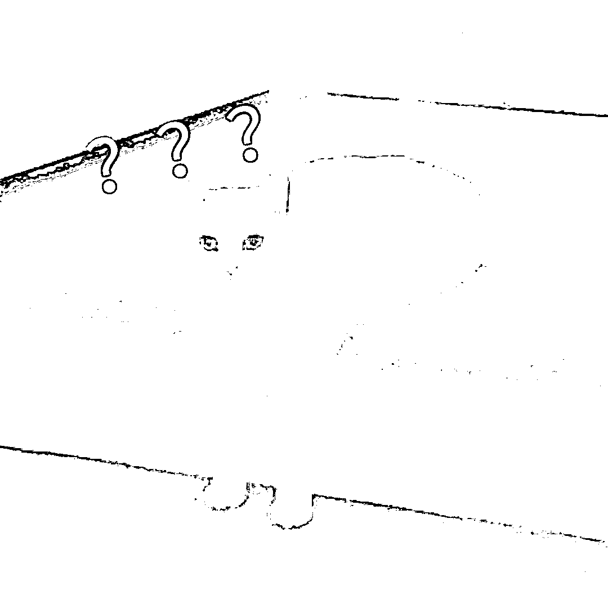
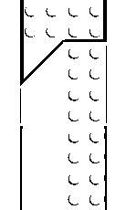
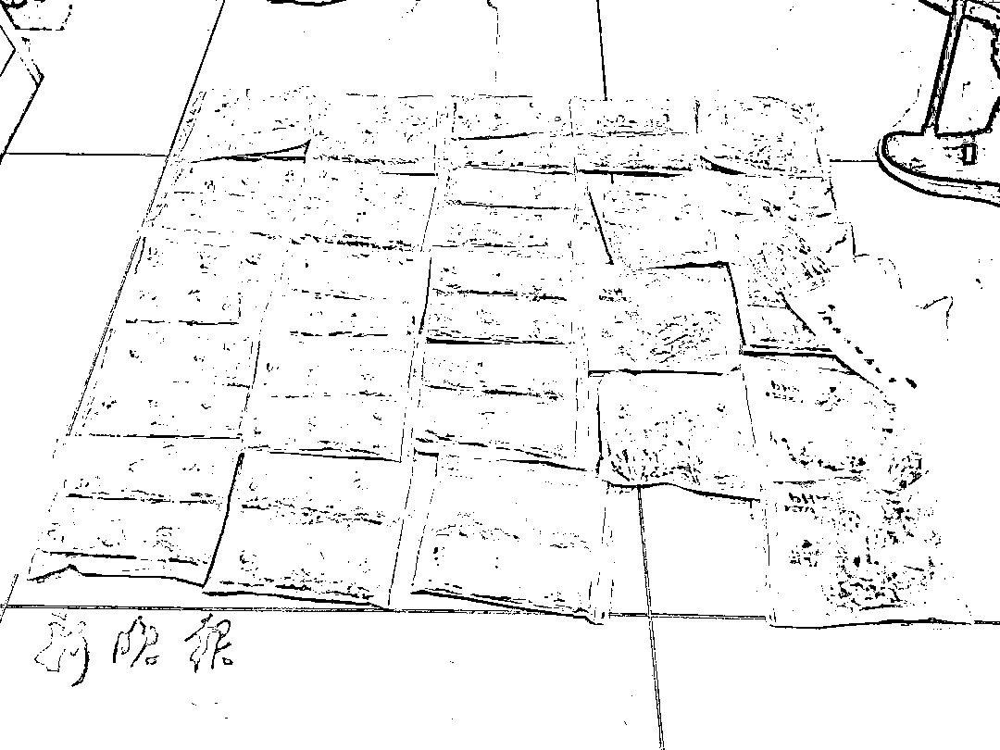
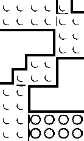
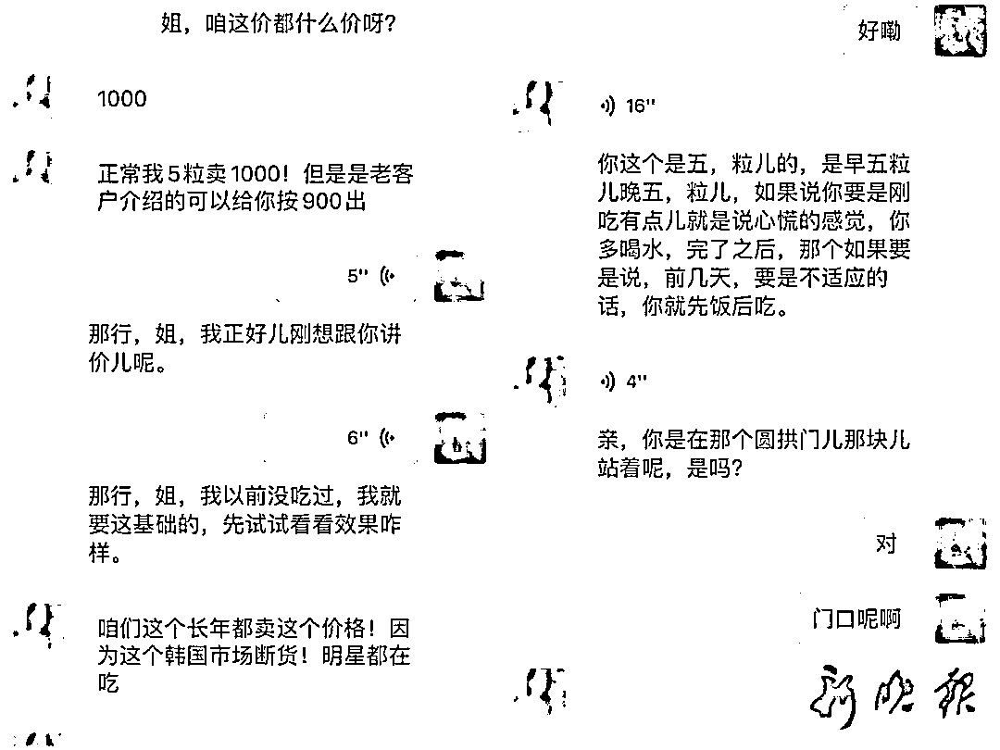
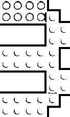
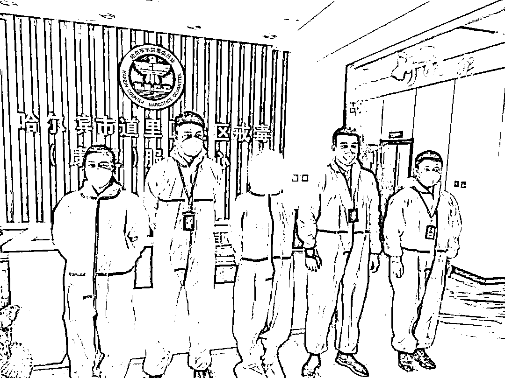
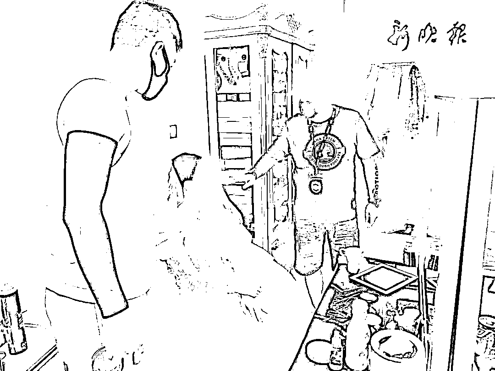

# 吃减肥药后毒品尿检竟呈阳性！女子被抓时还穿着婚纱……

> 原文：[`mp.weixin.qq.com/s?__biz=MzIyMDYwMTk0Mw==&mid=2247541169&idx=6&sn=e12039c8f10760e375adb7f6668e202d&chksm=97cbea89a0bc639f0862d293374b9c8259d8779e029d0170bab44df2abab8f8f5fd466ca0df2&scene=27#wechat_redirect`](http://mp.weixin.qq.com/s?__biz=MzIyMDYwMTk0Mw==&mid=2247541169&idx=6&sn=e12039c8f10760e375adb7f6668e202d&chksm=97cbea89a0bc639f0862d293374b9c8259d8779e029d0170bab44df2abab8f8f5fd466ca0df2&scene=27#wechat_redirect)

**“使用这个产品一个月能瘦 30 斤。”**

**近日**

**一款国外代购的减肥药**

**因其减肥效果明显**

**在网络走红**

减肥效果真的有这么好吗？

哈市道里警方深入挖掘

**发现该减肥产品内竟然暗含毒品**

5 月初，哈尔滨市公安局道里分局禁毒大队民警在工作中发现**一****女子可能吸食毒品，于是立即对其毒品吸食情况展开深入调查。**然而，让办案民警感到疑惑的是**该女子并未涉毒。**经进一步鉴定，**发现该名女性近期一直食用的国外代购的减肥药内含有麻黄碱、咖啡因、甲卡西酮。**

**这一毒品线索的来源引起了禁毒民警的高度注意，减肥药里含毒品？民警通过加该减肥药的代购卖家孙某为好友，购买了其售卖的多款减肥药。**

****“一个个透明的小袋子、塑料盒子，里面装有红、蓝、黄、白等五颜六色的胶囊跟药片，一袋有五粒、九粒、6+4 等规格，产品包装上除了外文没有其他任何说明信息。”**经侦查，孙某在微信朋友圈贩卖的减肥药号称外国处方药无副作用。**

****

****

**据了解，今年 35 周岁的孙某，高中毕业后就到了国外闯荡，在国外留学七年，有多年的国外生活经验。孙某凭借在国外学习、生活时间长的优势，做起了海外代购的业务。最开始孙某做的是化妆品和生活用品代购，直到发现减肥药存在巨大暴利，孙某便把焦点放在了减肥产品上。**为尽可能更多的招揽国内顾客，孙某通过微信朋友圈、网络等途径对其售卖的减肥产品进行宣传，号称食用完后一天不用吃饭，一周能够减掉好几斤。****

****民警通过微信与孙某联络时发现，**孙某明知道其所售卖的减肥药中含有毒品成分，但仍然利用其在销售化妆品时积累的客源，将产品**通过快递**销往全国各地市，**客源量较大。**孙某的减肥药是从国外进口的，价格为 360 元每包，一小包装有 9 粒药片。孙某一次批发售卖 30 小包，售卖价格为 900 元每包，6+4 规格的，售卖价格更高达 1000 元每包。******

************

********“每次吃完减肥药后，总是精神亢奋，人会特别精神而且感觉不到疲倦，有时候会整夜整夜没有困意，肚子也没有饥饿感，有时候心慌、口渴。”**受害人王女士谈到。据民警介绍，很多爱美女性服用完在孙某处购得的减肥药后出现了不同程度的“吸毒”反应，有些人甚至性格突变，从而引起家庭矛盾影响家庭稳定。**这些远销全国各地的减肥药，都含有麻黄碱、咖啡因、甲卡西酮成分，服用后大都会出现兴奋无饥饿感的症状。**因此，该减肥药品确实能在一定程度上起到减肥效果。******

************

******随着案件深入调查，警方发现孙某还在全国各地销售涉毒减肥药，为防止更多人受害，**道里警方决定开始收网，并于 7 月 1 日将包括孙某在内的 4 名犯罪嫌疑人一举抓获。********

************

******但在抓捕过程中也让警方费了不少周折。受孙某雇佣的三名客服人员拒不交代藏匿涉毒减肥药的库房，只声称销售的是海外代购的化妆品，**警方通过深入摸排最终确定了藏匿减肥药的库房，并当场查获涉毒减肥药 1 万粒。**面对证据，三名客服人员供述，孙某一直担心事情败露会受到公安机关打击，曾要求大家将售卖减肥药的聊天记录、交易记录等全部删除。******

********警方通过侦查发现，孙某正和未婚夫在道里区群力某婚纱影楼外景地拍摄婚纱照，近期准备结婚。**看见警察后，孙某撒泼抵赖欲逃避抓捕。**警方几经工作，最终只能无奈的将穿着婚纱的孙某采取强制措施。********

****************

**********目前，孙某等人因涉嫌贩卖毒品罪被道里公安分局采取刑事强制措施。**据孙某交代，其所售卖的多款减肥药成分相同，明知药品含有毒品成分，但为了高额暴利铤而走险，非法获利 200 余万元，损害了他人的身体健康。********

******警方提示：******

******广大爱美女性，在购买减肥产品时，一定要到正规药店或者正规电商平台，看清产品成分，以免误服不合格或者涉毒产品，损害健康。******

********来源：新晚报********

************************

******← 向右滑动与灰产圈互动交流 →******

************