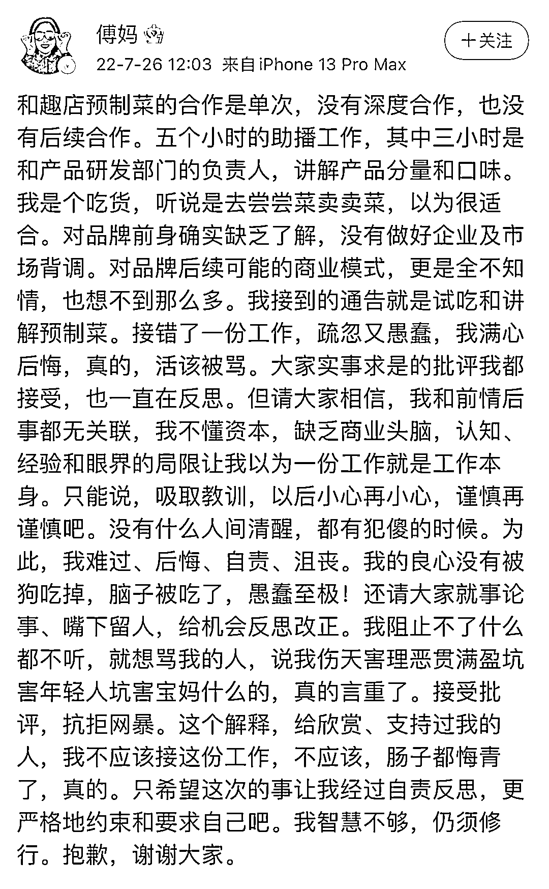

# 热搜第一！知名艺人致歉！相关视频紧急下架

> 原文：[`mp.weixin.qq.com/s?__biz=MzIyMDYwMTk0Mw==&mid=2247541169&idx=7&sn=8c97d11faa39b6786eca321e56ffdfa0&chksm=97cbea89a0bc639fbae0c8dc7f5d5718f567f99d4ae954d5aadfd882decee7fabffaf173e668&scene=27#wechat_redirect`](http://mp.weixin.qq.com/s?__biz=MzIyMDYwMTk0Mw==&mid=2247541169&idx=7&sn=8c97d11faa39b6786eca321e56ffdfa0&chksm=97cbea89a0bc639fbae0c8dc7f5d5718f567f99d4ae954d5aadfd882decee7fabffaf173e668&scene=27#wechat_redirect)

“趣店罗老板”的罗敏，此前凭借连续 19 小时的抖音直播营销，杀入预制菜赛道，以狂揽数亿元销售额引发关注。

7 月 17 日，罗敏邀来贾乃亮、傅首尔一起吃播带货，凭借“1 分钱抢购酸菜鱼，1500 台 iPhone13 免费送”，让“趣店罗老板”的抖音直播间火出圈。当日，他的直播从早上 6 点半开始，累计时长超 19 个小时。

7 月 17 日，罗敏邀贾乃亮、傅首尔一起带货，凭借“1 分钱抢购酸菜鱼，1500 台 iPhone13 免费送”出圈

据抖音直播数据分析平台数据显示，7 月 17 日，罗敏直播间总观看人次达 9098.6 万，累计点赞量超过 6 亿。抖音直播间账号“趣店罗老板”因此涨粉约 458 万。这场直播单场累计销售额达到 2.5 亿元，超过东方甄选，登上 717 直播销售额第一位。

“趣店罗老板”抖音直播间的爆火劲儿还没退，罗敏便因被质疑蹭董宇辉流量遭拉黑、“校园贷”发家史被扒出等陷入舆论风波。

**贾乃亮道歉：已第一时间解约**

7 月 26 日，贾乃亮在微博回应称，自己看到负面信息后，深感愧疚和歉意。“基于近期趣店品牌历史背景的相关舆情，我和大家一样在密切关注，看到这些负面信息，本人深感愧疚和歉意。”

相关话题迅速冲上热搜第一。

他还表示，发现问题后已第一时间解约，双方也没有后续的任何合作。“关于趣店的品牌合作，没有背调清楚品牌前身的经历，是我们疏忽大意了。”

**傅首尔道歉：接错了一份工作**

昨日中午，傅首尔发文回应与趣店合作称：和趣店预制菜的合作是单次，没有深度合作，也没有后续合作。

傅首尔称对品牌前身确实缺乏了解，没有做好企业及市场背调。对品牌后续可能的商业模式，更是全不知情，也想不到那么多。

傅首尔表示，接错了一份工作，疏忽又愚蠢，满心后悔，实事求是的批评都接受，也一直在反思。

**罗敏“校园贷”发家史被扒出**

靠“校园贷”发家身家曾高达 125 亿元的罗敏，身份饱受争议。

在社交平台上，罗敏自称是来自江西的“小镇青年”、80 后连续创业者。作为一个连续创业者，罗敏也曾风光万分，年仅 34 岁，就成为市值百亿美元的上市公司的 CEO，实现自己年轻时许下的“去美国敲钟”的愿望。

但“上市即巅峰”，上市仅仅几天，趣店股价很快跌破发行价，随后股价一路下泻，仅仅半年，股价就跌到 10 美元以下。2020 年，趣店股价直接跌到了 2 美元上下徘徊。如今，趣店股价已经跌至 1 美元以下。相较上市之初的 100 亿美元市值，如今趣店的市值只有 3 亿美元左右，四年多时间蒸发了 97％。

而这个让罗敏走向“人生巅峰”的趣店的前身，就是趣分期——是一个面向大学生提供分期消费的金融服务平台，简单来说，趣分期做的是校园贷的生意。

据了解，当初罗敏为了快速占领校园市场，雇用了大批大学生发放传单，一月时间趣分期扩展到了全国 300 个城市。

趣分期短短一年就获得五轮融资，融资总额超过 2 亿美元。2017 年，罗敏创立的趣店在美上市，市值最高时曾触碰百亿。事实上，因学生无力偿还网贷而频频出现的跳楼、自杀事件，校园贷被推上了风口浪尖。从 2016 年开始，银监会以及各地金融办加紧了对校园贷的监管：

2016 年 4 月，教育部和中国银监会发布通知，要求建立校园不良网络借贷日常监测机制，帮助学生增强金融、网络安全防范意识。

随后 8 月 24 日，银监会就有关情况召开新闻发布会时明确提出，对校园网贷采取“停、移、整、教、引”五字方针。地方层面也出台了相应的自律文件。深圳互联网金融协会下发通知，严禁线下销售和校园代理、严禁非法催收。

随后趣店发文，宣布正式从校园市场成功转型全社会非信用卡消费金融用户，退出校园。

退出校园贷业务，对趣店来说无疑是自断双臂。

但这时趣店已经停不下来了，上市已经箭在弦上，不得不发。

2017 年 10 月，趣店成功在美国纽交所上市，成为第三个上市的消费金融公司，也是当年在美国融资规模最大的中概股。当年 34 岁的罗敏也以 125 亿身家登上《2017 胡润 80 后富豪榜》第 7 位。

而在趣店上市前一个月，教育部明确“取缔校园贷款业务，任何网络贷款机构都不允许向在校大学生发放贷款”，这引发了美国投资者对趣店的集体诉讼。

2022 年 2 月 28 日，在美国纽约南区地方法院指令下，趣店及其实际控制人罗敏向发起证券欺诈诉讼的若干原告支付了 850 万美元和解金，至此，这桩打了四年多的证券欺诈官司宣告收尾。

而稍早之前，趣店还因为股价连续 30 个交易日低于 1 美元，收到纽交所的“退市”警告。

来源：南方都市报、中国基金报编辑：杨倩杰 实习生 杨璟怡值班主任：黄慧莹

← 向右滑动与灰产圈互动交流 →

