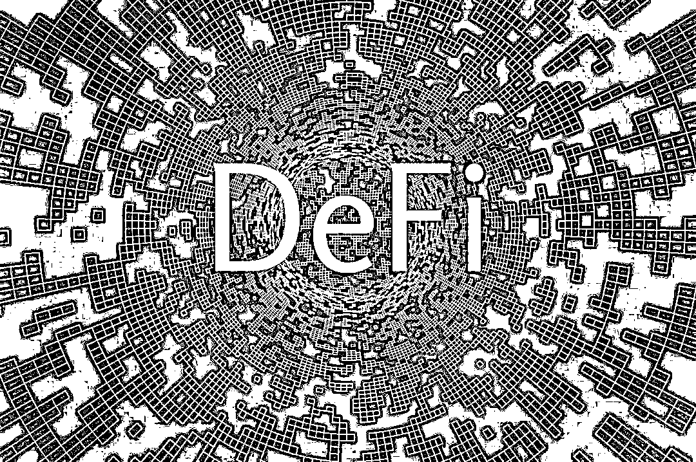
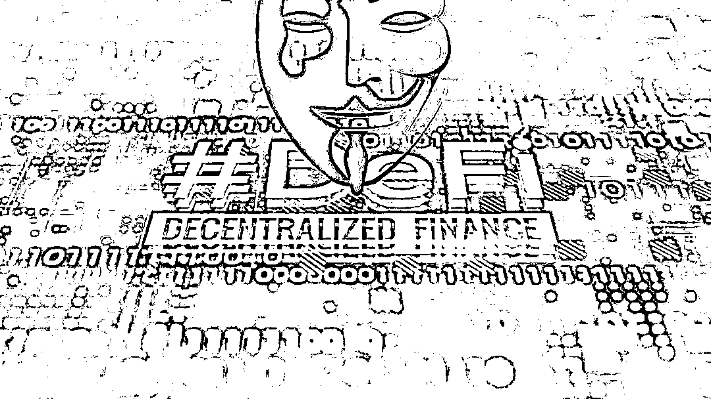
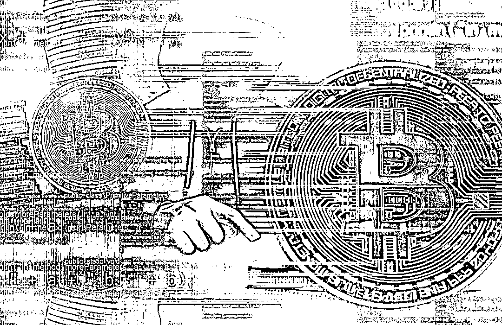
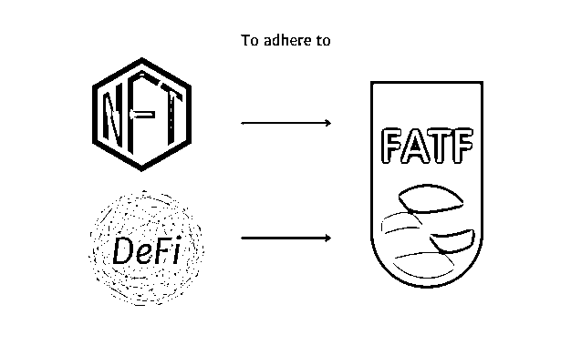

# 接收了 69%的链上非法资金，DeFi 是如何洗钱的？

> 原文：[`mp.weixin.qq.com/s?__biz=MzIyMDYwMTk0Mw==&mid=2247541169&idx=8&sn=28ed53ac1fea62d6096557de11ec30be&chksm=97cbea89a0bc639fdf4843c567aa879cb455fc10eb419f99964e668fdd91dbf9d48e274e4a37&scene=27#wechat_redirect`](http://mp.weixin.qq.com/s?__biz=MzIyMDYwMTk0Mw==&mid=2247541169&idx=8&sn=28ed53ac1fea62d6096557de11ec30be&chksm=97cbea89a0bc639fdf4843c567aa879cb455fc10eb419f99964e668fdd91dbf9d48e274e4a37&scene=27#wechat_redirect)

2022 年 1 月，公安部在京召开的新闻发布会上通报：**2021 年全国破获虚拟货币洗钱类案件 259 起，收缴虚拟货币价值 110 亿余元。**
随着区块链行业的兴起，利用虚拟货币等新型手段进行洗钱的犯罪活动愈演愈烈。在**【新型洗钱犯罪研究】**专题中，我们已经跟大家分享了 NFT 洗钱手法：（[新型洗钱犯罪研究（1）| 增速超 40%，NFT 为何成为洗钱犯罪新宠？](http://mp.weixin.qq.com/s?__biz=MzkxNzI3MTI4NQ==&mid=2247485550&idx=1&sn=402a003eba5755c3c2b843a7aa2672db&chksm=c1426ff4f635e6e2dc73a43acd85bbe0c1f072a4c12f3cdc4d74bf4a2473f8fa81751b8a03ad&scene=21#wechat_redirect)），今天将继续给大家分享**DeFi 洗钱**。

**01**

**什么是 DeFi?**

DeFi 是“去中心化金融(Decentralized Finance)”的英文缩写，主要指在以太坊等可编程的公有区块链网络上搭建的，以加密货币价值锚定、借贷、互换等类金融活动为功能目标，由系列智能合约和应用程序共同构成的区块链应用项目。

目前的绝大部分 DeFi 都是基于以太坊构建的，因为以太坊有智能合约，而且使用范围很广，最流行的 DeFi 应用大致可以分为稳定币、去中心化交易所、借贷等。

**稳定币**

指币值锚定某种（或一篮子）法定货币的加密货币，用于对冲加密货币价格波动。加密货币除了缺乏法偿性、强制性等法律属性之外，它们还有一个非常严重的缺陷，那就是币值不稳定。跟传统金融活动一样，DeFi 也需要一个价值稳定的一般等价物来充当交易媒介和价值尺度，这就是“稳定币”产生的直接原因。

**去中心化交易所**

专门解决不同代币之间的互换问题，它们充分利用套利模型，以两两一组的代币对组合建立自动兑换资产池，创造出了“自动做市商”的代币互换模式。例如，Uniswap 等去中心化交易所就是这样的应用项目。

**加密货币借贷**

这类业务类似于银行的“抵押借贷”，已经成为了 DeFi 参与者的最大刚需。加密货币借贷项目的商业模式很相似，都是按币种分别设立借贷资金池，流动性提供者向资金池中存入代币以换取资产池份额，借款人则以超额担保、浮动利率和复利计息为基础从资金池中借出代币，系统依靠代币供需数量的比率确定存贷利率，通过清算套利、担保物拍卖机制督促还款并促进不良出清，进而构建出加密货币的自动拆借市场。

**02**

**DeFi**为什么会**被用于洗钱？**

大多数 DeFi 协议中，**都允许用户将一种代币换成另一种新代币**，**而在这些协议上追踪资产移动存在难度**，**且大多数 DeFi 项目缺乏 KYC 要求**，这些特征使得 DeFi 上洗钱、诈骗等犯罪活动极速增长。

**①无需实名认证，难以查到用户身份信息。**区别于中心化加密货币交易所，DeFi 协议并没有身份验证的要求，从而无法查找到用户的 KYC 信息，还保持着匿名属性；

**②只需钱包就可即时交易。**在 DeFi 项目中只需要提供个人钱包地址，无需交易账户，便可实现即时交易，而且加密货币钱包也是不需要实名认证的。

**③截断特定加密货币的流转路径追踪。**以资金池为典型结构特征的 DeFi 的出现则直接截断了可能的追踪路径。比如，Uniswap 等去中心化交易所按代币对组合分别设立互换资金池，而 DeFi 借贷应用则根据不同币种分别设立借贷资金池，当非法资金进入到这些资金池，这些资金池直接截断了加密货币的转账支付路径，使得入池资金和出池资金不再具备连续背书，让追踪特定加密货币的流转路径不再可能。

**④缺乏监管。**目前 DeFi 领域还没有相应的监管政策和措施，因为监管的空白使得洗钱的犯罪活动更加的猖獗。

因为 DeFi 的去中心化、匿名性使得**DeFi 在识别和冻结非法资金方面存在重大缺陷**，这也是为什么 DeFi 项目日益沦为洗钱工具的原因所在。

**03**

**DeFi 如何洗钱？**

假如犯罪分子想把非法获得的赃款通过 DeFi 洗白，一般会如何操作呢？**（本文仅提供可能的方式途径）**

**第一种方式：通过去中心化交易所（DEX）洗钱。**犯罪分子将非法获得的赃款发送到诸如 Uniswap、MDEX、JustSwap、SushiSwap、DOTC 等去中心化交流所，然后通过去中心化交易所的资金池兑换成新代币，以达到混淆资金流转路径，将赃款洗白的目的。2020 年 Kucoin（库币）被盗的 1700 多万美元的就是通过去中心交易所洗白转走的。

**第二种方式：通过 DeFi 借贷协议洗钱。**犯罪分子将非法获得的赃款发送到 DeFi 上提供借贷服务的项目中，通过借贷项目资金池换成新代币，以达到混淆资金流转路径，将赃款洗白的目的。

**第三种方式：创建一个 DeFi 项目洗钱。**犯罪分子自己创建一个 DeFi 项目，将非法获得的赃款投入到项目中，然后通过“监守自盗”（设置后门，自己伪装黑客盗币等）等方式将项目资金转移，或者将吸收的用户的资金和赃款进行混淆，以达到洗钱的目的。

**第四种方式：通过 DeFi 质押/流动性挖矿洗钱。**犯罪分子将非法获得的赃款投入到 DeFi 质押挖矿或者 DeFi 流动性挖矿项目中，并从中获得收益，而这部分收益就跟赃款没有太大的关系了。

犯罪分子通过上述操作，将非法获得的赃款换成了新代币，已初步实现了赃款洗白的目的，为了进一步达到洗钱效果，他们还会选择诸如 Tornado Cash 这样的混币器加深资金链路的隐匿。最后通过合法的中心化交易所，兑换成法币，完成洗钱活动。

**（ps：通过混币平台的资金追踪难度是非常大，而成都链安在之前协助的某起案件中，成功追踪到了通过 Tornado Cash 的资金流向。**关于**Tornado Cash 介绍，可戳这里了解**：**[黑客的天堂？Tornado Cash 混币后的资产如何快速追踪？](http://mp.weixin.qq.com/s?__biz=MzU2NzUxMTM0Nw==&mid=2247497524&idx=1&sn=d1836420ac78bdc6f282d14fb199b7fe&chksm=fc9ea768cbe92e7e3d737ec8269aa43c7df905764dad56169151606aeb1f82ad5edc39dbbfbf&scene=21#wechat_redirect)****）**

**04**

**DeFi 洗钱形势严峻**

DeFi 大部分产品都是基于智能合约和交互协议构建的，组合玩法越来越多，代码普遍开源，资产完全在链上，行业规模增长迅速，因此成为犯罪活动的重灾区之一。

根据国外区块链公司 Chainalysis 的报告数据显示，在过去两年中，从非法地址发送到加密资产服务机构的资金总额中，DeFi 的占比越来越大。DeFi 项目在 2021 年接收到的非法资金较 2020 年**增长约 1900%**，**占所有被监测到的非法资金的 19%，**到了 2022 年，DeFi 协议已成为非法资金的最大接收者，在与犯罪活动相关的地址发送的所有资金中占比 69%。

2021 年 10 月，国际组织《反洗钱金融行动特别工作组<h-char unicode="ff08" style="margin: 0px;padding: 0px;letter-spacing: 0.211744px;text-align: justify;white-space: normal;color: rgb(51, 53, 60);font-family: Biaodian Pro Sans GB, Helvetica Neue, Helvetica, Arial, pingfang sc, Hiragino Sans GB, Microsoft YaHei, 微软雅黑, STHeiti, SimSun, sans-serif;font-size: 16px;"><h-inner style="margin: 0px 0px 0px -0.5em;padding: 0px;">（</h-inner></h-char>FATF<h-char unicode="ff09" style="margin: 0px;padding: 0px;letter-spacing: 0.211744px;text-align: justify;white-space: normal;color: rgb(51, 53, 60);font-family: Biaodian Pro Sans GB, Helvetica Neue, Helvetica, Arial, pingfang sc, Hiragino Sans GB, Microsoft YaHei, 微软雅黑, STHeiti, SimSun, sans-serif;font-size: 16px;"><h-inner style="margin: 0px;padding: 0px;letter-spacing: -0.5em;">）</h-inner></h-char>》在更新的虚拟资产反洗钱指南中建议，将 DeFi 以虚拟资产服务提供商（VASP）纳入反洗钱义务中。

面对不断增长的 DeFi 洗钱活动，一方面，需要加大相关犯罪活动的打击力度；另一方面，也应持续加强监管，以减少相关犯罪活动的发生。

参考资料：一文读懂 DeFi  财经网 来源：七星实验室

← 向右滑动与灰产圈互动交流 →

