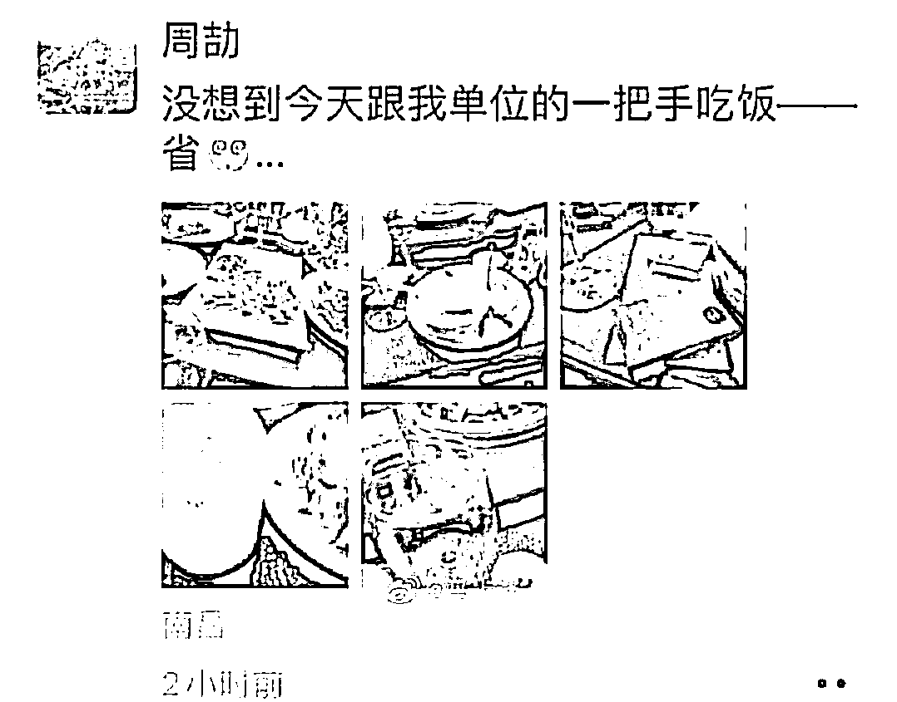
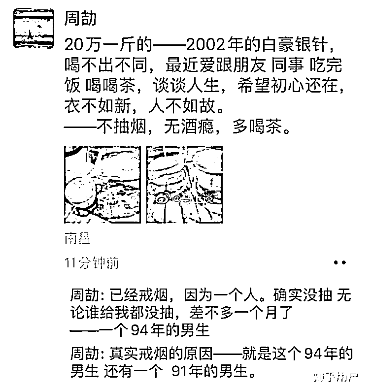
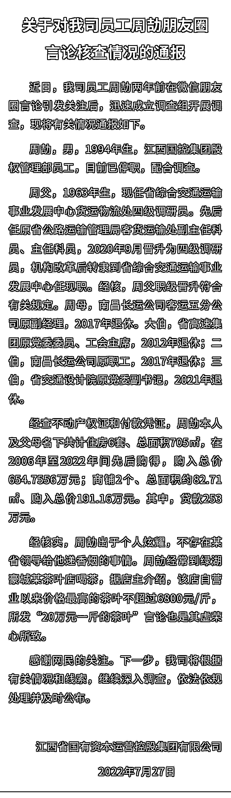
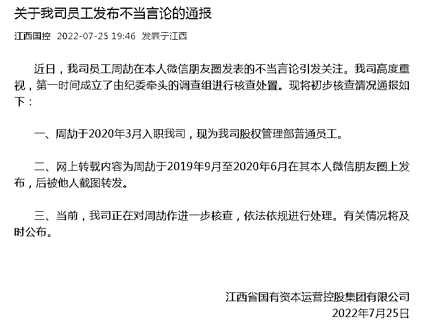
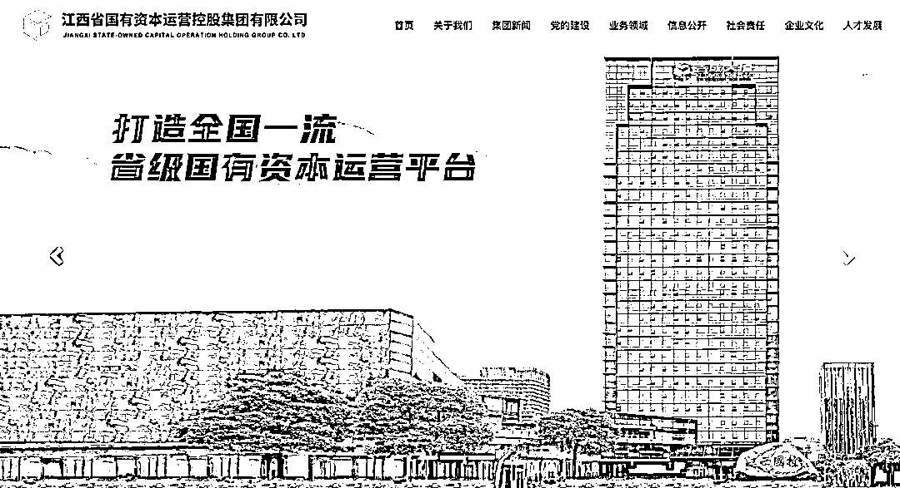

# 凌晨通报！周劼已停职，朋友圈炫富内容系编造，其父晋升合规，家中有 6 套房+2 个商铺

> 原文：[`mp.weixin.qq.com/s?__biz=MzIyMDYwMTk0Mw==&mid=2247541355&idx=1&sn=dc43765a422f1eb6f81ad383228d707a&chksm=97cbe953a0bc60450127a91a06f1ee53c5626e8b51bc61054028b2278ca38b1983e8d0209977&scene=27#wechat_redirect`](http://mp.weixin.qq.com/s?__biz=MzIyMDYwMTk0Mw==&mid=2247541355&idx=1&sn=dc43765a422f1eb6f81ad383228d707a&chksm=97cbe953a0bc60450127a91a06f1ee53c5626e8b51bc61054028b2278ca38b1983e8d0209977&scene=27#wechat_redirect)

近日，江西一国企员工周劼的“奇葩朋友圈”在网络热传，其自称家庭背景深厚（“父亲的副局长没问题了”）、日常生活奢侈（喝 20 万一斤的白毫银针）、每晚都有赶不完的饭局，且经常与各级领导打交道。人们纷纷发问，如此炫耀背后，究竟是自我吹嘘，还是确有其事？是否存在违纪违法行为？

7 月 27 日凌晨 3 点多，江西省国有资本运营控股集团有限公司（简称江西国控集团）通报了对周劼朋友圈言论核查情况，宣布其已停职、配合调查，并回应了社会关切的几点问题。

**周劼已停职、配合调查**

**相关朋友圈为编造**

根据江西国控集团的最新通报：

**其一，周劼父亲为四级调研员，母亲及几个伯父均已退休**

周劼本人出生于 1994 年，为江西国控集团股权管理部员工。目前已停职配合调查。

周劼之父现任江西省综合交通运输事业发展中心货运物流处四级调研员，曾任原江西省公路运输管理局客货运输处副主任科员、主任科员，2020 年 9 月晋升为四级调研员，机构改革后转隶到江西省综合交通运输事业发展中心任现职。经核，周父职级晋升符合有关规定。

周劼之母为南昌长运公司客运五分公司原副经理，2017 年退休。

周劼大伯为江西省高速集团原党委委员、工会主席，2012 年退休；二伯为南昌长运公司原职工，2017 年退休；三伯为江西省交通设计院原党委副书记，2021 年退休。

**二，周劼的家庭资产情况**

经查不动产权证和付款凭证，周劼本人及父母名下共计住房 6 套、总面积 705㎡，在 2006 年至 2022 年间先后购得，购入总价 654.7556 万元；商铺 2 个、总面积约 82.71㎡、购入总价 191.16 万元。其中，贷款 253 万元。

**三，周劼的多条朋友圈为编造**

经核实，周劼出于个人炫耀，不存在某省领导给他递香烟的事情。

周劼经常到绿湖豪城某茶叶店喝茶，据店主介绍，该店自营业以来价格最高的茶叶不超过 6800 元/斤，所发“20 万元一斤的茶叶”言论也是其虚荣心所致。

江西国控集团表示，下一步将根据有关情况和线索，继续深入调查，依法依规处理并及时公布。

以下为通报原文：

此前 25 日晚，江西国控集团曾发布第一份通报，通报显示：

*   周劼于 2020 年 3 月入职我司，现为我司股权管理部普通员工。

*   网上转载内容为周劼于 2019 年 9 月至 2020 年 6 月在其本人微信朋友圈上发布，后被他人截图转发。

**江西国控正在进行重大资产重组**

官网简介显示，江西省国有资本运营控股集团有限公司是经江西省人民政府批准设立、省国资委履行出资人职责并授权经营的全省层级最高、最具有典型性的省级国有资本运营平台，主营业务为资本运营和产业投资。

江西国控并表新钢集团、建工集团、江盐集团、江咨集团等 4 家省属企业股权，并代持华润江中股权，拥有全资企业 10 家，控股企业 8 家，参股企业 27 家，实施了华赣航空、国控启迪云计算、江西直升机、赞比亚江西多功能经济区等一批省级重点项目。

来源：江西国控集团官网 

2022 年 2 月 16 日，该公司法定代表人由周应华变更为江尚文。3 月 15 日，该公司名称由江西省省属国有企业资产经营（控股）有限公司变更为现在的江西省国有资本运营控股集团有限公司。

在这次公司名称变更背后，是江西国控的重大资产重组。

3 月 26 日，江西国控发布公告称，经江西省人民政府同意，决定将江西省国资委持有的江西铜业集团有限公司 90%股权、江西省交通运输厅持有的江西省交通投资集团有限责任公司 90%股权、江西省发改委持有的江西省铁路航空投资集团有限公司 71.1447%股权、江西省国资委持有的江西省水利投资集团有限公司 90%股权无偿划转至江西省国有资本运营控股集团有限公司。划转基准日为 2021 年 12 月 31 日。

公告称，本次重大资产重组后，江西铜业、江西交投、江西铁航及江西水投将成为江西国控并表子公司。“本次重大资产重组将对江西国控合并报表的资产规模、收入利润等财务指标产生积极影响”。

7 月 26 日，江西国控再发公告称，2022 年 4 月 8 日，江西水投在江西省市场监督管理局完成工商变更，江西国控已持有江西水投 90%股权，江西水投控股股东变更为江西国控。截至该公告出具日，江西铁航已在江西省市场监督管理局完成工商变更，江西国控已持有江西铁航 71.1447%股权，江西铁航控股股东变更为江西国控。江西铜业、江西交投股权划转工作尚在进行中。

来源：每日经济新闻综合自江西国控集团微信、南方都市报

← 向右滑动与灰产圈互动交流 →

