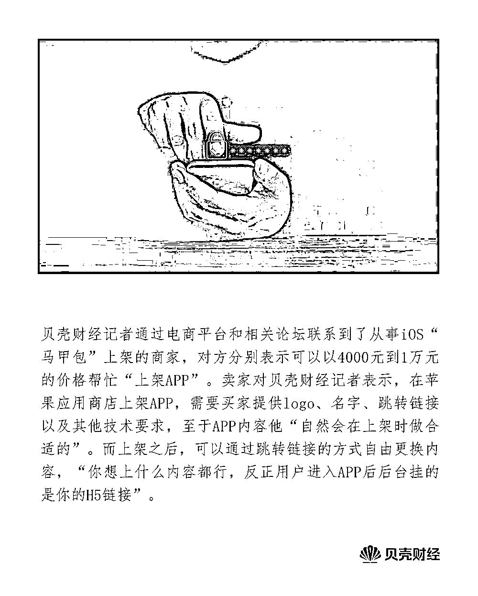
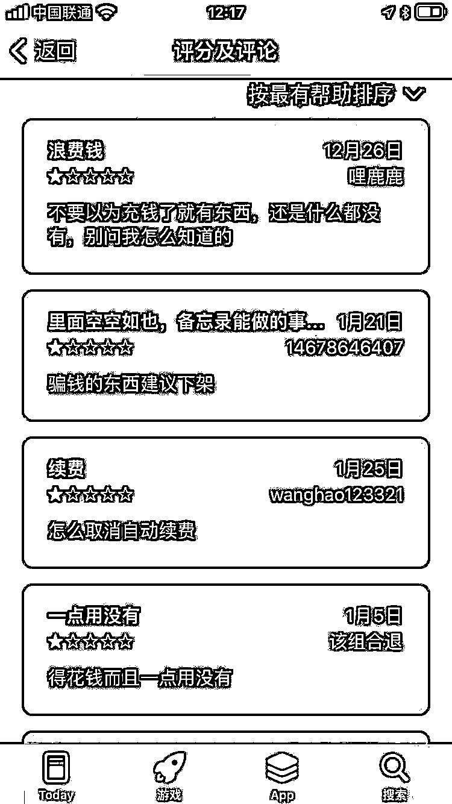
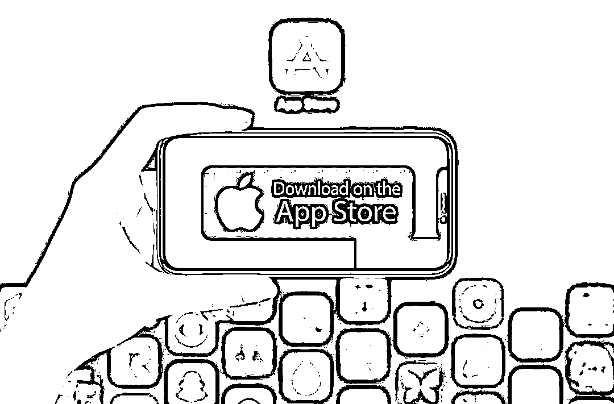
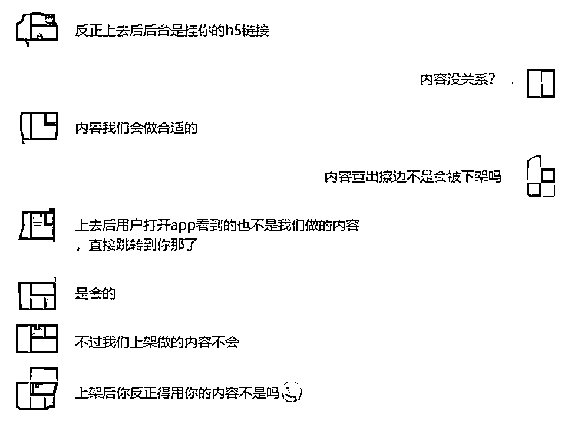

# 实测苹果应用商店色情 APP：打擦边球 4 千到 1 万元“包上架”

> 原文：[`mp.weixin.qq.com/s?__biz=MzIyMDYwMTk0Mw==&mid=2247541355&idx=2&sn=5f8e46bbdc09d99a739ada0c0c460029&chksm=97cbe953a0bc604551bdcd1f70e347bd48aa88fadb2ea9292c94b8362df9a5dcad203c69bde6&scene=27#wechat_redirect`](http://mp.weixin.qq.com/s?__biz=MzIyMDYwMTk0Mw==&mid=2247541355&idx=2&sn=5f8e46bbdc09d99a739ada0c0c460029&chksm=97cbe953a0bc604551bdcd1f70e347bd48aa88fadb2ea9292c94b8362df9a5dcad203c69bde6&scene=27#wechat_redirect)

近日，“苹果应用商店涌现大量色情 APP”的消息冲上微博热搜。7 月 28 日，贝壳财经记者实测发现，目前苹果应用商店内仍然有名称和内容涉嫌“打擦边球”的 APP 存在，其中一些 APP 打开后只显示一个 H5 网页链接，疑似跳转至导向色情网站。还有不少 APP 以露骨的名称和内容简介诱导用户下载或充值，但充值后往往并没有用户想要的内容，令不少用户在评论区直呼“骗钱”。

需要注意的是，根据热搜爆料，这些 APP 在苹果应用商店内先以正常名称、内容上架，通过审核后再通过更新的方式加入色情内容。对此，贝壳财经记者通过电商平台和相关论坛联系到了从事 iOS“马甲包”上架的商家，对方分别表示可以以 4000 元到 1 万元的价格帮忙“上架 APP”。

**下载“生活助手”**

****变成“****AV****大片”****

****有网友爆料称，苹果应用商店中一款英文名的 APP，从名字和简介看是个答题类的小游戏，但是下载打开后，马甲名字不见了，发现这个 APP 里为色情内容。苹果客服对此回应称“很震惊”，记录下应用名字后，其表示会进一步了解情况。****

****对此，贝壳财经记者 7 月 28 日在苹果应用商店中检索该 APP，发现已经无法搜索到内容。那么，目前苹果应用商店还存在此类情况吗？****

****7 月 28 日至 29 日，贝壳财经通过反复测试多个关键词，发现仍然有这种“套牌”APP 的存在，不过相比之下数量更多的是以色情为卖点实为诱惑用户充值的“打擦边球”类 APP。****

****在“套牌”APP 上，贝壳财经记者 7 月 29 日在苹果应用商店下载了一款带有生活助手字样的 APP，该 APP 的年龄分段为“4 岁”，分类为“美食佳饮”，宣传图片是各种菜谱。但记者下载该 APP 打开后发现，其页面只有一张图片，图片内容为“91 制片厂自制 AV 剧情大片”，点击该图片跳转到了某个以各种裸露图片为背景的社区平台，但无法登录。****

****对于套牌 APP，网友“pwn0rz”表示，这类 APP 一般都是内置了两套界面，审核的时候是一套正常的界面，等审核后过一段时间后展示的是黄赌相关的界面。软件是动态的，所以这种问题目前无解。哪个平台都可能出现，除非平台每天 24 小时盯着这个 APP，但是成本就无限大了。****

****值得注意的是，相比此类外观“无害”但内容不同的“套牌”APP，还有不少 APP 直接把带有色情挑逗意味的词语用在了内容简介上，如“约会撩骚”“高清无码”“成人社区”等，并且点进这类 APP 时往往要进行充值或购买 VIP，但其实际内容却与名称和简介中大相径庭，甚至有充值后也看不了任何内容的“欺骗”行为，让不少用户在 APP 评论区打上了一星评价并表示“被骗了钱”。****

********

****在苹果应用商店下载的 APP“粉色私密视频”遭到了用户的一星差评。****

****其中，一些 APP 甚至探索出了手动删除成人作品中的色情部分并堂而皇之进行付费观看的操作。如贝壳财经记者登录两个漫画类 APP 发现，在这些 APP 上可以直接观看“删减后”的韩国色情漫画部分章节，用户需要付费才能观看完整作品。****

******擦边****APP****最低****4000****元******

********“包上架”应用商店********

************

******图/IC******

******那么，这些色情 APP 或者擦边球 APP 是如何成功上架苹果应用商店的呢？******

******“名字起得太直白或者名字和 logo 被禁就上不了。”7 月 28 日，记者在某贴吧联系到的一名提供“马甲包上架”的卖家说。******

******该名卖家对贝壳财经记者表示，在苹果应用商店上架 APP，需要买家提供 logo、名字、跳转链接以及其他技术要求，至于 APP 内容他“自然会在上架时做合适的”。而上架之后，可以通过跳转链接的方式自由更换内容，“你想上什么内容都行，反正用户进入 APP 后后台挂的是你的 H5 链接”。******

************

******卖家对贝壳财经记者表示可以制作跳转链接的“套牌”APP。******

******该名卖家称，普通的 iOS 马甲包要 1 万元左右，不同类型不同价格，“如果你要做擦边直播类型的马甲包，需要 3 万到 4 万元，因为直播类型的马甲包如果跳转 H5 会导致用户体验变差，所以一般都要更贵，有些现成的直播平台源代码买回去就可以直接运营，要近 9 万元。”******

******贝壳财经记者浏览其提供的已上架 APP 名单发现，其中不乏“名媛同城”“高端人士介绍”“恋爱话术”等充满暗示的 APP。“我们社交直播类做得最多，这些 APP 不擦边也不会采用马甲的方式上架了。”而对于上架后是否会因再次遭遇审核而下架，该名卖家表示“没有百分百规避的方法，要看运气，现在交友查得严，直播相对没有那么严。”******

******7 月 28 日，贝壳财经记者在某电商平台找到了另一位同样从事“APP 上架业务”的卖家，对方称普通 APP 在苹果应用商店上架费用为 4000 元，如果是直播则要升到 6000 元，如果需要协助申请则再加 600 元“包上架”。******

******这名电商平台卖家表示，对涉及擦边球、灰黑产的 APP，苹果应用商店有可能会予以下架，因此推荐记者可以通过“超级签”或“企业签”的方式推广 APP。其中前者收费 4 元一次下载，后者 3000 元一个月，可以以不上架应用商店的方式让用户下载 APP。******

******中国互联网协会法治工作委员会副秘书长胡钢公开表示，应用商店参与了 APP 的分发、销售环节，与开发者是利益共同体，APP 出现问题应用商店无法独善其身，是共同责任人，应承担连带责任。******

******“同时，应用软件监管要强调智能、有效、实时的监管，应当建立全国统一的权威的应用软件监管平台，具备能实时发现问题、探视感知能力强、能快速处置、快速报告等特点。”胡钢指出。******

******来源：贝壳财经****** 

************************

******← 向右滑动与灰产圈互动交流 →******

************