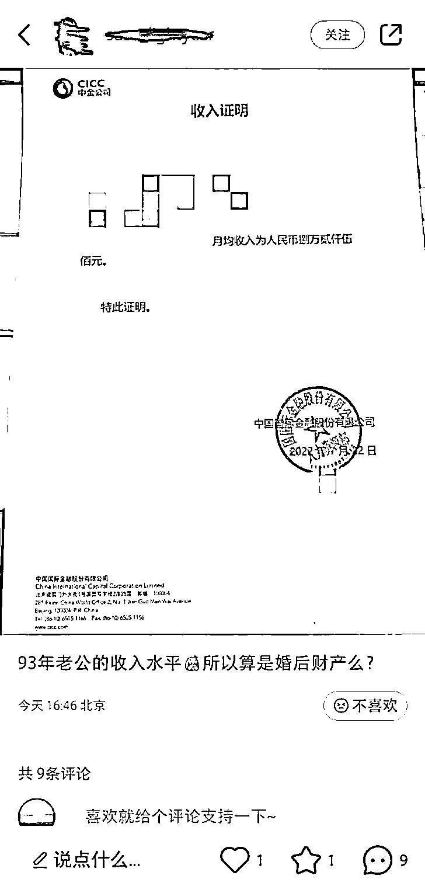
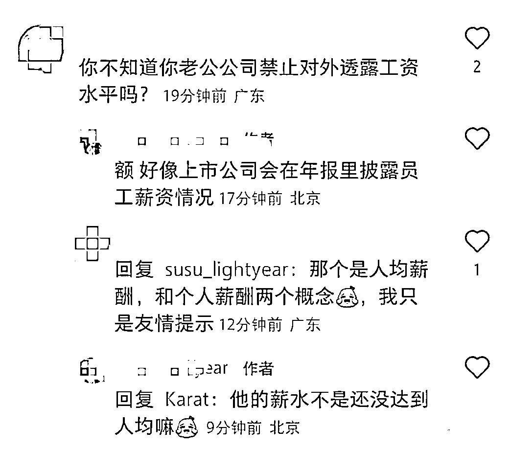
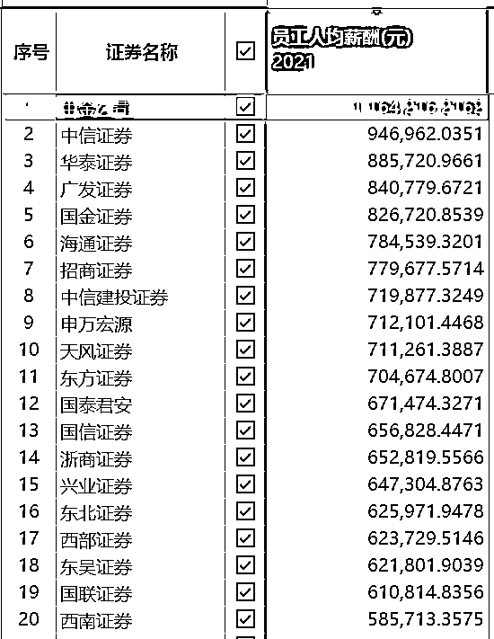
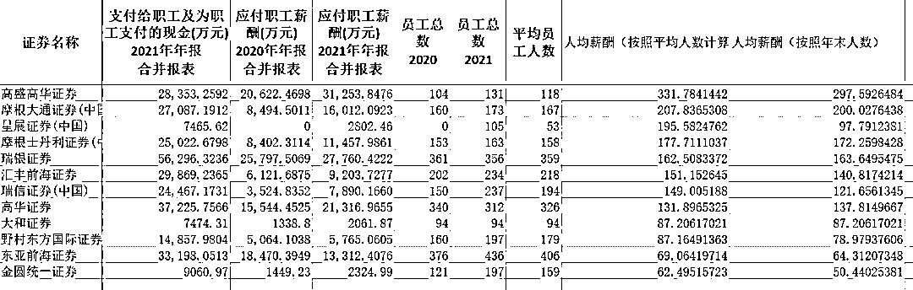

# 月入超 8 万？博主晒 90 后券商交易员老公收入证明：“算婚后财产吗？”

> 原文：[`mp.weixin.qq.com/s?__biz=MzIyMDYwMTk0Mw==&mid=2247541355&idx=3&sn=e556556ebbc74a06e3ebcc1d80751ab5&chksm=97cbe953a0bc6045a0eb84511bc7a6515186afb9fbc1ead2baa2956e57c87f496842a9558bda&scene=27#wechat_redirect`](http://mp.weixin.qq.com/s?__biz=MzIyMDYwMTk0Mw==&mid=2247541355&idx=3&sn=e556556ebbc74a06e3ebcc1d80751ab5&chksm=97cbe953a0bc6045a0eb84511bc7a6515186afb9fbc1ead2baa2956e57c87f496842a9558bda&scene=27#wechat_redirect)

半年前，某券商非银首席分析师小红书上晒工资，后引起舆论热议，以至于今年年中，中证协专门出台文件，要求证券行业建立稳健的薪酬制度。

但 7 月 28 日，小红书上又出现了券商晒薪酬事件。

网传中金公司一名交易员的夫人晒出了其夫的收入证明，**该证明显示其月均收入为 82500 元。这位夫人问：“93 年老公的收入水平，所以算婚后财产吗？”**

《民法典》规定，夫妻双方的工资在有了结婚证后均是婚后财产。所以这位博主当然是明知故问。不过，她这一招可谓“实力坑夫”，又在小红书、微博上引发了关于券商薪酬的讨论。而中证协虽然出台了关于声誉风险制度的管理办法，该小红书博主如果不是券商员工，只是券商员工家属，公司的声誉风险办法是否能对这一群体形成约束呢？

**晒老公月薪被网友提醒**

从网传截图来看，虽然这位夫人没透露自己的职业，但其夫的收入证明上印有其所在公司的 logo，且为 7 月 22 日开具。此外，流传出来的照片还包括其与丈夫在杭州银泰的合影，**并配文“被我家交易员宠爱的每一天”**。

不过，她的行为也遭到了网友的议论。有网友提醒：你不知道你老公公司禁止对外透露工资水平吗？她回复：好像上市公司会在年报里披露员工工资情况，并轻微吐槽：“他的薪水不是还没达到人均嘛”。

还有网友称：“券商的递延就是被这些好老婆贡献的，你再接再厉”。

**证监会曾明确表态薪酬管理指引并非限薪**

这名交易员夫人的言论从小红书上被截图传播后，关于券商薪酬再次引发了热议，事实上，近年来有关券商的薪酬话题至少会被炒作两波。

今年 1 月，同样在小红书上，一名博主晒出了自己 2021 年 1 至 11 月收入，为 224.67 万，已申报税额合计 62.32 万。后被曝出该小红书博主为中泰证券陆姓非银分析师，虽然当事人予以否认，但该事件引发了行业热议。

东方财富 Choice 金融终端数据显示，证券从业者收入之间差距巨大，但无疑多是所在地的高薪阶层。2021 年，中金公司员工人均年薪以 116.42 万元居首，其次是中信证券，人均年薪为 94.59 万，第三为华泰，人均薪酬 88.57 万元。

而以上述交易员的月薪 82500 元计算，其年薪为 99 万元，略低于公司人均。

在引发了舆论热议之后，今年 5 月 13 日，中证协发布《证券公司建立稳健薪酬制度指引》（以下简称《指引》），自发布之日起施行。指引明确要求，证券公司在制定薪酬制度时，应当结合行业特点制定稳健薪酬方案，充分考虑市场周期波动影响和行业及公司业务发展趋势，适度平滑薪酬发放安排，同时做好薪酬激励的极值管控和节奏控制。

不过，一些抢滩中国市场的外资投行薪酬更高。今年 6 月，《每日经济新闻》记者曾经做过统计，高盛高华、摩根大通证券(中国)两家外资券商 2021 年人均薪酬均超过 200 万元。摩根士丹利证券(中国)、瑞银证券、汇丰前海证券、高华证券、瑞信证券(中国)人均薪酬也超过百万。

值得一提的是，今年 6 月，证监会专门对券商基金等薪酬问题做了表态。证监会指出，薪酬制度是公司治理的重要内容，构建科学合理的薪酬制度是保持行业核心竞争力的基础，也是保持行业稳健可持续发展的基础。全球监管部门对薪酬激励相关制度近年来比较关注，目的是为了防范过度投机、过度激励引发的金融风险。但证券业协会、基金业协会分别发布的薪酬管理指引并无设置薪酬限额，也不涉及薪酬总额和具体操作办法。证监会充分尊重机构经营决策自主权。

**社交媒体对券商声誉风险管理带来新挑战**

不过，有关这位美女博主发布的内容，更令人关注的则是有关社交媒体带来的券商声誉风险。

从近年来券商负面舆情发酵的源头来看，**小红书、微博、微信朋友圈或群聊，均可能被截图后在多渠道形成传播。而这样的舆情发酵方式也并非券商新闻独有**。有鉴于此，如何对社交媒体言论进行监管，可以说构成了近年来券商行业声誉风险最大的挑战之一。

为建立良好的行业形象，形成良好的行业生态，2021 年 10 月，中证协出台了《证券公司声誉风险管理指引》，要求证券公司建立并持续完善声誉风险管理制度和机制，建立工作人员声誉约束及评价机制，从制度建设、管控部门、人事管理、信息登记、内控监督等层面加强对工作人员的声誉风险管理，同时要求公司将声誉风险纳入工作人员的考核范围，防范从业人员道德风险。

华北某券商人士 7 月 26 日通过微信对《每日经济新闻》记者表示，“《指引》对券商该领域工作提出了更高要求。我们根据《指引》要求完善了公司的制度和管理机制，提高经营管理各领域各环节声誉风险防范水平。近年来由于员工个人言行导致的负面舆情频发，我们也以同行出现的问题为戒，加强内部培训。”

但值得一提的是，券商员工受到公司声誉风险制度的约束，这位小红书博主仅是券商员工家属，那么面对这种情况，这位丈夫又该负什么责任呢？

一位券商人士对记者表示，公司制度肯定只能约束自己的员工。“一般而言公司给员工开具收入证明，是用于办理信用卡或按揭贷款等业务，员工家属看到这份文件并不奇怪。但该员工在公司对声誉风险有相关规定的情况下，至少应该有阻止文件被传播上网的责任，所以并不能说完全无辜。”

《每日经济新闻》记者就此事欲与中金公司方面进行沟通，不过截至发稿，未获得回复。

来源：每日经济新闻 

← 向右滑动与灰产圈互动交流 →

