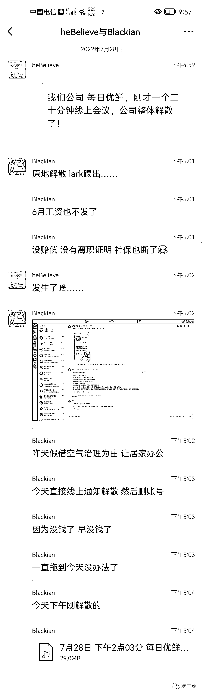
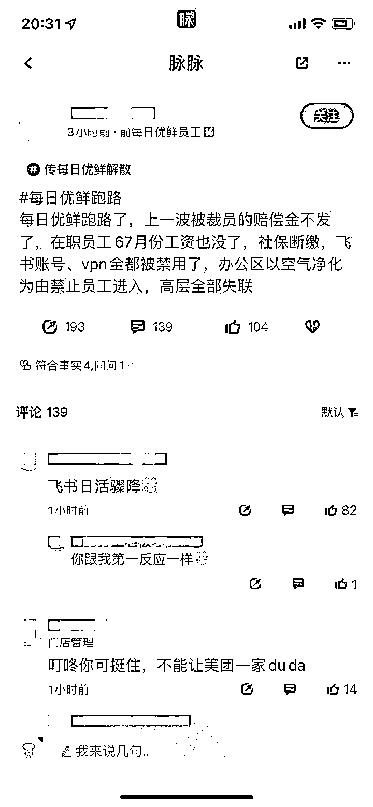
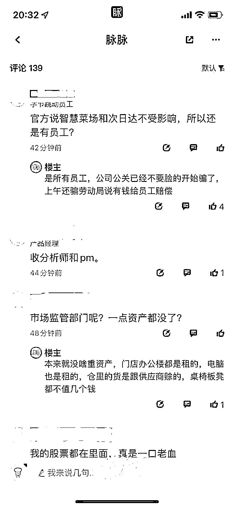

# 刚回应完解散传闻，多地每日优鲜已无法下单

> 原文：[`mp.weixin.qq.com/s?__biz=MzIyMDYwMTk0Mw==&mid=2247541355&idx=4&sn=f4403391eb0a575194ec69741fc21bb0&chksm=97cbe953a0bc60450c92a377bc23f985c1722f80c96496a3d5758e5ee812d44895fe5f740b4d&scene=27#wechat_redirect`](http://mp.weixin.qq.com/s?__biz=MzIyMDYwMTk0Mw==&mid=2247541355&idx=4&sn=f4403391eb0a575194ec69741fc21bb0&chksm=97cbe953a0bc60450c92a377bc23f985c1722f80c96496a3d5758e5ee812d44895fe5f740b4d&scene=27#wechat_redirect)

近日，社交平台上的一份聊天记录显示，一名网友称，他所在的每日优鲜公司 28 日下午开了一个 20 分钟的线上会议，公司整体解散了。

另一名网友回应称，6 月工资不发、没有赔偿、没有离职证明，社保也断了。该网友晒出的办公软件截图显示，27 日晚收到了办公区空气治理通知，发布通知的人称“近日，收到员工反馈空气质量问题……本周决定增加一场空气治理，本周四、周五，全员居家办公”。该网友表示，“今天直接线上通知解散，然后删账号。”并附上了一段时长 15 分钟的录音。

录音中，一名女性负责人介绍了人力方面的信息，“首先说工作截止，这里面大部分人的工作截止就截止到今天了，7 月 28 号。7 月的工资和社保是公司来承担、缴纳，8 月份开始，大家的社保公积金自理。这些也比较难讲出口，但今天这个情形下，很无奈地跟大家做这个信息传递。”该负责人表示，后续会有一个专门的邮箱，hr@每日优鲜的后缀，大家相关问题，都可以发邮件到这个邮箱里，将派工作组的人员对邮箱信息逐一确认、归拢，逐一回复。

在录音中，员工询问了几个关键问题，如“这算公司对我们强制解除合同吗？”“5、6、7 月公司缓缴的那部分（社保）会补发吗？”“6 月份和 7 月份的工资什么时候发放？”等。

回答中，透露出每日优鲜的财务窘况。

上述女性负责人解释称，公司现在在调拨资金，第一优先级肯定是员工工资，员工工资的序列里边的话，把前三个月社保补缴上，三险的补缴是排在（比）员工工资更靠前的位置。但她无法回答员工当天是否能够发放工资的疑问，“他们还在想办法，但是我只能说这个可能性有，但是因为现在没有授权我回答这个问题，我也不具备财务究竟调拨资金到什么程度这个信息。”

在脉脉上，一名认证为每日优鲜员工的网友 7 月 28 日下午称，工资都不发了；另一名每日优鲜员工称“确实原地解散”。

28 日傍晚，据财联社报道，每日优鲜工作人员回应称，**在实现盈利的大目标下，公司对业务及组织进行调整。**次日达、智慧菜场、零售云等业务不受影响。由于业务调整，部分员工离职，公司目前正积极寻求一切可能的方案，最大限度保障员工权益。

这一说法很快遭到每日优鲜员工质疑。28 日 20：00 左右，一名认证为每日优鲜前员工的脉脉用户表示，涉及的“是所有员工”，“还在微博辟谣只是部分裁员，实际上是整个团队都没了。我认识的连账号都没了。”至少两名脉脉用户证实，内部沟通软件飞书和 VPN 都已停用。

28 日晚，新黄河记者多次致电每日优鲜客服，始终无人接听。每日优鲜加盟电话提示关机，拨打官网的投资者关系热线，提示号码尚未注册。

新黄河记者在北京、济南分别测试每日优鲜小程序，在蔬菜类选项中，叶菜类、葱姜蒜等分类均没有看到相关产品。28 日晚，记者发现，**每日优鲜的全部商品均无法下单购买**，填写订单后，提示“抱歉，本单购买的商品在当前地址下无货”。公开报道显示，**每日优鲜多省份地区都存在相同情况。**

来源：新黄河客户端 记者：李运恒 杜林 

← 向右滑动与灰产圈互动交流 →

