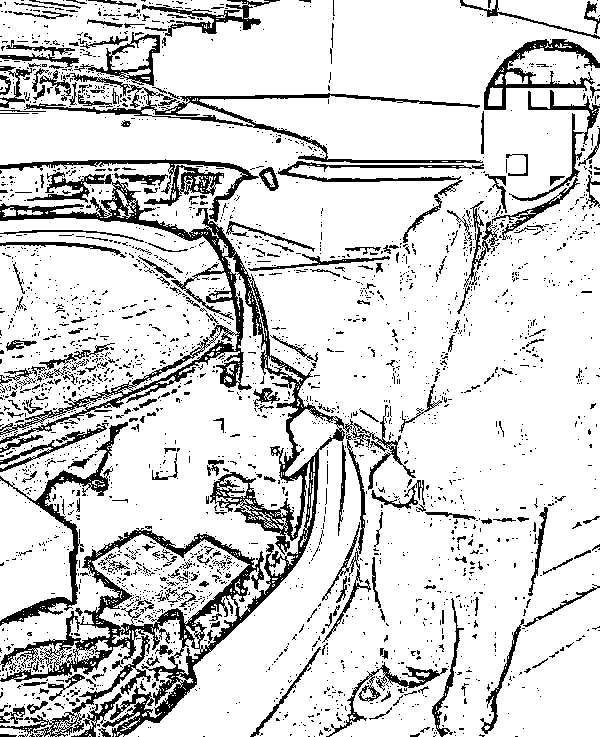
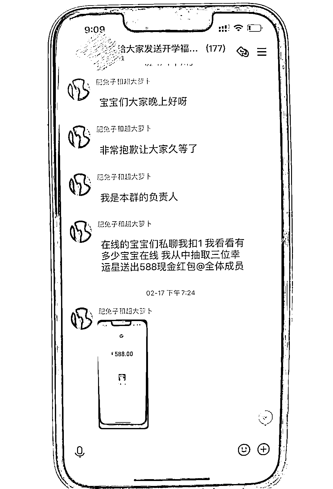

# 富二代受骗后自学骗术，假扮明星网上行骗，一个月骗得 13 万！

> 原文：[`mp.weixin.qq.com/s?__biz=MzIyMDYwMTk0Mw==&mid=2247541355&idx=6&sn=fd0e8b7fb27ecd35fb67e3157d099a3a&chksm=97cbe953a0bc6045b024fa3515b0ac0d1a5cd246a4068f4cb87cd45e7cfe36d32cada738fe10&scene=27#wechat_redirect`](http://mp.weixin.qq.com/s?__biz=MzIyMDYwMTk0Mw==&mid=2247541355&idx=6&sn=fd0e8b7fb27ecd35fb67e3157d099a3a&chksm=97cbe953a0bc6045b024fa3515b0ac0d1a5cd246a4068f4cb87cd45e7cfe36d32cada738fe10&scene=27#wechat_redirect)

家境富裕、名下有玛莎拉蒂，本应当衣食无忧的小青年徐某，却因一次机缘巧合开启了另类“赚钱”的门道。

**一次被骗后，自学了骗术**

徐某是福建省南平市人，去年年底，他在网上遭遇“明星发放粉丝福利”骗局，被骗现金 2000 元。心中愤愤不平的他，没选择报案，反而动起了歪心思，想着以同样的方式去骗人。

他认真翻看与骗子的聊天记录，加上自己的领悟，很快掌握了骗子的诈骗手法，然后心生一计。

2021 年 12 月，他叫上表弟周某和河南网友马某，开始了网上诈骗。

徐某假借明星和一些视频网红之名在网络上开号，并开启了“粉丝群服务小组”，其中周某是粉丝群客服，马某是财务人员

三人建立了“某某明星生日送福利”“某某网红现金返利”等多个交流群，吸引粉丝入群，并诱骗他人向指定收款二维码输入金额，并称“这是虚拟资金认证，输入金额越大，得到认证后便会收到同等大小的现金福利红包。” 

**一个月骗 13 万元**

仅短短一个月，就有 5 人上当受骗，涉案金额 13 万多元。

市民林某便是被骗人员之一。今年 1 月 9 日，林某在某短视频平台上刷到他们发布的“网红生日百万返现送福利”的视频推送，加入推送的交流群后，被骗去 49597 元。

接到报案后，浙江台州天台县公安局刑侦大队随即立案调查，办案民警季雨航通过侦查，锁定了犯罪嫌疑人，先后远赴河南省郑州市、福建省南平市，抓获三名犯罪嫌疑人。

徐某等人到案后如实交代了冒充网红和明星，引诱他人转账诈骗的犯罪事实。经查，有内蒙古、湖北、四川等地 5 名人员上当受骗。目前，天台警方已成功追回全部被骗款。

来源：潇湘晨报综合天台县公安局 记者：吴陈幸子

← 向右滑动与灰产圈互动交流 →

