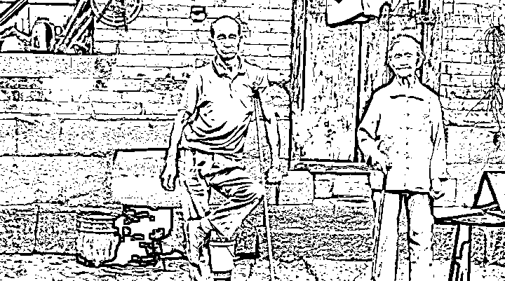
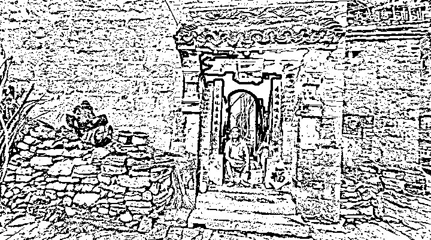
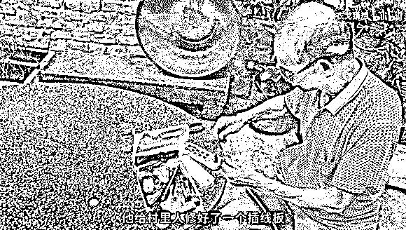
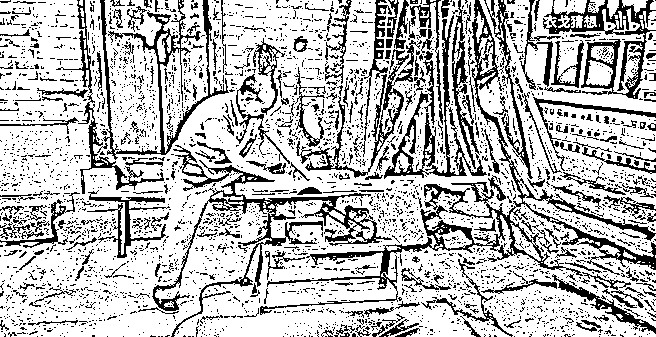

# “二舅”火后遭质疑，多方回应

> 原文：[`mp.weixin.qq.com/s?__biz=MzIyMDYwMTk0Mw==&mid=2247541415&idx=2&sn=bfd964c0e6c12795e52323a7c705a419&chksm=97cbe99fa0bc608994ee5fbf03dccc85d14ab71f85caa613b539a2b5884ad2e28aa37c824e22&scene=27#wechat_redirect`](http://mp.weixin.qq.com/s?__biz=MzIyMDYwMTk0Mw==&mid=2247541415&idx=2&sn=bfd964c0e6c12795e52323a7c705a419&chksm=97cbe99fa0bc608994ee5fbf03dccc85d14ab71f85caa613b539a2b5884ad2e28aa37c824e22&scene=27#wechat_redirect)

二舅火了。7 月 25 日，b 站 UP 主 @衣戈猜想 发布《回村三天，二舅治好了我的精神内耗》的 11 分钟视频爆火，也让片中 66 岁的“二舅”成为大众关注的焦点。 

<mpvideosnap class="js_uneditable custom_select_card channels_iframe videosnap_video_iframe" data-pluginname="videosnap" data-id="export/UzFfAgtgekIEAQAAAAAAPpQ1ApHxVgAAAAstQy6ubaLX4KHWvLEZgBPEjYIAL040Q-uCzNPgMIu6USAzw5PIwdaFu2IDj3vs" data-url="https://findermp.video.qq.com/251/20304/stodownload?encfilekey=rjD5jyTuFrIpZ2ibE8T7YmwgiahniaXswqzhJxo4saytlCRvwb5y5TlicPtK9mE63SUXrdSoNNMPol49sWibpAIctkbb7IjRp0nbMibsOcFrGTfiaCRT70Y0teJow&amp;adaptivelytrans=0&amp;bizid=1023&amp;dotrans=0&amp;hy=SH&amp;idx=1&amp;m=&amp;scene=0&amp;token=x5Y29zUxcibDMibpSxZy4mW5AScuvlyRzzXROM3qsvtKml5JhgWuYuALmNWdIAN4pIQPfoMUs7LOY" data-headimgurl="http://wx.qlogo.cn/finderhead/0nn3FBrD9a3p8JkxgttfvRKI2pt1RkOYx7icX9wtR2Xap8n4Tdoib3pg/0" data-username="v2_060000231003b20faec8c7e48d19c0d4c90ce533b0772e1c08f4c6e0ce38be3ca98f63f23589@finder" data-nickname="澎湃新闻" data-desc="#《二舅治好了我的精神内耗》UP 主发声：让二舅和姥姥安静生活吧
7 月 25 日，B 站 UP 主“衣戈猜想”发布的视频《回村三天，二舅治好了我的精神内耗》走红网络。7 月 26 日，该 UP 主发文回应网友建议二舅直播：让二舅和姥姥安静生活吧。
" data-nonceid="14909559905942920929" data-type="video" data-width="1920" data-height="1080"></mpvideosnap>

**         澎湃新闻****该视频号动态不可引用******         澎湃新闻********该视频号动态不可引用**********         澎湃新闻************该视频号动态不可引用******

******片中，@衣戈猜想回顾二舅的人生称：学业优秀、被称为天才少年的二舅，初中时发烧，由赤脚医生打了四针后，左腿落下残疾。后他自学木匠工艺谋生。二舅始终没有结婚，收养了女孩宁宁，并用十几万元积蓄，为她付了房子首付。现在，二舅带着 88 岁的老母亲一起生活。****** 

******在视频爆火后，@衣戈猜想表示不希望二舅被打扰，二舅及其母亲已被从村中接走。****** 

******不少网友称被“二舅”的故事打动，质疑声也随之而来：一些网友认为，在短片中未发一言的二舅，其苦难已经过 up 主的“滤镜”加工。也有网友对“二舅”故事中的部分细节提出质疑。******

************ 

********二舅和老母亲********

********视频中，@衣戈猜想在旁白中称，很难把二舅定义为一个木匠，他在家这三天的时间里，二舅给村里人修好了一个插线板、一个燃气灶、一盏床头灯、一辆玩具车、一个镢头、一个洗衣机、一个水龙头。“这个村子里有的一切农具、家具、电器、车辆，二舅不会修的只有三样：智能手机、汽车和电脑......”******** 

********视频称：“二舅总说他能顾得住自己就不错了，他其实顾住了整个村子。村里人都开玩笑叫他歪子，但我们每个人都很清楚，我们爱这个歪子， 我们离不开这个歪子。”    ********

********“二舅因为身体原因没法种地，但是长达三四十年的时间，他家里面永远堆满了米和菜。就是因为人家谁东西坏了，往你家里面一扔，人家扭头就走了，然后等人家想起来再拿的时候就已经给人修好了。等过几天人家山上什么蔬菜、粮食熟了，去地里干活，路过二舅家的时候就往家门口扔一点，所以二舅家菜米面有的是。”视频作者@衣戈猜想曾在接受澎湃新闻采访时说。******** 

********当地一名村民告诉澎湃新闻，视频中的“二舅”和母亲一起住，村里人有些小物件坏了就会送去给他修。******** 

********多位邻居在接受媒体采访时称，“二舅”确实以木工为业，近几年还会偶尔做工，也会帮助邻居们做一些简单家具的维修，不收钱，有时候也不收东西。******** 

********据邻居和“二舅”亲属讲述，“二舅”88 岁的母亲由 5 个儿女共同赡养。五个子女中，有四个都住在相邻的村子里，平常家里电风扇、饮水机坏了，“二舅”妹妹还是会习惯性向“二舅”求助，而“二舅”也总是第一时间出现在她面前，“随叫随到，他从来不会让我难过”。******** 

**********“最好的二哥被更多的人看到了。”“二舅”的妹妹在接受媒体采访时表示。********** 

********据她回忆，这条视频的拍摄者唐浩，是小妹的女儿的女婿，前段时间他们小两口回来过一次，用两三天时间完成了拍摄，第一次看见这个视频的时候，她觉得很感动，“看哭了，我们姊妹几个看完后心里都很难受，很心疼二哥，二哥是真苦”。******** 

********她说，她从没听“二舅”说起过这种“苦”，在他们面前，“二舅”是个乐观的人，去年老母亲生病以后，他经常带着老母亲出去散步、爬山，看到老母亲不高兴，就会想着办法讲笑话哄她开心。******** 

**********伴随着巨大的流量，网上开始出现对“二舅”的质疑和揣测，****对于这些声音，“二舅”的妹妹表现得并不在意，“谁愿意说说去，谁愿意看就看”。********** 

**********致残原因和残疾证**********

**********视频中提到，“二舅”初中时落下左腿残疾，“不知道什么手续上的原因，二舅的残疾证怎么都办不下来”。********** 

**********在接受采访时，视频作者@衣戈猜想表示，二舅当年从北京回去不久，残疾证就办下来了。********** 

**********7 月 29 日，河北武安市残联一名工作人员告诉澎湃新闻，“二舅”是肢体三级残疾，且是低保户。**对于视频中“残疾证怎么都办不下来”这一说法**，**该工作人员称，视频中提到二舅第一次办理残疾证，应该是在二三十年前，当时还没有残联。************ 

**********该工作人员说，残疾证十年一换，2009 年应该给“二舅”换过证。“如果（他）属于低保户，补贴方面是民政局在负责。”********** 

**********他说，残联一般会重点照顾一级、二级，没有自理能力、躺在床上不能动的残疾人，三级残疾属于还能自理的残疾人。“这个事情报道出来之后，我们了解到他，他做了好人好事。”********** 

************澎湃新闻多次致电武安市民政局，该局一名工作人员表示，暂未关注到相关情况，仅依据现有信息还无法查询到“二舅”的低保信息。************

**********同日，武安市委宣传部相关工作人员表示，目前，二舅一家搬离了原来的村子，暂时不愿意接受采访。********** 

********************

************对于“二舅”如何落下残疾**，前述视频称：“有一天，二舅发高烧请假回家，隔壁村的医生一天在他屁股上打了四针，二舅就成了残疾。”********** 

**********作者@衣戈猜想在接受采访时提到，他（二舅）现在跟那个（害了他的）医生，看着关系还是挺好的，隔个 10 天半个月还能碰上一次，跟遇到其他的村民没什么区别。********** 

************据红星新闻报道，原“县卫生院”的退休院长也表示，为“二舅”打针的医生已经去世。**老院长说，他也曾为“二舅”看过病，“这个事我知道，一开始是高烧，后面打完针后就出现这个情况，后来是麻痹”，“一开始打的不是这个屁股，后来到这屁股上了。”********** 

************在老院长看来，“二舅”患了脊髓灰质炎（俗称小儿麻痹症），并非打针（直接）导致残疾**，这一疾病目前已在该地区得到有效遏制，“发了糖丸（指脊髓灰质炎疫苗）以后就再也没有那个病了。”********** 

************“二舅”走红后的村庄************

************在接受澎湃新闻采访时，作者@衣戈猜想曾这样描述二舅所在的村子：村子有四类人，（大约）80%是留守老人，村里老人没有退休一说，10%是留守儿童。大部分孩子被爸妈接到县城去了，只有很少一部分留在农村；剩下个别的青壮年，在外地打工的时候受伤了，有的甚至已经丧失劳动能力，腰彻底废了，或者腿断了，没法在外面打工，就回村养着了；还有一个就是“树先生”。************ 

************“以前村子里还特别热衷于搞文艺汇演，双簧、跳舞。但是年轻人全都走了，村里面几个文艺骨干，比如我老姨夫，所有的事情都他张罗，大家一块凑钱买道具，每一个家庭出一个节目。但是老姨夫现在也不行了，走不动了，好几位文艺骨干也都已经过世了，冷清了很多。”他说。************ 

************据红星新闻 7 月 30 日报道，随着年轻人不断外流，村里如今只有一百多口人，几乎都是老人和留守的孩子。自从视频走红以后，这个从村头走到村尾不过十来分钟的小村庄，几乎人人都知道“歪子”（指“二舅”）成了“名人”，对于突然造访的陌生人，他们并不意外。************ 

************一位曾在村里教书的老人，主动向记者介绍起“二舅”，也就是他们口中“歪子”的过往，这名老人称，自己在抖音上看到了“二舅”的视频，视频里讲述的故事，和他在生活里认识的“歪子”出入并不大，“基本上有八九成都是真的”。************ 

************据他说，在村子里大家有什么东西坏了，都会找“歪子”帮忙，老人家的门锁就是对方帮他装的。帮村里人修东西，“歪子”从不收钱，有时候村里人想给他些蔬果、粮食也不要，“这就够意思”。************

************************

************二舅会修村子里各种东西。************ 

************************

************二舅还会做木工。************

************邻居们说，“谁的水泵坏了，就用那个表，上去一看就知道哪坏了，给你买个配件就换了”。至于“二舅”不在的时候，如果遇上有什么要修的，就得到村子前面去找别人帮忙。************

************来源：澎湃新闻  记者：吕新文************

************************************](http://mp.weixin.qq.com/s?__biz=Mzg5ODAwNzA5Ng==&mid=2247488103&idx=1&sn=c27f1b0f0bf5c536b80c4f5185fd1201&chksm=c0687b30f71ff226e5ed32cd1091a66d75ac90288af64d3575e7907a929b57b80580c8fb53d7&scene=21#wechat_redirect)************

************← 向右滑动与灰产圈互动交流 →************

************************