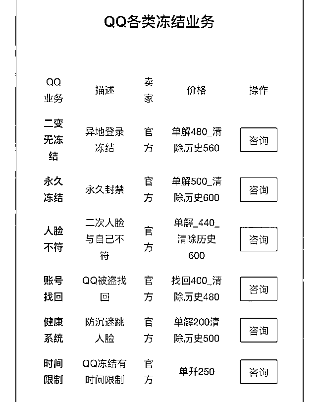
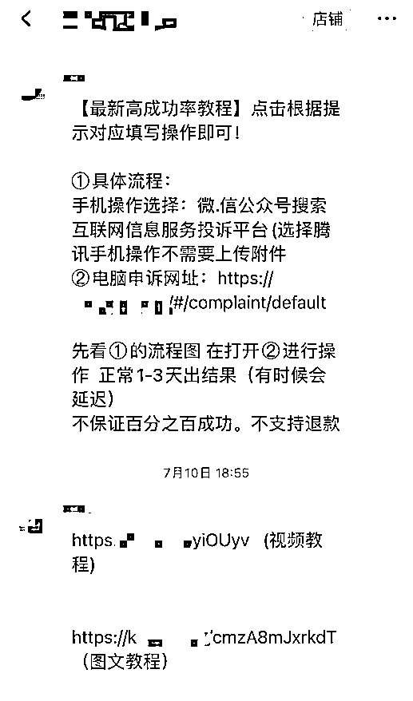
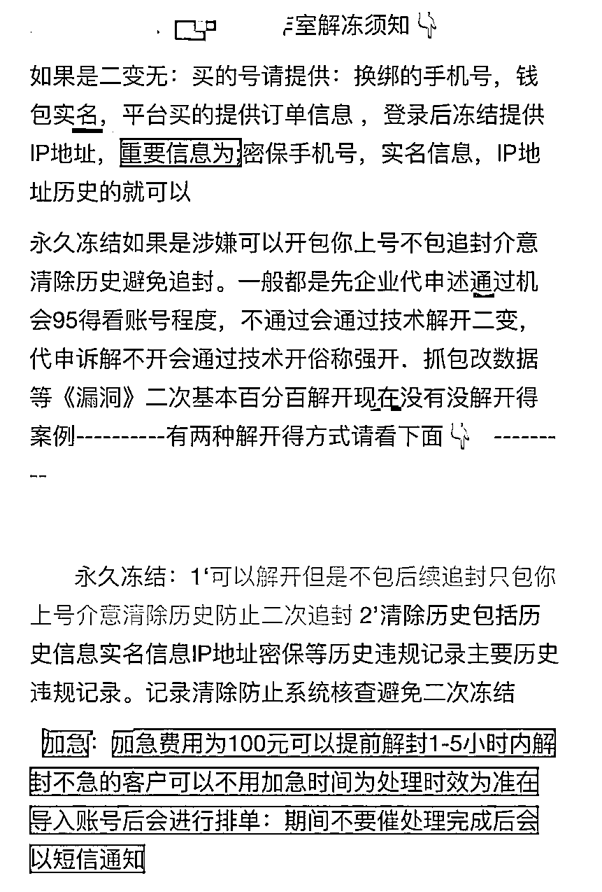
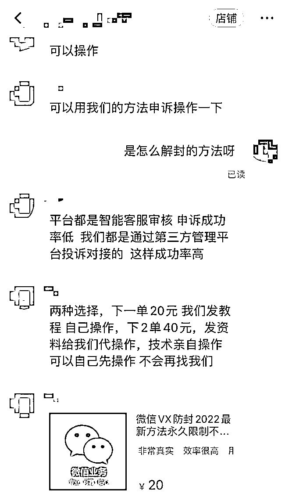

# 记者揭秘解封违规社交账号黑产：多种手段解封恢复、大量涉及电信诈骗

> 原文：[`mp.weixin.qq.com/s?__biz=MzIyMDYwMTk0Mw==&mid=2247541415&idx=7&sn=793674977a73a0a21d69ce22fb78828c&chksm=97cbe99fa0bc6089e2b778ff2011ec710e2727ee6c05fdc250dec9a582783b353a222de04b45&scene=27#wechat_redirect`](http://mp.weixin.qq.com/s?__biz=MzIyMDYwMTk0Mw==&mid=2247541415&idx=7&sn=793674977a73a0a21d69ce22fb78828c&chksm=97cbe99fa0bc6089e2b778ff2011ec710e2727ee6c05fdc250dec9a582783b353a222de04b45&scene=27#wechat_redirect)

新华社北京 7 月 29 日电（记者吴文诩、鲁畅）记者调查发现，当前网络上活跃着通过提供“社交账号解封”服务牟利的黑灰产业——**通过短信验证码、人脸识别验证、套路化的申诉投诉等手段**，帮助他人恢复因非正常操作而被平台冻结的社交账号。据公安部门介绍，**这些非法解封的账号中，有大量账号被电信诈骗团伙用于实施诈骗使用，涉案金额巨大，成为电信诈骗违法犯罪“帮凶”。**

按照公安部“净网 2022”专项行动部署，北京警方已破获数十起涉嫌帮助信息网络犯罪活动罪（以下称“帮信罪”）案件，其中提供解封账号的违法犯罪行为呈现增长势头。

在北京市公安局网安总队和通州公安分局破获的一起案件中，赵某通过网络发布解封 QQ 账号广告并与境外电信诈骗团伙勾连，在明知这些 QQ 号违法用途的情况下提供解封服务，并雇佣苏某、李某参与其中。

办案民警介绍，近一年时间内，**赵某等三人解封冻结 QQ 号超过 3 万个，非法获利近 40 万元。经过公安部门筛查，赵某等解封的 QQ 号与全国 300 余起刑事案件有关联，**涉案金额近 3000 万元。

在通州区人民法院审理的一起案件中，被告人杨某某因帮信罪获刑。根据其供述，2020 年 10 月，杨某某因在 QQ 群发布兼职信息被“封号”，在网上找人帮助解封时接触到解封账号的情况，由此发现非法解封账号有利可图。随后，杨某某从用自己的人脸帮助他人解封，到购买使用带有视频人脸转换器的手机，再到去付费网站批量解封，杨某某利用多种手段先后非法解封上万个 QQ 号，非法获利 15 万元。据相关部门核实，杨某某解封的多个账号被用于电信诈骗犯罪。

图为某解封工作室针对不同形式的账号冻结，明码标价解封费用。

办案人员告诉记者，不法人员**通常使用短信验证和人脸识别两种方式完成 QQ 号解封**。在赵某等三人相关案件中，赵某会利用**“短信验证码接收平台”或通过建立微信“兼职群”，让群里的用户以“做任务”的形式用自己的手机接收验证码，赵某再支付一定“兼职”费用；人脸识别方式解封的操作与之类似，李某和苏某雇佣他人使用自己的照片或网络搜索的人脸照片进行验证，解封 QQ 号**。

北京市公安局网安总队办案民警表示，在涉嫌帮信罪案件中，明知有解封需求的社交账号可能用于电信诈骗仍收费解封的案件呈现出增长势头。“不法人员使用 QQ 聊天从事不法活动，触发系统封控策略被冻结，本来起到了制止作用，但解封后不法分子又能继续与事主联系，进一步实施诈骗。”上述办案民警说。

图为在某购物平台上，20 元拍下解封教程，商家发来申诉模板。

图为某解封工作室制作相关文档，向客户介绍其解封方式。

记者调查发现，解封账号行为危害大，但在一些网络平台上，仍有不少商家发布广告，提供解封账号服务。其中，解封社交账号手段五花八门，既有几百元的高价“强开”，也有价格较低的通过申诉方式解封的教程。在交流过程中，这些商家通常不会询问解封账号的用途是什么。

图为某购物平台上，商家提供微信解封投诉教程。

在某购物平台上，**解封教程售价 20 元，内含详细的投诉模板和总结好的“高通过率文案”。**商家告诉记者，用户可以在互联网信息服务投诉平台上申诉，向平台施压，进而达到解封的目的。这位商家还表示，20 元是教程费用，如果需要商家代操作，则需另加 20 元“技术服务费”，此种方式成功率很高，但不能保证一定解封。

一家收费更高的商户表示，能“百分之百”保证账号成功解封。在代客户申诉后，如果解封不成功，还可以通过技术“强开”，最高收费 660 元。此外，商户还能够帮“二变无”账号（即密保工具失效的账号）清除违规记录、实名记录和历史登录记录。

记者同时发现，除了解封 QQ 号外，微信、支付宝等同样存在通过教程操作的解封服务。有消费者留言称，按照店家所给的操作流程，成功解除了限制。一位商家坦言，这样的解封产业为灰黑产业，因此希望客户不要宣传声张，避免不必要的麻烦。

“现在注册新的 QQ 号需要各种实名或者验证，增加了犯罪分子大量注册的难度。如果不能大量补充新的 QQ 号码，他们就需要通过非法途径付费解冻账号，然后利用旧的 QQ 号继续实施诈骗。”北京京坤律师事务所合伙人律师李小乐说。

法律人士指出，此类违法犯罪活动反映出网络平台还存在较大的技术漏洞。李小乐说，社交软件相关企业要进一步完善安全防护策略，通过技术手段堵住违规解封账号这一漏洞。记者梳理多起案件判决书发现，不法分子用于解封账号的手机号、照片均不是账号用户本人的，甚至可以使用网上随意下载的照片进行人脸识别解封。

警方提醒，广大群众应提高个人信息安全保护意识，不能为了牟取小利，乱入“兼职群”，将自己的照片、身份证、银行卡、手机号等出借、出租、出售给他人，这样既可能会影响个人征信记录，还可能沦为电信诈骗、网络赌博、色情交易等网络犯罪的帮凶而被追究法律责任。（参与采写：孙彤）

来源：天下有诈

](http://mp.weixin.qq.com/s?__biz=Mzg5ODAwNzA5Ng==&mid=2247488103&idx=1&sn=c27f1b0f0bf5c536b80c4f5185fd1201&chksm=c0687b30f71ff226e5ed32cd1091a66d75ac90288af64d3575e7907a929b57b80580c8fb53d7&scene=21#wechat_redirect)

← 向右滑动与灰产圈互动交流 →

