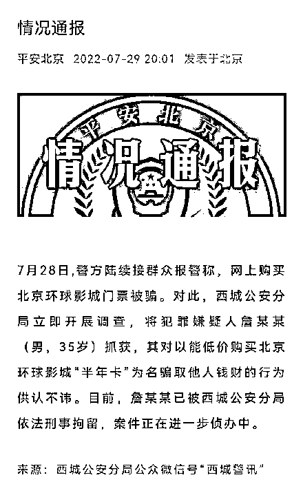

# 网购环球影城票却遭“杀猪盘”，有人被骗上百万？警方通报→

> 原文：[`mp.weixin.qq.com/s?__biz=MzIyMDYwMTk0Mw==&mid=2247541415&idx=8&sn=2f9a79e8720085870a921fc6391bd499&chksm=97cbe99fa0bc6089d7ba6a6ec0a80274719682551fc377b14b26eb37c2038fbef1ec5967ed73&scene=27#wechat_redirect`](http://mp.weixin.qq.com/s?__biz=MzIyMDYwMTk0Mw==&mid=2247541415&idx=8&sn=2f9a79e8720085870a921fc6391bd499&chksm=97cbe99fa0bc6089d7ba6a6ec0a80274719682551fc377b14b26eb37c2038fbef1ec5967ed73&scene=27#wechat_redirect)

昨天（7 月 29 日），部分游客在某些平台购买环球影城半年卡被骗的消息在多个平台疯转。有媒体从北京环球度假区求证后获悉，北京环球影城已将相关信息向公安机关报告。

北京环球度假区对此回应称，从未授权任何其他第三方平台、商家或个人销售北京环球影城夏秋漫游卡，且不存在内部折扣价，建议消费者通过官方渠道购买，如遇疑似诈骗行为，建议消费者及时向公安机关报案。

**先“养猪”，再“杀猪”** 

**有人被骗上百万元？**

据界面新闻报道，据了解，骗局分两步，一开始骗子会自己从正规渠道原价购买环球影城门票，再低价出售，以获取购买者的信任，这一步被受骗者称为“养猪”。当充分信任后，购买者大举囤票，此后骗子便称无法出票，甚至删除好友，这一步被称为“杀猪”。

受骗者王女士对界面新闻表示，自己在 2 月份通过朋友了解到，有人在低价出售环球影城门票，年卡仅需 1000 元，一年内可无限次游玩，成人和儿童票价一致。环球影城官方单次票价五六百元，王女士觉得 1000 元的年卡很划算，而且朋友已经成功兑换门票。她通过微信转账的方式，花费 2000 元购买了两张卡。

此后连续三天，王女士都成功兑换门票，兑换方式也是通过微信发送身份信息给对方。对方购票后，王女士自己再通过环球影城官方小程序预约进园时间。成功进入环球影城让她完全信任了对方，认为对方确实有渠道可以拿到低价票。

后来王女士了解到，不仅可以购买年卡，还可以购买单次票，票价仅仅 260 元，而且购买得越多越便宜。王女士以单价 120 元买入 500 张门票，花费 6 万元。

王女士的几个朋友也购买了大量门票，有的花费 10 多万、20 多万的，还有的花了 80 多万。界面新闻在一个被骗者组建的群中了解到，有人投入了上百万甚至数百万元，试图囤积上万张门票。他们大多数直接转账给一个姓詹的人，没有收据或者发票。

这些购买大量门票的人，会自称为代理，将门票再转售给其他人，从中赚取一定差价。他们基本都是先试探性地购买少量门票，兑换成功后再大量购入。但是他们没想到，大量购入门票后，兑换起来却不顺利。詹某某经常以系统问题等理由拒绝出票，甚至一些人被删除微信好友。一些人意识到可能有问题，陆续去公安局报警。

王女士表示，由被骗者组建的微信群，好几个已经达到 500 人，还有几十个 100 多人的群，涉及数千人，涉案总金额也不小。

**警方通报购买环球影城门票被骗事件**

据北京青年报报道，北京环球度假区对此回应称，已经关注到近期网络上有人谎称能获取到所谓北京环球影城半年卡“团购价”或“内部折扣价”等，并以此为由诱导消费者购买，涉嫌进行诈骗。北京环球影城已将相关信息向公安机关报告。

图片来源：视觉中国 

“我们感谢广大消费者对北京环球度假区的热情，也在此提醒消费者对类似行为保持警惕，同时为保障您的合法权益，请通过官方渠道购买，以免造成不必要的损失。”北京环球度假区透露，北京环球影城夏秋漫游卡仅在北京环球度假区官方 App、阿里小程序、微信小程序、官方飞猪旗舰店销售，消费者目前仍可选购。北京环球度假区从未授权任何其他第三方平台、商家或个人销售北京环球影城夏秋漫游卡，且不存在内部折扣价。

7 月 29 日晚，北京警方通报购买环球影城门票被骗事件。通报称，7 月 28 日，警方陆续接群众报警称，网上购买北京环球影城门票被骗。对此，西城公安分局立即开展调查，将犯罪嫌疑人詹某某（男，35 岁）抓获，其对以能低价购买北京环球影城“半年卡”为名骗取他人钱财的行为供认不讳。目前，詹某某已被西城公安分局依法刑事拘留，案件正在进一步侦办中。

截图来源：平安北京 

编辑：王月龙 盖源源 校对：程鹏 来源：每日经济新闻综合自界面新闻、北京青年报、平安北京

](http://mp.weixin.qq.com/s?__biz=Mzg5ODAwNzA5Ng==&mid=2247488103&idx=1&sn=c27f1b0f0bf5c536b80c4f5185fd1201&chksm=c0687b30f71ff226e5ed32cd1091a66d75ac90288af64d3575e7907a929b57b80580c8fb53d7&scene=21#wechat_redirect)

← 向右滑动与灰产圈互动交流 →

