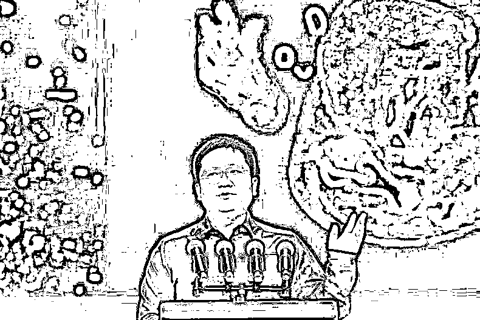
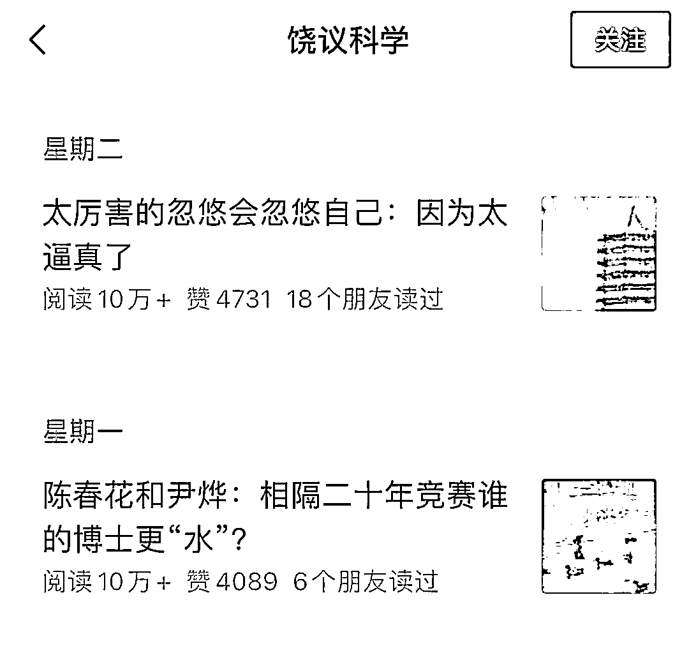
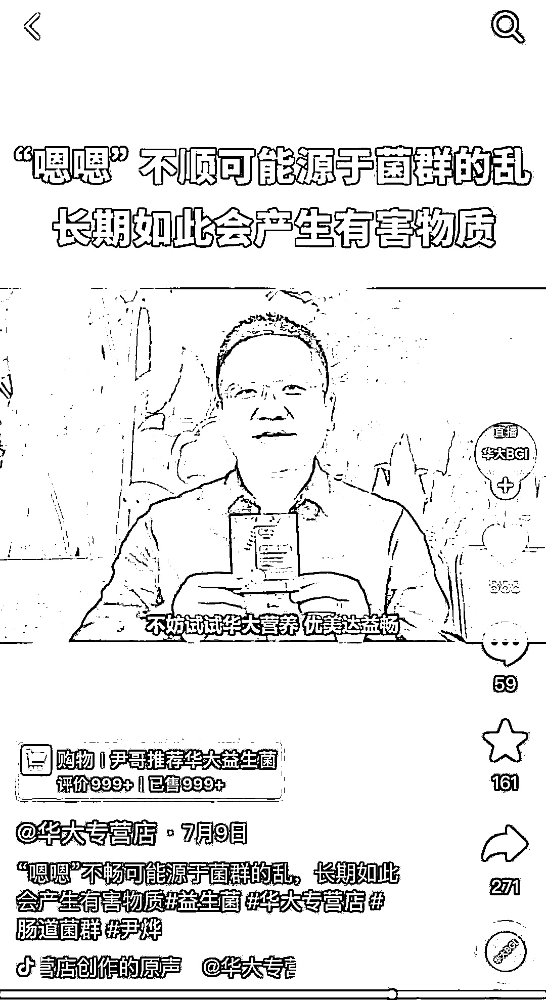
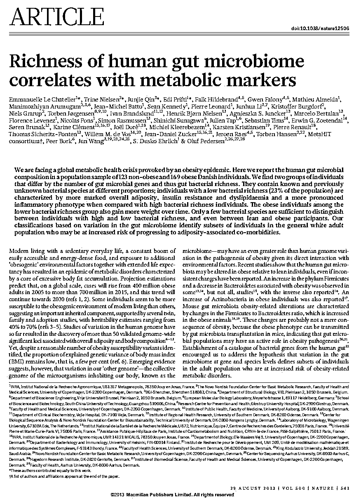
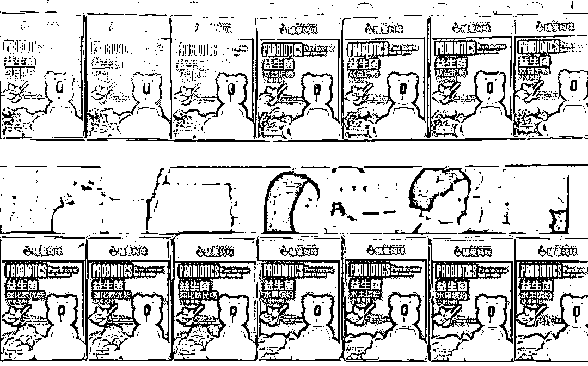
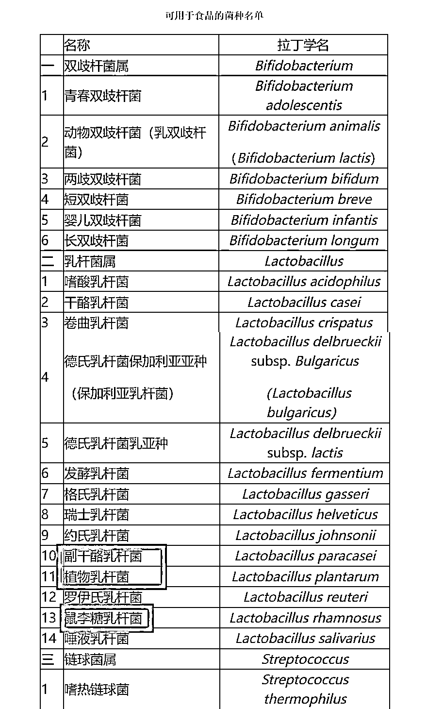
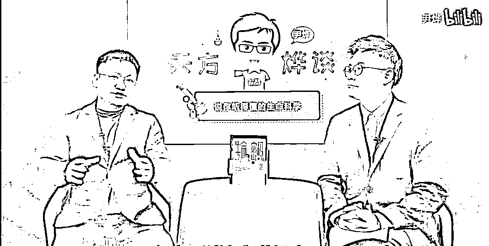
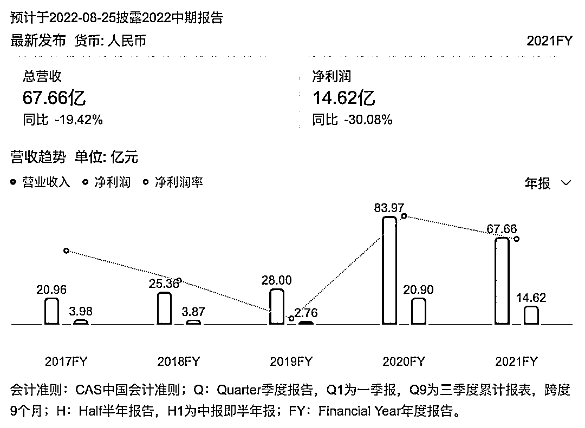

# 饶毅看了他上火

> 原文：[`mp.weixin.qq.com/s?__biz=MzIyMDYwMTk0Mw==&mid=2247541592&idx=4&sn=9529325e95624097f5dbc5b321460995&chksm=97cbe860a0bc6176a220cb22cd42836e2fda497c7b165fe6b2f4dabbbafb0bf31c56ad970ff3&scene=27#wechat_redirect`](http://mp.weixin.qq.com/s?__biz=MzIyMDYwMTk0Mw==&mid=2247541592&idx=4&sn=9529325e95624097f5dbc5b321460995&chksm=97cbe860a0bc6176a220cb22cd42836e2fda497c7b165fe6b2f4dabbbafb0bf31c56ad970ff3&scene=27#wechat_redirect)

▍盐财经 作者 | 宝珠编辑 | 煎尼

学术界的“打假斗士”饶毅再度出击，这次他将枪口对准了尹烨。

尹烨是华大基因副董事长，2022 年春节，他在节目《圆桌派》上金句频出，凭借在科学、人文多领域深入浅出的发言，给观众留下了深刻印象。

共同作为生物科学领域的名人，两人在网上各自拥趸无数，此次饶毅“炮轰”尹烨发言为伪科学，双方支持者可谓各执一词。

当科学家杠上企业家，会怎么样？

**三点质疑**

从 7 月 23 日到 7 月 27 日，连续五天，首都医科大学校长饶毅在其个人公众号“饶议科学”中发表声讨尹烨的檄文。

饶毅在其个人公众号“饶议科学”中声讨尹烨

文章洋洋洒洒，但总的来说，饶毅针对尹烨的质疑可以分为三点。

一是质疑尹烨为“水博士”。根据公开资料，尹烨博士毕业于哥本哈根大学生物工程专业，并担任基因组学研究员。饶毅在公众号指出，2010 年华大基因与哥本哈根大学建立合作关系，联合培养博士，“华大基因不止一位高管，在哥本哈根大学获得博士学位”，并称：“尹烨的论文是 2015 年开始研究，2018 年提交。而尹烨同时期任华大基因的 CEO。显然，只有他知道自己这是什么博士。”

二是尹烨的科普内容中存在错误。饶毅表示：“看了几个尹烨的视频，结果发现错误连篇”“而且是个个有错”。但他没有在文章中具体指出错误在何处，只是说“有些错误需要懂一些专业的人才知道”。

三是指责尹烨推广的益生菌为假药。尹烨在抖音多次为华大基因自营的益生菌产品带货，不过，这一系列名为“优美达益生菌”的商品并非药物，购买链接底部的消费提示中将其标注为“滋补类膳食商品”。

尹烨在抖音多次为华大基因自营的优美达益生菌产品带货

从带货视频中可以看出，尹烨在用词表达上颇为微妙，推广“益舒”益生菌固体饮料时他说：“喝到 10 杯 8 杯后，再来一袋，还是会让你感觉和以前是不太一样”；另一个视频中，尹烨在介绍完肠道菌群与人体压力的关系后，举起商品说道：“不妨试一试，看一看是不是您又多了一位可以帮助改善睡眠的好帮手”。

面对饶毅的接连炮轰，尹烨于 7 月 24 日在公众号“尹哥聊基因”上表态：谢谢指教，并引用他在《圆桌派》上所说的“三人行必有我师”。除此之外，尹烨还有华大基因方暂无其他公开回应。

[`mp.weixin.qq.com/mp/readtemplate?t=pages/video_player_tmpl&action=mpvideo&auto=0&vid=wxv_2499226826188357633`](https://mp.weixin.qq.com/mp/readtemplate?t=pages/video_player_tmpl&action=mpvideo&auto=0&vid=wxv_2499226826188357633)

尹烨在《圆桌派》上所说的“三人行必有我师”

盐财经就此询问华大基因的公关人员，截止发稿前没有获得回复。

此前，中新经纬曾致电华大基因董秘，对方表示尹烨现在不在上市公司任职，是在集团任职，公司不会对此发布公告进行回应。

然而，华大官网显示，尹烨为华大集团首席执行官、执行董事、华大基因副董事长。此外，盐财经记者发现，今年 6 月，华大基因股份有限公司 2022 年第二次临时股东大会决议公告显示，由于公司董事长汪建因重要公务事项无法现场主持会议，由公司副董事长尹烨代替主持。

**益生菌是假药吗**

“水博士”难论证，益生菌尚能一谈。

7 月 28 日，公众号“尹哥聊基因”发文称华大基因过去在菌群研究方面的论文达到 71 篇，其中包括 5 篇发表在国际顶级科学杂志《Nature》上的论文。此举疑似对饶毅“益生菌假药”说的回应。

其中一篇 2013 年发表于《Nature》的研究发现，肥胖人群与非肥胖人群在肠道微生物基因和物种丰富度上存在明显差异，表明菌群丰度而不是特定的菌群分类可较为明显区分胖瘦。

2013 年，华大研究团队在《Nature》发表的研究论文

值得注意的是，这些论文代表着华大基因在肠道菌群研究上成果颇丰，但并不能就此说明口服益生菌可以有效达到视频宣传中所说的缓解痛风、排便、失眠等大众健康问题。

“益生菌改善睡眠、痛风，目前只有基础研究有提出，还没有应用于临床，暂时也没有得到临床证实”，一位不愿具名的医疗业内人士对盐财经表示。他介绍，在医学上，益生菌常用于进行病毒性肠胃炎、胃肠功能紊乱、肠易激综合症等疾病治疗，但没有确切证据表明益生菌压缩糖果或冲剂可以改变肠道菌群，不作为医学推荐治疗。

益生菌指的是对宿主有益的活性微生物。自“菌-肠-脑 轴系统”发现后，肠道菌群被证实与肥胖、压力情绪、抑郁等问题存在关联，因此形成了益生菌产品的商业热潮。然而，研究结果呈现出的“存在关联”，通常是建立在实验对照数据上得出的结论，至于背后的分子机制，还需要未来很长一段时间内进一步研究。

益生菌产品在市场需求里仍旧占领一席之地

总而言之，益生菌在许多方面的作用仍然处于“不确定”的阶段，不能说服用益生菌“不可能有效”，只能说或许有用但尚未得到临床证实。华大基因在“优美达益生菌”产品中添加的植物乳酸杆菌、鼠李糖乳杆菌、副干酪杆菌三种菌种，列于国家卫生部发布的《可用于食品的菌种名单》当中，作为食品售卖的益生菌产品充其量只能称为“智商税”，不能称之为假药。

国家发布的《可用于食品的菌种名单》

在有选择地科普之后，用模糊的表达做出健康上的承诺，这是尹烨有失“体面”的一面。这或许是饶毅等人感到气愤的原因，有行业人士接受媒体采访时曾说：“尹烨一个科学工作者，不去做研究，像网红、微商一样搞营销，太丢人了。”

不过，从尹烨的公开履历来看，很难说他是一名科学工作者，他的个人实践更多发生在企业而非实验室，主要工作是市场营销而非基因研究。

2002 年，尹烨从大连理工大学本科毕业后，进入华大集团子公司北京华大吉比爱生物技术有限公司，从事“试剂研发、产品注册、生产管理、质量管理、市场营销等工作”。七年后，尹烨调入华大集团总部，负责基因组学及生物信息学在全球范围内的产业推广。2010 年起，他开始组建华大全球营销团队。

社会对于尹烨的头衔，也更多集中在商业领域，比如“2017 年度最佳商业模式先锋人物奖”“中国 40 位 40 岁以下商界精英”。

根据公开资料，尹烨在国际学术期刊尚发表论文超过 60 篇，不过从网上陈列的论文标题来看，罕有尹烨作为第一作者的论文。

**科学、科普与带货**

一直以来，尹烨都以科普者的角色面向公众。作为生物医疗界的“名嘴”，他出版过科普读物，在公众号上发表过上百篇科普文章，还开设了电台节目《天方烨谈》。

尹烨在 B 站上的节目《天方烨谈》

“如果生命是一组代码，我相信人类的代码中有爱”，从尹烨在《圆桌派》上的表现能够看出，他的不少发言已经超出生物领域，走向了人文、哲学维度。近些年，尹烨的科普内容逐渐从最早的生命基因，蔓延到教育、元宇宙、心理健康等大众关心的话题。对于普通人来说，这样的讲述方式引人入胜，不过在“懂行”的人看来，可能就显得似是而非、泛泛而谈。

“每一个事实听起来好像没有什么问题，你不能说他错，要反驳好像就显得是在抠字眼，但不反驳又觉得说的不太靠谱”，一名基因检测行业内的人士在接受《中国企业家杂志》时这样形容观看尹烨科普视频时的感受。

饶毅对尹烨的“炮轰”，引出了科学与科普之间的争辩。尹烨的形象，十分契合大众对科普者的想象，既拥有理性的科学知识储备，又富有人文关怀视野，全知全能者般对普通人在认知上进行“降维打击”。而真正的科研者，往往做不到尹烨这样在各个话题上侃侃而谈，现代科学主张的学科精细划分，引导着每位科学家在微小且艰深的领域内探索，越往科学的深处走，研究的问题就越具体。

[`mp.weixin.qq.com/mp/readtemplate?t=pages/video_player_tmpl&action=mpvideo&auto=0&vid=wxv_2192316574764711936`](https://mp.weixin.qq.com/mp/readtemplate?t=pages/video_player_tmpl&action=mpvideo&auto=0&vid=wxv_2192316574764711936)

尹烨在《圆桌派》中以富有人文关怀的视野向观众进行科普

理解尹烨一方的人认为，科普未必比科研容易，如果要将以大众都能接受的方式科普，必然要在严谨度上有所牺牲。

只是，如果将科普与带货结合起来，便需要保持一定的警惕。

尹烨在抖音带货始于 2022 年。此举也引发了人们对华大经营状况的关注。

华大基因的主营业务是向医疗机构、第三方检验公司提供基因测序服务。2019 年以前，华大基因的主要收入来源在与生育健康业务板块，占比超过 40%，不过到了 2020 年，新冠疫情在全球爆发，华大基因也因此迎来一次大规模的营收上涨。

2020 年，华大基因的归母净利润约 20.90 亿元，同比增长 656.43%。华大基因在年报中说明，由于新冠疫情在全球蔓延，导致市场对新冠病毒检测试剂盒及检测服务的需求增加，感染防控业务和精准医学综合解决方案业务出现大幅增长。

不过到了新冠第二年，众多在疫情中经历暴富的医药企业出现了快速下行的趋势。2021 年华大基因年报显示，公司主营收入 67.66 亿元，同比下降 19.42%；归母净利润 14.62 亿元，同比下降 30.08%。与此同时，尹烨的个人年薪也从 2020 年的 362 万降至 2021 年的 91 万。

2021 年华大基因年报显示，公司主营收入 67.66 亿元，同比下降 19.42%；归母净利润 14.62 亿元，同比下降 30.08%

在回应“科学的尽头是带货”的质疑时，尹烨曾表示：“作为华大的 CEO，我有什么理由不带货？不带货就是对自家产品不自信。”为了给华大产品站台，尹烨不惜牺牲自己多年在公众面前塑造起来的形象，不能不说是兢兢业业。

就在饶毅连续炮轰尹烨期间，7 月 26 日，华大基因的关联公司华大智造科创板 IPO 注册获得了证监会同意。因此有人猜测，华大在此风口浪尖保持沉默，是因为华大智造上市要紧。

好的企业家未必能做好的科学家，好的科学家也未必能成为好的企业家。在一点上，尽管饶毅旗下也有多家公司，并担任生物制药公司原基华毅的董事长，但在商业成就上与华大基因相去甚远。

不过此次饶毅发声，让更多人看到了尹烨在科普者之外的商人身份。

无论如何，科学需要一片净土，商业与医学之间需要存在清晰的界限，如果利用人们对科学权威的信任而牟利，企业信用必然会受到影响。

](http://mp.weixin.qq.com/s?__biz=Mzg5ODAwNzA5Ng==&mid=2247487905&idx=1&sn=15b43eaa121201d59b6bfad7b7482a46&chksm=c06878f6f71ff1e008eb1280e4ca5c1030c6df736d362b5818908b0e5bbd4a592b35310ca3fd&scene=21#wechat_redirect)

← 向右滑动与灰产圈互动交流 →

