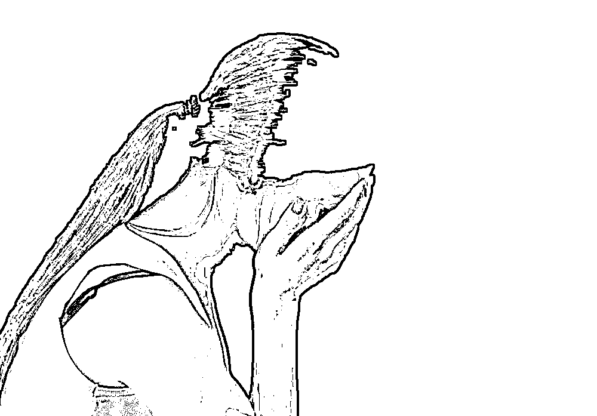

# 女子在火车上遭多次猥亵，男子一句话惹怒全网："她没反应，造成我有邪念”

> 原文：[`mp.weixin.qq.com/s?__biz=MzIyMDYwMTk0Mw==&mid=2247541592&idx=5&sn=052d28e4dab5b0f4dc5d701de6b9f09b&chksm=97cbe860a0bc61767607531606db0814445beddd5b491e789949552690665a45fa2c72e68514&scene=27#wechat_redirect`](http://mp.weixin.qq.com/s?__biz=MzIyMDYwMTk0Mw==&mid=2247541592&idx=5&sn=052d28e4dab5b0f4dc5d701de6b9f09b&chksm=97cbe860a0bc61767607531606db0814445beddd5b491e789949552690665a45fa2c72e68514&scene=27#wechat_redirect)

相信大家都有坐火车的经历，在火车上遇到的都是形形色色的人，而在最近就有一起猥亵案件发生在火车上。 

 一名女子独自乘坐火车，在途中熟睡过去了，而坐在她旁边的男子将魔爪伸向了她，见女子毫无反应，男子不止一次伸手摸她。

女子冷静的将手机录像打开取证，男子解释原因语气轻佻……”

今天想分享的最关键的一点就是，女子在外如何教科书式的保护自己，让我忍不住想要给她点赞。而男子不知悔改且不知廉耻的样子，让人心生怒意。

这名女子名叫（小萱），她坐在自己的位置上睡着了。

在熟睡的过程中，她突然感受到有人在触摸她右侧腰腹部。一开始小萱以为是大家的位置挨太近了，可能只是无意的碰到了一下。

可过了一会她发觉有些不对，因为男子的手触碰以外还在她身上乱动。

图片来源：网络视频截图，侵删

她就立马警觉到了这事并没有那么简单，一开始女子醒来将男子伸向自己的手放回到男子的身上去，然后自己也有意识的往窗户边靠去。

看了一会的手机后，女子偷偷得将手机录像打开，然后继续装睡。

果然如女子想的一样，男子趁她又睡着时，再次将魔爪伸过来触碰她。 

这回，女子立马向乘务警求助，并提供了刚刚自己录下来的视频作为证据

想必很多人看到这里，都会为这个女孩遭遇时冷静和机智的处理方式竖起大拇指。能够这么有效地将自己保护好，值得被大家学习。

男子在接受警察盘问时，双手抱膀，整个身体靠在椅子上，看样子根本就没有诚心觉得自己做错了，说得话更是没脸没皮，听了就让人心生来气。

02

据了解，受害女子寻求帮助后，乘警迅速地就锁定了嫌疑男子。

一开始男子拒不承认自己的做过这行为，还在为自己找各种借口。直到看警察将证据甩出来时，男子才不得不承认自己一时产生的邪念。

男子在表述自己的动机时，发言也是十分迷惑。

 **男子：“就是故意的，因为她没反应，然后造成我有点邪念。”**

图片来源：网络视频截图，侵删

一句话，可以说惹怒了全网，因为他对自己作恶缘由的阐述，真的毫无底线。按照他的表达，他产生邪念，都是因为受害女子没反应？

图片来源：网络视频截图，侵删

对于此发言，网友们也纷纷表述了自己的看法：

看到他在接受询问时的态度，很多网友才真正明白了女子装睡取证的重要性。

因为说白了，这种人既然能把产生恶意念头的原因归纳到受害者身上，就难免会想尽办法否认自己的恶行。

乘坐列车却惨遭猥亵，小萱是不幸的，但她遇事不慌，面对危险时冷静沉着，学会理智的方法留存自己受到侵害的证据，拿起法律的武器保护自己，让坏人受到应有的惩罚。

但不是所有人，都能在这样的危险时刻，保持足够的清醒。

还记得早前有一起事件，飞机上惨遭威胁长达 90 分钟，整个过程一言不发的女子吗？

被侵犯一个半小时，她闭口忍耐的真相，也让不少人感到辛酸。

03

一趟长沙飞北京的航班上，一名 20 岁的姑娘就经历了一场可怕的“鬼压床”

坐在她身旁一位 35 岁男子张某，看到邻座姑娘长得挺漂亮，便起了歹心。他以“帮你捡耳机”为由，趁机将手放在她的大腿上。 

被欺负的女子十分害怕，立刻蜷缩在窗边。因为是独自出行，遇到这种事害怕到了极点，别说反抗了，就连呼救都做不到。 

可能就是张某见女子没有什么剧烈的反应，变本加厉，得意忘形地继续向她搭讪，还肆无忌惮的用手多次乱摸女子大腿。 

她多次改变坐姿，企图躲避触碰，但张某还是不依不饶，就这样明目张胆的猥亵行为足足持续了一个半小时，这整个过程当中，女子都是一言不发状。

图片来源：网络视频截图，侵删

直到飞机落地，女子才迅速报了 jing ，当晚警方就找到了张某。

是，作恶的张某得到了自己应有的惩罚，可那名女子整一个乘机过程中都遭遇了侵犯，伤害也是实实在在发生了啊。

事情在网上曝光后，很多人都无法理解，为什么受害女子能忍受长达 90 分钟的伤害之后才寻求帮助，为什么不在伤害刚一发生就求助。

甚至还有些人对此，恶意揣测女子的心理。

评论区居然有人问：公共场合可以让一个男的猥亵 90 分钟？我实在想不到她在怕什么。

还有人说：这女的太搞笑了，态度那么暧昧人家还以为她同意呢。

怕得不敢说话=态度暧昧？这是什么强盗逻辑？

我一直以为，女孩只要没有明确说“yes” 所有霸王硬上弓的行为，都要被道德的滤镜审视一番。

可是，评论区有太多人把“害怕”和“活该”联系在一起，仿佛女孩是颗有缝的鸡蛋，没有第一时间说“NO”，就活该被苍蝇叮。

不拒绝，真的是女孩的问题吗？

但我想说，其实这没什么难理解的，每个人的成长环境不同，心理素质不同，处理危机的能力不同，在伤害发生过程中的考量也不同。

所以当即做出的反应有所差别，实属正常。

再者言，错的是心怀恶意者实施恶行，错的不是被伤害者没有选择最好的自保方式。我们不该本末倒置。

 来源：话痨 幸福小酒馆

](http://mp.weixin.qq.com/s?__biz=Mzg5ODAwNzA5Ng==&mid=2247487905&idx=1&sn=15b43eaa121201d59b6bfad7b7482a46&chksm=c06878f6f71ff1e008eb1280e4ca5c1030c6df736d362b5818908b0e5bbd4a592b35310ca3fd&scene=21#wechat_redirect)

← 向右滑动与灰产圈互动交流 →

