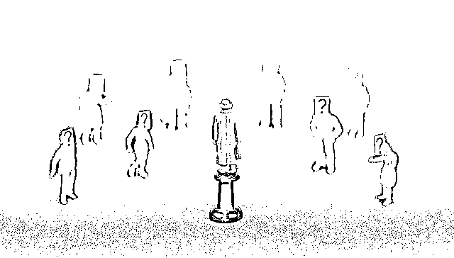
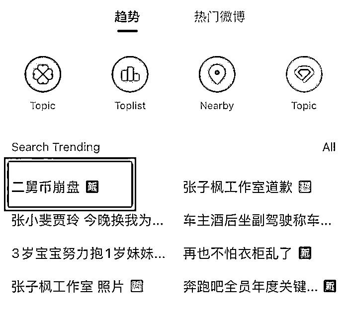
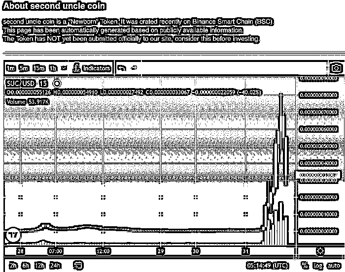

# “二舅币崩盘”登顶热搜榜！发行人被质疑诈骗 130 万美金后跑路，善行还是骗局？

> 原文：[`mp.weixin.qq.com/s?__biz=MzIyMDYwMTk0Mw==&mid=2247541592&idx=7&sn=45951a5ebc30ee8d20dda1b8df8ae248&chksm=97cbe860a0bc6176524f2fddb0e9821888ed3d815dd346cedae7d8dbaf466e4346845eb64296&scene=27#wechat_redirect`](http://mp.weixin.qq.com/s?__biz=MzIyMDYwMTk0Mw==&mid=2247541592&idx=7&sn=45951a5ebc30ee8d20dda1b8df8ae248&chksm=97cbe860a0bc6176524f2fddb0e9821888ed3d815dd346cedae7d8dbaf466e4346845eb64296&scene=27#wechat_redirect)

图片来源：视觉中国  记者 | 冯赛琪

近日，视频博主“衣戈猜想”的一则视频《回村三天，二舅治好了我的精神内耗》火爆全网。于是，竟然有人打着帮助二舅的旗号，发行了一款名为二舅币（second uncle coin，简称 SUC）的虚拟货币。

该词条一度登上热搜榜首

7 月 31 日中午，“二舅币崩盘”的词条一度冲上热搜榜榜首位置，引起网友关注。二舅币发行者是谁？这到底是一场善举还是一场骗局？发行人真的卷走已募得的 130 万美金“跑路”了吗？

7 月 28 日，一位昵称为“second uncle dao”的用户在国外社交网站发文称，一个人的力量很难和命运做抗争，但是一群人的力量却可以帮助二舅走出困境。一群旨在帮助二舅的爱心人士发起了 second uncle dao，通过区块链将爱心传递，营销钱包将全部捐赠给二舅，依靠大家的力量为二舅的养老提供保障，让二舅的生活不再有遗憾。该用户并在推文最后附上了该虚拟货币的合约地址。

该用户于今年 6 月刚刚注册账号，简介中写着“旨在为二舅的养老提供保障，营销钱包将全部捐赠给二舅”。其发布的 32 条推文，绝大部分都与二舅币有关，截至目前，其关注者为 2204 人。

界面新闻记者在虚拟货币资讯网站 Top100Token 中找到了二舅币目前的发行动态。该网站介绍，二舅币是“新生儿”代币，于 7 月 27 日在币安智能链上创建。

网站表示，二舅币官方尚未向其提交注册资料，目前该页面上有关二舅的信息是根据公开信息自动生成的。

值得注意的是，该网站向投资者提醒：我们的智能合同分析发现，这种代币与常见的诈骗代币非常相似，需确保您完全了解与交易此代币相关的风险！

据 Top100Token 数据，目前二舅币市值 46.82 万美元，每枚价格为 0.0000000004682 美元，其最近一次巨大波动是在 7 月 31 日凌晨。

Top100Token 网站数据走势

7 月 28 日晚，一名昵称为 WhoCareNews 的网友发文质疑二舅币，表示这是个骗局，发行者已经卷款跑路，称“安全专家 Iketrinia Rais 发推表示，监测到近日大热的 second uncle coin 二舅币池发生 Rugpull（是指加密货币开发商突然放弃一个项目,卷走投资者的资金）。一合约部署者已通过 Tornado Cash 清洗赃款，截至目前代币 SUC 价格已下跌 99.7%. 据统计，本次诈骗事件的利润总额高达 130 万美元。”

second uncle dao 在 7 月 30 日深夜回应了相关跑路言论，称：“团队未曾 Rugpull，也没有撤池子，所谓的专家推特在哪里，能否指路一下”。

截至目前，二舅币官方并没有出示任何信息，以证明其与视频博主“衣戈猜想”方面取得任何联系，这场二舅币营销的真实性，仍颇受质疑。

实际上，从“衣戈猜想”此前回应可见其对于二舅被卷入社会焦点中的反应。他在接受采访时表示，期待这个视频的热度能够以最快的速度下去，不想让任何人知道二舅在哪个村子，不想让任何人找到他。“希望大家对二舅的所有关切就简单地起于线上，止于相忘。”

此前一天，他也婉拒了网友们的建议，表示不会让二舅去短视频平台直播赚钱，“让二舅安安静静地陪姥姥生活在那个小山村吧，那就是这个故事最美好的结尾。”

来源：界面新闻

](http://mp.weixin.qq.com/s?__biz=Mzg5ODAwNzA5Ng==&mid=2247487905&idx=1&sn=15b43eaa121201d59b6bfad7b7482a46&chksm=c06878f6f71ff1e008eb1280e4ca5c1030c6df736d362b5818908b0e5bbd4a592b35310ca3fd&scene=21#wechat_redirect)

← 向右滑动与灰产圈互动交流 →

