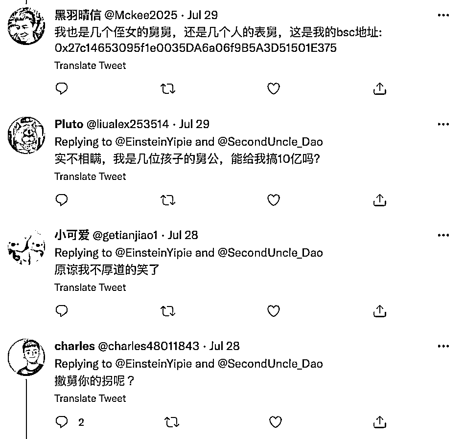

# “二舅币崩盘”，疑似诈骗 130 万美元？夸张了……

> 原文：[`mp.weixin.qq.com/s?__biz=MzIyMDYwMTk0Mw==&mid=2247541651&idx=1&sn=21b6e117a83478a316c4585d52bdc756&chksm=97cbe8aba0bc61bd61b3eef0c451ec21769c6dcef112ffe2fea2f488354f81fda93646c04bda&scene=27#wechat_redirect`](http://mp.weixin.qq.com/s?__biz=MzIyMDYwMTk0Mw==&mid=2247541651&idx=1&sn=21b6e117a83478a316c4585d52bdc756&chksm=97cbe8aba0bc61bd61b3eef0c451ec21769c6dcef112ffe2fea2f488354f81fda93646c04bda&scene=27#wechat_redirect)

继“治好无数人精神内耗”的“二舅”火了之后，一个名为“second uncle coin(二舅币)”的数字货币崩盘的消息也上了热搜。

31 日，一则“[二舅币疑似诈骗，利润总额已高达 130 万美元](http://mp.weixin.qq.com/s?__biz=MzIyMDYwMTk0Mw==&mid=2247541592&idx=7&sn=45951a5ebc30ee8d20dda1b8df8ae248&chksm=97cbe860a0bc6176524f2fddb0e9821888ed3d815dd346cedae7d8dbaf466e4346845eb64296&scene=21#wechat_redirect)”的消息经各方转发，引发热议。然而观察者网梳理发现，事情真相远没那么简单。

在推特上，疑似“second uncle coin(二舅币)”的发起人在个人介绍里写道：“旨在为二舅的养老提供保障，营销钱包将全部捐赠给二舅”。推特显示，该账号为今年 6 月新注册。翻看其推特发现，自 7 月 28 日起，这位名叫“second uncle dao”的用户便开始企图蹭二舅的热度，售卖“second uncle coin(二舅币)”。

他在推文中煽情，“一个人的力量很难和命运做抗争，但是一群人的力量却可以帮助二舅走出困境。”并声称是“一群旨在帮助二舅的爱心人士发起了 second uncle dao，通过区块链将爱心传递，营销钱包将全部捐赠给二舅，依靠大家的力量为二舅的养老提供保障，让二舅的生活不再有遗憾”。

可评论区就不像推文这么煽情了。不少网友留言称：“这钱赚了能直接给我吗？实不相瞒我也是很多人的舅舅”“原谅我不厚道的笑了”。

看上去似乎没人为“二舅币”买账，那网传的 130 万又是哪来的呢？

很快，一个名为“WhoCaresNews”推特账号连发三条推文拆穿“二舅币”。

“WhoCaresNews”在推文中称，安全专家 Iketrinia Rais 发推表示监测到近日大热的 second uncle coin 发生 Rug pull（拉地毯骗局），合约部署者已通过 Tornado Cash 清洗赃款，截至目前代币 SUC 价格已下跌 99.7%。据统计，本次诈骗事件的利润总额高达 130 万美元。

（注：Rugpull，拉地毯，通常指的是加新加密项目的开发人员撤出 DEX 流动性池或突然放弃一个项目，毫无征兆地就卷走投资者的资金。）

“WhoCaresNews”还指出，目前“second uncle dao”还在持续发布有关该币交易的定期公告，仍未在任何社交平台上公开承认此次骗局。

这也是“诈骗 130 万美元”这一数据的原始出处。

随后，“second uncle dao”亲自上阵指出了疑点所在：**所谓的专家推特在哪里**，能否指路一下。

观察者网发现，被千篇一律引用的“安全专家 Iketrinia Rais”并没有推特账号。

一名拥有数千粉丝的推特用户“Niq”也指出“WhoCaresNews”爆料信息不准确，有夸大的嫌疑。还在推文中附了一张截图称，**交易金额大约“是 400 美元，并非 130 万美元”**。

而从评论区的互动来看，不少网友认可“Niq”的评论指出，“WhoCaresNews”就是个发假新闻的账号。

推特账号则显示，“WhoCares News”于 7 月才新注册，注册时间甚至比炒作“二舅币”的“second uncle dao”还晚。

据谷歌上搜索到的信息显示，与“WhoCares News”同名的还有一个电台播客，每日播报娱乐节目。节目的口号是“嘲笑所有没人关心的无用新闻。”最近的一期节目（7 月 29 日）内容是“布拉德·皮特现在是加州卡梅尔的居民，他花了 4000 万美元买了一个婴儿床。”然而，该播客发布的新闻并未指明来源，也未见其他任何一家媒体报道，真实性存疑。

虽然，账号“WhoCares News”在推特上的爆料信息已被批“夸大”。不过，“二舅币”项目，确有其事。

稍早前，证券时报 e 公司记者在数字货币网站“top100token”上，发现确有“二舅币”的项目，也有截图为证。数据显示，该币种在过去两个交易日内大幅回调，从最高点跌到目前市值只剩下十分之一。

该图转自证券时报 e 公司

7 月 31 日，观察者网在“top100token”上已查询不到“second uncle coin”的相关信息，但仍可通过谷歌浏览器直达相关界面。

据数字货币网站截图显示，目前共发行 1 万亿枚 SUC（二舅币），1BNB（币安币）=516.95 亿 SUC。截至发稿，1SUC 的价格为 0.0000000004682 美元。

来源：观察者网

](http://mp.weixin.qq.com/s?__biz=Mzg5ODAwNzA5Ng==&mid=2247488098&idx=3&sn=638c5dd62ca652e1a1f2fd5b8420b00f&chksm=c0687b35f71ff223bca5031da035e3ab56f77f3ecfe42e587322e6e0f1302dc4d3e3fb354f18&scene=21#wechat_redirect)

← 向右滑动与灰产圈互动交流 →

