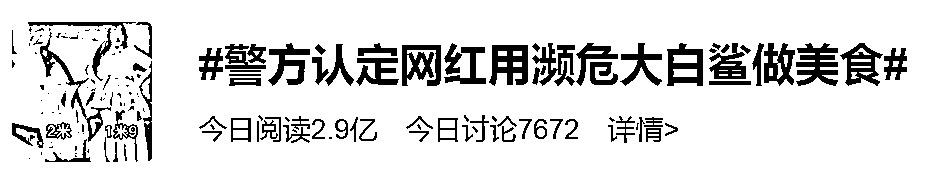
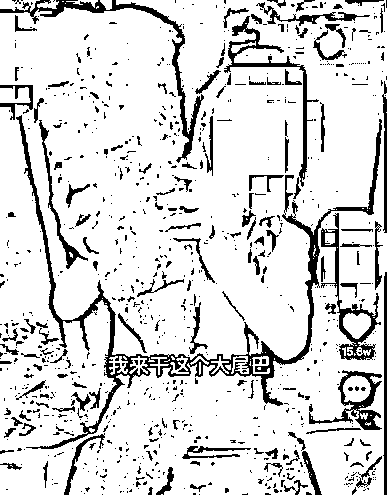
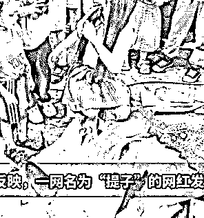
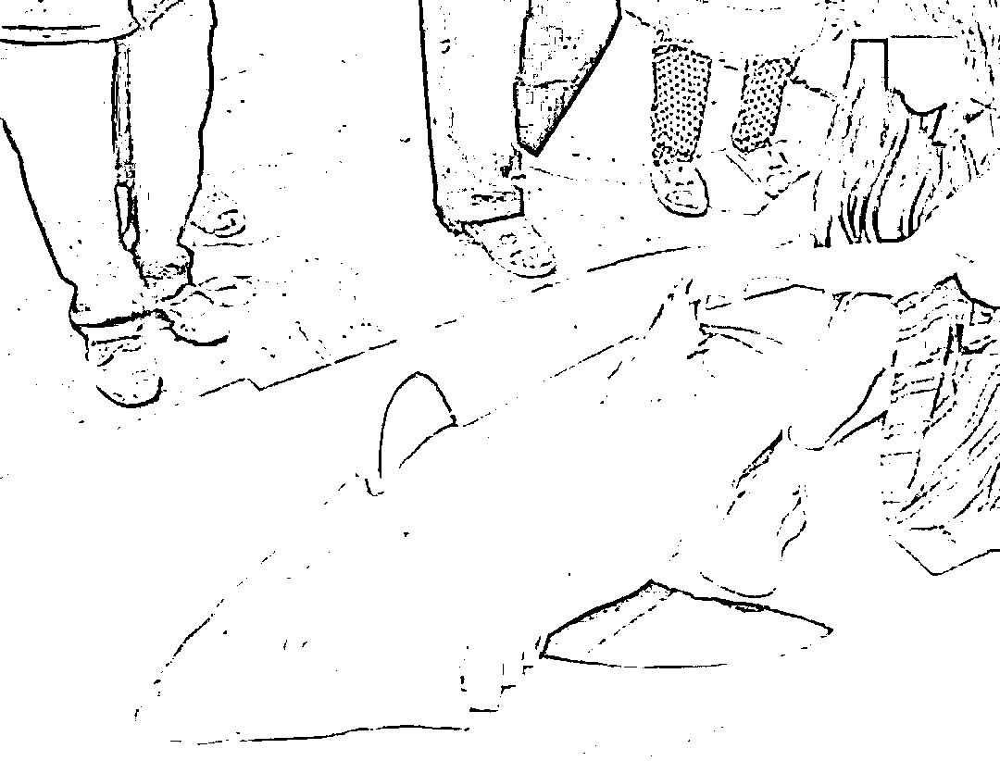
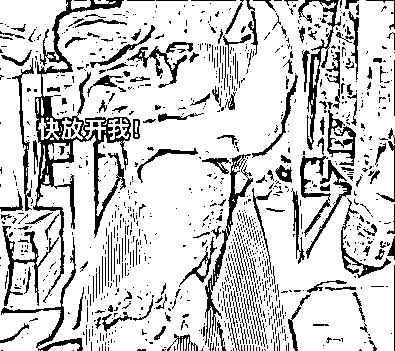
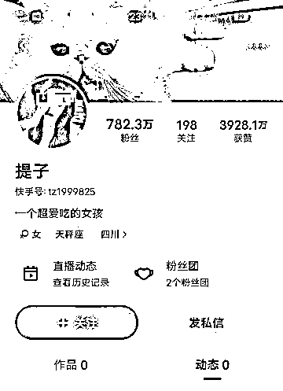
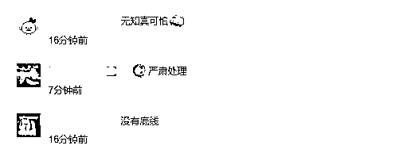

# 百万粉丝网红涉案！警方回应

> 原文：[`mp.weixin.qq.com/s?__biz=MzIyMDYwMTk0Mw==&mid=2247541651&idx=2&sn=95c5745d8065c85dc50b8f622b69885e&chksm=97cbe8aba0bc61bdd80eb06b88b46b4a2b945611792c751d51ffc89b6497042ad091d45c8fff&scene=27#wechat_redirect`](http://mp.weixin.qq.com/s?__biz=MzIyMDYwMTk0Mw==&mid=2247541651&idx=2&sn=95c5745d8065c85dc50b8f622b69885e&chksm=97cbe8aba0bc61bdd80eb06b88b46b4a2b945611792c751d51ffc89b6497042ad091d45c8fff&scene=27#wechat_redirect)

日前

一段网红美食博主

拍摄水煮鲨鱼和烧烤鲨鱼的视频

引发全网关注

**警方认定**

**视频中系濒危大白鲨**

**相关人员已被控制**

在视频中出镜的女生

系美食网红博主“**提子**”

其账号拥有百万粉丝

视频画面显示

“提子”将一包裹拆开

里面装着一条体型硕大的鲨鱼

引来不少人围观

**此后鲨鱼被进行分割**

**分别用于水煮和烧烤**

**随即被食用**

尽管该视频画面打上

“人工养殖可食用”字幕

但很快引来了网友的质疑

有科普博主反映

这条鲨鱼是

国际濒危野生动物大白鲨

（又名噬人鲨）

属于国家二级保护动物

四川南充警方随后介入调查

据红星新闻报道，7 月 31 日，记者从四川南充警方获悉，**经相关部门鉴定，网红博主“提子”视频中的鲨鱼确系噬人鲨（也称大白鲨）。**

对于网友关心的这条鲨鱼的来源，此前当事网红博主在接受采访时曾否认是噬人鲨，称是尖齿鲨，“通过正规渠道的……”**目前，警方暂未透露有关鲨鱼具体来源的相关消息，并表示正在对相关情况展开进一步调查。**

网友“黑鳞鸡冠蛇”是一名拥有 231 万粉丝的知名科学科普博主，还是一名研学导师，也是一名自然科普撰稿人 。“黑鳞鸡冠蛇”在接受记者采访时曾表示，“按照现行的野生动物保护法，捕获大白鲨这样的国家一二级保护的水生野生动物是不允许私自售卖的，即使它已经死亡，也不允许上岸售卖。”

据其介绍，大白鲨是世界性分布的，我国黄海、东海、渤海都有记录，但包括大白鲨在内的大型鲨鱼，目前是没有人工繁殖种群，无法人工养殖的，“那个主播所谓这个是‘养殖大鲨鱼’是子虚乌有的事情”。

▲ 视频截图

据封面新闻消息，8 月 1 日，南充市农业农村局执法监督科有关负责人告诉记者，“事情发生后，警方去她家搜出了还有一些鲨鱼肉和骨头，我们联系了南海水产研究所。”7 月 18 日，南充市农业农村局工作人员和南充警方一同把鲨鱼组织带到南海水产研究所检测。“7 月 22 日，检测结果出来是噬人鲨。”

**“警方已调查出来，提子是通过网购买的噬人鲨，来源是福建沿海地区，相关人员已被控制。”**负责人介绍，目前正联系国家认证的司法鉴定机构，对鲨鱼到底是幼体还是成体做进一步检测。

根据《刑法》第三百四十一条，非法猎捕、杀害国家重点保护的珍贵、濒危野生动物，或者非法收购、运输、出售国家重点保护的珍贵、濒危野生动物及其制品的，处五年以下有期徒刑或者拘役，并处罚金；情节严重的，处五年以上十年以下有期徒刑，并处罚金；情节特别严重的，处十年以上有期徒刑，并处罚金或者没收财产。

据网友反映

除了大白鲨外

“提子”还曾食用**罕见的金色娃娃鱼**

当时也一再强调是人工养殖

目前

“提子”账号内的所有视频均已清空

网友评论表示

“希望严惩！”

来源：封面新闻、红星新闻、极目新闻

](http://mp.weixin.qq.com/s?__biz=Mzg5ODAwNzA5Ng==&mid=2247488098&idx=3&sn=638c5dd62ca652e1a1f2fd5b8420b00f&chksm=c0687b35f71ff223bca5031da035e3ab56f77f3ecfe42e587322e6e0f1302dc4d3e3fb354f18&scene=21#wechat_redirect)

← 向右滑动与灰产圈互动交流 →

